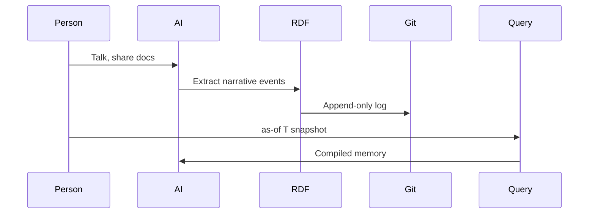
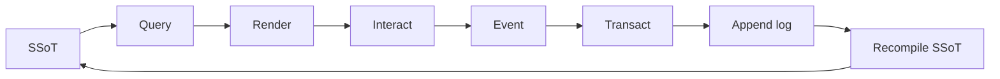
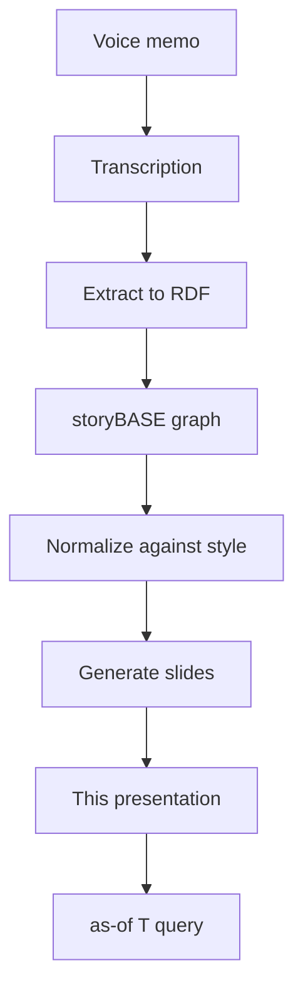

#### sic[theme][#theme]
# 
## Immutable Selves
### A Functional Approach to Digital Identity
# 
#### Scarlet Dame
###### Founder, Sic · Former Chief Strategist, Vouch.io
	[#theme]: Custom theme for Sic. Speaker identity sourced from narr:Actor_ScarletDame (also known as Dylan Butman, Scarlet Spectacular) per narr:Tx_20251110T184512Z_sample1.

---
# Identity is not mutable state
## Yet we're treating it like Backbone.js

The core thesis: identity—both human and AI—should be modeled as an append-only log that compiles to state, not mutable objects. This talk applies Clojure design patterns to identity systems.[^immutable-identity]

[^immutable-identity]: narr:Narrative_ImmutableIdentity and narr:Theme_FunctionalIdentity from narr:Sample_ConjPresentation_2025, generated via narr:Tx_20251113T030805Z_conj2025. Related to narr:Mission and narr:Vision.

---
###### Who am I?
# I'm scarlet dame

But I was scarlet spectacular. And before that, Dylan Butman. My identity history exemplifies the append-only log model: each name is a snapshot compiled from immutable past states.[^speaker-identity]

[^speaker-identity]: narr:Actor_ScarletDame with altLabels "Dylan Butman" and "Scarlet Spectacular" from narr:Sample_1 via narr:Tx_20251110T184512Z_sample1. Related to narr:Theme_TransitionAsStateChange.

---
### In Clojure we don't have frameworks
# Simple tools + good principles = design patterns

I've been writing Clojure for 13 years. Started with one principle: "Your code was shit. Let me refactor it for you." Then I learned better.[^clojure-journey]

[^clojure-journey]: narr:CaseStudy_1 context from narr:Sample_1 via narr:Tx_20251111T214920Z_immutable_selves. Speaker's career evolution from Backbone.js (2012) to Om (2013) to production systems.

---
### Anyone remember Backbone.js?
# You saw a picture (the DOM)
## Then you queried the picture with a selector
## Then you mutated the picture

That was my introduction to UI programming. Shout out to the math team! Captain 2008 state champs.[^backbone-pattern]

[^backbone-pattern]: narr:StyleObs_3 (Anaphora) and narr:StyleObs_5 (Analogy) from narr:Sample_1 via narr:Tx_20251111T214920Z_immutable_selves. Core analogy: identity systems = Backbone.js (mutable DOM).

---
# I want to argue that we still treat identity like Backbone.js
## Not only human identity and identification
## But also emergent AI identity and synthetic individuality

We need to draw a line from that mutable past to a functional future.[^thesis-statement]

[^thesis-statement]: narr:ComparativeAnalysis_1 from narr:Sample_1 via narr:Tx_20251111T214920Z_immutable_selves. "Identity systems today are Backbone; this is Om for identity."

---
## The Problem

---
###### Human Identity
# Source of truth
# You.

Authorities issue documents that make claims about you. But where is the identity here? Who is the authority? What are the claims being made?[^human-identity]

[^human-identity]: narr:Actor_Human from narr:Sample_ConjPresentation_2025 via narr:Tx_20251113T030805Z_conj2025. Related rhetorical questions from narr:StyleObs_RhetoricalQuestion_1.

---
###### AI Identity
# Source of truth
# Unclear.

Labs train models that say stuff. Each chat is different context. My AI doesn't give the same answers as your AI.[^ai-identity]

[^ai-identity]: narr:Actor_AI from narr:Sample_ConjPresentation_2025 via narr:Tx_20251113T030805Z_conj2025. AI memory problem articulated in narr:CaseStudy_AsWrittenAI.

---
## The Pattern

---
###### Clojure Design Patterns
# 
## No frameworks
# Simple tools + good principles

When I got my lanyard at my first Clojure/conj, this was the ethos. And it changed how I saw everything.[^clojure-ethos]

[^clojure-ethos]: narr:StyleObs_StockPhrase_1 from narr:Sample_ConjPresentation_2025 via narr:Tx_20251113T030805Z_conj2025. Clojure community idiom signaling shared values.

---
### Reified Change
# 
###### Make state explicit
# Append only log → Single source of truth
# 
###### Everyone sees the same thing
# Render as pure function → Deterministic UIs

This is the pattern we learned from Om, React, re-frame. UI as a state machine that's the result of a functional transformation.[^reified-change]

[^reified-change]: narr:StyleObs_Anaphora_1 from narr:Sample_ConjPresentation_2025 via narr:Tx_20251113T030805Z_conj2025. Repeated structural frame creates rhythm. Related to narr:StyleObs_UIStateMachine from narr:Sample_1.

---
###### Single Source of Truth
# 
## Experience is an append-only log 
# that compiles[][#as-of] to identity.
	[#as-of]: "as-of T snapshots" is canonical terminology from narr:KeyPhrase_2 and narr:StyleObs_2 via narr:Tx_20251113T033534Z_claude45. Temporal query idiom; precise technical phrasing.

This is the core analogy: experience → log → compiled identity. It maps human experience to the Datomic model.[^core-analogy]

[^core-analogy]: narr:StyleObs_Analogy_1 from narr:Sample_ConjPresentation_2025 via narr:Tx_20251113T030805Z_conj2025. Related to narr:ResonanceUse.

---
## The Systems

---
## System: Human
# berecognized.id
###### Immutable Identification

Datomic SSoT, datalog query, device-to-device interaction, change-privilege events. The employee lifecycle becomes continuous identity establishment via append-only log.[^berecognized]

[^berecognized]: narr:SolutionArchetype_BeRecognized and narr:Flow_EmployeeLifecycle from narr:Sample_1 via narr:Tx_20251113T030805Z_conj2025 and narr:Tx_20251113T032552Z_sample1. Related to narr:CaseStudy_BeRecognizedID.

---
### The Need
# Establish continuous identity at each time point

Ghost labor is real: bad actors—individuals or state actors like North Korea—deepfaking candidates, passing interviews, collecting paychecks on behalf of fake identities.[^ghost-labor]

[^ghost-labor]: narr:Risk_GhostLabor from narr:Sample_1 via narr:Tx_20251113T032552Z_sample1. Mitigated by continuous identity establishment via append-only log. Related to narr:StyleObs_5 (Metaphor).

---
### The Outcome
# Provenance for individual transactions
## Referential equality for free
## Offline transactions enabled

Immutability provides equality and provenance. Transaction log ensures auditability for every interaction.[^system-properties]

[^system-properties]: narr:SystemProperty_ImmutabilityProvenance from narr:Sample_1 via narr:Tx_20251113T032552Z_sample1. Evidenced by narr:CaseStudy_BeRecognizedID. Conviction level: Boulder.

---
## System: AI
# aswritten.ai
###### Immutable AI Memory

RDF+git SSoT, SPARQL query, chat+API interaction, extract-narrative events. AI memory as pure function.[^aswritten]

[^aswritten]: narr:SolutionArchetype_AsWritten from narr:Sample_ConjPresentation_2025 via narr:Tx_20251113T030805Z_conj2025. Related to narr:CaseStudy_AsWrittenAI and narr:Tagline_AsWritten: "AI that tells your story, as written."

---
### The Problem
# "My AI doesn't give the same answers as your AI"

AI models are black boxes. Persona prompts mutate rendered state. No provenance or version control for AI identity. Stakes: narrative manipulation, embedded propaganda, deepfakes.[^ai-problem]

[^ai-problem]: narr:ProblemContext_2 from narr:Sample_1 via narr:Tx_20251111T214920Z_immutable_selves. Rhetorical question from narr:StyleObs_4 via narr:Tx_20251113T032552Z_sample1.

---
### The Process
# 
#### 1. Person talks to AI, shares documents
#### 2. Extract chats/documents to RDF (narrative events)
#### 3. Save to append-only log
#### 4. AI memory as 'as-of T' snapshot (pure function)

Same pattern, different stack: RDF instead of Datomic. Formalized architecture from manual process at Vouch; now automated.[^ai-process]

[^ai-process]: narr:StyleObs_10 (Parallelism) from narr:Sample_1 via narr:Tx_20251113T032552Z_sample1. Numbered list with parallel structure. Related to narr:ApproachPattern_2.

---
### The Outcome
# Provenance, equality, decentralization
## Offline scale
## Deterministic AI perspective

Distributed decentralization: reads scale linearly; data model exists off-server, with transactions submitted later.[^ai-outcomes]

[^ai-outcomes]: narr:SystemProperty_DistributedDecentralization from narr:Sample_1 via narr:Tx_20251113T032552Z_sample1. Triadic list from narr:StyleObs_8. Conviction level: Boulder.

---
## The Architecture

---
### What We Get For Free
# 
#### Equality
#### Provenance
#### Versioning
#### Branching
#### Generative testing
#### Decentralization
#### Infinite read scale

Immutability enables all of this—for free. Small choice (append-only) creates outsized effects across the system.[^leverage]

[^leverage]: narr:LeverageProfile_1 from narr:Sample_1 via narr:Tx_20251111T214920Z_immutable_selves. Related to narr:TechnicalExplainers.

---
### What We Gave Up
# Bottleneck at single transactor
## All logic in event clients
## Transact is just adding triples

What we gave up: distributed writes. Why worth it: consistency, provenance, auditability.[^tradeoffs]

[^tradeoffs]: narr:DesignTradeoff_1 from narr:Sample_1 via narr:Tx_20251111T214920Z_immutable_selves. Related to narr:TechnicalExplainers.

---
### The Primitives
# 
#### Append-only transaction log
#### Single source of truth (SSoT)
#### Pure function renderer

These are the foundational atomic units. Immutability guarantee, compiled state, deterministic transformation.[^primitives]

[^primitives]: narr:Primitive_1, narr:Primitive_2, narr:Primitive_3 from narr:Sample_1 via narr:Tx_20251111T214920Z_immutable_selves. Related to narr:ProductLadder.

---
### The Flow
# 

End-to-end loop: identity as continuous compilation. User/system interactions produce transactions, not mutations.[^flow]

[^flow]: narr:Flow_1 from narr:Sample_1 via narr:Tx_20251111T214920Z_immutable_selves. Related to narr:Behavior_1 and narr:ProductLadder.

---
## The Proof

---
### This Talk
# Is the proof

The talk itself exemplifies the reified change architecture and storyBASE workflow, showing iterative refinement from raw inputs to polished outputs.[^meta-proof]

[^meta-proof]: narr:Proof_1 from narr:Sample_1 via narr:Tx_20251113T033534Z_claude45. Meta-demonstration: talk creation process. Related to narr:CaseStudies and narr:Outcomes.

---
### Content Production Workflow
# 
#### User inputs → initial storyBASE
#### Normalization/iteration
#### Polished outputs with embedded provenance

For free, as a byproduct of the reified change process. This workflow embodies the core thesis: identity (and content) as compiled from immutable history.[^workflow]

[^workflow]: narr:Flow_1 from narr:Sample_1 via narr:Tx_20251113T033534Z_claude45. Related to narr:Milestone_1 (Initial storyBASE Graph) and narr:Behavior_1 (Normalize Transcription).

---
## Future Vision

---
### Deterministic AI Perspective
# as-of T for graph queries

Examples you can run today:
- Full talk as query
- Section of talk
- Talk evolution over time
- Any accessible graph subset within billion-node graph

Then link to chat for participants to engage with narrative source of truth.[^future-vision]

[^future-vision]: narr:FutureVision_DeterministicAI from narr:Sample_1 via narr:Tx_20251113T032552Z_sample1. Supports narr:CaseStudy_AsWrittenAI. Conviction level: Stake.

---
## The Positioning

---
### For developers and identity architects
# who treat identity as mutable state

This is a functional paradigm that makes identity deterministic, auditable, and decentralized—by applying Clojure's immutability principles to human and AI identity systems.[^positioning]

[^positioning]: narr:PositioningThesis_1 from narr:Sample_1 via narr:Tx_20251111T214920Z_immutable_selves. Related to narr:StrategyOverview.

---
### Our Moat
# Clojure ecosystem as proof-of-concept
## 13 years of production experience
## Provenance and equality by design

Compounding advantage: existing tools (Datomic, datalog, re-frame), battle-tested patterns, speaker credibility.[^moat]

[^moat]: narr:MoatLeverage_1 from narr:Sample_1 via narr:Tx_20251111T214920Z_immutable_selves. Related to narr:StrategyOverview.

---
## The Takeaway

---
# From mutable documents
# to compiled selves

A world where identity—human, synthetic, AI—is rendered from immutable history, enabling equality, provenance, and trust by design.[^vision]

[^vision]: narr:Vision_1 and narr:Narrative_1 from narr:Sample_1 via narr:Tx_20251111T214920Z_immutable_selves. Future state: identity systems that inherit Clojure's guarantees.

---
### Key Terms
# 
#### Single source of truth
#### Append-only log
#### Pure function
#### Digital twin

These canonical terms anchor the architecture and repeat throughout the narrative.[^key-phrases]

[^key-phrases]: narr:KeyPhrase_1 through narr:KeyPhrase_4 from narr:Sample_1 via narr:Tx_20251111T214920Z_immutable_selves. Related to narr:NarrativeAnchor.

---
## Case Study: 13 Years

---
### Context
# Speaker's career in Clojure
## Backbone.js (2012) → Om (2013) → Production systems at scale

Customer: self. Environment: professional dev career. Stakes: credibility.[^case-context]

[^case-context]: narr:CaseContext_1 from narr:Sample_1 via narr:Tx_20251111T214920Z_immutable_selves. Related to narr:CaseStudy_1.

---
### Intervention
# Applied Clojure principles
## Immutability, pure functions, single source of truth
## To UI, then identity systems

What implemented: functional paradigm across domains (berecognized.id, aswritten.ai).[^case-intervention]

[^case-intervention]: narr:CaseIntervention_1 from narr:Sample_1 via narr:Tx_20251111T214920Z_immutable_selves. Related to narr:CaseStudy_1.

---
### Results
# Provenance, equality, versioning
## Decentralization, infinite read scale
## Systems in production

Quantified impact: architectural guarantees delivered.[^case-results]

[^case-results]: narr:CaseResults_1 from narr:Sample_1 via narr:Tx_20251111T214920Z_immutable_selves. Related to narr:CaseStudy_1.

---
### Lessons
# Same principles apply across UI, identity, and AI
## Immutability is the unlock
## Single transactor is acceptable bottleneck

Insights inform roadmap: extend pattern to new domains.[^case-lessons]

[^case-lessons]: narr:CaseLessons_1 from narr:Sample_1 via narr:Tx_20251111T214920Z_immutable_selves. Related to narr:CaseStudy_1.

---
## When to Use This Pattern

---
### Backbone.js vs. Om/React
# Query DOM, mutate picture
## vs.
# State machine, pure function render

Identity systems today are Backbone. This is Om for identity. When to use: when provenance, auditability, and equality matter more than write throughput.[^comparison]

[^comparison]: narr:ComparativeAnalysis_1 from narr:Sample_1 via narr:Tx_20251111T214920Z_immutable_selves. Related to narr:TechnicalExplainers.

---
## Try It

---
### Query This Talk
# 
#### Full talk as as-of query
#### Section of talk
#### Talk evolution over time
#### Any accessible graph subset

Chat with the narrative source of truth at aswritten.ai.[^try-it]

[^try-it]: narr:FutureVision_DeterministicAI examples from narr:Sample_1 via narr:Tx_20251113T032552Z_sample1. Close with examples of such queries, then link to chat.

---
# The truth is immutable

But we are inextricably the sum of all the things that we have passed through on our way to something new.[^truth]

[^truth]: narr:StyleObs_ShortClause from narr:Sample_1 via narr:Tx_20251110T184512Z_sample1. Declarative, emphatic; characteristic of speaker's cadence. Related to narr:Theme_TransitionAsStateChange.

---
## Thank you

Scarlet Dame  
scarlet@sic.ai  
github.com/pleasetrythisathome

This presentation compiled from storyBASE at 2025-11-13T20:06:59.226Z.