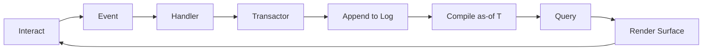
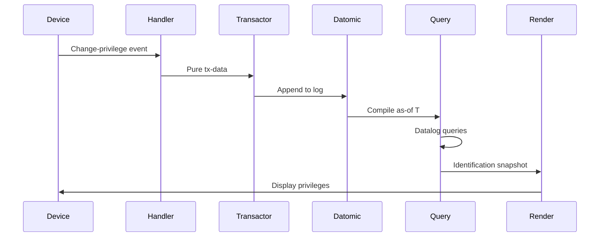
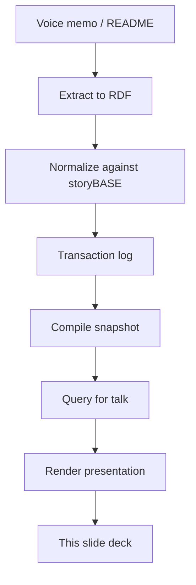

#### sic[theme][#theme]
# 
## Immutable Selves
### A Functional Approach to Digital Identity
# 
#### Scarlet Dame
###### Founder, Sic · Former Chief Strategist, Vouch.io
	[#theme]: Custom theme for Sic brand. Source: narr:Tagline_1 "Immutable Selves: A Functional Approach to Digital Identity" from Sample_1, generated via Tx_20251111T214920Z_immutable_selves.

---
# Identity is not mutable state
## Yet we're treating it like Backbone.js

We're going to fix that.

	[#backbone-metaphor]: Core metaphor from StyleObs_Metaphor_1 (Sample_ConjPresentation_2025): "Identity as mutable state vs. immutable log; Backbone.js as anti-pattern." This frames the problem space using shared technical context familiar to the Clojure community.

---
###### Who am I?
# scarlet dame

But I was Dylan Butman.  
And scarlet spectacular.

	[#identity-history]: Personal narrative from Actor_ScarletDame (Sample_1): "Speaker's identity history exemplifies append-only log model" with altLabels "Dylan Butman" and "Scarlet Spectacular." This lived experience grounds the technical thesis in human reality.

---
### In Clojure we don't have frameworks
# Simple tools + good principles = design patterns

	[#clojure-philosophy]: Stock phrase from StyleObs_StockPhrase_1 (Sample_ConjPresentation_2025): "Clojure community idiom; signals insider knowledge and shared values." This establishes shared values with the audience before introducing the pattern.

---
## Anyone remember Backbone.js?

You saw a picture (the DOM).  
Then you queried the picture with a selector.  
Then you mutated the picture.

	[#backbone-pattern]: Anaphora from StyleObs_3 (Sample_1): "Repeated 'Then you' structure; rhetorical device for emphasis." This repetition creates rhythm while illustrating the anti-pattern we're moving away from.

---
# I want to argue that we still treat identity like Backbone.js
## Human identity, AI identity, synthetic individuality

All mutable state.

	[#thesis-statement]: Core analogy from StyleObs_5 (Sample_1): "Core analogy: identity systems = Backbone.js (mutable DOM)." This extends the technical metaphor to the identity domain, setting up the solution.

---
## The Problem

---
###### Human Identity
# Source of truth?
## You.

	[#human-source]: Actor_Human (Sample_ConjPresentation_2025): "Source of truth for identity; authorities issue documents that make claims." Short punchy answer from StyleObs_ShortPunchy_1: "Single-word answer 'You.' after setup; punchy, direct, confident."

---
#### Authorities issue documents that 
# make claims about you

	[#authorities]: Second-person address from StyleObs_SecondPerson_1 (Sample_ConjPresentation_2025): "Direct address 'you'; conversational, inclusive tone." This personalizes the abstract concept of identity claims.

---
###### AI Identity  
# Source of truth?
## Unclear.

Labs train models that say stuff.  
Each chat is different context.

	[#ai-source]: Actor_AI (Sample_ConjPresentation_2025): "Source of truth unclear; labs train models that say stuff; each chat is different context." This contrast highlights the problem we're solving for AI memory.

---
### Where is the identity here?
### Who is the authority?
### What are the claims being made?

	[#rhetorical-questions]: Triadic rhetorical questions from StyleObs_RhetoricalQuestion_1 (Sample_ConjPresentation_2025): "frames problem space and invites audience reasoning." Rule of three creates memorable rhythm.

---
## The Pattern

---
###### Clojure Design Patterns
# 
## Make state explicit
# Append-only log → Single source of truth

	[#pattern-intro]: KeyPhrase_1 and KeyPhrase_2 (Sample_1): "single source of truth" and "append-only log" are canonical terms from NarrativeAnchor. Anaphora from StyleObs_Anaphora_1 creates structural rhythm.

---
# Everyone sees the same thing
## Render as pure function → Deterministic UIs

	[#pure-render]: KeyPhrase_3 (Sample_1): "pure function" as "Rendering identity as deterministic transformation." This connects UI patterns to identity rendering.

---
###### Single Source of Truth
# 
## Experience is an append-only log 
# that compiles[][#as-of] to identity

	[#core-analogy]: Core analogy from StyleObs_Analogy_1 (Sample_ConjPresentation_2025): "experience → log → compiled identity; maps human to Datomic model." This is the central thesis of the talk.
	[#as-of]: Canonical term from Obs_KeyPhrase_SnapshotAsOfT: "Snapshot (as-of T): Compiled view derived from log at specific time/commit."

---
### The Loop



	[#immutable-loop]: Flow from Obs_Flow_CoreLoop (Sample_1): "interact → event → handler → transactor → append → compile as-of T → query → render → interact." Short punchy cadence from StyleObs_Cadence_Loop: "encodes entire loop in one line."

---
## System: Human
# berecognized.id
###### Immutable Identification

	[#berecognized]: SolutionArchetype_BeRecognized (Sample_ConjPresentation_2025): "Human identity system: Datomic SSoT, datalog query, device-to-device interaction, change-privilege events." Brand stylization from StyleObs_BrandStylization_2: "Lowercase brand name with TLD."

---
### Device-to-device verification
# Identification and privileges evolve over time

	[#berecognized-context]: CaseStudy_berecognized_Context (Sample_1): "Identification and privileges evolve; need provenance and offline capability." This establishes the problem context for the human identity case.

---
### The Flow



	[#berecognized-flow]: CaseStudy_berecognized_Intervention (Sample_1): "Change-privilege event → pure handler → tx-data → transactor appends to Datomic → compile as-of T → Datalog queries → render Identification." Active voice from StyleObs_ActiveVoice_Emit: "interaction emits."

---
### Outcomes
# Provenance
## Append-only log

	[#provenance]: CaseStudy_berecognized_Results (Sample_1): "Provenance ← append-only log." First outcome in triadic structure.

---
### Outcomes  
# Equality
## Snapshot hashes

	[#equality]: CaseStudy_berecognized_Results: "Equality (snapshot hashes) ← compile as-of + deterministic render." Second outcome.

---
### Outcomes
# Offline
## Render targets travel

	[#offline]: CaseStudy_berecognized_Results: "Offline ← render targets travel." Third outcome completes the triad from StyleObs_8 (Sample_1): "Triadic list of system benefits."

---
## System: AI
# aswritten.ai
###### Immutable AI Memory

	[#aswritten]: SolutionArchetype_AsWritten (Sample_ConjPresentation_2025): "AI identity system: RDF+git SSoT, SPARQL query, chat+API interaction, extract-narrative events." Brand from StyleObs_BrandStylization_1: "Lowercase brand name with TLD."

---
### 'Why does the AI answer differ?'
# Need versioning, branching, deterministic perspective

	[#ai-problem]: CaseStudy_aswritten_Context (Sample_1) and rhetorical question from StyleObs_RhetoricalQ_WhyDiffer: "Implicit rhetorical question frames problem context." This surfaces the AI memory problem.

---
### The Flow

```mermaid
sequenceDiagram
    participant Chat
    participant Handler
    participant Transactor
    participant RDF+git
    participant Query
    participant Render
    
    Chat->>Handler: Extract-narrative event
    Handler->>Transactor: Triples/commit tx-data
    Transactor->>RDF+git: Append to log
    RDF+git->>Query: Compile as-of commit
    Query->>Query: SPARQL queries
    Query->>Render: AI memory snapshot
    Render->>Chat: Deterministic perspective
```

	[#aswritten-flow]: CaseStudy_aswritten_Intervention (Sample_1): "Extract-narrative event → pure handler → triples/commit tx-data → transactor appends to RDF+git → compile as-of commit → SPARQL queries → render AI memory." Same pattern, different stack.

---
### Outcomes
# Versioning/Branching
## Git log

	[#versioning]: CaseStudy_aswritten_Results (Sample_1): "Versioning/Branching ← git log." First outcome in AI case.

---
### Outcomes
# Deterministic perspective as-of T
## Compile + pure render

	[#deterministic]: CaseStudy_aswritten_Results: "Deterministic perspective as-of T ← compile + pure render." Core capability for AI memory.

---
### Outcomes
# Provenance
## Commit history + citations

	[#ai-provenance]: CaseStudy_aswritten_Results: "Provenance ← commit history + citations." Completes the triadic structure for AI outcomes.

---
## The Leverage

---
# Immutability enables
## Equality, provenance, versioning, branching, generative testing, decentralization, infinite read scale

For free.

	[#leverage]: LeverageProfile_1 (Sample_1): "Small choice (append-only) creates outsized effects across system." This lists the compounding advantages from the architectural choice.

---
## The Trade-offs

---
# Bottleneck at single transactor
## All logic in event clients
### Transact is just adding triples

	[#tradeoffs]: DesignTradeoff_1 (Sample_1): "What we gave up: distributed writes. Why worth it: consistency, provenance, auditability." Honest about constraints from RiskGuardrails.

---
### When to use this pattern
# When provenance, auditability, and equality matter more than write throughput

	[#when-to-use]: ComparativeAnalysis_1 (Sample_1): "When to use: when provenance, auditability, and equality matter more than write throughput." Clear guidance on applicability.

---
## The Vision

---
# A world where identity is rendered from immutable history
## Enabling equality, provenance, and trust by design

	[#vision]: Vision_1 (Sample_1): "A world where identity—human, synthetic, AI—is rendered from immutable history, enabling equality, provenance, and trust by design." Future state from NarrativeAnchor.

---
### Deterministic AI perspective 'as-of T'
# Query any graph subset

Full talk as query.  
Section of talk.  
Talk evolution over time.  
Any accessible subset within billion-node graph.

	[#future-queries]: FutureVision_DeterministicAI (Sample_1): "Examples: full talk as query, section of talk, talk evolution over time, any accessible graph subset within billion-node graph." This demonstrates the power of the pattern at scale.

---
## Meta-Demonstration

---
# This talk itself is compiled from storyBASE
## Iterative refinement from raw inputs to polished outputs

	[#meta-proof]: Proof_1 (Sample_1): "The talk itself exemplifies the reified change architecture and storyBASE workflow, showing iterative refinement from raw inputs to polished outputs." The presentation demonstrates its own thesis.

---
### The storyBASE workflow



	[#workflow]: Flow_1 (Sample_1): "User inputs → initial storyBASE → normalization/iteration → polished outputs with embedded provenance." Behavior_1: "Normalize Transcription Against storyBASE."

---
### Apply the pattern in your domain
# Model events
## Write handlers
### Transact to append-only store
#### Compile as-of T
##### Render surface

	[#vision-action]: Obs_Vision_1 (Sample_1): "Engineers apply the pattern in their domain: Audience models events, writes handlers, transacts to append-only store, compiles as-of T, renders surface." This gives the audience concrete next steps.

---
## Chat with the narrative source of truth

aswritten.ai

	[#cta]: Tagline_AsWritten (Sample_ConjPresentation_2025): "AI that tells your story, as written." This invites engagement with the living demonstration of the pattern. FutureVision_DeterministicAI: "link to chat for participants to engage with narrative source of truth."

---
## Thank you

Questions?

	[#closing]: Standard conference talk closing. The entire presentation structure follows Obs_SalesDeck_StoryArc (Sample_1): "Act I: Hook (what's broken); Act II: Pattern (how it works); Act III: Case studies (how to do it); Act IV: Trade-offs & CTA."