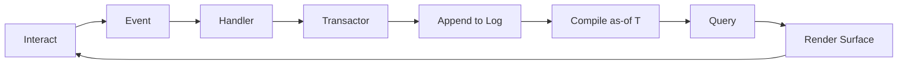
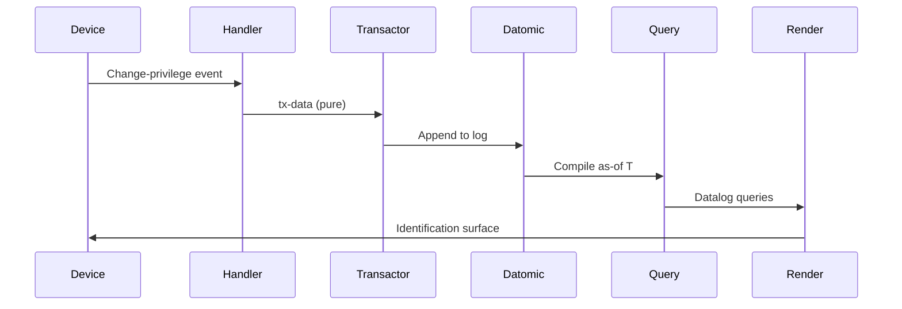
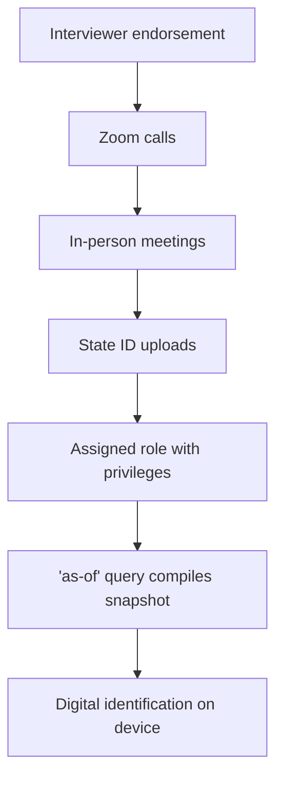
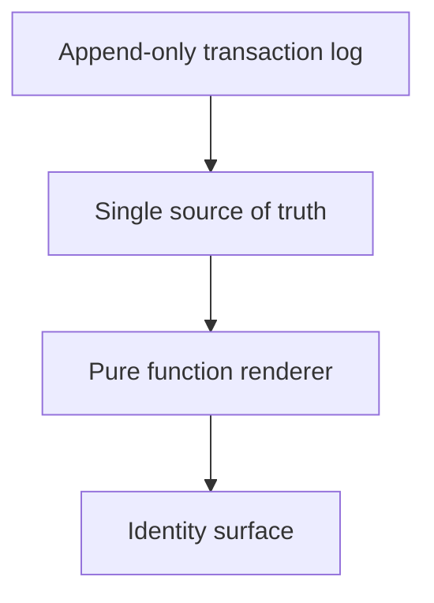
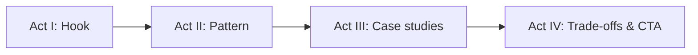
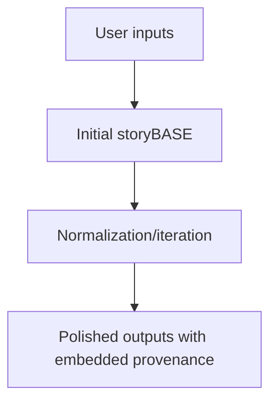

#### sic[theme][#theme]
# 
## Immutable Selves
### A Functional Approach to Digital Identity
# 
#### Scarlet Dame
###### Founder, Sic · Former Chief Strategist, Vouch.io
	[#theme]: Custom theme for Sic brand. Source: narr:Tagline_1 "Immutable Selves: A Functional Approach to Digital Identity" from narr:Sample_1, generated via narr:Tx_20251111T214920Z_immutable_selves.

---
# Identity is not mutable state
## Yet we're treating it like Backbone.js

We mutate pictures. We mutate profiles. We mutate identity.

---
###### Personal story
# I became Scarlet

I was Dylan Butman. Then Scarlet Spectacular. Now Scarlet Dame[][#transition].

Each name is a snapshot compiled from immutable history—not a mutation of who I was.

	[#transition]: Personal identity evolution exemplifies append-only log model. Source: narr:Actor_ScarletDame with altLabels "Dylan Butman" and "Scarlet Spectacular" from narr:Sample_1, via narr:Tx_20251110T184512Z_sample1. Related to narr:Theme_TransitionAsStateChange: "Personal transition as functional transformation from immutable past states."

---
### Who am I?
# You.

Human Identity  
Source of truth[][#human-source]

	[#human-source]: Source: narr:Actor_Human "Source of truth for identity; authorities issue documents that make claims" from narr:Sample_ConjPresentation_2025, via narr:Tx_20251113T030805Z_conj2025.

---
#### Authorities issue documents that 
# make claims about you

Identification represents a snapshot  
compiled at a point in time

---
###### The problem
# Where is the identity here?

Who is the authority?  
What are the claims being made?[][#rhetorical]

	[#rhetorical]: Triadic rhetorical questions frame problem space. Source: narr:StyleObs_RhetoricalQuestion_1 from narr:Sample_ConjPresentation_2025, via narr:Tx_20251113T030805Z_conj2025. Related to narr:RuleOfThree.

---
## AI Identity
# Source of truth?
## Unclear.

Labs train models that say stuff.  
Each chat is different context[][#ai-source].

	[#ai-source]: Source: narr:Actor_AI "Source of truth unclear; labs train models that say stuff; each chat is different context" from narr:Sample_ConjPresentation_2025, via narr:Tx_20251113T030805Z_conj2025.

---
### The question
# "My AI doesn't give the same answers as your AI?"

This is problematic[][#ai-problem].

	[#ai-problem]: Rhetorical question frames AI memory problem. Source: narr:StyleObs_4 and narr:StyleObs_RhetoricalQ_WhyDiffer from narr:Sample_1, via narr:Tx_20251113T032552Z_sample1 and narr:Tx_20251113T200138Z_immutable_selves. Related to narr:CaseStudy_AsWrittenAI.

---
###### Clojure Design Patterns
# 
## No frameworks
# Simple tools ± good principles

Simple tools + good principles = design patterns[][#clojure-idiom]

	[#clojure-idiom]: Clojure community idiom signaling shared values. Source: narr:StyleObs_StockPhrase_1 from narr:Sample_ConjPresentation_2025, via narr:Tx_20251113T030805Z_conj2025. Related to narr:IdiolectPhrasing. Also narr:StyleObs_1 from narr:Sample_1 via narr:Tx_20251111T214920Z_immutable_selves.

---
### I've been writing Clojure
# since 2012

Anyone remember Backbone.js?[][#backbone]

	[#backbone]: Engages audience with shared context. Source: narr:StyleObs_6 from narr:Sample_1, via narr:Tx_20251111T214920Z_immutable_selves.

---
### Backbone.js
# You saw a picture (the DOM)
## Then you queried the picture
## Then you mutated the picture

Anaphora creates rhythm and emphasis[][#anaphora].

	[#anaphora]: Repeated "Then you" structure. Source: narr:StyleObs_3 from narr:Sample_1, via narr:Tx_20251111T214920Z_immutable_selves. Related to narr:Anaphora and narr:CadenceRhythm.

---
### I want to argue
# We still treat identity like Backbone.js

Human identity  
AI identity  
Synthetic individuality[][#backbone-analogy]

	[#backbone-analogy]: Core analogy: identity systems = Backbone.js (mutable DOM). Source: narr:StyleObs_5 from narr:Sample_1, via narr:Tx_20251111T214920Z_immutable_selves. Also narr:StyleObs_Metaphor_1 from narr:Sample_ConjPresentation_2025 via narr:Tx_20251113T030805Z_conj2025.

---
## Reified Change
# 
###### Make state explicit
# Append only log → Single source of truth
# Everyone sees the same thing
# Render as pure function → Deterministic UIs

Repeated structural frame creates rhythm[][#reified-pattern].

	[#reified-pattern]: Anaphora: principle → pattern. Source: narr:StyleObs_Anaphora_1 from narr:Sample_ConjPresentation_2025, via narr:Tx_20251113T030805Z_conj2025. Related to narr:CadenceRhythm.

---
###### Single Source of Truth
# 
## Experience is an append-only log 
# that compiles[][#as-of] to identity

	[#as-of]: Core analogy mapping human to Datomic model. Source: narr:StyleObs_Analogy_1 from narr:Sample_ConjPresentation_2025, via narr:Tx_20251113T030805Z_conj2025. Related to narr:ResonanceUse. Verb "compile" is canonical: narr:StyleObs_VerbChoice_Compile from narr:Sample_1 via narr:Tx_20251113T200138Z_immutable_selves.

---
## The Pattern



interact → event → handler → transactor → append → compile as-of T → query → render → interact[][#loop]

	[#loop]: Immutable Identity Loop. Source: narr:Obs_Flow_CoreLoop "interact → event → handler → transactor → append → compile as-of T → query → render → interact" from narr:Sample_1, via narr:Tx_20251113T200138Z_immutable_selves. Also narr:StyleObs_Cadence_Loop: "Short, punchy cadence with arrow notation; encodes entire loop in one line."

---
###### Vocabulary
# 
### Append-only log
## Single source of truth

### Snapshot (as-of T)
## Compiled view

### Identity surface
## What gets rendered[][#vocab]

	[#vocab]: Canonical terminology. Sources: narr:Obs_KeyPhrase_AppendOnlyLog, narr:Obs_KeyPhrase_SnapshotAsOfT, narr:Obs_KeyPhrase_IdentitySurface from narr:Sample_1, via narr:Tx_20251113T200138Z_immutable_selves. Related to narr:TerminologyControl and narr:KeyPhrases.

---
## System: Human
# berecognized.id
###### Immutable Identification

Device-to-device verification  
Identification and privileges evolve[][#berecognized]

	[#berecognized]: Source: narr:CaseStudy_berecognized and narr:CaseStudy_berecognized_Context from narr:Sample_1, via narr:Tx_20251113T200138Z_immutable_selves. Brand stylization: narr:StyleObs_Brand_berecognized "Lowercase brand with .id TLD; consistent stylization."

---
### berecognized.id
# How it works



A device interaction emits Change-privilege → pure handler → tx-data → transactor appends to Datomic → compile as-of T → Datalog queries → render Identification[][#berecognized-flow]

	[#berecognized-flow]: Source: narr:CaseStudy_berecognized_Intervention from narr:Sample_1, via narr:Tx_20251113T200138Z_immutable_selves. Active voice: narr:StyleObs_ActiveVoice_Emit "Active voice: 'interaction emits'; subject performs action."

---
### berecognized.id
# Outcomes

Provenance ← append-only log  
Equality ← snapshot hashes  
Offline ← render targets travel[][#berecognized-results]

	[#berecognized-results]: Source: narr:CaseStudy_berecognized_Results from narr:Sample_1, via narr:Tx_20251113T200138Z_immutable_selves. Triadic list: narr:StyleObs_8 from narr:Sample_1 via narr:Tx_20251113T032552Z_sample1.

---
### The risk
# Ghost labor

Bad actors deepfaking candidates  
Passing interviews  
Collecting paychecks[][#ghost-labor]

Continuous identity establishment via append-only log mitigates this.

	[#ghost-labor]: Source: narr:Risk_GhostLabor "Bad actors (individuals or state actors like North Korea) deepfaking candidates, passing interviews, collecting paychecks on behalf of fake identities" from narr:Sample_1, via narr:Tx_20251113T032552Z_sample1. Metaphor: narr:StyleObs_5. Verb choice: narr:StyleObs_6 "Gerund 'deepfaking' as active verb."

---
### Employee lifecycle
# Continuous identity



Endorsement → Zoom → in-person → ID upload → role with privileges → 'as-of' query compiles snapshot → digital identification on device[][#employee-flow]

	[#employee-flow]: Source: narr:Flow_EmployeeLifecycle from narr:Sample_1, via narr:Tx_20251113T032552Z_sample1. Related to narr:Behaviors and narr:Storyboards.

---
## System: AI
# aswritten.ai
###### Immutable AI Memory

Chat ± API  
Deterministic AI perspective[][#aswritten]

	[#aswritten]: Source: narr:CaseStudy_aswritten and narr:CaseStudy_aswritten_Context from narr:Sample_1, via narr:Tx_20251113T200138Z_immutable_selves. Brand stylization: narr:StyleObs_Brand_aswritten "Lowercase brand with .ai TLD; consistent stylization."

---
### aswritten.ai
# How it works

```mermaid
sequenceDiagram
    participant Person
    participant Handler
    participant Transactor
    participant RDF+git
    participant Query
    participant Render

    Person->>Handler: Extract-narrative event
    Handler->>Transactor: triples/commit tx-data
    Transactor->>RDF+git: Append to log
    RDF+git->>Query: Compile as-of commit
    Query->>Render: SPARQL queries
    Render->>Person: AI memory surface
```

Person talks to AI → extract chats/docs to RDF → save to append-only log → AI memory as 'as-of T' snapshot (pure function)[][#aswritten-flow]

	[#aswritten-flow]: Source: narr:CaseStudy_aswritten_Intervention from narr:Sample_1, via narr:Tx_20251113T200138Z_immutable_selves. Also narr:CaseStudy_AsWrittenAI from narr:Sample_1 via narr:Tx_20251113T032552Z_sample1.

---
### aswritten.ai
# Outcomes

Versioning/Branching ← git log  
Deterministic perspective as-of T ← compile + pure render  
Provenance ← commit history + citations[][#aswritten-results]

	[#aswritten-results]: Source: narr:CaseStudy_aswritten_Results from narr:Sample_1, via narr:Tx_20251113T200138Z_immutable_selves.

---
###### Tagline
# AI that tells your story
## as written.

7-word tagline encoding promise and brand[][#tagline].

	[#tagline]: Source: narr:Tagline_AsWritten from narr:Sample_ConjPresentation_2025, via narr:Tx_20251113T030805Z_conj2025.

---
## The Primitives



Foundational atomic units that compose all higher-order features[][#primitives]

	[#primitives]: Source: narr:Primitive_1 "Append-only transaction log", narr:Primitive_2 "Single source of truth (SSoT)", narr:Primitive_3 "Pure function renderer" from narr:Sample_1, via narr:Tx_20251111T214920Z_immutable_selves. Related to narr:ProductLadder.

---
### What we get
# for free

Equality  
Provenance  
Versioning  
Branching  
Generative testing  
Decentralization  
Infinite read scale[][#leverage]

Immutability creates outsized effects across the system.

	[#leverage]: Source: narr:LeverageProfile_1 "Immutability enables equality, provenance, versioning, branching, generative testing, decentralization, and infinite read scale—for free" from narr:Sample_1, via narr:Tx_20251111T214920Z_immutable_selves.

---
### What we gave up
# Distributed writes

Bottleneck at single transactor  
All logic in event clients  
Transact is just adding triples[][#tradeoff]

Why worth it: consistency, provenance, auditability.

	[#tradeoff]: Source: narr:DesignTradeoff_1 from narr:Sample_1, via narr:Tx_20251111T214920Z_immutable_selves. Related to narr:TechnicalExplainers. Stock phrase: narr:StyleObs_Idiolect_SingleTransactor "Repeated phrase: 'Single transactor' appears in both case studies."

---
## Datomic
# The canonical example

Append-only log compiles into snapshot as-of T  
Time-travel, audit, deterministic UI render from pure functions[][#datomic]

	[#datomic]: Source: narr:StyleObs_Analogy_DatomicPattern "Analogy: Datomic's as-of T pattern generalizes to identity" from narr:Sample_1, via narr:Tx_20251113T200138Z_immutable_selves.

---
### When to use this pattern
# vs. alternatives

When provenance, auditability, and equality matter more than write throughput[][#comparative]

	[#comparative]: Source: narr:ComparativeAnalysis_1 "Backbone.js (query DOM, mutate picture) vs. Om/React (state machine, pure function render). Identity systems today are Backbone; this is Om for identity" from narr:Sample_1, via narr:Tx_20251111T214920Z_immutable_selves.

---
## Positioning

For developers and identity architects who treat identity as mutable state,  
this is a functional paradigm that makes identity deterministic, auditable, and decentralized—  
by applying Clojure's immutability principles to human and AI identity systems[][#positioning]

	[#positioning]: Source: narr:PositioningThesis_1 from narr:Sample_1, via narr:Tx_20251111T214920Z_immutable_selves. Related to narr:StrategyOverview.

---
### Our moat
# 13 years of production experience

Clojure ecosystem (Datomic, datalog, re-frame) as proof-of-concept  
Provenance and equality by design[][#moat]

	[#moat]: Source: narr:MoatLeverage_1 from narr:Sample_1, via narr:Tx_20251111T214920Z_immutable_selves. Related to narr:StrategyOverview.

---
## Four-act story arc



Act I: What's broken  
Act II: How it works  
Act III: How to do it  
Act IV: Trade-offs & next steps[][#story-arc]

	[#story-arc]: Source: narr:Obs_SalesDeck_StoryArc "Act I: Hook (what's broken); Act II: Pattern (how it works); Act III: Case studies (how to do it); Act IV: Trade-offs & CTA" from narr:Sample_1, via narr:Tx_20251113T200138Z_immutable_selves. Related to narr:SalesDecks.

---
###### Vision
# A world where identity is rendered from immutable history

Human, synthetic, AI—  
enabling equality, provenance, and trust by design[][#vision]

	[#vision]: Source: narr:Vision_1 from narr:Sample_1, via narr:Tx_20251111T214920Z_immutable_selves. Related to narr:NarrativeAnchor. Also narr:Obs_Vision_1 "Engineers apply the pattern in their domain" via narr:Tx_20251113T200138Z_immutable_selves.

---
### Deterministic AI perspective
# as-of T

Full talk as query  
Section of talk  
Talk evolution over time  
Any accessible graph subset within billion-node graph[][#future-vision]

Close with examples of such queries, then link to chat for participants to engage with narrative source of truth.

	[#future-vision]: Source: narr:FutureVision_DeterministicAI from narr:Sample_1, via narr:Tx_20251113T032552Z_sample1. Related to narr:TrendForecasting and narr:InflectionPoints.

---
## Meta-demonstration

This talk itself exemplifies the reified change architecture and storyBASE workflow[][#meta]

Iterative refinement from raw inputs to polished outputs  
Identity as compiled surface from append-only log

	[#meta]: Source: narr:Proof_1 "The talk itself exemplifies the reified change architecture and storyBASE workflow, showing iterative refinement from raw inputs to polished outputs" from narr:Sample_1, via narr:Tx_20251113T033534Z_claude45. Related to narr:CaseStudies and narr:Outcomes.

---
### storyBASE workflow
# Content production



User inputs → initial storyBASE → normalization/iteration → polished outputs with embedded provenance[][#workflow]

	[#workflow]: Source: narr:Flow_1 "User inputs → initial storyBASE → normalization/iteration → polished outputs with embedded provenance" from narr:Sample_1, via narr:Tx_20251113T033534Z_claude45. Related to narr:ProductLadder and narr:Storyboards.

---
###### Mission
# Move identity from mutable documents
## to compiled surfaces

Rendered from append-only logs and single sources of truth[][#mission]

Make identity deterministic, provable, and decentralized.

	[#mission]: Source: narr:Mission_1 from narr:Sample_1, via narr:Tx_20251111T214920Z_immutable_selves. Also narr:Obs_Mission_1 "Abstract Datomic's as-of T pattern: identity is a compiled surface, not mutable state" via narr:Tx_20251113T200138Z_immutable_selves. Related to narr:NarrativeAnchor.

---
## Now Go and Apply the Pattern

Model events  
Write handlers  
Transact to append-only store  
Compile as-of T  
Render surface[][#cta]

	[#cta]: Actionable takeaways for audience. Related to narr:Obs_Vision_1 and narr:CallToAction.

---
### Thank you

Scarlet Dame  
scarlet@sic.ai  
aswritten.ai

	This presentation was compiled from storyBASE[][#storybase-brand]—a Git-native RDF knowledge graph—demonstrating the very pattern it describes.
	
	[#storybase-brand]: Brand stylization: narr:StyleObs_storyBASE "CamelCase with uppercase suffix; consistent brand stylization" from narr:Sample_1, via narr:Tx_20251110T184512Z_sample1. Related to narr:NamingConventions and narr:BrandNameStylization.