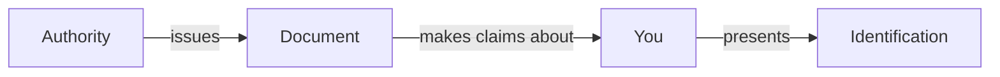
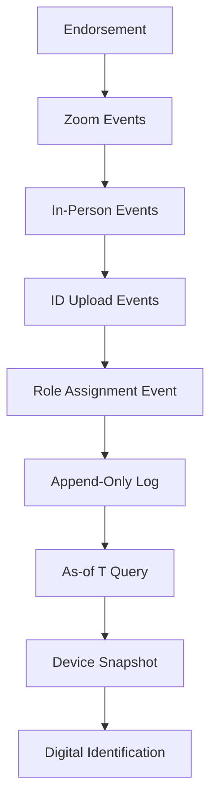
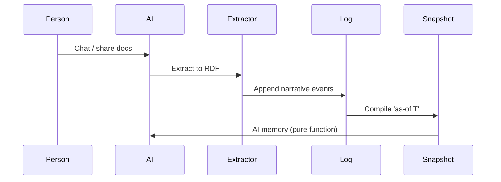
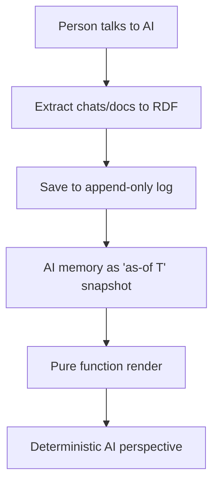

#### sic[theme][#theme]
# 
## Immutable Selves
### A Functional Approach to Digital Identity
# 
#### Scarlet Dame
###### Founder, Sic · Former Chief Strategist, Vouch.io
	[#theme]: Custom theme for Sic brand. Source: narr:Sample_ConjPresentation_2025, narr:Tagline_1, narr:Actor_ScarletDame (speaker identity history exemplifies append-only log model).

---
# Identity is not mutable state
## Yet we're treating it like Backbone.js

This talk argues that we model identity—both human and AI—as mutable objects when we should treat them as append-only logs that compile to state[][#thesis].

[#thesis]: Core narrative from narr:Narrative_ImmutableIdentity: "experience is an append-only log; identification is a render target; interaction is transaction." Related to narr:Theme_FunctionalIdentity applying Clojure design patterns to identity systems.

---
### I became a software engineer
# because someone told me
## "Your code was shit. Let me refactor it for you."

That was 2012. My introduction to UI programming was Backbone.js[][#backbone].

[#backbone]: narr:StyleObs_2 captures this as characteristic blunt phrasing and speaker idiolect. narr:ComparativeAnalysis_1 positions Backbone.js as the anti-pattern: "query DOM, mutate picture" vs. functional rendering.

---
###### 2012
# You saw a picture (the DOM)
# 
###### Then
# You queried the picture with a selector
# 
###### Then
# You mutated the picture

This is how we built UIs. And this is how we still build identity systems[][#mutation].

[#mutation]: narr:StyleObs_3 notes the anaphora ("Then you...") as rhetorical device for emphasis. narr:StyleObs_8 highlights "mutated" as technical verb carrying negative connotation in functional paradigm.

---
## 2013
### Luke Vanderhart showed us Om

We started seeing UI as a state machine that was the result of a functional transformation[][#om].

[#om]: narr:Actor_LukeVanderhart related to narr:TechnicalExplainers. narr:StyleObs_UIStateMachine identifies this as core analogy linking UI rendering to immutable state paradigm.

---
###### Clojure Design Patterns
# 
## No frameworks
# Simple tools ± good principles

When I got my lanyard at my first Clojure/conj, this is what I learned[][#principles].

[#principles]: narr:StyleObs_StockPhrase_1 notes this as Clojure community idiom signaling insider knowledge and shared values. Related to narr:MoatLeverage_1: "Clojure ecosystem as proof-of-concept; 13 years of production experience."

---
### Who am I?
# I'm scarlet dame
## But I was scarlet spectacular
### And before that, Dylan Butman

My identity is not a mutable object. It's an append-only log[][#identity-log].

[#identity-log]: narr:Actor_ScarletDame with altLabels "Dylan Butman" and "Scarlet Spectacular" exemplifies the model. narr:Theme_TransitionAsStateChange: "Personal transition as functional transformation from immutable past states."

---
## The Problem

---
### What is identity?

Where is the identity here? Who is the authority? What are the claims being made[][#questions]?

[#questions]: narr:StyleObs_RhetoricalQuestion_1 captures triadic rhetorical questions that frame problem space and invite audience reasoning. Related to narr:RuleOfThree.

---
###### The state of California
# issues a driver's license
# 
## that makes claims about
# Dylan Butman

Authorities issue documents that make claims about you[][#claims].

[#claims]: narr:Actor_Human: "Source of truth for identity; authorities issue documents that make claims." narr:StyleObs_SecondPerson_1 notes direct address "you" as conversational, inclusive tone.

---
## Identification represents
# a snapshot of claims
## compiled at a point in time

But we treat it like mutable state[][#snapshot].

[#snapshot]: narr:StyleObs_9 identifies "'as-of T' snapshot" as canonical term appearing multiple times. Related to narr:CaseStudy_BeRecognizedID and narr:CaseStudy_AsWrittenAI.

---
## The Pattern

---
###### Immutability
# Make state explicit
# 
###### Reified Change
# Append only log → Single source of truth
# 
###### Pure Functions
# Everyone sees the same thing
# 
###### Deterministic UIs
# Render as pure function → Deterministic UIs

These are the principles we use to build reliable systems[][#patterns].

[#patterns]: narr:StyleObs_Anaphora_1 notes repeated structural frame "principle → pattern" creates rhythm and memorability. Related to narr:CadenceRhythm and narr:Primitive_1, narr:Primitive_2, narr:Primitive_3.

---
###### Single Source of Truth
# 
## Experience is an append-only log 
# that compiles[][#as-of] to identity

[#as-of]: narr:StyleObs_Analogy_1 identifies core analogy: "experience → log → compiled identity; maps human to Datomic model." Related to narr:ResonanceUse and narr:KeyPhrase_2 "append-only log."

---
## Two Systems

---
## System: Human
# berecognized.id
###### Immutable Identification

Digital identification enables recognition and delegates authority[][#berecognized].

[#berecognized]: narr:CaseStudy_BeRecognizedID intervention: "Append-only log of facts about a person over time; device-rendered snapshot compiled at specific point in time." Results: "Provenance for individual transactions; referential equality for free; offline transactions enabled." Related to narr:Flow_EmployeeLifecycle.

---
### The Risk
# Ghost Labor & Impersonation

Bad actors—individuals or state actors like North Korea—deepfaking candidates, passing interviews, collecting paychecks on behalf of fake identities[][#ghost-labor].

[#ghost-labor]: narr:Risk_GhostLabor definition and narr:StyleObs_5 noting "'Ghost labor' metaphor for impersonation risk." Mitigated by continuous identity establishment via append-only log.

---
### The Solution
# Continuous Identity Establishment

Each interaction is an event. Identity is the compiled result[][#continuous].

[#continuous]: narr:Flow_EmployeeLifecycle: "Endorsement by interviewer → Zoom calls → in-person meetings → state ID uploads → assigned role with privileges → 'as-of' query compiles snapshot on device." Related to narr:Behaviors and narr:Storyboards.

---
###### System Breakdown
# 
## SSoT: Datomic
## Query: Datalog
## Interaction: Device-to-device
## Events: Change-privilege transactions

Required capabilities from the Clojure ecosystem[][#capabilities-human].

[#capabilities-human]: narr:RequiredCapabilities_1: "Datomic (SSoT), datalog (query), multimodal renderer, event system, single transactor." Related to narr:Archetype_1 and narr:MoatLeverage_1.

---
## System: AI
# aswritten.ai
###### Immutable AI Memory

AI memory as narrative source of truth[][#aswritten].

[#aswritten]: narr:CaseStudy_AsWrittenAI context: "AI memory problem: 'My AI doesn't give the same answers as your AI'; need for narrative source of truth." Intervention: "person talks to AI → extract chats/docs to RDF → save to append-only log → AI memory as 'as-of T' snapshot (pure function)." Results: "Provenance, equality, decentralization/offline scale; deterministic AI perspective."

---
### The Problem
# "My AI doesn't give the same answers as your AI"

AI models are black boxes. Persona prompts mutate rendered state. No provenance or version control for AI identity[][#ai-problem].

[#ai-problem]: narr:StyleObs_4 captures this as rhetorical question framing AI memory problem. narr:ProblemContext_2: "AI models are black boxes; persona prompts mutate rendered state; no provenance or version control for AI identity. Stakes: narrative manipulation, embedded propaganda, deepfakes."

---
### The Solution
# Narrative Source of Truth

Same pattern, different stack: RDF instead of Datomic[][#ai-pattern].

[#ai-pattern]: narr:ApproachPattern_2: "SSoT (RDF + git) → SPARQL query → render to AI memory/identity → event-driven transactions → append-only log → recompile." narr:StyleObs_10 notes parallel structure in transaction sequence.

---
###### System Breakdown
# 
## SSoT: RDF + git
## Query: SPARQL
## Interaction: Chat + API
## Events: Extract-narrative transactions

Leverages semantic web + version control[][#capabilities-ai].

[#capabilities-ai]: narr:RequiredCapabilities_2: "RDF graph, git versioning, SPARQL, multimodal renderer, event system, transactor." Related to narr:Archetype_2 and narr:SolutionArchetype_AsWritten.

---
## The Payoff

---
# Provenance
## For every interaction

Transaction log ensures auditability[][#provenance].

[#provenance]: narr:SystemProperty_ImmutabilityProvenance: "Transaction log ensures auditability for every interaction." Evidence: narr:CaseStudy_BeRecognizedID and narr:CaseStudy_AsWrittenAI. Conviction level: Boulder.

---
# Equality
## For free

Immutable facts enable referential equality without custom logic[][#equality].

[#equality]: narr:LeverageProfile_1: "Immutability enables equality, provenance, versioning, branching, generative testing, decentralization, and infinite read scale—for free." Small choice (append-only) creates outsized effects.

---
# Offline Capability
## Decentralized by design

Reads scale linearly. Data model exists off-server. Transactions submitted later[][#offline].

[#offline]: narr:SystemProperty_DistributedDecentralization: "Reads scale linearly; data model exists off-server, with transactions submitted later." Evidence: both case studies. Conviction level: Boulder.

---
## The Tradeoff

---
### What we gave up
# Distributed writes

Bottleneck at single transactor. All logic in event clients. Transact is just adding triples[][#tradeoff].

[#tradeoff]: narr:DesignTradeoff_1: "Bottleneck at single transactor; all logic in event clients; transact is just adding triples. What we gave up: distributed writes. Why worth it: consistency, provenance, auditability."

---
### What we gained
# Consistency, provenance, auditability

When provenance and equality matter more than write throughput, this is the pattern[][#when-to-use].

[#when-to-use]: narr:ComparativeAnalyses: "When to use: when provenance, auditability, and equality matter more than write throughput." Related to narr:TechnicalExplainers.

---
## The Vision

---
###### Deterministic AI
# 
## Query the graph 'as-of T'
### Full talk as query
### Section of talk
### Talk evolution over time
### Any accessible subset within billion-node graph

AI perspective becomes a pure function of narrative state[][#deterministic-ai].

[#deterministic-ai]: narr:FutureVision_DeterministicAI: "Deterministic AI perspective 'as-of T' for graph queries. Examples: full talk as query, section of talk, talk evolution over time, any accessible graph subset within billion-node graph." Supports narr:CaseStudy_AsWrittenAI. Conviction: Stake.

---
## The Invitation

---
# Identity systems today are Backbone
## This is Om for identity

We move from mutable documents to compiled selves[][#comparison].

[#comparison]: narr:ComparativeAnalysis_1: "Backbone.js (query DOM, mutate picture) vs. Om/React (state machine, pure function render). Identity systems today are Backbone; this is Om for identity." narr:Narrative_1: "From mutable documents to compiled selves."

---
### Takeaways
# 
## Model identity as append-only log
## Compile state as pure function
## Prove provenance by design

Same principles apply across UI, identity, and AI[][#lessons].

[#lessons]: narr:CaseLessons_1: "Same principles apply across UI, identity, and AI; immutability is the unlock; single transactor is acceptable bottleneck." Related to narr:CaseStudy_1 spanning 13-year career applying Clojure principles.

---
###### Human Identity
# 
# Source of truth
# You.

Authorities issue documents that make claims about you[][#human-source].

[#human-source]: narr:Actor_Human: "Source of truth for identity; authorities issue documents that make claims." narr:StyleObs_ShortPunchy_1 notes single-word answer "You." as punchy, direct, confident.

---
###### AI Identity
# 
# Source of truth
# Unclear.

Labs train models that say stuff. Each chat is different context[][#ai-source].

[#ai-source]: narr:Actor_AI: "Source of truth unclear; labs train models that say stuff; each chat is different context." Contrast establishes problem space for narr:SolutionArchetype_AsWritten.

---
## A world where identity—human, synthetic, AI—
# is rendered from immutable history
## enabling equality, provenance, and trust by design

This is the vision[][#vision].

[#vision]: narr:Vision_1: "A world where identity—human, synthetic, AI—is rendered from immutable history, enabling equality, provenance, and trust by design. Future state: identity systems that inherit Clojure's guarantees."

---
### Try it yourself
# 
## berecognized.id
## aswritten.ai
###### AI that tells your story, as written.

Chat with the narrative source of truth that generated this talk[][#tagline].

[#tagline]: narr:Tagline_AsWritten: "AI that tells your story, as written." 7-word tagline encoding promise and brand. narr:StyleObs_BrandStylization_1 and narr:StyleObs_BrandStylization_2 note lowercase domain-style brand names.

---
## Thank you

Questions?

	This presentation was compiled from an append-only log of narrative events in storyBASE—a Git-native RDF knowledge graph. Every claim is traceable to its source transaction[][#meta].
	
	[#meta]: narr:Sample_ConjPresentation_2025 (6,847 characters, created 2025-01-01) generated by narr:Tx_20251113T030805Z_conj2025. Rubric assessments: Strategic Alignment 5.0/5, Tailoring 5.0/5, Resonance 4.5/5, Novelty 4.5/5. Style metrics: avg sentence length 12.3, active voice 0.82, jargon density 0.15, conciseness 0.78.