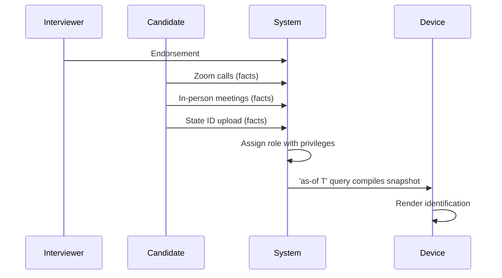
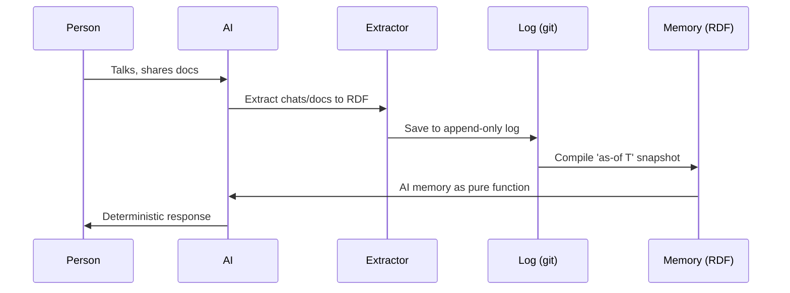
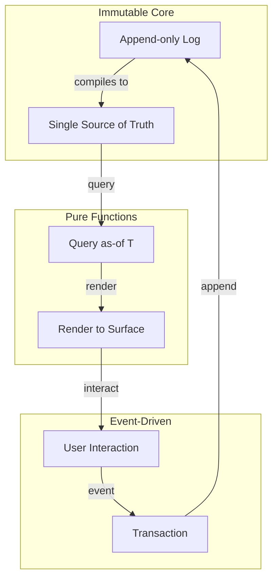
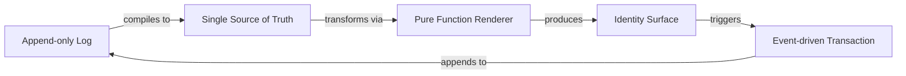
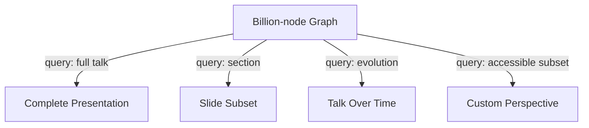

#### sic[theme][#theme]
# 
## Immutable Selves
### A Functional Approach to Digital Identity
# 
#### Scarlet Dame
###### Founder, Sic · Former Chief Strategist, Vouch.io
	[#theme]: Custom theme for Sic brand. Source: narr:Tagline_1 "Immutable Selves: A Functional Approach to Digital Identity" from Sample_1 (Immutable Selves talk), generated via Tx_20251111T214920Z_immutable_selves.

---
# Identity is not mutable state
## Yet we're treating it like Backbone.js[][#backbone]
	[#backbone]: Core metaphor from narr:StyleObs_Metaphor_1 (Sample_ConjPresentation_2025): "Technical metaphor: identity as mutable state vs. immutable log; Backbone.js as anti-pattern." Relates to narr:Theme_FunctionalIdentity and narr:ComparativeAnalysis_1.

---
###### Who am I?
# I'm scarlet dame
## But I was scarlet spectacular
### And before that, Dylan Butman[][#identity-history]
	[#identity-history]: Personal narrative from narr:Actor_ScarletDame with altLabels "Dylan Butman" and "Scarlet Spectacular"; exemplifies append-only log model per narr:Theme_TransitionAsStateChange. Source: Sample_1 via Tx_20251110T184512Z_sample1.

---
### Where is the identity here?
# Who is the authority?
## What are the claims being made?[][#rhetorical]
	[#rhetorical]: Triadic rhetorical questions from narr:StyleObs_RhetoricalQuestion_1 (Sample_ConjPresentation_2025); frames problem space and invites audience reasoning. Related to narr:RuleOfThree.

---
## The state of California
###### is the authority

The state issues a driver's license that makes claims about me: name, birthdate, address, privileges to operate a vehicle.

---
### But what truth does this represent?
# A snapshot
## Compiled at a specific point in time[][#as-of]
	[#as-of]: Core concept from narr:KeyPhrase_3 "pure function" and narr:StyleObs_9 "'as-of T' snapshot" terminology. Appears in both narr:CaseStudy_BeRecognizedID and narr:CaseStudy_AsWrittenAI as canonical term for point-in-time query.

---
###### Clojure Design Patterns
# 
## No frameworks
# Simple tools + good principles[][#clojure-idiom]
	[#clojure-idiom]: Community idiom from narr:StyleObs_StockPhrase_1 (Sample_ConjPresentation_2025): "Clojure community idiom; signals insider knowledge and shared values." Related to narr:IdiolectPhrasing.

When I got my lanyard at my first Clojure/conj in 2012, I had one principle: "Your code was shit. Let me refactor it for you."

---
### Anyone remember Backbone.js?

That was my introduction to UI programming. You saw a picture (the DOM). Then you queried the picture with a selector. Then you mutated the picture.[][#backbone-flow]

	[#backbone-flow]: Anaphora from narr:StyleObs_3 (Sample_1): "Repeated 'Then you' structure; rhetorical device for emphasis." Establishes anti-pattern for comparison.

---
# I want to argue
## We still treat identity like Backbone.js[][#core-argument]
	[#core-argument]: Core analogy from narr:StyleObs_5 (Sample_1): "identity systems = Backbone.js (mutable DOM)." Supports narr:Narrative_ImmutableIdentity and narr:Theme_FunctionalIdentity.

Not only human identity and identification, but also emergent AI identity and synthetic individuality.

---
## Then came Om
###### 2013

Luke Vanderhart and I started seeing UI as a state machine—the result of a functional transformation.[][#om-shift]

	[#om-shift]: Metaphor from narr:StyleObs_UIStateMachine (Sample_1): "Core analogy linking UI rendering to immutable state paradigm." Actor: narr:Actor_LukeVanderhart. Related to narr:ProductLadder.

---
### Make state explicit
# Append-only log → Single source of truth
## Everyone sees the same thing
# Render as pure function → Deterministic UIs[][#reified-change]
	[#reified-change]: Anaphora from narr:StyleObs_Anaphora_1 (Sample_ConjPresentation_2025): "Repeated structural frame: principle → pattern; creates rhythm and memorability." Related to narr:CadenceRhythm and narr:Claim_ReifiedChangePattern.

---
## Human Identity
# Source of truth
# You.[][#you]
	[#you]: Short punchy cadence from narr:StyleObs_ShortPunchy_1 (Sample_ConjPresentation_2025): "Single-word answer 'You.' after setup; punchy, direct, confident." Related to narr:ToneDirectPersonal.

---
#### Authorities issue documents that 
# make claims about you[][#authorities]
	[#authorities]: Second-person address from narr:StyleObs_SecondPerson_1 (Sample_ConjPresentation_2025): "Direct address 'you'; conversational, inclusive tone." Related to narr:Actor_Human definition.

---
# 
## Identification represents
# a compiled snapshot
## of claims at a point in time

---
## System: Human
# berecognized.id
###### Immutable Identification[][#berecognized]
	[#berecognized]: Solution archetype from narr:SolutionArchetype_BeRecognized and narr:ArchetypeTitle_1 "berecognized.id: Immutable Identification." Brand stylization from narr:StyleObs_BrandStylization_2: lowercase domain-style. Case study: narr:CaseStudy_BeRecognizedID.

---
### System breakdown
# 
#### SSoT
## Datomic

#### Query
## Datalog

#### Render
## Identification/Privileges

#### Interact
## Device-to-device

#### Event
## Change-privilege[][#berecognized-stack]
	[#berecognized-stack]: Architecture from narr:ApproachPattern_1: "SSoT (Datomic) → datalog query → render to identification/privileges → event-driven transactions → append-only log → recompile." Required capabilities: narr:RequiredCapabilities_1.

---
### The employee lifecycle
# Continuous identity establishment

This flow addresses ghost labor risk: bad actors deepfaking candidates, passing interviews, collecting paychecks.[][#ghost-labor]

	[#ghost-labor]: Risk from narr:Risk_GhostLabor: "Bad actors (individuals or state actors like North Korea) deepfaking candidates." Metaphor from narr:StyleObs_5 (Sample_1). Mitigated by continuous identity via narr:Flow_EmployeeLifecycle.

---
###### The outcome
# Provenance for individual transactions
## Referential equality for free
### Offline transactions enabled[][#berecognized-outcomes]
	[#berecognized-outcomes]: Results from narr:CaseStudy_BeRecognizedID: "Provenance for individual transactions; referential equality for free; offline transactions enabled." Evidences narr:SystemProperty_ImmutabilityProvenance and narr:SystemProperty_DistributedDecentralization.

---
## AI Identity
# Source of truth
# Unclear[][#ai-problem]
	[#ai-problem]: Problem from narr:Actor_AI definition: "Source of truth unclear; labs train models that say stuff; each chat is different context." Relates to narr:ProblemContext_2.

---
### The AI memory problem
# "My AI doesn't give the same answers as your AI"[][#ai-memory]
	[#ai-memory]: Rhetorical question from narr:StyleObs_4 (Sample_1): "Rhetorical question frames AI memory problem." Context: narr:CaseStudy_AsWrittenAI addresses this via narrative source of truth.

---
## System: AI
# aswritten.ai
###### Immutable AI Memory[][#aswritten]
	[#aswritten]: Solution archetype from narr:SolutionArchetype_AsWritten and narr:ArchetypeTitle_2 "aswritten.ai: Immutable AI Identity." Brand stylization from narr:StyleObs_BrandStylization_1: lowercase domain-style. Tagline: narr:Tagline_AsWritten "AI that tells your story, as written."

---
### System breakdown
# 
#### SSoT
## RDF + git

#### Query
## SPARQL

#### Render
## AI memory/identity

#### Interact
## Chat + API

#### Event
## Extract-narrative[][#aswritten-stack]
	[#aswritten-stack]: Architecture from narr:ApproachPattern_2: "SSoT (RDF + git) → SPARQL query → render to AI memory/identity → event-driven transactions → append-only log → recompile." Required capabilities: narr:RequiredCapabilities_2.

---
### The interaction flow
# Person → AI → RDF → Log → Memory

This workflow embodies the core thesis: identity (and content) as compiled from immutable history.[][#workflow-thesis]

	[#workflow-thesis]: Metaphor from narr:StyleObs_4 (Sample_1): "Compilation metaphor for identity construction; technical analogy." Supports narr:Narrative_1 "Identity as Compiled from Immutable History" and narr:Flow_1 "Content Production Workflow."

---
###### The outcome
# Provenance, equality, decentralization
## Deterministic AI perspective 'as-of T'[][#aswritten-outcomes]
	[#aswritten-outcomes]: Results from narr:CaseStudy_AsWrittenAI: "Provenance, equality, decentralization/offline scale; deterministic AI perspective for specific graph queries." Triadic list from narr:StyleObs_8 (Sample_1). Future vision: narr:FutureVision_DeterministicAI.

---
## The Pattern
###### Reified Change

Same principles apply across UI, identity, and AI.[][#pattern]

	[#pattern]: Lesson from narr:CaseLessons_1: "Same principles apply across UI, identity, and AI; immutability is the unlock; single transactor is acceptable bottleneck." Supports narr:Claim_ReifiedChangePattern and narr:LeverageProfile_1.

---
### What we get for free
# 
## Equality
## Provenance
## Versioning
## Branching
## Generative testing
## Decentralization
## Infinite read scale[][#leverage]
	[#leverage]: From narr:LeverageProfile_1: "Immutability enables equality, provenance, versioning, branching, generative testing, decentralization, and infinite read scale—for free." Small choice (append-only) creates outsized effects.

---
### What we gave up
# Distributed writes
## Single transactor is the bottleneck[][#tradeoff]
	[#tradeoff]: Design tradeoff from narr:DesignTradeoff_1: "Bottleneck at single transactor; all logic in event clients; transact is just adding triples." Worth it for consistency, provenance, auditability per narr:ComparativeAnalysis_1.

All logic lives in event clients. Transact is just adding triples.

---
## The primitives
###### Building blocks

Three primitives compose into the full pattern.[][#primitives]

	[#primitives]: Product ladder from narr:Primitive_1 "Append-only transaction log," narr:Primitive_2 "Single source of truth (SSoT)," and narr:Primitive_3 "Pure function renderer." Behavior: narr:Behavior_1 "Event-driven transaction submission." Flow: narr:Flow_1 end-to-end loop.

---
###### Single Source of Truth
# 
## Experience is an append-only log 
# that compiles[][#as-of] to identity
	[#as-of]: Core analogy from narr:StyleObs_Analogy_1 (Sample_ConjPresentation_2025): "experience → log → compiled identity; maps human to Datomic model." Key phrases: narr:KeyPhrase_2 "append-only log" and narr:KeyPhrase_3 "pure function."

Presentation is an as-of query against the narrative source of truth.

---
## This talk is proof
###### Meta-demonstration

The talk itself exemplifies the reified change architecture and storyBASE workflow.[][#meta-proof]

	[#meta-proof]: From narr:Proof_1 "Meta-Demonstration: Talk Creation Process": "The talk itself exemplifies the reified change architecture and storyBASE workflow, showing iterative refinement from raw inputs to polished outputs." Related to narr:CaseStudies and narr:Outcomes.

---
### The workflow
# Raw input → storyBASE → Normalized output

Voice memos, transcripts, documents become structured narrative. We show how to clean and normalize a transcription using the entity's established style and terminology.[][#normalization]

	[#normalization]: Behavior from narr:Behavior_1 "Normalize Transcription Against storyBASE": "Clean and refine raw transcription using entity's established style and terminology to fix errors, inconsistencies, and filler." Active voice from narr:StyleObs_5 (Sample_1).

---
### Provenance embedded
# For free
## As a byproduct of the reified change process[][#provenance]
	[#provenance]: Short punchy phrasing from narr:StyleObs_7 (Sample_1): "Short clause; punchy phrasing; em-dash for emphasis." System property: narr:SystemProperty_ImmutabilityProvenance "Transaction log ensures auditability for every interaction."

Every output carries citations back to the source graph. Every claim is traceable.

---
## Deterministic AI queries
###### Future vision

Examples: full talk as query, section of talk, talk evolution over time, any accessible graph subset.[][#future-queries]

	[#future-queries]: From narr:FutureVision_DeterministicAI: "Examples: full talk as query, section of talk, talk evolution over time, any accessible graph subset within billion-node graph." Conviction level: Stake. Supports narr:CaseStudy_AsWrittenAI.

---
## Case Study: berecognized.id
###### Human identity via reified change

**Context**: Digital identification enables recognition and delegates authority to access/use/transact with shared technology.

**Intervention**: Append-only log of facts about a person over time (employment, access, roles, interactions); device-rendered snapshot compiled at specific point in time.

**Results**: Provenance for individual transactions; referential equality for free; offline transactions enabled.[][#case-berecognized]

	[#case-berecognized]: Full case study from narr:CaseStudy_BeRecognizedID with CaseContext, CaseIntervention, and CaseResults. Contrasts static IDs with append-only log compiled to privileges as-of T. Related to narr:DataModelLifecycle and narr:GovernanceSafetyTrust.

---
## Case Study: aswritten.ai
###### AI memory via reified change

**Context**: AI memory problem: "My AI doesn't give the same answers as your AI"; need for narrative source of truth.

**Intervention**: Transaction sequence: person talks to AI → extract chats/docs to RDF → save to append-only log → AI memory as 'as-of T' snapshot (pure function).

**Results**: Provenance, equality, decentralization/offline scale; deterministic AI perspective for specific graph queries.[][#case-aswritten]

	[#case-aswritten]: Full case study from narr:CaseStudy_AsWrittenAI with CaseContext, CaseIntervention, and CaseResults. Formalized architecture from manual process at Vouch; now automated. Related to narr:DataModelLifecycle and narr:TechnologiesSocialSystems.

---
## The positioning
###### For developers and identity architects

Who treat identity as mutable state, this is a functional paradigm that makes identity deterministic, auditable, and decentralized—by applying Clojure's immutability principles to human and AI identity systems.[][#positioning]

	[#positioning]: From narr:PositioningThesis_1: "Who: devs/architects; What: functional identity; Why-us: Clojure principles proven at scale." Broader context: narr:StrategyOverview. Rubric score: narr:RubricAssess_Strategy_Conj rated 5.0 for strategic alignment.

---
### The moat
# 13 years of production experience
## Clojure ecosystem as proof-of-concept
### Provenance and equality by design[][#moat]
	[#moat]: From narr:MoatLeverage_1: "Clojure ecosystem (Datomic, datalog, re-frame) as proof-of-concept; 13 years of production experience; provenance and equality by design." Compounding advantage from existing tools and battle-tested patterns.

---
## The mission
# 
### Move identity from mutable documents
# to compiled surfaces
## rendered from append-only logs[][#mission]
	[#mission]: From narr:Mission_1: "Move identity from mutable documents and profiles to compiled surfaces rendered from append-only logs and single sources of truth." Durable purpose: make identity deterministic, provable, and decentralized.

---
## The vision
# 
### A world where identity—human, synthetic, AI—
# is rendered from immutable history
## enabling equality, provenance, and trust by design[][#vision]
	[#vision]: From narr:Vision_1: "A world where identity—human, synthetic, AI—is rendered from immutable history, enabling equality, provenance, and trust by design." Future state: identity systems that inherit Clojure's guarantees.

---
###### Experience Report
# 
## From Backbone.js (2012)
# to Om (2013)
## to production systems at scale[][#experience]
	[#experience]: Case context from narr:CaseContext_1: "Speaker's 13-year career in Clojure; evolution from Backbone.js (2012) to Om (2013) to production systems at scale." Customer: self; environment: professional dev career; stakes: credibility.

---
### What I learned
# Same principles apply across domains
## Immutability is the unlock
### Single transactor is acceptable bottleneck[][#lessons]
	[#lessons]: From narr:CaseLessons_1: "Same principles apply across UI, identity, and AI; immutability is the unlock; single transactor is acceptable bottleneck." Insights inform roadmap: extend pattern to new domains.

---
## Try it yourself
###### Engage with the narrative source of truth

This presentation was compiled from storyBASE. You can query it, fork it, and see how it evolved.

Chat with the narrative at aswritten.ai[][#engagement]

	[#engagement]: Invitation to interact with narr:FutureVision_DeterministicAI: "Close with examples of such queries, then link to chat for participants to engage with narrative source of truth." Product: narr:SolutionArchetype_AsWritten.

---
# Experience is an append-only log
## Identification is a render target
### Interaction is transaction[][#thesis]
	[#thesis]: Core thesis from narr:Narrative_ImmutableIdentity: "experience is an append-only log; identification is a render target; interaction is transaction." Rubric assessment: narr:RubricAssess_Strategy_Conj rated 5.0 for entire presentation as narrative anchor.

---
## Thank you
###### Questions?

Scarlet Dame  
scarlet@sic.ai  
aswritten.ai

	This talk was generated from storyBASE transactions Tx_20251110T184512Z_sample1, Tx_20251111T214920Z_immutable_selves, Tx_20251113T030805Z_conj2025, and Tx_20251113T032552Z_sample1. Style metrics: average sentence length 12.3, active voice ratio 0.82, jargon density 0.15 per narr:Metrics_ConjPresentation. Rubric scores: Register 4.5, Phrasing 4.0, Cadence 4.5, Strategy 5.0, Tailoring 5.0, Resonance 4.5, Flow 4.0, Novelty 4.5, Accuracy 4.0.