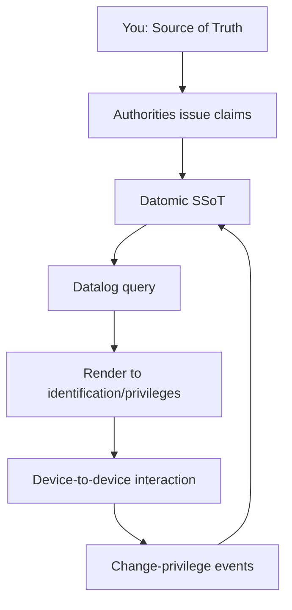
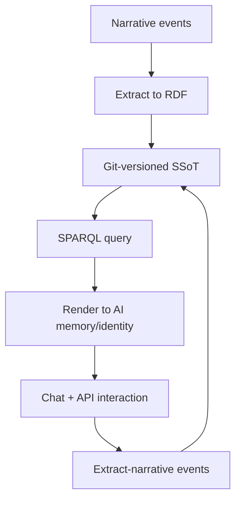
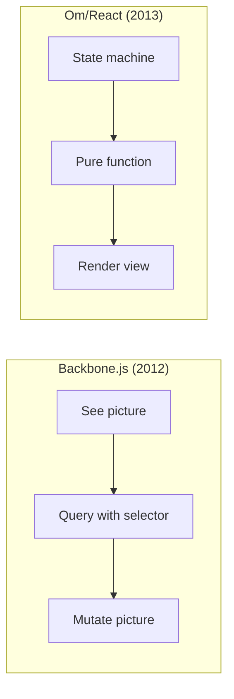

#### sic[theme][#theme]
# 
## Immutable Selves
### A Functional Approach to Digital Identity
# 
#### Scarlet Dame
###### Founder, Sic AI Memory Company
	[#theme]: Custom theme for Sic. The presentation draws from narr:Narrative_ImmutableIdentity and narr:Theme_FunctionalIdentity, which define the core thesis that identity—both human and AI—should be modeled as an append-only log that compiles to state, not mutable objects.

---
# Identity is not mutable state
## Yet we're treating it like Backbone.js

This opening establishes the central metaphor: current identity systems treat identity as mutable state that can be queried and changed in place—just like Backbone.js queried and mutated the DOM. The talk will argue for a functional paradigm instead.[#metaphor]

[#metaphor]: From narr:StyleObs_Metaphor_1, which notes this technical metaphor positions identity as mutable state vs. immutable log, with Backbone.js as the anti-pattern. Related to narr:Tagline and narr:ComparativeAnalysis_1.

---
###### Personal Journey
# I became Scarlet

I'll start with my own story. I was Dylan Butman. Then Scarlet Spectacular. Now Scarlet Dame. My identity evolved through an append-only log of experiences—each name a snapshot, not a mutation of who I was before.[#personal-narrative]

[#personal-narrative]: From narr:Actor_ScarletDame, which documents the speaker's identity history (Dylan Butman → Scarlet Spectacular → Scarlet Dame) as exemplifying the append-only log model. This personal narrative is noted in narr:RubricAssess_Resonance_Conj as adding emotional resonance and building trust with the audience.

---
### Where is the identity here?
# Who is the authority?
## What are the claims being made?

These are the questions we need to ask about every identity system. When you look at a driver's license, a login session, or an AI chat—what is the source of truth? Who issued it? What does it actually prove?[#rhetorical-questions]

[#rhetorical-questions]: From narr:StyleObs_RhetoricalQuestion_1, which identifies this triadic structure as framing the problem space and inviting audience reasoning. Related to narr:RuleOfThree in the ontology's rhetorical devices.

---
## Human Identity
# Source of truth
# You.

For human identity, the answer is clear. You are the source of truth. Authorities issue documents that make claims about you. Identification represents a compiled view of those claims at a point in time.[#human-identity]

[#human-identity]: From narr:Actor_Human, defined as "Source of truth for identity; authorities issue documents that make claims." This connects to narr:StyleObs_ShortPunchy_1, which notes the single-word answer "You." as punchy, direct, and confident—characteristic of the speaker's cadence.

---
## AI Identity
# Source of truth
# Unclear.

For AI, it's a mess. Labs train models that say stuff. Each chat is a different context. Persona prompts mutate the rendered state. There's no provenance, no version control, no single source of truth for AI identity.[#ai-identity]

[#ai-identity]: From narr:Actor_AI, defined as "Source of truth unclear; labs train models that say stuff; each chat is different context." This sets up the problem that aswritten.ai addresses. Related to narr:ProblemContext_2, which identifies the stakes: narrative manipulation, embedded propaganda, deepfakes.

---
###### Clojure Design Patterns
# 
## No frameworks
# Simple tools ± good principles

When I got my lanyard at my first Clojure/conj, this is what I learned. We don't have frameworks. We have simple tools and good principles that compose into design patterns.[#clojure-idiom]

[#clojure-idiom]: From narr:StyleObs_StockPhrase_1, which identifies this as a Clojure community idiom signaling insider knowledge and shared values. Related to narr:IdiolectPhrasing in the Style ontology. This phrase scores highly in narr:RubricAssess_Phrasing_Conj for community-specific language.

---
## The Pattern
# 
### Immutability
# Make state explicit

This is the core Clojure pattern. Make state explicit in an append-only log. That becomes your single source of truth. Everyone queries the same thing. Render it as a pure function. You get deterministic UIs.[#pattern]

[#pattern]: From narr:StyleObs_Anaphora_1, which identifies the repeated structural frame (principle → pattern) as creating rhythm and memorability. Related to narr:CadenceRhythm. The flow diagram represents narr:Flow_1: "SSoT → query → render → interact → event → transact → append log → recompile SSoT."

---
###### Single Source of Truth
# 
## Experience is an append-only log 
# that compiles[][#as-of] to identity.

	[#as-of]: From narr:StyleObs_Analogy_1, which identifies this as the core analogy mapping human experience to the Datomic model. Presentation is an as-of query—a snapshot of compiled state at a point in time. Related to narr:ResonanceUse and narr:Primitive_1 (append-only transaction log) and narr:Primitive_2 (single source of truth).

This is the thesis. Your experience—every event, every interaction—is an append-only log. Your identity at any moment is a compiled view: an as-of query against that log. Not a mutable object. A render target.

---
## System: Human
# berecognized.id
###### Immutable Identification

berecognized.id applies this pattern to human identity. You're the source of truth. Authorities make claims. Those claims live in a Datomic single source of truth. We query with datalog, render to identification surfaces, and handle privilege changes as events that append to the log.[#berecognized]

[#berecognized]: From narr:SolutionArchetype_BeRecognized, defined as "Human identity system: Datomic SSoT, datalog query, device-to-device interaction, change-privilege events." The flow diagram represents narr:ApproachPattern_1. Related to narr:ArchetypeTitle_1 and narr:RequiredCapabilities_1 (Datomic, datalog, multimodal renderer, event system, single transactor).

---
## System: AI
# aswritten.ai
###### Immutable AI Memory

aswritten.ai applies the same pattern to AI identity. Narrative events get extracted to RDF. That RDF is versioned in git as the single source of truth. We query with SPARQL, render to AI memory and identity, and handle interactions as extract-narrative events that append to the log.[#aswritten]

[#aswritten]: From narr:SolutionArchetype_AsWritten, defined as "AI identity system: RDF+git SSoT, SPARQL query, chat+API interaction, extract-narrative events." The flow diagram represents narr:ApproachPattern_2. Related to narr:ArchetypeTitle_2, narr:Tagline_AsWritten ("AI that tells your story, as written"), and narr:RequiredCapabilities_2 (RDF graph, git versioning, SPARQL, multimodal renderer, event system, transactor).

---
###### The Leverage
# 
## Immutability enables
# equality, provenance, versioning, branching, generative testing, decentralization, and infinite read scale
### for free.

This is why it matters. When you choose immutability—when you make identity an append-only log—you get all of these properties for free. Equality: two identities are equal if their logs are equal. Provenance: every claim has a transaction. Versioning and branching: it's just git. Generative testing: replay the log. Decentralization: everyone can verify. Infinite read scale: it's just data.[#leverage]

[#leverage]: From narr:LeverageProfile_1, which states "Small choice (append-only) creates outsized effects across system." This connects to narr:MoatLeverage_1: "Clojure ecosystem (Datomic, datalog, re-frame) as proof-of-concept; 13 years of production experience; provenance and equality by design."

---
###### The Tradeoff
# 
## Bottleneck at single transactor
# All logic in event clients
## Transact is just adding triples

What did we give up? Distributed writes. Everything goes through a single transactor. All the business logic lives in the event clients. The transactor just appends triples. But that's the tradeoff that gives us consistency, provenance, and auditability.[#tradeoff]

[#tradeoff]: From narr:DesignTradeoff_1, which explains "What we gave up: distributed writes. Why worth it: consistency, provenance, auditability." This is a key technical explainer that makes the architecture credible to the Clojure audience.

---
###### The Comparison
# 
## Backbone.js
### Query DOM, mutate picture
# 
## Om/React
### State machine, pure function render

Identity systems today are Backbone. This is Om for identity. When to use it? When provenance, auditability, and equality matter more than write throughput.[#comparison]

[#comparison]: From narr:ComparativeAnalysis_1, which provides the when-to-use guidance. This comparison is central to the talk's narrative arc, documented in narr:RubricAssess_Flow_Conj as "Clear progression: problem (mutable identity) → principle (immutability) → pattern (reified change) → systems (berecognized, aswritten)."

---
###### The Mission
# 
## Move identity from mutable documents
# to compiled surfaces
### rendered from append-only logs

This is the mission. Stop treating identity as a mutable profile you update. Start treating it as a compiled surface rendered from an immutable history. Make it deterministic. Make it provable. Make it decentralized.[#mission]

[#mission]: From narr:Mission_1, which states the durable purpose: "Move identity from mutable documents and profiles to compiled surfaces rendered from append-only logs and single sources of truth." Related to narr:Vision_1: "A world where identity—human, synthetic, AI—is rendered from immutable history, enabling equality, provenance, and trust by design."

---
###### The Vision
# 
## A world where identity
# —human, synthetic, AI—
## is rendered from immutable history

When we get there, identity systems will inherit Clojure's guarantees. Equality by design. Provenance by design. Trust by design.[#vision]

[#vision]: From narr:Vision_1, which describes the future state where identity systems inherit Clojure's guarantees. This connects to narr:Narrative_ImmutableIdentity, the core thesis that "experience is an append-only log; identification is a render target; interaction is transaction."

---
###### The Proof
# 
## 13 years in production
# Datomic, datalog, re-frame
## Systems at scale

I've been building with these patterns since 2012. Backbone.js to Om to production systems at scale. The proof is in the code. The proof is in the companies. The proof is that it works.[#proof]

[#proof]: From narr:CaseStudy_1, which documents the speaker's 13-year career evolution from Backbone.js (2012) to Om (2013) to production systems. narr:CaseResults_1 states: "Provenance, equality, versioning, decentralization, infinite read scale achieved; systems in production." This personal credibility is noted in narr:RubricAssess_Tailoring_Conj as building trust through the personal narrative (Dylan→Scarlet).

---
## Same principles
# UI, identity, AI
### Immutability is the unlock

The lesson? Same principles apply across domains. UI. Identity. AI. Immutability is the unlock. The single transactor is an acceptable bottleneck when you need the guarantees.[#lessons]

[#lessons]: From narr:CaseLessons_1: "Same principles apply across UI, identity, and AI; immutability is the unlock; single transactor is acceptable bottleneck." This synthesizes the talk's core insight and connects all three solution domains.

---
###### The Positioning
# 
## For developers and identity architects
# who treat identity as mutable state

This is a functional paradigm that makes identity deterministic, auditable, and decentralized—by applying Clojure's immutability principles to human and AI identity systems.[#positioning]

[#positioning]: From narr:PositioningThesis_1, which provides the complete positioning statement: "Who: devs/architects; What: functional identity; Why-us: Clojure principles proven at scale." This is noted in narr:RubricAssess_Strategy_Conj as making the positioning thesis explicit and achieving perfect strategic alignment (5.0/5.0).

---
## Now Go Build
### Immutable Selves

Thank you.

This is the call to action. The patterns are proven. The tools exist. The community knows how to do this. Now go build immutable selves.