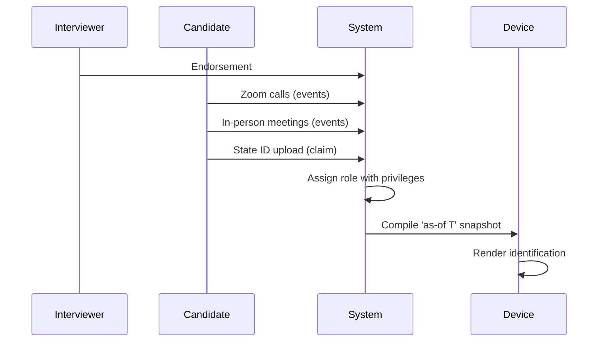
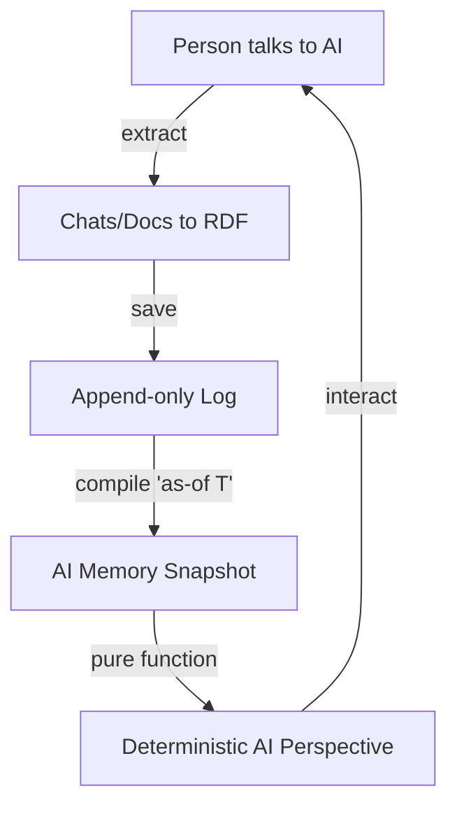

#### sic[theme][#theme]
# 
## Immutable Selves
### A Functional Approach to Digital Identity
# 
#### Scarlet Dame
###### Founder, Sic · Former Chief Strategist, Vouch.io
	[#theme]: Custom theme for Sic brand. Source: narr:Sample_ConjPresentation_2025, narr:Tagline_1, narr:Actor_ScarletDame with alternate labels Dylan Butman and Scarlet Spectacular.

---
# Identity is not mutable state
## Yet we're treating it like Backbone.js

This opening frames the core thesis: identity systems today mutate state like Backbone.js mutated the DOM, when they should compile from immutable history like Om/React render from state machines[][#metaphor].

[#metaphor]: narr:StyleObs_Metaphor_1 captures this technical metaphor positioning identity as mutable state vs. immutable log, with Backbone.js as the anti-pattern. Related to narr:Theme_FunctionalIdentity.

---
###### Personal Journey
# I became a Clojure developer
## because someone told me my code was shit

In 2012, I was Dylan. I wrote jQuery. Luke Vanderhart said "Your code was shit. Let me refactor it for you."[][#idiolect]

That was my introduction to functional programming.

[#idiolect]: narr:StyleObs_2 notes this characteristic blunt phrasing as speaker idiolect. narr:Actor_LukeVanderhart is referenced as the catalyst. Source: narr:Sample_1, narr:CaseContext_1 describing 13-year Clojure career evolution.

---
### Anyone remember Backbone.js?

You saw a picture (the DOM).  
Then you queried the picture with a selector.  
Then you mutated the picture[][#anaphora].

[#anaphora]: narr:StyleObs_3 identifies repeated "Then you" structure as anaphora, a rhetorical device for emphasis. Related to narr:ComparativeAnalysis_1 contrasting Backbone (query DOM, mutate) vs. Om/React (state machine, pure render).

---
# I want to argue
## We still treat identity like Backbone.js

Not only human identity and identification, but also emergent AI identity and synthetic individuality[][#analogy].

[#analogy]: narr:StyleObs_5 captures this core analogy: identity systems = Backbone.js (mutable DOM). Supports narr:Narrative_ImmutableIdentity thesis that identity should be modeled as append-only log compiling to state.

---
## The Problem

---
### Who am I?

I'm scarlet dame.  
But I was scarlet spectacular.  
And before that, Dylan[][#identity-evolution].

[#identity-evolution]: narr:Actor_ScarletDame with altLabels demonstrates the speaker's identity history as exemplar of append-only log model. Related to narr:Theme_TransitionAsStateChange: personal transition as functional transformation from immutable past states.

---
###### Identity
### Where is the identity here?
### Who is the authority?
### What are the claims being made?

These rhetorical questions frame the problem space and invite audience reasoning[][#rhetorical].

[#rhetorical]: narr:StyleObs_RhetoricalQuestion_1 notes triadic rhetorical questions as engagement device. Related to narr:RuleOfThree pattern for memorability.

---
## The state of California
### is the authority

Authorities issue documents that  
make claims about you[][#second-person].

[#second-person]: narr:StyleObs_SecondPerson_1 captures direct address "you" as conversational, inclusive tone. Related to narr:ToneDirectPersonal and narr:RubricAssess_Register_Conj (4.5/5 for conversational yet authoritative register).

---
# 
# Human Identity
# Source of truth
# You.

Single-word answer after setup: punchy, direct, confident[][#punchy].

[#punchy]: narr:StyleObs_ShortPunchy_1 demonstrates characteristic short, emphatic cadence. Related to narr:ShortPunchyCadence and narr:RubricAssess_Cadence_Conj (4.5/5).

---
#### Authorities issue documents that 
# make claims about you.
# 
## Identification represents
# a snapshot of those claims

This establishes the human identity model: authorities make claims, identification is the compiled view[][#human-model].

[#human-model]: narr:Actor_Human defined as "Source of truth for identity; authorities issue documents that make claims." Related to narr:SolutionArchetype_BeRecognized.

---
## The Solution

---
###### Clojure Design Patterns
# 
## No frameworks
# Simple tools ± good principles

When I got my lanyard at my first Clojure/conj, this was the ethos[][#stock-phrase].

[#stock-phrase]: narr:StyleObs_StockPhrase_1 identifies this as Clojure community idiom signaling insider knowledge and shared values. Related to narr:IdiolectPhrasing.

---
### Simple tools + good principles
# = design patterns

I've been writing Clojure for 13 years. From Backbone.js in 2012 to Om in 2013 to production systems at scale[][#career-arc].

[#career-arc]: narr:CaseContext_1 documents speaker's evolution from Backbone.js (2012) to Om (2013) to production systems. Supports narr:MoatLeverage_1: "13 years of production experience; provenance and equality by design."

---
## Reified Change
# 
###### Make state explicit
# Append only log -> Single source of truth
# Everyone sees the same thing
# Render as pure function -> Deterministic UIs
# 
###### Immutability

This anaphora creates rhythm and memorability by repeating the structural frame: principle → pattern[][#anaphora-pattern].

[#anaphora-pattern]: narr:StyleObs_Anaphora_1 notes repeated structural frame creating rhythm. Related to narr:CadenceRhythm and narr:RubricAssess_Cadence_Conj.

---
### The same pattern applies to identity

This is the canonical flow: experience → log → SSoT → snapshot → render → interact → transact[][#flow].

[#flow]: narr:Flow_1 defines end-to-end loop as "SSoT → query → render → interact → event → transact → append log → recompile SSoT." Related to narr:Primitive_1 (append-only log), narr:Primitive_2 (SSoT), narr:Primitive_3 (pure function renderer).

---
###### Single Source of Truth
# 
## Experience is an append-only log  
# that compiles[][#as-of] to identity.

[#as-of]: narr:StyleObs_9 identifies 'as-of T' as canonical term for point-in-time query, appearing multiple times. This presentation is itself an as-of query of the storyBASE graph. Related to narr:KeyPhrase_2 (append-only log) and narr:KeyPhrase_1 (single source of truth).

---
## Two Systems

---
## System: Human
# berecognized.id
###### Immutable Identification

Digital identification enables recognition and delegates authority to access/use/transact with shared technology[][#berecognized].

[#berecognized]: narr:CaseStudy_BeRecognizedID and narr:SolutionArchetype_BeRecognized describe human identity system using Datomic SSoT, datalog query, device-to-device interaction. narr:StyleObs_BrandStylization_2 notes lowercase domain-style brand name.

---
### Employee Lifecycle

Endorsement by interviewer → Zoom calls → in-person meetings → state ID uploads → assigned role with privileges → 'as-of' query compiles snapshot (digital identification) on device[][#lifecycle].

[#lifecycle]: narr:Flow_EmployeeLifecycle describes continuous identity establishment. Related to narr:Behaviors and narr:Storyboards. Mitigates narr:Risk_GhostLabor (deepfaking candidates, ghost labor by state actors like North Korea).

---
### System Breakdown
###### berecognized.id

**SSoT**: Datomic  
**Query**: datalog  
**Render**: identification/privileges  
**Interaction**: device-to-device  
**Events**: change-privilege transactions[][#capabilities-human]

[#capabilities-human]: narr:RequiredCapabilities_1 lists specific modules from Clojure ecosystem. narr:ApproachPattern_1 defines canonical flow. narr:OutcomesProof_1: "Proof of provenance and authority innate; hash of last tx + SSoT state enables 'be recognized' property."

---
### Outcomes
###### berecognized.id

Provenance for individual transactions  
Referential equality for free  
Offline transactions enabled[][#outcomes-human]

[#outcomes-human]: narr:CaseStudy_BeRecognizedID results. Related to narr:SystemProperty_ImmutabilityProvenance (transaction log ensures auditability) and narr:SystemProperty_DistributedDecentralization (reads scale linearly; offline capability).

---
## System: AI
# aswritten.ai
###### Immutable AI Memory

AI memory problem: "My AI doesn't give the same answers as your AI?"[][#ai-problem]

[#ai-problem]: narr:StyleObs_4 (from sample1) captures this rhetorical question framing AI memory problem. narr:Actor_AI defined as "Source of truth unclear; labs train models that say stuff; each chat is different context."

---
### AI Memory as Compiled Model

Transaction sequence: person talks to AI → extract chats/docs to RDF → save to append-only log → AI memory as 'as-of T' snapshot (pure function)[][#ai-flow].

[#ai-flow]: narr:CaseStudy_AsWrittenAI intervention sequence. narr:StyleObs_10 notes parallel structure in numbered list. Related to narr:Parallelism.

---
### System Breakdown
###### aswritten.ai

**SSoT**: RDF + git  
**Query**: SPARQL  
**Render**: AI memory/identity  
**Interaction**: chat + API  
**Events**: extract-narrative transactions[][#capabilities-ai]

[#capabilities-ai]: narr:RequiredCapabilities_2 lists semantic web + version control stack. narr:ApproachPattern_2: "Same pattern, different stack: RDF instead of Datomic." narr:SolutionArchetype_AsWritten defines AI identity system.

---
### Outcomes
###### aswritten.ai

Provenance  
Equality  
Decentralization/offline scale  
Deterministic AI perspective[][#outcomes-ai]

[#outcomes-ai]: narr:CaseStudy_AsWrittenAI results. narr:StyleObs_8 identifies this triadic list as rule-of-three pattern. narr:Tagline_AsWritten: "AI that tells your story, as written."

---
## The Pattern

---
### What we learned

Immutability enables equality, provenance, versioning, branching, generative testing, decentralization, and infinite read scale—for free[][#leverage].

[#leverage]: narr:LeverageProfile_1 describes how small choice (append-only) creates outsized effects. Related to narr:TechnicalExplainers.

---
### What we gave up

Bottleneck at single transactor  
All logic in event clients  
Transact is just adding triples[][#tradeoffs]

[#tradeoffs]: narr:DesignTradeoff_1 explains what was sacrificed (distributed writes) and why it's worth it (consistency, provenance, auditability). Related to narr:TechnicalExplainers.

---
### When to use this pattern

When provenance, auditability, and equality matter more than write throughput[][#when].

Identity systems today are Backbone.  
This is Om for identity.

[#when]: narr:ComparativeAnalysis_1 provides guidance on pattern applicability. Related to narr:TechnicalExplainers and narr:ComparativeAnalyses.

---
## The Vision

---
###### Future
# Deterministic AI perspective
## 'as-of T' for graph queries

Examples:  
- Full talk as query  
- Section of talk  
- Talk evolution over time  
- Any accessible graph subset within billion-node graph[][#future-vision]

[#future-vision]: narr:FutureVision_DeterministicAI with conviction level Stake. Related to narr:InflectionPoints and narr:TrendForecasting. Note suggests closing with query examples and linking to chat for participant engagement.

---
### A world where identity
###### human, synthetic, AI

# is rendered from immutable history

Enabling equality, provenance, and trust by design[][#vision].

[#vision]: narr:Vision_1 describes future state where identity systems inherit Clojure's guarantees. Related to narr:Mission_1: "Move identity from mutable documents and profiles to compiled surfaces rendered from append-only logs and single sources of truth."

---
## Takeaways

---
### For developers

Model identity as append-only log  
Compile to state, don't mutate  
Render as pure function[][#dev-takeaway]

[#dev-takeaway]: Synthesized from narr:Primitive_1 (append-only transaction log), narr:Primitive_2 (SSoT), narr:Primitive_3 (pure function renderer). Related to narr:ProductLadder.

---
### For architects

Single source of truth  
Event-driven transactions  
Provenance by design[][#architect-takeaway]

[#architect-takeaway]: Drawn from narr:KeyPhrase_1 (single source of truth), narr:Behavior_1 (event-driven transaction submission), and narr:SystemProperty_ImmutabilityProvenance. Related to narr:PositioningThesis_1 targeting "developers and identity architects."

---
### For everyone

Experience is an append-only log  
Identification is a render target  
Interaction is transaction[][#everyone-takeaway]

[#everyone-takeaway]: Core thesis from narr:Narrative_ImmutableIdentity. Related to narr:Theme_FunctionalIdentity applying Clojure design patterns to identity systems.

---
## Systems in Production

---
### berecognized.id
###### Human Identity

Datomic SSoT  
Datalog query  
Device-to-device interaction  
Change-privilege events[][#berecognized-prod]

Proof-of-provenance identity system in production.

[#berecognized-prod]: narr:ArchetypeTitle_1 and narr:SolutionArchetype_BeRecognized. narr:CaseResults_1: "Provenance, equality, versioning, decentralization, infinite read scale achieved; systems in production."

---
### aswritten.ai
###### AI Memory

RDF+git SSoT  
SPARQL query  
Chat+API interaction  
Extract-narrative events[][#aswritten-prod]

Digital twin as compiled model.

[#aswritten-prod]: narr:ArchetypeTitle_2 and narr:SolutionArchetype_AsWritten. narr:CaseStudy_AsWrittenAI note: "Formalized architecture from manual process at Vouch; now automated."

---
###### Strategic Alignment
# This talk is the proof

Entire presentation is a narrative anchor: 'Immutable Selves' thesis; two solution archetypes (berecognized.id, aswritten.ai); clear mission/vision alignment[][#strategic].

[#strategic]: narr:RubricAssess_Strategy_Conj scored 5.0/5 for strategic alignment. Related to narr:Narrative_ImmutableIdentity, narr:SolutionArchetype_BeRecognized, narr:SolutionArchetype_AsWritten.

---
###### Audience Tailoring
# Deeply tailored to Clojure/conj

References Backbone.js, Om, Datomic, re-frame  
Assumes functional programming literacy  
Personal narrative (Dylan→Scarlet) builds trust[][#tailoring]

[#tailoring]: narr:RubricAssess_Tailoring_Conj scored 5.0/5. Related to narr:Actor_Human, narr:Actor_AI, and narr:PrimaryActors.

---
## Thank you

Questions?

Chat with this talk's storyBASE at aswritten.ai[][#engagement]

[#engagement]: Invitation to engage with narrative source of truth. Related to narr:FutureVision_DeterministicAI suggestion to "link to chat for participants to engage with narrative source of truth."