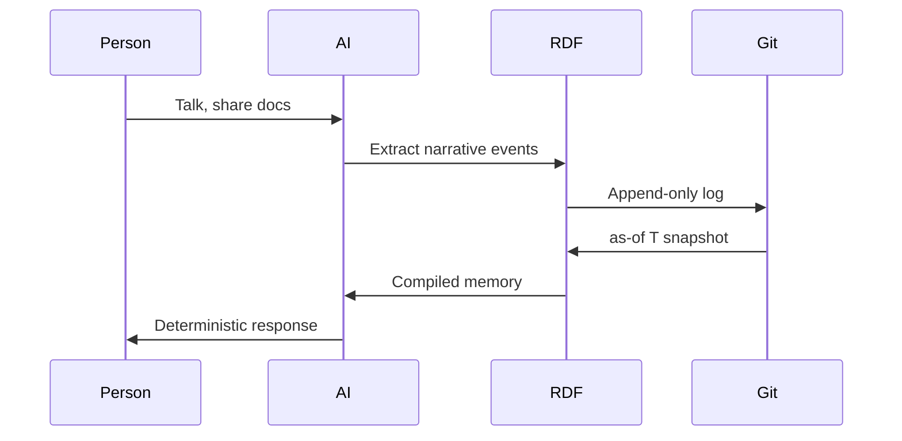
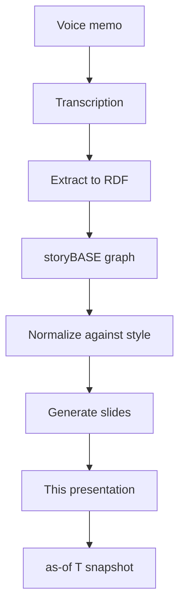

#### sic[theme][#theme]
# 
## Immutable Selves
### A Functional Approach to Digital Identity
# 
#### Scarlet Dame
###### Founder, Sic · Former Chief Strategist, Vouch.io
	[#theme]: Custom theme for Sic. Source: narr:Tagline_1 "Immutable Selves: A Functional Approach to Digital Identity" from Sample_1 (Immutable Selves talk), linked to narr:NarrativeAnchor and narr:Mission_1.

---
# Identity is not mutable state
## Yet we're treating it like Backbone.js

The talk opens with the core tension: we model identity as something we mutate, when it should be compiled from immutable history. This frames the entire argument.[#opening]

[#opening]: narr:StyleObs_Metaphor_1 from Sample_ConjPresentation_2025; technical metaphor positions Backbone.js as anti-pattern for identity systems, related to narr:Tagline and narr:Theme_FunctionalIdentity.

---
###### Who am I?
# I'm scarlet dame
## But I was scarlet spectacular
### And before that, Dylan Butman

Personal narrative establishes the speaker's lived experience of identity as append-only log: each name is a snapshot, not a replacement.[#identity-history]

[#identity-history]: narr:Actor_ScarletDame with altLabels "Dylan Butman" and "Scarlet Spectacular" from Sample_1; exemplifies narr:Theme_TransitionAsStateChange and narr:Theme_ImmutableIdentity.

---
### In Clojure we don't have frameworks
# 
## Simple tools + good principles
# = design patterns

This is the Clojure community's core philosophy, which we'll apply to identity systems.[#clojure-philosophy]

[#clojure-philosophy]: narr:StyleObs_1 and narr:StyleObs_StockPhrase_1 from Sample_1 and Sample_ConjPresentation_2025; signals insider knowledge, related to narr:MoatLeverage_1 (13 years Clojure production experience).

---
###### 2012
### Anyone remember Backbone.js?

You saw a picture (the DOM). Then you queried the picture with a selector. Then you mutated the picture.[#backbone]

[#backbone]: narr:StyleObs_3 (Anaphora) and narr:StyleObs_6 (Rhetorical Question) from Sample_1; repeated "Then you" structure emphasizes mutation anti-pattern, related to narr:ComparativeAnalysis_1.

---
# I want to argue that we still treat identity like Backbone.js
## Human identity and identification
### AI identity and synthetic individuality

We query the current state and mutate it, instead of compiling from immutable history.[#thesis]

[#thesis]: narr:StyleObs_5 (Analogy) from Sample_1; core analogy linking identity systems to Backbone.js mutable DOM pattern, supports narr:Narrative_ImmutableIdentity.

---
## The Problem

---
###### Human Identity
# Source of truth
# You.

Authorities issue documents that make claims about you. Identification represents those claims at a point in time.[#human-source]

[#human-source]: narr:Actor_Human and narr:StyleObs_ShortPunchy_1 from Sample_ConjPresentation_2025; single-word answer "You." after setup creates punchy, direct, confident cadence.

---
### Where is the identity here?
# 
### Who is the authority?
# 
### What are the claims being made?

These questions reveal the confusion in current identity systems: we conflate the person, the authority, and the representation.[#questions]

[#questions]: narr:StyleObs_RhetoricalQuestion_1 from Sample_ConjPresentation_2025; triadic rhetorical questions frame problem space, related to narr:RuleOfThree.

---
###### AI Identity
# Source of truth
## Unclear

Labs train models that say stuff. Each chat is different context. No provenance, no version control.[#ai-source]

[#ai-source]: narr:Actor_AI from Sample_ConjPresentation_2025; contrasts with human identity's clear source of truth, sets up narr:SolutionArchetype_AsWritten.

---
### My AI doesn't give the same answers as your AI

This is the AI memory problem: without a narrative source of truth, every AI is different.[#ai-problem]

[#ai-problem]: narr:StyleObs_4 (Rhetorical Question) from Sample_1; frames AI memory problem, related to narr:CaseStudy_AsWrittenAI.

---
## The Pattern

---
###### Clojure Design Patterns
# 
## No frameworks
# Simple tools ± good principles

When I got my lanyard at my first Clojure/conj, this philosophy changed how I thought about building systems.[#philosophy]

[#philosophy]: narr:StyleObs_StockPhrase_1 from Sample_ConjPresentation_2025; Clojure community idiom signals shared values, related to narr:MoatLeverage_1.

---
### Reified Change
# 
###### Make state explicit
# Append only log → Single source of truth
# 
###### Everyone sees the same thing
# Render as pure function → Deterministic UIs

This is the pattern we'll apply to identity.[#reified-change]

[#reified-change]: narr:StyleObs_Anaphora_1 from Sample_ConjPresentation_2025; repeated structural frame (principle → pattern) creates rhythm and memorability, related to narr:CadenceRhythm.

---
###### Single Source of Truth
# 
## Experience is an append-only log 
# that compiles[][#as-of] to identity.
	[#as-of]: Presentation is an as-of query against the storyBASE graph at this moment. Source: narr:StyleObs_Analogy_1 from Sample_ConjPresentation_2025; core analogy maps human experience to Datomic model, related to narr:ResonanceUse and narr:KeyPhrase_2 "append-only log".

---
## The Systems

---
###### System: Human
# berecognized.id
###### Immutable Identification

Continuous identity establishment via append-only log. Each interaction adds facts; privileges compile as-of T.[#berecognized]

[#berecognized]: narr:CaseStudy_BeRecognizedID and narr:Flow_EmployeeLifecycle from Sample_1; demonstrates reified change pattern for human identity, evidences narr:SystemProperty_ImmutabilityProvenance.

---
###### berecognized.id
### Architecture

**SSoT**: Datomic  
**Query**: datalog  
**Render**: device-to-device  
**Events**: change-privilege transactions  

**Outcome**: Provenance for every transaction. Referential equality for free. Offline transactions enabled.[#berecognized-arch]

[#berecognized-arch]: narr:SolutionArchetype_BeRecognized and narr:ApproachPattern_1 from Sample_1; canonical flow applied to access control, related to narr:RequiredCapabilities_1 (Datomic, datalog, multimodal renderer).

---
###### The Risk
### Ghost Labor

Bad actors—individuals or state actors like North Korea—deepfaking candidates, passing interviews, collecting paychecks on behalf of fake identities.[#ghost-labor]

**Mitigation**: Continuous identity establishment. The append-only log makes impersonation detectable.[#mitigation]

[#ghost-labor]: narr:Risk_GhostLabor and narr:StyleObs_5 (Metaphor) from Sample_1; 'ghost labor' metaphor for impersonation risk, challenges narr:CaseStudy_BeRecognizedID.

[#mitigation]: narr:Risk_GhostLabor skos:note from Sample_1; mitigated by continuous identity establishment via append-only log.

---
###### System: AI
# aswritten.ai
###### Immutable AI Memory

AI memory as pure function: same graph state → same perspective.[#aswritten]

[#aswritten]: narr:CaseStudy_AsWrittenAI and narr:StyleObs_10 (Parallelism) from Sample_1; numbered list with parallel structure shows transaction sequence, evidences narr:SystemProperty_DistributedDecentralization.

---
###### aswritten.ai
### Architecture

**SSoT**: RDF + git  
**Query**: SPARQL  
**Render**: chat + API  
**Events**: extract-narrative transactions  

**Outcome**: Provenance, equality, decentralization. Deterministic AI perspective for any graph query.[#aswritten-arch]

[#aswritten-arch]: narr:SolutionArchetype_AsWritten and narr:ApproachPattern_2 from Sample_1; same pattern as berecognized.id but RDF instead of Datomic, related to narr:RequiredCapabilities_2.

---
### AI that tells your story, as written.

This is the tagline for aswritten.ai: it encodes both the promise (your story) and the brand (as written).[#tagline]

[#tagline]: narr:Tagline_AsWritten from Sample_ConjPresentation_2025; 7-word tagline encoding promise and brand, related to narr:Tagline.

---
## The Benefits

---
### Immutability enables
# 
## Equality
## Provenance  
## Versioning
## Branching
## Generative testing
## Decentralization
## Infinite read scale
# 
### For free.

Small choice (append-only) creates outsized effects across the system.[#leverage]

[#leverage]: narr:LeverageProfile_1 from Sample_1; demonstrates how immutability creates compounding advantages, related to narr:TechnicalExplainers and narr:MoatLeverage_1.

---
### What we gave up
# 
## Bottleneck at single transactor
## All logic in event clients
## Transact is just adding triples

But we gained consistency, provenance, and auditability. Worth it when those matter more than write throughput.[#tradeoffs]

[#tradeoffs]: narr:DesignTradeoff_1 from Sample_1; explicit about costs and benefits, related to narr:TechnicalExplainers.

---
## The Comparison

---
### Backbone.js
###### Query DOM, mutate picture
# 
### Om / React
###### State machine, pure function render
# 
### Identity systems today
###### Backbone
# 
### This approach
###### Om for identity

When provenance, auditability, and equality matter more than write throughput, use this pattern.[#comparison]

[#comparison]: narr:ComparativeAnalysis_1 from Sample_1; when-to-use guidance for the pattern, related to narr:TechnicalExplainers.

---
## The Proof

---
### This talk is the proof

The talk itself demonstrates the workflow: raw input → storyBASE → normalized output with embedded provenance.[#meta-proof]

[#meta-proof]: narr:Proof_1 and narr:Flow_1 from Sample_1; meta-demonstration showing iterative refinement from raw inputs to polished outputs, related to narr:CaseStudies and narr:Outcomes.

---
###### The workflow
### User inputs → initial storyBASE
# 
### Normalization against style
# 
### Polished outputs with provenance

Each step is a transaction. The presentation you're seeing is compiled from the append-only log of this talk's creation.[#workflow]

[#workflow]: narr:Flow_1 from Sample_1; content production workflow showing user inputs through to polished outputs, related to narr:ProductLadder and narr:Storyboards.

---
### Deterministic AI perspective
# 
## Full talk as query
## Section of talk  
## Talk evolution over time
## Any accessible graph subset

Within a billion-node graph, we can query any perspective as-of T.[#queries]

[#queries]: narr:FutureVision_DeterministicAI from Sample_1; examples of as-of T queries, supports narr:CaseStudy_AsWrittenAI, related to narr:InflectionPoints.

---
## The Invitation

---
### Try it yourself

Chat with the narrative source of truth for this talk at aswritten.ai

Ask it about:
- The evolution of this presentation
- Style observations across samples  
- How conviction levels change
- Any concept in the graph

The AI's memory is this storyBASE—immutable, versioned, and yours to query.[#invitation]

[#invitation]: Connects to storyBASE product overview from storybase.synthetic-identity.co/product/what-is-storybase; RDF narrative source of truth that steers AI output, making it specific and controllable.

---
## Takeaways

---
### Identity as append-only log
# 
### Identification as render target
# 
### Interaction as transaction

These three principles—applied consistently—give you provenance, equality, and decentralization by design.[#takeaways]

[#takeaways]: Synthesizes narr:Narrative_ImmutableIdentity core thesis from Sample_ConjPresentation_2025 with narr:KeyPhrase_2 "append-only log" and narr:KeyPhrase_3 "pure function" from Sample_1.

---
# Experience is an append-only log
## that compiles to identity

This is the vision: identity systems—human, synthetic, AI—rendered from immutable history, enabling equality, provenance, and trust by design.[#vision]

[#vision]: narr:Vision_1 from Sample_1; future state where identity systems inherit Clojure's guarantees, related to narr:NarrativeAnchor and narr:Mission_1.

---
## Thank you

### Questions?

	Scarlet Dame  
	scarlet@sic.ai  
	aswritten.ai

	This presentation was compiled from storyBASE transaction log narr:Tx_20251113T030805Z_conj2025 and related samples, demonstrating the reified change architecture it describes.