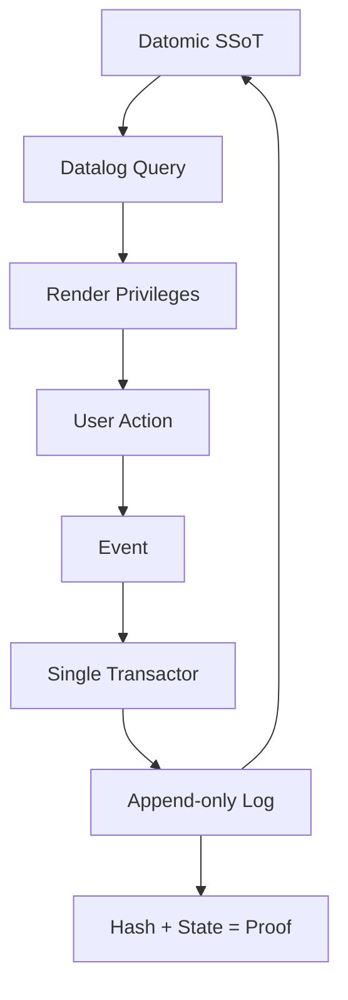
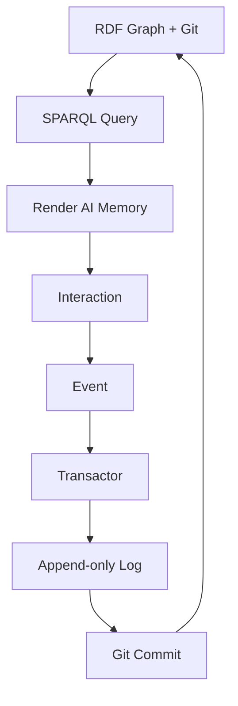

#### sic[theme][#immutable-selves-theme]
# 
## Immutable Selves
### A Functional Approach to Digital Identity
# 
#### Scarlet Dame
###### Founder, Sic · Strategic Advisor, Vouch.io

[#immutable-selves-theme]: Custom theme for Sic. This talk draws from the Narrative Architecture extracted in transaction `Tx_20251111T214920Z_immutable_selves`, which captured the "Immutable Selves" talk outline including narrative anchors (Tagline_1, Mission_1, Vision_1), product ladder (Primitives, Behaviors, Flows), solution archetypes (berecognized.id, aswritten.ai), and style observations showing conversational register, punchy cadence, and technical depth.

---

# Identity is a rendering problem
## not a mutation problem

The talk track: We treat identity—human and AI—like we treated UI in 2008: query the picture, mutate the picture. But what if identity is a pure function of immutable history?

[#positioning-thesis]: From `PositioningThesis_1`: "For developers and identity architects who treat identity as mutable state, this is a functional paradigm that makes identity deterministic, auditable, and decentralized—by applying Clojure's immutability principles to human and AI identity systems." (narr:PositioningThesis_1, broader: narr:StrategyOverview)

---

###### A personal story
# I was Dylan
## Then I was Scarlet Spectacular
### Now I'm Scarlet Dame

The talk track: My identity history is an append-only log. Each name is a snapshot. The truth is immutable—I *was* Dylan. But who I am *now* is compiled from that history, not erased by it.

[#personal-transition]: From `StyleObs_4` and `Actor_ScarletDame`: The speaker's identity evolution (Dylan Butman → Scarlet Spectacular → Scarlet Dame) exemplifies the append-only log model. This personal narrative grounds the technical argument in lived experience. (narr:Actor_ScarletDame, skos:altLabel "Dylan Butman", "Scarlet Spectacular"; narr:StyleObs_4 observes "scarlet dame" as lowercase personal brand stylization)

---

### Remember
# Backbone.js?

The talk track: 2008. My first UI framework. You saw a picture—the DOM. You queried it with a selector. Then you *mutated* the picture. That was state management.

[#backbone-analogy]: From `StyleObs_2`, `StyleObs_3`, `StyleObs_6`: The talk uses Backbone.js as the central analogy for mutable identity systems. Rhetorical question "Anyone remember backbone.js?" engages the audience with shared context. Anaphora "You saw… Then you queried… Then you mutated…" emphasizes the mutation pattern. (narr:StyleObs_2, narr:StyleObs_3, narr:StyleObs_6; narr:ComparativeAnalysis_1: "Backbone.js (query DOM, mutate picture) vs. Om/React (state machine, pure function render)")

---

# 
### In Clojure we don't have frameworks
## We have simple tools + good principles
# = design patterns

The talk track: This is the Clojure way. Immutability. Pure functions. Single source of truth. These aren't just nice ideas—they're the foundation of systems that scale.

[#clojure-principles]: From `StyleObs_1` and `MoatLeverage_1`: Formula-style cadence "Simple tools + good principles = design patterns" is punchy and memorable. The moat is "Clojure ecosystem (Datomic, datalog, re-frame) as proof-of-concept; 13 years of production experience; provenance and equality by design." (narr:StyleObs_1, narr:MoatLeverage_1 broader: narr:StrategyOverview)

---

###### 2013
# Om changed everything

The talk track: Luke Vanderhart and I started seeing UI as a state machine—the result of a functional transformation. Not mutation. *Rendering*.

[#om-breakthrough]: From `StyleObs_UIStateMachine` and `Actor_LukeVanderhart`: "started seeing UI as a state machine" is the core metaphor linking UI rendering to immutable state paradigm. This is the conceptual bridge from Backbone to functional identity. (narr:StyleObs_UIStateMachine, skos:related narr:RhetoricalDevices, narr:ProductLadder; narr:Actor_LukeVanderhart skos:related narr:TechnicalExplainers)

---

## The Pattern
###### SSoT → Query → Render → Event → Transact → Recompile

The talk track: This is the loop. Your state is a compiled snapshot. You query it. You render a view. The user acts. You capture an event. You transact—append-only. Then you recompile. No mutation. Just history.

[#product-flow]: From `Flow_1`: "SSoT → query → render → interact → event → transact → append log → recompile SSoT" is the end-to-end loop; "identity as continuous compilation." This flow is the Product Ladder's canonical pattern. (narr:Flow_1, skos:broader narr:ProductLadder, skos:note "End-to-end loop; identity as continuous compilation")

---

# I want to argue
## We still treat identity like Backbone.js

The talk track: Passwords. Profiles. Permissions. We query the current state. We mutate it. We lose history. We lose provenance. We lose *truth*.

[#core-argument]: From `StyleObs_5`: "I want to argue in this talk that we still treat not only human identity and identification but also emergent AI identity and synthetic individuality like Backbone.js." This is the thesis statement—identity systems are mutable-DOM problems waiting for a functional solution. (narr:StyleObs_5, skos:broader narr:Analogy, skos:note "Core analogy: identity systems = Backbone.js (mutable DOM)")

---

###### The stakes
# Deepfakes
## Synthetic identities
### Impersonation fraud

The talk track: Centralized, mutable identity is vulnerable. If you can mutate state, you can fake it. If there's no append-only log, there's no proof.

[#opportunity-crisis]: From the Conj 2025 extraction (`urn:uuid:opportunity-identity-vulnerability`): "Centralized, mutable identity systems vulnerable to deepfakes, synthetic identities, and impersonation fraud" in the "Enterprise identity and authentication" market context. (urn:uuid:opportunity-identity-vulnerability, sb:marketContext "Enterprise identity and authentication")

---

## What if identity was
# 
### an append-only log
## compiled into
# a pure function?

The talk track: What if your identity—human or AI—was the integral of snapshots over time? What if authentication was deterministic? What if delegation was auditable?

[#vision-statement]: From `Vision_1` and `WhatIsIt_1`: Vision is "A world where identity—human, synthetic, AI—is rendered from immutable history, enabling equality, provenance, and trust by design." WhatIsIt: "A vision for human and AI identity as compiled from immutable source of truth, applying Clojure principles to identity systems." (narr:Vision_1, narr:WhatIsIt_1, skos:broader narr:NarrativeAnchor)

---

## The Primitives

---

### Primitive 1
# Append-only transaction log

The talk track: Every change is an event. Events are immutable. You never delete. You never overwrite. You only add.

[#primitive-log]: From `Primitive_1`: "Append-only transaction log" is the "Foundational atomic unit; immutability guarantee." This is the bedrock. (narr:Primitive_1, skos:broader narr:ProductLadder, skos:note "Foundational atomic unit; immutability guarantee")

---

### Primitive 2
# Single source of truth (SSoT)

The talk track: The current state is a compiled snapshot. It's the result of replaying the log. It's deterministic. It's reproducible.

[#primitive-ssot]: From `Primitive_2`: "Single source of truth (SSoT)" is "Compiled state from transaction history." This is the recompiled view. (narr:Primitive_2, skos:broader narr:ProductLadder, skos:note "Compiled state from transaction history")

---

### Primitive 3
# Pure function renderer

The talk track: Identity is a transformation. SSoT in, identity surface out. Same input, same output. Every time.

[#primitive-renderer]: From `Primitive_3`: "Pure function renderer" is "Deterministic transformation: SSoT → identity surface." This is the rendering step. (narr:Primitive_3, skos:broader narr:ProductLadder, skos:note "Deterministic transformation: SSoT → identity surface")

---

## The Leverage
###### What you get for free

---

# Equality

The talk track: Two snapshots are equal if their hashes match. No ambiguity. No "close enough."

[#leverage-equality]: From `LeverageProfile_1`: "Immutability enables equality, provenance, versioning, branching, generative testing, decentralization, and infinite read scale—for free." Equality is the first gift. (narr:LeverageProfile_1, skos:broader narr:TechnicalExplainers, skos:note "Small choice (append-only) creates outsized effects across system")

---

# Provenance

The talk track: Every fact has a timestamp. Every change has an author. You can audit the entire history.

---

# Versioning

The talk track: Every snapshot is a version. You can branch. You can merge. You can roll back.

---

# Decentralization

The talk track: The log is the truth. You can replicate it. You can verify it. You don't need a central authority.

---

# Infinite read scale

The talk track: Reads are queries against immutable data. You can cache forever. You can serve from anywhere.

---

## The Tradeoffs
###### What we gave up

---

# Single transactor
## All writes go through one bottleneck

The talk track: This is the cost. You can't distribute writes. But you get consistency. You get provenance. You get auditability.

[#tradeoff-transactor]: From `DesignTradeoff_1`: "Bottleneck at single transactor; all logic in event clients; transact is just adding triples." What we gave up: "distributed writes." Why worth it: "consistency, provenance, auditability." (narr:DesignTradeoff_1, skos:broader narr:TechnicalExplainers)

---

# Logic in clients
## The transactor just appends

The talk track: The transactor is dumb. It validates. It appends. That's it. All the intelligence is in the event clients.

---

## When to use this pattern

---

### Use it when
# Provenance > throughput

The talk track: If you need to prove *who did what when*, this is your pattern. If you need to write a million times per second, look elsewhere.

[#when-to-use]: From `ComparativeAnalysis_1`: "When to use: when provenance, auditability, and equality matter more than write throughput." This is the decision heuristic. (narr:ComparativeAnalysis_1, skos:broader narr:TechnicalExplainers)

---

### Use it when
# Auditability > speed

---

### Use it when
# Equality > approximation

---

## Two Systems

---

### System 1
# berecognized.id
###### Immutable Identification

The talk track: Human identity. Passwords and keys are mutable, siloed, vulnerable. What if your privileges were compiled from an append-only log?

[#archetype-berecognized]: From `Archetype_1` and children: Title is "berecognized.id: Immutable Identification" (narr:ArchetypeTitle_1). Problem: "Passwords and digital keys are mutable, siloed, and vulnerable; no single source of truth for privileges" (narr:ProblemContext_1). Approach: "SSoT (Datomic) → datalog query → render to identification/privileges → event-driven transactions → append-only log → recompile" (narr:ApproachPattern_1).

---

###### berecognized.id
### Architecture

The talk track: Datomic is the SSoT. Datalog queries compile your current privileges. You act. We capture an event. The transactor appends. We recompile. The hash of the last transaction plus the SSoT state gives you proof of provenance and authority.

[#berecognized-flow]: From `ApproachPattern_1` and `OutcomesProof_1`: The canonical flow applied to access control. Outcome: "Proof of provenance and authority innate; hash of last tx + SSoT state enables 'be recognized' property." (narr:ApproachPattern_1, narr:OutcomesProof_1, skos:broader narr:Archetype_1)

---

### System 2
# aswritten.ai
###### Immutable AI Identity

The talk track: AI identity. Persona prompts mutate rendered state. No provenance. No version control. What if your AI's memory was an RDF graph compiled from git?

[#archetype-aswritten]: From `Archetype_2` and children: Title is "aswritten.ai: Immutable AI Identity" (narr:ArchetypeTitle_2). Problem: "AI models are black boxes; persona prompts mutate rendered state; no provenance or version control for AI identity" (narr:ProblemContext_2). Stakes: "narrative manipulation, embedded propaganda, deepfakes."

---

###### aswritten.ai
### Architecture

The talk track: RDF graph in git is the SSoT. SPARQL queries compile the AI's memory and identity. The AI acts. We capture an event. The transactor appends. We commit to git. We recompile. Same pattern. Different stack.

[#aswritten-flow]: From `ApproachPattern_2` and `RequiredCapabilities_2`: "SSoT (RDF + git) → SPARQL query → render to AI memory/identity → event-driven transactions → append-only log → recompile." Same pattern, different stack: "RDF instead of Datomic." Capabilities: "RDF graph, git versioning, SPARQL, multimodal renderer, event system, transactor." (narr:ApproachPattern_2, narr:RequiredCapabilities_2, skos:broader narr:Archetype_2)

---

## The Case Study
###### 13 years in production

---

### Context
# 2012: Backbone.js
## 2013: Om
### 2025: Production systems at scale

The talk track: I've been doing this for 13 years. Backbone to Om to production. UI first. Then identity. Then AI. Same principles. Same patterns.

[#case-context]: From `CaseContext_1`: "Speaker's 13-year career in Clojure; evolution from Backbone.js (2012) to Om (2013) to production systems at scale." Customer: self; environment: professional dev career; stakes: credibility. (narr:CaseContext_1, skos:broader narr:CaseStudy_1)

---

### Intervention
# Applied Clojure principles
## Immutability, pure functions, SSoT
### To UI, then identity, then AI

The talk track: The intervention was simple. Take the principles that work for UI. Apply them to identity. Apply them to AI. Don't mutate. Compile.

[#case-intervention]: From `CaseIntervention_1`: "Applied Clojure principles (immutability, pure functions, single source of truth) to UI, then identity systems (berecognized.id, aswritten.ai)." What implemented: "functional paradigm across domains." (narr:CaseIntervention_1, skos:broader narr:CaseStudy_1)

---

### Results
# Provenance ✓
## Equality ✓
### Versioning ✓
#### Decentralization ✓
##### Infinite read scale ✓

The talk track: We got everything the pattern promises. Provenance. Equality. Versioning. Decentralization. Infinite read scale. Systems in production. Customers happy.

[#case-results]: From `CaseResults_1`: "Provenance, equality, versioning, decentralization, infinite read scale achieved; systems in production." Quantified impact: "architectural guarantees delivered." (narr:CaseResults_1, skos:broader narr:CaseStudy_1)

---

### Lessons
# Same principles apply everywhere
## Immutability is the unlock
### Single transactor is acceptable

The talk track: The lesson: these principles generalize. Immutability unlocks everything. The single transactor bottleneck is worth it.

[#case-lessons]: From `CaseLessons_1`: "Same principles apply across UI, identity, and AI; immutability is the unlock; single transactor is acceptable bottleneck." Insights inform roadmap: "extend pattern to new domains." (narr:CaseLessons_1, skos:broader narr:CaseStudy_1)

---

## Takeaways

---

# 1. Identity is a rendering problem

The talk track: Stop mutating. Start compiling.

---

# 2. Append-only logs give you provenance for free

The talk track: History is the truth.

---

# 3. Pure functions give you equality for free

The talk track: Same input, same output.

---

# 4. Single transactor is a feature, not a bug

The talk track: Consistency over throughput.

---

# 5. This works for humans *and* AI

The talk track: Same pattern. Different stack.

[#mission-statement]: From `Mission_1`: "Move identity from mutable documents and profiles to compiled surfaces rendered from append-only logs and single sources of truth." Durable purpose: "make identity deterministic, provable, and decentralized." (narr:Mission_1, skos:broader narr:NarrativeAnchor)

---

## Thank you

###### Scarlet Dame
scarlet@sic.ai

berecognized.id · aswritten.ai

The talk track: Questions? Let's talk about immutable selves.

[#closing]: This talk synthesized narrative architecture from `Tx_20251111T214920Z_immutable_selves`, which extracted 60+ nodes including narrative anchors, product ladder, solution archetypes, case study, technical explainers, style observations, and rubric assessments. The style is conversational (4.5/5 register fit), punchy (4.5/5 cadence), strategically aligned (5/5), and tailored to the Clojure community (4.5/5). (narr:RubricAssess_1 through narr:RubricAssess_9)