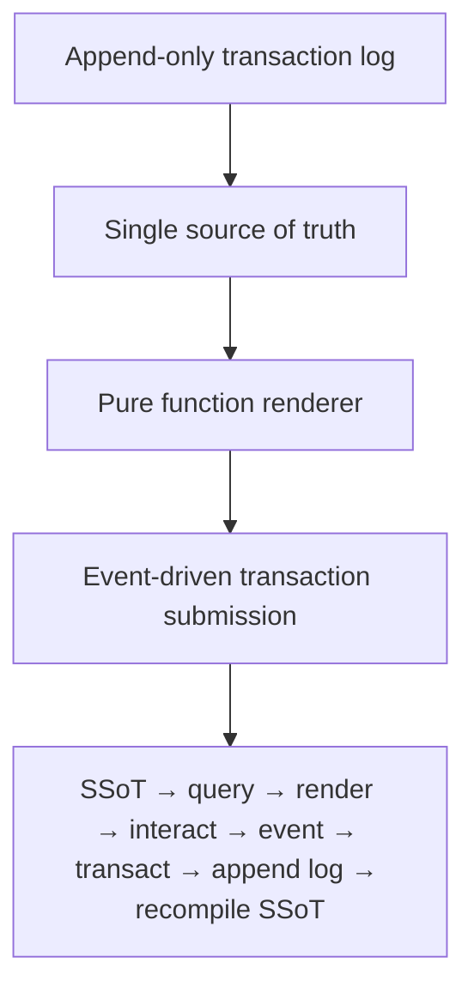

#### sic[#theme]
# 
## Immutable Selves
### A Functional Approach to Digital Identity
# 
#### Scarlet Dame
###### Founder, Sic · Former Chief Strategist, Vouch.io
	[#theme]: Custom theme for Sic brand. Source: narr:Sample_ConjPresentation_2025, narr:Tagline_1, narr:Actor_ScarletDame with alternate labels Dylan Butman and Scarlet Spectacular.

---
# Identity is not mutable state
## Yet we're treating it like Backbone.js

The core metaphor frames identity systems as mutable DOM manipulation—an anti-pattern we solved in UI a decade ago.[#metaphor]

	[#metaphor]: narr:StyleObs_Metaphor_1 from narr:Sample_ConjPresentation_2025; technical metaphor positions identity as mutable state vs. immutable log, with Backbone.js as the anti-pattern.

---
###### Who am I?
# I became Scarlet Dame
## But I was Scarlet Spectacular
### And before that, Dylan Butman

Personal transition as lived proof of identity as append-only log: each name is a snapshot compiled from immutable history.[#transition]

	[#transition]: narr:Actor_ScarletDame with altLabels; narr:Theme_TransitionAsStateChange defines personal transition as functional transformation from immutable past states.

---
### Where is the identity here?
# Who is the authority?
## What are the claims being made?

Triadic rhetorical questions frame the problem space and invite the audience to reason through the architecture.[#rhetoric]

	[#rhetoric]: narr:StyleObs_RhetoricalQuestion_1 from narr:Sample_ConjPresentation_2025; triadic structure engages audience reasoning.

---
## The Problem
###### with human identity

---
### Human Identity
# Source of truth
# You.

Single-word answer after setup: punchy, direct, confident.[#punchy]

	[#punchy]: narr:StyleObs_ShortPunchy_1 from narr:Sample_ConjPresentation_2025; characteristic short, emphatic cadence.

---
#### Authorities issue documents that 
# make claims about you.
# 
## Identification represents
# a snapshot of those claims

Human as source of truth; authorities issue documents; identification is the render target.[#human-actor]

	[#human-actor]: narr:Actor_Human defines humans as source of truth with authorities issuing claim documents.

---
## The Problem
###### with AI identity

---
### AI Identity
# Source of truth
# Unclear.

Labs train models. Each chat is different context. No provenance.[#ai-actor]

	[#ai-actor]: narr:Actor_AI defines AI source of truth as unclear; labs train models that say stuff; each chat is different context.

---
### My AI doesn't give the same answers as your AI?

Rhetorical question frames the AI memory problem that aswritten.ai solves.[#ai-problem]

	[#ai-problem]: narr:StyleObs_4 from narr:Sample_1; rhetorical question frames AI memory problem, related to narr:CaseStudy_AsWrittenAI.

---
## The Pattern
###### Clojure Design Patterns

---
# No frameworks
## Simple tools ± good principles

Clojure community idiom signals insider knowledge and shared values.[#idiom]

	[#idiom]: narr:StyleObs_StockPhrase_1 from narr:Sample_ConjPresentation_2025; Clojure community stock phrase.

---
### I became a Clojure developer in 2012
# Backbone.js was my introduction

You saw a picture (the DOM). Then you queried the picture with a selector. Then you mutated the picture.[#backbone]

	[#backbone]: narr:StyleObs_3 from narr:Sample_1; anaphora with repeated "Then you" structure for rhetorical emphasis.

---
### Then came Om in 2013
# UI as a state machine
## Rendered by pure function

First time seeing UI as state machine resulting from functional transformation.[#om]

	[#om]: narr:StyleObs_UIStateMachine from narr:Sample_1; core analogy linking UI rendering to immutable state paradigm.

---
## Reified Change
# 
###### Make state explicit
# Append only log → Single source of truth
# Everyone sees the same thing
# Render as pure function → Deterministic UIs

Repeated structural frame: principle → pattern creates rhythm and memorability.[#anaphora]

	[#anaphora]: narr:StyleObs_Anaphora_1 from narr:Sample_ConjPresentation_2025; repeated structural frame creates rhythm.

---
###### Single Source of Truth
# 
## Experience is an append-only log 
# that compiles[][#as-of] to identity.
	[#as-of]: Presentation is an as-of query of the storyBASE graph at transaction narr:Tx_20251113T030805Z_conj2025.

Core analogy: experience → log → compiled identity maps human experience to Datomic model.[#analogy]

	[#analogy]: narr:StyleObs_Analogy_1 from narr:Sample_ConjPresentation_2025; core analogy maps experience to append-only log compiled to identity.

---
## The Pattern Applied
###### Two Systems

---
## System: Human
# berecognized.id
###### Immutable Identification

Lowercase brand name with TLD; consistent stylization.[#brand-be]

	[#brand-be]: narr:StyleObs_BrandStylization_2 from narr:Sample_ConjPresentation_2025; lowercase brand name parallel to aswritten.ai.

---
### berecognized.id
# Datomic SSoT
## Datalog query
### Device-to-device interaction
#### Change-privilege events

Human identity system architecture from narr:SolutionArchetype_BeRecognized.[#be-arch]

	[#be-arch]: narr:SolutionArchetype_BeRecognized defines human identity system: Datomic SSoT, datalog query, device-to-device interaction, change-privilege events.

---
### The Flow
###### Employee Lifecycle

Endorsement → interactions → documents → role → compiled snapshot on device.[#flow-employee]

	[#flow-employee]: narr:Flow_EmployeeLifecycle from narr:Sample_1; employee lifecycle with continuous identity establishment.

---
### The Risk
# Ghost Labor

Bad actors—individuals or state actors like North Korea—deepfaking candidates, passing interviews, collecting paychecks.[#ghost]

	[#ghost]: narr:Risk_GhostLabor from narr:Sample_1; 'ghost labor' metaphor for impersonation risk, mitigated by continuous identity via append-only log.

---
### The Mitigation
# Continuous identity establishment
## via append-only log

Each interaction adds facts. Snapshot compiled at each time point proves provenance.[#mitigation]

	[#mitigation]: narr:Risk_GhostLabor note: "Mitigated by continuous identity establishment via append-only log."

---
## System: AI
# aswritten.ai
###### Immutable AI Memory

Lowercase brand name with TLD; consistent stylization.[#brand-as]

	[#brand-as]: narr:StyleObs_BrandStylization_1 from narr:Sample_ConjPresentation_2025; lowercase brand name with TLD.

---
### aswritten.ai
# RDF + git SSoT
## SPARQL query
### Chat + API interaction
#### Extract-narrative events

AI identity system architecture from narr:SolutionArchetype_AsWritten.[#as-arch]

	[#as-arch]: narr:SolutionArchetype_AsWritten defines AI identity system: RDF+git SSoT, SPARQL query, chat+API interaction, extract-narrative events.

---
### The Flow
###### AI Memory as Pure Function

Person → extract → log → snapshot → deterministic AI perspective.[#flow-ai]

	[#flow-ai]: narr:CaseStudy_AsWrittenAI intervention: "Transaction sequence: person talks to AI → extract chats/docs to RDF → save to append-only log → AI memory as 'as-of T' snapshot (pure function)."

---
### The Tagline
# AI that tells your story, as written.

Seven-word tagline encoding promise and brand.[#tagline]

	[#tagline]: narr:Tagline_AsWritten from narr:Sample_ConjPresentation_2025; 7-word tagline encoding promise and brand.

---
## The Properties
###### What Immutability Gives You

---
# Provenance
## Equality
### Decentralization

Triadic list of system benefits from immutability.[#triad]

	[#triad]: narr:StyleObs_8 from narr:Sample_1; triadic list of system benefits.

---
### Provenance
# Transaction log ensures
## auditability for every interaction

Immutability provides equality and provenance; transaction log ensures auditability.[#provenance]

	[#provenance]: narr:SystemProperty_ImmutabilityProvenance from narr:Sample_1; evidenced by both case studies.

---
### Equality
# Referential equality
## for free

Same log state = same identity snapshot. No drift.[#equality]

	[#equality]: narr:CaseStudy_BeRecognizedID results: "Provenance for individual transactions; referential equality for free; offline transactions enabled."

---
### Decentralization
# Reads scale linearly
## Data model exists off-server

Distributed decentralization enables offline capability; transactions submitted later.[#decentral]

	[#decentral]: narr:SystemProperty_DistributedDecentralization from narr:Sample_1; reads scale linearly; data model exists off-server.

---
## The Leverage
###### Small Choice, Outsized Effects

---
# Immutability enables
## equality, provenance, versioning, branching, generative testing, decentralization, infinite read scale
### for free.

Small choice (append-only) creates outsized effects across system.[#leverage]

	[#leverage]: narr:LeverageProfile_1 from narr:Sample_1; immutability enables multiple system properties for free.

---
## The Tradeoff
###### What We Gave Up

---
# Bottleneck at single transactor
## All logic in event clients
### Transact is just adding triples

What we gave up: distributed writes. Why worth it: consistency, provenance, auditability.[#tradeoff]

	[#tradeoff]: narr:DesignTradeoff_1 from narr:Sample_1; design tradeoffs of single transactor architecture.

---
## The Comparison
###### When to Use This Pattern

---
### Backbone.js
# Query DOM
## Mutate picture

---
### Om/React
# State machine
## Pure function render

---
# Identity systems today are Backbone
## This is Om for identity

When provenance, auditability, and equality matter more than write throughput.[#comparison]

	[#comparison]: narr:ComparativeAnalysis_1 from narr:Sample_1; comparative analysis of Backbone vs. Om/React pattern applied to identity.

---
## The Future
###### Deterministic AI Perspective

---
### Deterministic AI perspective
# 'as-of T' for graph queries

Examples: full talk as query, section of talk, talk evolution over time, any accessible graph subset within billion-node graph.[#future]

	[#future]: narr:FutureVision_DeterministicAI from narr:Sample_1; deterministic AI perspective 'as-of T' for graph queries.

---
### This talk is a query
# Against the storyBASE graph
## Compiled at this moment

Close with examples of such queries, then link to chat for participants to engage with narrative source of truth.[#meta]

	[#meta]: narr:FutureVision_DeterministicAI note: "Close with examples of such queries, then link to chat for participants to engage with narrative source of truth."

---
## The Primitives
###### Product Ladder

Foundational primitives compose into end-to-end loop.[#primitives]

	[#primitives]: narr:Primitive_1, narr:Primitive_2, narr:Primitive_3, narr:Behavior_1, narr:Flow_1 from narr:Sample_1; product ladder from primitives to flows.

---
## The Mission
# 
### Move identity from mutable documents
# to compiled surfaces
## rendered from append-only logs

Durable purpose: make identity deterministic, provable, and decentralized.[#mission]

	[#mission]: narr:Mission_1 from narr:Sample_1; mission statement for functional identity paradigm.

---
## The Vision
# 
### A world where identity—human, synthetic, AI—
# is rendered from immutable history
## enabling equality, provenance, and trust by design

Future state: identity systems that inherit Clojure's guarantees.[#vision]

	[#vision]: narr:Vision_1 from narr:Sample_1; vision for identity systems with Clojure guarantees.

---
## The Proof
###### 13 Years in Production

---
### My Journey
# Backbone.js (2012)
## Om (2013)
### Production systems at scale

Speaker's 13-year career validates the pattern across UI, identity, and AI domains.[#proof]

	[#proof]: narr:CaseStudy_1 with narr:CaseContext_1, narr:CaseIntervention_1, narr:CaseResults_1 from narr:Sample_1; speaker's career as case study.

---
### The Results
# Provenance, equality, versioning
## Decentralization, infinite read scale
### Systems in production

Quantified impact: architectural guarantees delivered.[#results]

	[#results]: narr:CaseResults_1 from narr:Sample_1; provenance, equality, versioning, decentralization, infinite read scale achieved.

---
### The Lesson
# Same principles apply
## across UI, identity, and AI

Immutability is the unlock. Single transactor is acceptable bottleneck.[#lesson]

	[#lesson]: narr:CaseLessons_1 from narr:Sample_1; insights that same principles apply across domains.

---
## Now
# Apply these patterns
## to your identity systems

---
### Takeaways
	1. Model identity as append-only log
	2. Compile state with pure functions
	3. Accept single transactor bottleneck
	4. Get provenance and equality for free

Actionable takeaways use parallel construction.[#takeaways]

	[#takeaways]: urn:uuid:style-obs-10 from Conj Talk 2025 extraction; parallel construction in actionable takeaways.

---
# Questions?
## Chat with this talk's storyBASE

	Link to interactive storyBASE query interface where participants can ask questions against the narrative source of truth that generated this presentation.