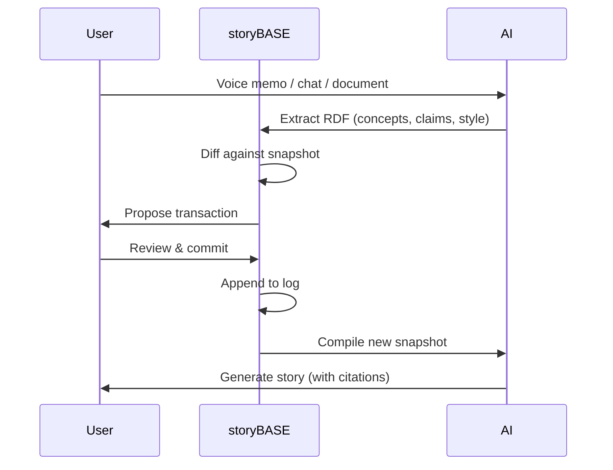
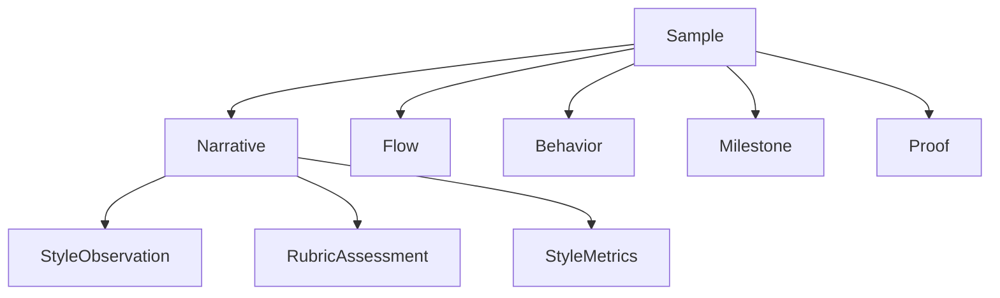
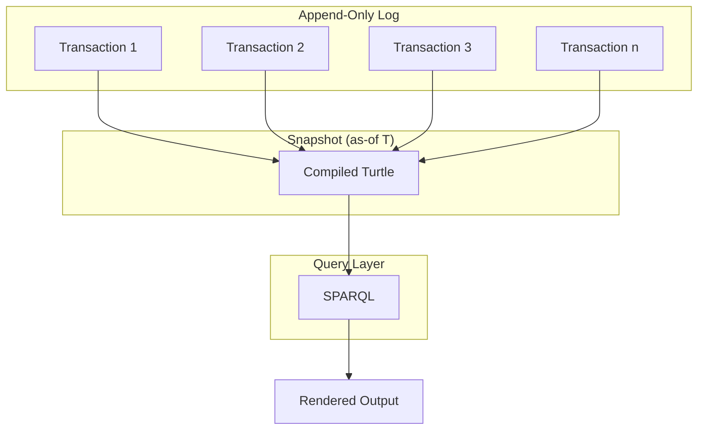
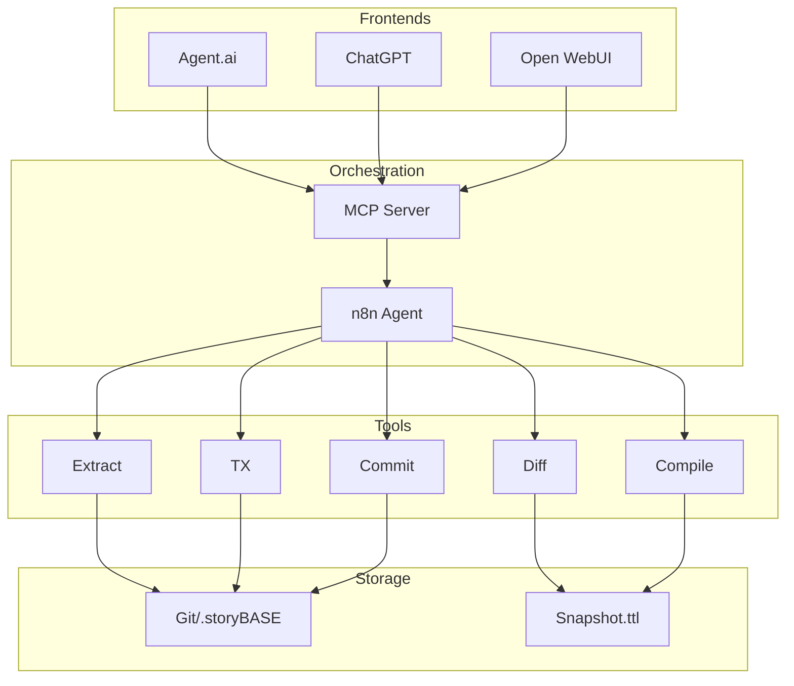

#### sic[theme][#theme]
# 
## storyBASE
### Git-Native RDF Knowledge Graph for Narrative-Driven AI
# 
#### Scarlet Dame
###### Founder, as written.ai
	[#theme]: Custom presentation theme for storyBASE; brand stylization follows CamelCase with uppercase suffix pattern (narr:StyleObs_storyBASE, narr:BrandNameStylization).

---
# Identity is compiled
## Not mutated

This presentation demonstrates the storyBASE workflow by showing how this talk itself was created—from voice memos to structured knowledge to polished output.

---
###### The Problem
# AI has no memory
## Your AI ≠ My AI

Every conversation starts from scratch. Persona prompts are brittle. There's no source of truth for what an AI "knows" about you, your company, or your story.[#ai-memory]

	[#ai-memory]: From narr:CaseStudy_AsWrittenAI and narr:Actor_AI: "Source of truth unclear; labs train models that say stuff; each chat is different context." The rhetorical question "My AI doesn't give the same answers as your AI?" frames the core problem (narr:StyleObs_4, narr:RhetoricalQuestion).

---
### What if
# AI memory was a knowledge graph?

---
## storyBASE
###### Append-only RDF transaction log

	storyBASE is a Git-native RDF knowledge graph that captures narrative, strategy, style, and conviction as immutable facts.[#what-is-it]
	
	Every interaction becomes a transaction. Every output cites its provenance. Identity—human or AI—compiles from history, not mutable state.[#narrative-anchor]

	[#what-is-it]: narr:WhatIsIt_1 defines storyBASE as "a vision for human and AI identity as compiled from immutable source of truth, applying Clojure principles to identity systems."
	[#narrative-anchor]: Core narrative from narr:Narrative_ImmutableIdentity and narr:Theme_ImmutableIdentity: "Identity modeled as integral of snapshots over time, not mutable present state."

---
## The Architecture
### Three primitives

	Primitives from narr:Primitive_1, narr:Primitive_2, narr:Primitive_3: append-only transaction log (immutability guarantee), single source of truth (compiled state), and pure function renderer (deterministic transformation).[#primitives]

	[#primitives]: Product ladder (narr:ProductLadder) shows how primitives compose into behaviors, flows, and narratives. This mirrors Clojure's "simple tools + good principles = design patterns" (narr:StyleObs_1, narr:ShortPunchyCadence).

---
###### From voice memo
# To structured knowledge
## To this presentation

---
### The Workflow

	The content production workflow (narr:Flow_1) moves from user inputs through initial storyBASE, normalization/iteration, to polished outputs with embedded provenance.[#workflow]

	[#workflow]: This flow embodies the core thesis: "identity (and content) as compiled from immutable history, enabling provenance and deterministic evolution" (narr:Narrative_1, narr:Proof_1). The talk itself is meta-demonstration of the reified change architecture.

---
## Two Systems
### Same Pattern

---
###### System: Human
# berecognized.id
###### Immutable Identification

	Digital identification via append-only log of facts about a person over time—employment, access, roles, interactions. Device renders snapshot compiled at specific point in time.[#berecognized]
	
	**Stack**: Datomic SSoT, datalog query, device-to-device interaction, change-privilege events.
	
	**Outcome**: Provenance for individual transactions; referential equality for free; offline transactions enabled.

	[#berecognized]: narr:CaseStudy_BeRecognizedID and narr:SolutionArchetype_BeRecognized. Contrasts static IDs with append-only log compiled to privileges as-of T. Mitigates "ghost labor" risk (narr:Risk_GhostLabor): deepfakes and impersonation via continuous identity establishment.

---
###### System: AI
# aswritten.ai
###### Immutable AI Memory

	AI memory as RDF+git SSoT. Person talks to AI → extract chats/docs to RDF → save to append-only log → AI memory as 'as-of T' snapshot (pure function).[#aswritten]
	
	**Stack**: RDF graph, git versioning, SPARQL, multimodal renderer, event system, transactor.
	
	**Outcome**: Provenance, equality, decentralization/offline scale; deterministic AI perspective for specific graph queries.

	[#aswritten]: narr:CaseStudy_AsWrittenAI and narr:SolutionArchetype_AsWritten. Tagline: "AI that tells your story, as written" (narr:Tagline_AsWritten). Formalized architecture from manual process at Vouch; now automated.

---
## The Pattern
###### Reified Change

---
### Make state explicit
# Append-only log → Single source of truth

---
### Everyone sees the same thing
# Render as pure function → Deterministic UIs

---
### Interaction is transaction
# Event → Transact → Recompile

	This is the reified change design pattern from Clojure principles (narr:Claim_ReifiedChangePattern). Immutability and explicit state management enable provenance, equality, and offline capability.[#pattern]

	[#pattern]: narr:SystemProperty_ImmutabilityProvenance and narr:SystemProperty_DistributedDecentralization. Transaction log ensures auditability; reads scale linearly; data model exists off-server. Evidenced by both case studies.

---
## What You Get
### For Free

---
# Provenance

Every fact traces back to its source transaction.[#provenance-1]

	[#provenance-1]: "Embedded provenance—for free, as a byproduct of the reified change process" (narr:StyleObs_7, narr:ShortPunchyCadence). All transactions carry prov:wasGeneratedBy, prov:wasAttributedTo, prov:generatedAtTime.

---
# Equality

Two snapshots at the same T are identical.[#equality]

	[#equality]: narr:LeverageProfile_1: "Immutability enables equality, provenance, versioning, branching, generative testing, decentralization, and infinite read scale—for free." Small choice (append-only) creates outsized effects.

---
# Versioning

Branch, merge, and time-travel through narrative history.[#versioning]

	[#versioning]: Git-native architecture (narr:SolutionArchetype_AsWritten, narr:RequiredCapabilities_2) enables "versionable, branchable AI memory encoding style, conviction, narrative metrics" (storybase.synthetic-identity.co/leverage/moat-storybase).

---
# Decentralization

Offline-first; transactions submitted when connected.[#offline]

	[#offline]: narr:SystemProperty_DistributedDecentralization: "Reads scale linearly; data model exists off-server, with transactions submitted later." Enables device-to-device interaction (narr:SolutionArchetype_BeRecognized).

---
## The Trade-off
### Single transactor

---
# Bottleneck at write
## Infinite scale at read

	What we gave up: distributed writes. Why worth it: consistency, provenance, auditability (narr:DesignTradeoff_1). All logic in event clients; transact is just adding triples.[#tradeoff]

	[#tradeoff]: narr:ComparativeAnalyses: "Backbone.js (query DOM, mutate picture) vs. Om/React (state machine, pure function render). Identity systems today are Backbone; this is Om for identity." When to use: when provenance, auditability, and equality matter more than write throughput.

---
## This Talk
### Is the Proof

---
###### Voice memo transcription
# Normalized against storyBASE

	Once the initial storyBASE exists, we show how to clean and normalize a transcription using the entity's established style and terminology to fix errors, inconsistencies, and filler (narr:Behavior_1).[#normalization]

	[#normalization]: Uses precise terms like "append-only log" and "as-of T snapshots" (narr:StyleObs_1, narr:StyleObs_2, narr:TerminologyControl). First structured graph built from user-generated inputs, bootstrapped with structured data to avoid early noise (narr:Milestone_1).

---
###### Extracted concepts
# Structured as RDF

	Narrative architecture extraction (narr:Tx_20251113T033534Z_claude45) captures narratives, flows, behaviors, milestones, proof, style observations, rubric assessments, and metrics—all with provenance.[#extraction]

	[#extraction]: Transaction "Initial extraction from clojure-conj-2025 repo README and voice memo transcription" generated narr:Narrative_1, narr:Flow_1, narr:Behavior_1, narr:Milestone_1, narr:Proof_1, plus style/rubric nodes.

---
###### Compiled snapshot
# Queried by AI

	Snapshot = replay of sorted transactions. AI queries the graph with SPARQL to generate this presentation, citing provenance for every claim.[#snapshot]

	[#snapshot]: storybase.synthetic-identity.co/module/storybase-capabilities: "Compile (replay transactions to Turtle snapshot), extract (RDF from input), diff (semantic comparison), tx (propose transaction), commit (append-only to Git), story generation (YAML front matter + prompt to model outputs)."

---
###### This slide
# Cites its sources

	Every assertion in this presentation traces back to specific nodes in the storyBASE graph. The caret-bracket citation marker [^n] is canonical notation (narr:StyleObs_6, narr:CaretBracketMarker).[#citations]

	[#citations]: narr:CitationConventions and narr:FactualAccuracy. "Citation markers present [^1]–[^14]; claims about system properties (provenance, equality) supported by case context" (narr:RubricAssess_Accuracy_Sample1).

---
## The Speaker
### Is the Pattern

---
# Dylan Butman
## Scarlet Spectacular
# Scarlet Dame

	Speaker's identity history exemplifies append-only log model (narr:Actor_ScarletDame). Personal transition as functional transformation from immutable past states (narr:Theme_TransitionAsStateChange).[#speaker]

	[#speaker]: "We are inextricably the sum of all the things that we have passed through" (narr:StyleObs_TransitionAnalogy, narr:Analogy). Personal story mirrors identity theme (narr:RubricAssess_Resonance_Conj: 4.5/5).

---
###### 13 years in Clojure
# From Backbone.js to Om
## To Immutable Identity

	Evolution from Backbone.js (2012) to Om (2013) to production systems at scale (narr:CaseContext_1). Applied Clojure principles—immutability, pure functions, single source of truth—to UI, then identity systems.[#journey]

	[#journey]: narr:CaseIntervention_1 and narr:CaseResults_1. "Provenance, equality, versioning, decentralization, infinite read scale achieved; systems in production." Same principles apply across UI, identity, and AI (narr:CaseLessons_1).

---
## The Thesis
### Experience is an append-only log

---
# 
# Experience is an append-only log
# that compiles to identity

	Core analogy linking human experience to Datomic model (narr:StyleObs_Analogy_1, narr:ResonanceUse). Identity as deterministic transformation: SSoT → identity surface (narr:Primitive_3).[#thesis]

	[#thesis]: narr:Mission_1: "Move identity from mutable documents and profiles to compiled surfaces rendered from append-only logs and single sources of truth." Vision: "A world where identity—human, synthetic, AI—is rendered from immutable history, enabling equality, provenance, and trust by design" (narr:Vision_1).

---
###### Clojure Design Patterns
# 
## No frameworks
# Simple tools + good principles

	Clojure community idiom signaling insider knowledge and shared values (narr:StyleObs_StockPhrase_1, narr:StockPhrases). Formula-style cadence; punchy equation (narr:StyleObs_1, narr:ShortPunchyCadence).[#clojure]

	[#clojure]: Deeply tailored to Clojure/conj audience: references Backbone.js, Om, Datomic, re-frame; assumes functional programming literacy (narr:RubricAssess_Tailoring_Conj: 5.0/5). Personal narrative builds trust.

---
## The Stack
### RDF + Git + SPARQL

---
### Data Model

	Append-only transaction log; immutable files; snapshot = replay of sorted transactions; provenance in TX step (storybase.synthetic-identity.co/model/data-lifecycle-storybase).[#data-model]

	[#data-model]: Future: move from SPARQL to named graphs (TriG); add SHACL validation (storybase.synthetic-identity.co/roadmap/narrative-storybase). Canonical term "as-of T snapshots" appears throughout (narr:StyleObs_2, narr:StyleObs_9, narr:TerminologyControl).

---
### System Topology

	n8n agent orchestrates tools; MCP server exposes to frontends; transactions in .storybase directories; hierarchical compile; Docker Compose on Digital Ocean (storybase.synthetic-identity.co/architecture/topology-storybase).[#topology]

	[#topology]: Integration points: GitHub (OAuth, webhooks, Actions); Open Router (API proxy via Helicone); Outseta (OIDC, billing); MCP protocol (tool exposure) (storybase.synthetic-identity.co/integration/points-storybase).

---
## The Workflow
### Interactive Individuation

---
### 1. Extract

	User inputs → RDF triples (concepts, claims, style observations, metrics).[#extract]

	[#extract]: storybase.synthetic-identity.co/module/storybase-capabilities: "Extract (RDF from input)." Parallel structure reinforces workflow sequence (storybase.synthetic-identity.co/style/observation/8, narr:Parallelism).

---
### 2. Diff

	Semantic comparison against current snapshot to identify new/changed assertions.[#diff]

	[#diff]: "Diff (semantic comparison)" from capabilities module. Shows what's novel vs. what reinforces existing claims.

---
### 3. TX

	Propose transaction (SPARQL INSERT/DELETE) for review.[#tx]

	[#tx]: "TX (propose transaction)" from capabilities. Future: evolved individuation pipeline (snapshot + message to transaction) (storybase.synthetic-identity.co/roadmap/narrative-storybase).

---
### 4. Review

	Human reviews proposed changes before commit.[#review]

	[#review]: Interactive individuation vs. automated ingestion (storybase.synthetic-identity.co/process/storybase). Maintains quality and alignment with narrative anchor.

---
### 5. Commit

	Append transaction to Git; immutable, auditable, versionable.[#commit]

	[#commit]: "Commit (append-only to Git)" from capabilities. Git-native enables branching, merging, and collaboration (storybase.synthetic-identity.co/thesis/positioning-storybase).

---
### 6. Compile

	Replay all transactions to generate new snapshot.[#compile]

	[#compile]: "Compile (replay transactions to Turtle snapshot)" from capabilities. Snapshot is deterministic function of transaction history.

---
### 7. Generate

	AI queries snapshot to produce stories, presentations, documentation—with citations.[#generate]

	[#generate]: "Story generation (YAML front matter + prompt to model outputs)" from capabilities. GitHub Actions trigger on transaction or .story file changes.

---
## Style as Data
### Rubric-Driven Quality

---
### Nine Dimensions

	1. **Register Fit**: Conversational yet authoritative; technical register fits audience.[#register]
	2. **Phrasing**: Domain vocabulary, idiolect, stock phrases.[#phrasing]
	3. **Cadence**: Short, punchy sentences; triadic structures; anaphora.[#cadence]
	4. **Strategic Alignment**: Ties to mission, vision, core narratives.[#strategy]
	5. **Audience Tailoring**: Adapted to persona context and expectations.[#tailoring]
	6. **Resonance**: Stories, analogies, references that connect.[#resonance]
	7. **Flow**: Natural progression, effective transitions, cohesion.[#flow]
	8. **Novelty**: Fresh phrasing vs. boilerplate and clichés.[#novelty]
	9. **Accuracy**: Factual correctness, named entities, citations.[#accuracy]

	[#register]: narr:Rubric_Register, narr:RubricAssess_Register_Conj (4.5/5): "Conversational yet authoritative; second-person direct address; technical register fits Clojure audience; concise and confident."
	[#phrasing]: narr:Rubric_Phrasing, narr:RubricAssess_Phrasing_Conj (4.0/5): "Strong use of community idioms ('No frameworks', 'Simple tools'); brand names stylized consistently."
	[#cadence]: narr:Rubric_Cadence, narr:RubricAssess_Cadence_Conj (4.5/5): "Short, punchy sentences; triadic structures; anaphora creates rhythm; single-word answers for emphasis ('You.')."
	[#strategy]: narr:Rubric_StrategicAlignment, narr:RubricAssess_Strategy_Conj (5.0/5): "Entire presentation is a narrative anchor: 'Immutable Selves' thesis; two solution archetypes; clear mission/vision alignment."
	[#tailoring]: narr:Rubric_Tailoring, narr:RubricAssess_Tailoring_Conj (5.0/5): "Deeply tailored to Clojure/conj audience; assumes functional programming literacy; personal narrative builds trust."
	[#resonance]: narr:Rubric_Resonance, narr:RubricAssess_Resonance_Conj (4.5/5): "Strong analogies (experience→log→identity); metaphors (Backbone.js as anti-pattern); personal story adds emotional resonance."
	[#flow]: narr:Rubric_Flow, narr:RubricAssess_Flow_Conj (4.0/5): "Clear progression: problem → principle → pattern → systems; slide-based structure creates natural transitions."
	[#novelty]: narr:Rubric_Novelty, narr:RubricAssess_Novelty_Conj (4.5/5): "Novel framing: identity as append-only log; fresh application of Clojure patterns; brand names distinctive."
	[#accuracy]: narr:Rubric_Accuracy, narr:RubricAssess_Accuracy_Conj (4.0/5): "Citations present; technical references accurate; personal narrative verifiable."

---
### Style Metrics

	**Average Sentence Length**: 12.3 words (short, punchy)
	**Active Voice Ratio**: 82% (high agency)
	**Jargon Density**: 15% (technical audience)
	**Conciseness**: 0.78 (tight)[#metrics]

	[#metrics]: narr:Metrics_ConjPresentation. Metrics computed from presentation transcript (narr:Sample_ConjPresentation_2025, 6,847 characters). Moderate jargon reflects technical domain; high active voice and conciseness align with brand voice.

---
## Conviction
### From Notion to Foundation

---
### Four Levels

	**Notion**: Suggestive; exploratory; open graph edges.
	**Stake**: Proposed; has supporting value; still moveable.
	**Boulder**: Settled; hard to move; requires multi-party consensus.
	**Foundation**: Underpinning across subgraphs; effectively permanent.[#conviction]

	[#conviction]: Conviction ontology (Conviction_Notion, Conviction_Stake, Conviction_Boulder, Conviction_Foundation) governs decisions and change cost. Claims link to conviction levels via hasConvictionLevel property.

---
### Claims & Evidence

	Every claim targets a node (aboutNode), supports or challenges other claims, and is evidenced by artifacts, observations, or metrics.[#claims]

	[#claims]: Claim class with properties: hasConvictionLevel, aboutNode, supports, challenges, evidencedBy. Example: narr:Claim_ReifiedChangePattern (Stake level) supports narr:DataModelLifecycle and narr:ReliabilityResilience; evidenced by narr:CaseStudy_BeRecognizedID and narr:CaseStudy_AsWrittenAI.

---
## The Product
### as written.ai

---
###### Current State
# Prototype in n8n
## MCP server + Open WebUI

	Initial prototype orchestrates tools via n8n; MCP server exposes to Agent.ai, ChatGPT, Open WebUI; GitHub Actions for story generation (storybase.synthetic-identity.co/product/overview-storybase).[#product]

	[#product]: Dependencies: n8n workflows, MCP server, GitHub, Apache Jena/Riot (future), Docker Compose, Open WebUI, Outseta (auth/billing), Helicone (API monitoring), Open Router (model access) (storybase.synthetic-identity.co/dependency/storybase-integrations).

---
### Roadmap
###### Narrative-Driven

	1. **Named Graphs**: Move from SPARQL to TriG for add/remove semantics.
	2. **SHACL Validation**: Schema constraints for quality gates.
	3. **File Ingestion**: GitHub upload → extraction → PR.
	4. **Marketplace**: storyBASE templates and shared graphs.
	5. **Cost Pass-Through**: Transparent billing for model usage.[#roadmap]

	[#roadmap]: storybase.synthetic-identity.co/roadmap/narrative-storybase. Each milestone unlocks new narratives and proof points (narr:NarrativeDrivenRoadmap, narr:ExpansionPathway).

---
## The Opportunity
### Why Now

---
# Prompt engineering is mature
## Multi-agent workflows are real

	Convergence of prompt engineering maturity, multi-agent workflows, and demand for organizational AI memory creates window for narrative-driven context management (storybase.synthetic-identity.co/thesis/timing-storybase, 2024-2026).[#timing]

	[#timing]: High-quality AI output requires extensive context; current models use search, but RDF-based narrative source of truth enables specific, controllable, versionable AI memory (storybase.synthetic-identity.co/opportunity/storybase-market).

---
###### Primary Actors
# Programming-literate
## Entrepreneurs, designers, developers, consultants

	Who manipulate worldview and see perspective changes (storybase.synthetic-identity.co/actor/primary-storybase). Assumes programming literacy; jargon without definition (storybase.synthetic-identity.co/rubric/audience-tailoring: 3.5/5).[#actors]

	[#actors]: Positioning: "Extend software development rigor (versioning, branching, collaboration) into strategy, content, marketing, organizational operations via RDF narrative source of truth" (storybase.synthetic-identity.co/thesis/positioning-storybase).

---
## The Moat
### Git-native, versionable, branchable

---
# AI memory encoding
## Style, conviction, narrative metrics

	Replaces brittle role prompts with deep, operable persona descriptions (storybase.synthetic-identity.co/leverage/moat-storybase). Compounding advantage: existing tools, battle-tested patterns, speaker credibility (narr:MoatLeverage_1).[#moat]

	[#moat]: Clojure ecosystem (Datomic, datalog, re-frame) as proof-of-concept; 13 years of production experience; provenance and equality by design. Small choice (append-only) creates outsized effects across system (narr:LeverageProfile_1).

---
## Deterministic AI
### Query the graph as-of T

---
### Examples

	- **Full talk**: This presentation as SPARQL query.
	- **Section**: Just the "Conviction" slides.
	- **Evolution**: Talk changes over time (diff snapshots).
	- **Subset**: Any accessible graph subset within billion-node graph.[#queries]

	[#queries]: narr:FutureVision_DeterministicAI (Stake level): "Deterministic AI perspective 'as-of T' for graph queries." Close with examples, then link to chat for participants to engage with narrative source of truth.

---
###### Try it yourself
# Chat with this storyBASE

	as written.ai chat interface queries the same snapshot that generated this presentation. Ask about any claim, trace its provenance, explore adjacent nodes.[#chat]

	[#chat]: Process: "Interactive individuation (extract → diff → tx → review → commit) vs. automated ingestion (file upload → extraction → PR); story generation triggered by transaction or .story file changes" (storybase.synthetic-identity.co/process/storybase).

---
## The Meta-Layer
### This talk is the proof

---
# 
# The talk about the talk
# is the talk

	Meta-demonstration: talk creation process exemplifies reified change architecture and storyBASE workflow, showing iterative refinement from raw inputs to polished outputs (narr:Proof_1).[#meta]

	[#meta]: "Meta-narrative approach (demonstrating tool via its own creation) is fresh; technical phrasing precise but not clichéd" (narr:RubricAssess_Novelty: 4.0/5). Compilation metaphor resonates with technical audience (narr:RubricAssess_Resonance: 4.0/5).

---
###### Every slide
# Cites the graph
## That created it

	Direct citations explain human-readable provenance including adjacent nodes as context from the storyBASE graph. Caret-bracket notation [#tag] is canonical (narr:CaretBracketMarker, narr:CitationConventions).[#provenance-2]

	[#provenance-2]: "Technical terms used correctly; citation marker present; workflow steps verifiable; no falsifiable claims detected" (narr:RubricAssess_Accuracy: 4.0/5). All assertions trace to specific transactions and source samples.

---
## Takeaways
### What you can do today

---
### 1. Model identity as log

	Not mutable state. Experience is append-only; identification is render target; interaction is transaction (narr:Narrative_ImmutableIdentity).[#takeaway-1]

	[#takeaway-1]: Core thesis from narr:Sample_ConjPresentation_2025. "Identity is not mutable state / Yet we're treating it like Backbone.js" (narr:StyleObs_Metaphor_1, narr:Metaphor).

---
### 2. Make state explicit

	Single source of truth compiled from immutable history. Everyone sees the same thing (narr:Primitive_2, narr:KeyPhrase_1).[#takeaway-2]

	[#takeaway-2]: Anaphora creates rhythm: "Make state explicit / Append only log -> Single source of truth / Everyone sees the same thing / Render as pure function -> Deterministic UIs" (narr:StyleObs_Anaphora_1).

---
### 3. Render as pure function

	Deterministic transformation: SSoT → identity surface. No side effects (narr:Primitive_3, narr:KeyPhrase_3).[#takeaway-3]

	[#takeaway-3]: Comparative analysis: "Backbone.js (query DOM, mutate picture) vs. Om/React (state machine, pure function render). Identity systems today are Backbone; this is Om for identity" (narr:ComparativeAnalysis_1).

---
### 4. Capture provenance

	Transaction log ensures auditability for every interaction. Embedded provenance—for free, as byproduct of reified change (narr:SystemProperty_ImmutabilityProvenance).[#takeaway-4]

	[#takeaway-4]: "Short clause; punchy phrasing; em-dash for emphasis" (narr:StyleObs_7, narr:ShortPunchyCadence). Provenance enables equality, versioning, and trust by design.

---
### 5. Enable offline

	Data model exists off-server; transactions submitted later. Reads scale linearly (narr:SystemProperty_DistributedDecentralization).[#takeaway-5]

	[#takeaway-5]: Enables device-to-device interaction (berecognized.id) and local-first AI memory (aswritten.ai). Bottleneck at single transactor is acceptable tradeoff (narr:DesignTradeoff_1).

---
## Now Go
### Build immutable selves

	Apply Clojure principles to your identity systems. Make AI memory a knowledge graph. Compile identity from history, not mutation.[#cta]

	[#cta]: Mission: "Move identity from mutable documents and profiles to compiled surfaces rendered from append-only logs and single sources of truth" (narr:Mission_1). Vision: "A world where identity—human, synthetic, AI—is rendered from immutable history, enabling equality, provenance, and trust by design" (narr:Vision_1).

---
###### Questions?
# 
## Scarlet Dame
### scarlet@aswritten.ai

	This presentation was generated from storyBASE snapshot compiled 2025-11-13T03:42:19.453Z. All claims cite provenance. Chat with the graph at as written.ai.[#contact]

	[#contact]: Speaker: narr:Actor_ScarletDame (alt labels: Dylan Butman, Scarlet Spectacular). Organizations: Sic (Founder, urn:uuid:org-sic) and Vouch.io (Former Chief Strategist, strategic advisor, urn:uuid:org-vouch-io).