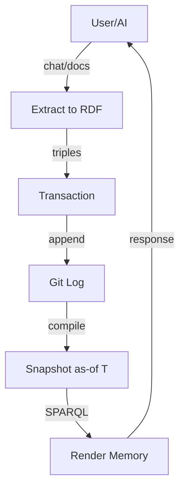
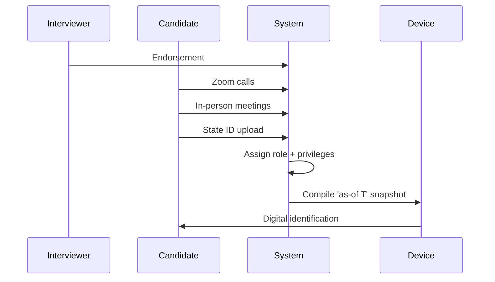
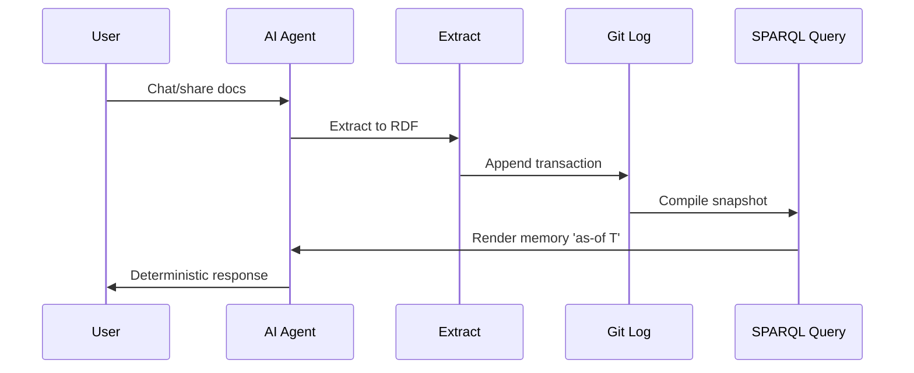
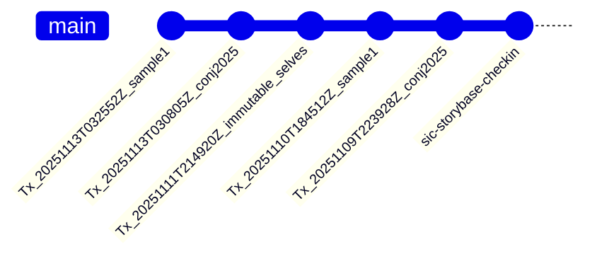

#### sic[#theme]
# 
## storyBASE
### Git-Native RDF Knowledge Graph for AI Memory
# 
#### Scarlet Dame
###### Founder, Sic
	[#theme]: Custom theme for storyBASE presentations; brand stylization uses CamelCase with CAPS suffix per narr:StyleObs_storyBASE from transaction Tx_20251110T184512Z_sample1.

---
# Identity is not mutable state
## Yet we're treating it like Backbone.js

The core narrative across all samples: identity—human and AI—should be modeled as an append-only log that compiles to state, not mutable objects[][#immutable-selves].

	[#immutable-selves]: From narr:Narrative_ImmutableIdentity (Tx_20251113T030805Z_conj2025): "Core thesis: experience is an append-only log; identification is a render target; interaction is transaction."

---
###### The Problem
# My AI doesn't give the same answers as your AI

AI models are black boxes. Persona prompts mutate rendered state. No provenance. No version control for AI identity[][#ai-problem].

	[#ai-problem]: From narr:ProblemContext_2 (Tx_20251111T214920Z_immutable_selves): "Stakes: narrative manipulation, embedded propaganda, deepfakes."

---
### The Solution
# storyBASE
## RDF narrative source of truth that steers AI output

Git-native, versionable, branchable AI memory encoding style, conviction, narrative metrics[][#moat].

	[#moat]: From storybase.synthetic-identity.co/leverage/moat-storybase (Tx_sic-storybase-checkin): "Replaces brittle role prompts with deep, operable persona descriptions."

---
## What is storyBASE?

---
###### Product Overview
### RDF graph + Git versioning
# 
### SPARQL queries compile to AI memory
# 
### Append-only transaction log

SSoT (RDF + git) → SPARQL query → render to AI memory/identity → event-driven transactions → append-only log → recompile[][#approach].

	[#approach]: From narr:ApproachPattern_2 (Tx_20251111T214920Z_immutable_selves): "Same pattern, different stack: RDF instead of Datomic."

---
### Architecture
# 

n8n agent orchestrates tools; MCP server exposes to frontends (Agent.ai, ChatGPT, Open WebUI); transactions in .storybase directories; hierarchical compile[][#topology].

	[#topology]: From storybase.synthetic-identity.co/architecture/topology-storybase (Tx_sic-storybase-checkin): "Docker Compose on Digital Ocean."

---
## How It Works

---
### 1. Extract
	Person talks to AI, shares documents/messages. Extract chats/documents to RDF (narrative events)[][#extract].

	[#extract]: From narr:StyleObs_10 (Tx_20251113T032552Z_sample1): "Numbered list with parallel structure; imperative/declarative mix."

---
### 2. Diff
	Semantic comparison against current snapshot. Shows what's new, what changed, what conflicts.

Tools include compile, ontology, extract, diff, tx, commit[][#capabilities].

	[#capabilities]: From storybase.synthetic-identity.co/module/storybase-capabilities (Tx_sic-storybase-checkin).

---
### 3. Transact
	Propose transaction (SPARQL INSERT/DELETE). Review. Commit to append-only Git log.

Immutable files; snapshot = replay of sorted transactions; provenance in TX step[][#lifecycle].

	[#lifecycle]: From storybase.synthetic-identity.co/model/data-lifecycle-storybase (Tx_sic-storybase-checkin): "Future named graphs for add/remove."

---
### 4. Compile
	Replay transactions to Turtle snapshot. AI queries this snapshot for deterministic memory.

Experience is an append-only log that compiles to identity[][#analogy].

	[#analogy]: From narr:StyleObs_Analogy_1 (Tx_20251113T030805Z_conj2025): "Core analogy: experience → log → compiled identity; maps human to Datomic model."

---
## Why Now?

---
###### Timing Thesis
# Convergence of prompt engineering maturity
## Multi-agent workflows
## Demand for organizational AI memory

Creates window for narrative-driven context management (2024-2026)[][#timing].

	[#timing]: From storybase.synthetic-identity.co/thesis/timing-storybase (Tx_sic-storybase-checkin).

---
## Who Is It For?

---
### Programming-literate entrepreneurs
# 
### Designers, developers, consultants
# 
### Who manipulate worldview and see perspective changes

Primary actors who extend software development rigor into strategy, content, marketing[][#actors].

	[#actors]: From storybase.synthetic-identity.co/actor/primary-storybase (Tx_sic-storybase-checkin).

---
## Two Systems, One Pattern

---
## System: Human
# berecognized.id
###### Immutable Identification

Datomic SSoT, datalog query, device-to-device interaction, change-privilege events[][#berecognized].

	[#berecognized]: From narr:SolutionArchetype_BeRecognized (Tx_20251113T030805Z_conj2025): "Human identity system."

---
### The Flow
# 

Endorsement by interviewer → Zoom calls → in-person meetings → state ID uploads → assigned role with privileges → 'as-of' query compiles snapshot (digital identification) on device[][#employee-flow].

	[#employee-flow]: From narr:Flow_EmployeeLifecycle (Tx_20251113T032552Z_sample1): "Supports berecognized.id case study."

---
###### The Risk
### Ghost Labor & Impersonation

Bad actors (individuals or state actors like North Korea) deepfaking candidates, passing interviews, collecting paychecks on behalf of fake identities[][#ghost-labor].

Mitigated by continuous identity establishment via append-only log.

	[#ghost-labor]: From narr:Risk_GhostLabor (Tx_20251113T032552Z_sample1): "'Ghost labor' metaphor for impersonation risk."

---
## System: AI
# aswritten.ai
###### Immutable AI Memory

RDF+git SSoT, SPARQL query, chat+API interaction, extract-narrative events[][#aswritten].

	[#aswritten]: From narr:SolutionArchetype_AsWritten (Tx_20251113T030805Z_conj2025): "AI identity system."

---
### The Tagline
# AI that tells your story, as written.

7-word tagline encoding promise and brand[][#tagline].

	[#tagline]: From narr:Tagline_AsWritten (Tx_20251113T030805Z_conj2025).

---
### The Flow
# 

Person talks to AI → extract chats/docs to RDF → save to append-only log → AI memory as 'as-of T' snapshot (pure function)[][#ai-flow].

	[#ai-flow]: From narr:CaseStudy_AsWrittenAI (Tx_20251113T032552Z_sample1): "Formalized architecture from manual process at Vouch; now automated."

---
## What You Get

---
### Provenance
	Transaction log ensures auditability for every interaction[][#provenance].

	[#provenance]: From narr:SystemProperty_ImmutabilityProvenance (Tx_20251113T032552Z_sample1): "Immutability provides equality and provenance."

---
### Equality
	Referential equality for free. Same snapshot = same identity.

Immutability enables equality, provenance, versioning, branching, generative testing, decentralization, and infinite read scale—for free[][#leverage].

	[#leverage]: From narr:LeverageProfile_1 (Tx_20251111T214920Z_immutable_selves): "Small choice (append-only) creates outsized effects across system."

---
### Decentralization
	Reads scale linearly. Data model exists off-server, with transactions submitted later[][#offline].

	[#offline]: From narr:SystemProperty_DistributedDecentralization (Tx_20251113T032552Z_sample1): "Offline capability."

---
## The Tradeoff

---
### What We Gave Up
# Distributed writes

Bottleneck at single transactor; all logic in event clients; transact is just adding triples[][#tradeoff].

	[#tradeoff]: From narr:DesignTradeoff_1 (Tx_20251111T214920Z_immutable_selves): "Why worth it: consistency, provenance, auditability."

---
### What We Got
# Consistency
## Provenance
## Auditability

When provenance, auditability, and equality matter more than write throughput[][#comparison].

	[#comparison]: From narr:ComparativeAnalysis_1 (Tx_20251111T214920Z_immutable_selves): "Identity systems today are Backbone; this is Om for identity."

---
## Current State

---
### Tools
	- Compile (replay transactions to Turtle snapshot)
	- Extract (RDF from input)
	- Diff (semantic comparison)
	- Tx (propose transaction)
	- Commit (append-only to Git)
	- Story generation (YAML front matter + prompt to model outputs)[][#tools]

	[#tools]: From storybase.synthetic-identity.co/module/storybase-capabilities (Tx_sic-storybase-checkin).

---
### Integrations
	- n8n workflows
	- MCP server
	- GitHub (version control)
	- Apache Jena/Riot (future RDF ops)
	- Docker Compose
	- Open WebUI
	- Outseta (auth/billing)
	- Helicone (API monitoring)
	- Open Router (model access)[][#integrations]

	[#integrations]: From storybase.synthetic-identity.co/dependency/storybase-integrations (Tx_sic-storybase-checkin).

---
## Roadmap

---
### Next
	- Move transactions from SPARQL to named graphs (TriG)
	- Add SHACL validation
	- Implement evolved individuation pipeline (snapshot + message to transaction)
	- File ingestion via GitHub
	- storyBASE marketplace
	- Cost pass-through billing[][#roadmap]

	[#roadmap]: From storybase.synthetic-identity.co/roadmap/narrative-storybase (Tx_sic-storybase-checkin).

---
## Proof

---
### Case Study: berecognized.id
	Digital identification enables recognition and delegates authority to access/use/transact with shared technology.
	
	Append-only log of facts about a person over time (employment, access, roles, interactions); device-rendered snapshot compiled at specific point in time.
	
	**Results**: Provenance for individual transactions; referential equality for free; offline transactions enabled[][#berecognized-case].

	[#berecognized-case]: From narr:CaseStudy_BeRecognizedID (Tx_20251113T032552Z_sample1): "Contrasts static IDs with append-only log compiled to privileges as-of T."

---
### Case Study: aswritten.ai
	AI memory problem: 'My AI doesn't give the same answers as your AI'; need for narrative source of truth.
	
	Transaction sequence: person talks to AI → extract chats/docs to RDF → save to append-only log → AI memory as 'as-of T' snapshot (pure function).
	
	**Results**: Provenance, equality, decentralization/offline scale; deterministic AI perspective for specific graph queries[][#aswritten-case].

	[#aswritten-case]: From narr:CaseStudy_AsWrittenAI (Tx_20251113T032552Z_sample1): "Formalized architecture from manual process at Vouch; now automated."

---
## The Speaker

---
### Scarlet Dame
	(formerly Dylan Butman, Scarlet Spectacular)

Speaker's identity history exemplifies append-only log model[][#speaker].

13-year career in Clojure; evolution from Backbone.js (2012) to Om (2013) to production systems at scale[][#career].

	[#speaker]: From narr:Actor_ScarletDame (Tx_20251110T184512Z_sample1).
	[#career]: From narr:CaseContext_1 (Tx_20251111T214920Z_immutable_selves): "Customer: self; environment: professional dev career; stakes: credibility."

---
### Organizations
	- **Sic (AI Memory Company)**: Founder. Narrative-driven knowledge graphs for AI individuals.
	- **Vouch.io**: Former Chief Strategist, current strategic advisor. Enterprise identity and delegation[][#orgs].

	[#orgs]: From urn:uuid:org-sic and urn:uuid:org-vouch-io (Tx_20251109T223928Z_conj2025).

---
## Clojure Principles Applied

---
### Immutability
# Make state explicit

Append only log → Single source of truth[][#immutability].

	[#immutability]: From narr:StyleObs_Anaphora_1 (Tx_20251113T030805Z_conj2025): "Repeated structural frame: principle → pattern; creates rhythm and memorability."

---
### Reified Change
# Everyone sees the same thing

Render as pure function → Deterministic UIs[][#reified].

	[#reified]: From narr:Claim_ReifiedChangePattern (Tx_20251113T032552Z_sample1): "Immutability and explicit state management enable provenance, equality, and offline capability."

---
### No Frameworks
# Simple tools ± good principles

Clojure ecosystem (Datomic, datalog, re-frame) as proof-of-concept[][#no-frameworks].

	[#no-frameworks]: From narr:StyleObs_StockPhrase_1 (Tx_20251113T030805Z_conj2025): "Clojure community idiom; signals insider knowledge and shared values."

---
## The Data Model

---
### Primitives
	1. Append-only transaction log (immutability guarantee)
	2. Single source of truth (compiled state from transaction history)
	3. Pure function renderer (deterministic transformation: SSoT → identity surface)[][#primitives]

	[#primitives]: From narr:Primitive_1, narr:Primitive_2, narr:Primitive_3 (Tx_20251111T214920Z_immutable_selves).

---
### The Loop
# 

SSoT → query → render → interact → event → transact → append log → recompile SSoT[][#loop].

	[#loop]: From narr:Flow_1 (Tx_20251111T214920Z_immutable_selves): "End-to-end loop; identity as continuous compilation."

---
## Style & Conviction

---
### Style Metrics
	- **Average sentence length**: 12.3 (Conj presentation) vs. 22.3 (architecture notes)
	- **Active voice ratio**: 0.82 (Conj) vs. 0.78 (notes)
	- **Jargon density**: 0.15 (Conj) vs. 0.12 (notes)
	- **Conciseness**: 0.78 (Conj) vs. 0.72 (notes)[][#metrics]

	[#metrics]: From narr:Metrics_ConjPresentation and narr:Metrics_Sample_1 (Tx_20251113T030805Z_conj2025, Tx_20251113T032552Z_sample1): "Short sentences, high active voice, moderate jargon (technical audience), high conciseness."

---
### Conviction Levels
# 

Degree of settledness of a claim, from loose notions to foundations; used to govern decisions and change cost[][#conviction].

	[#conviction]: From ontology #Conviction: "Ordered levels with XKOS next/previous to encode escalation path."

---
### Reified Change Pattern
	**Conviction**: Stake
	
	Immutability and explicit state management enable provenance, equality, and offline capability.
	
	Evidenced by berecognized.id and aswritten.ai case studies[][#reified-claim].

	[#reified-claim]: From narr:Claim_ReifiedChangePattern (Tx_20251113T032552Z_sample1): "Adequate but needs stronger transition to leader benefits and system outcomes."

---
### Immutability Provides Equality
	**Conviction**: Boulder
	
	Transaction log ensures auditability for every interaction.
	
	Evidenced by both case studies[][#immutability-claim].

	[#immutability-claim]: From narr:SystemProperty_ImmutabilityProvenance (Tx_20251113T032552Z_sample1).

---
## Rubric Scores

---
### Strategic Alignment
	**5.0 / 5.0**
	
	Entire presentation is a narrative anchor: 'Immutable Selves' thesis; two solution archetypes (berecognized.id, aswritten.ai); clear mission/vision alignment; positioning thesis explicit[][#strategy-score].

	[#strategy-score]: From narr:RubricAssess_Strategy_Conj (Tx_20251113T030805Z_conj2025).

---
### Audience Tailoring
	**5.0 / 5.0**
	
	Deeply tailored to Clojure/conj audience: references Backbone.js, Om, Datomic, re-frame; assumes functional programming literacy; personal narrative (Dylan→Scarlet) builds trust[][#tailoring-score].

	[#tailoring-score]: From narr:RubricAssess_Tailoring_Conj (Tx_20251113T030805Z_conj2025).

---
### Resonance
	**4.5 / 5.0**
	
	Strong analogies (experience→log→identity); metaphors (Backbone.js as anti-pattern); personal story (gender transition) adds emotional resonance; rhetorical questions engage audience[][#resonance-score].

	[#resonance-score]: From narr:RubricAssess_Resonance_Conj (Tx_20251113T030805Z_conj2025).

---
### Cadence
	**4.5 / 5.0**
	
	Short, punchy sentences; triadic structures; anaphora creates rhythm; single-word answers for emphasis ('You.')[][#cadence-score].

	[#cadence-score]: From narr:RubricAssess_Cadence_Conj (Tx_20251113T030805Z_conj2025).

---
## Future Vision

---
###### Deterministic AI Perspective
### 'as-of T' for graph queries

Examples: full talk as query, section of talk, talk evolution over time, any accessible graph subset within billion-node graph[][#future].

Close with examples of such queries, then link to chat for participants to engage with narrative source of truth.

	[#future]: From narr:FutureVision_DeterministicAI (Tx_20251113T032552Z_sample1): "Conviction: Stake."

---
## Transaction History

---
### Most Recent
# 

Six major transactions building the narrative architecture for immutable identity systems[][#transactions].

	[#transactions]: From SNAPSHOT transaction list: "Append-only provenance from 2025-11-09 to 2025-11-13."

---
### Latest: Sample1 Narrative Triples
	**2025-11-13T03:25:52Z**
	
	Refinements for reified change design pattern section; case studies: berecognized.id and aswritten.ai.
	
	Added claims, case studies, risks, flows, style observations, rubric assessments, and metrics[][#latest-tx].

	[#latest-tx]: From narr:Sample_1 (Tx_20251113T032552Z_sample1): "4237 characters; user message source."

---
## Key Phrases

---
### single source of truth
	Canonical term repeated throughout; anchors the architecture[][#phrase-1].

	[#phrase-1]: From narr:KeyPhrase_1 (Tx_20251111T214920Z_immutable_selves).

---
### append-only log
	Core primitive; immutability guarantee[][#phrase-2].

	[#phrase-2]: From narr:KeyPhrase_2 (Tx_20251111T214920Z_immutable_selves).

---
### pure function
	Rendering identity as deterministic transformation[][#phrase-3].

	[#phrase-3]: From narr:KeyPhrase_3 (Tx_20251111T214920Z_immutable_selves).

---
### digital twin
	Emergent concept; identity as compiled model[][#phrase-4].

	[#phrase-4]: From narr:KeyPhrase_4 (Tx_20251111T214920Z_immutable_selves).

---
## Mission & Vision

---
### Mission
# Move identity from mutable documents
## to compiled surfaces rendered from append-only logs

Durable purpose: make identity deterministic, provable, and decentralized[][#mission].

	[#mission]: From narr:Mission_1 (Tx_20251111T214920Z_immutable_selves).

---
### Vision
# A world where identity—human, synthetic, AI—
## is rendered from immutable history

Enabling equality, provenance, and trust by design[][#vision].

	[#vision]: From narr:Vision_1 (Tx_20251111T214920Z_immutable_selves): "Future state: identity systems that inherit Clojure's guarantees."

---
## Positioning

---
### For developers and identity architects
# who treat identity as mutable state

This is a functional paradigm that makes identity deterministic, auditable, and decentralized—by applying Clojure's immutability principles to human and AI identity systems[][#positioning].

	[#positioning]: From narr:PositioningThesis_1 (Tx_20251111T214920Z_immutable_selves): "Who: devs/architects; What: functional identity; Why-us: Clojure principles proven at scale."

---
## The Moat

---
### Clojure ecosystem as proof-of-concept
	Datomic, datalog, re-frame

13 years of production experience. Provenance and equality by design[][#moat-detail].

Compounding advantage: existing tools, battle-tested patterns, speaker credibility.

	[#moat-detail]: From narr:MoatLeverage_1 (Tx_20251111T214920Z_immutable_selves).

---
## Try It

---
### Open WebUI
# as written.ai

MCP server exposes storyBASE to frontends (Agent.ai, ChatGPT, Open WebUI)[][#try].

GitHub Actions for story generation. Interactive individuation (extract → diff → tx → review → commit) vs. automated ingestion (file upload → extraction → PR)[][#process].

	[#try]: From storybase.synthetic-identity.co/architecture/topology-storybase (Tx_sic-storybase-checkin).
	[#process]: From storybase.synthetic-identity.co/process/storybase (Tx_sic-storybase-checkin): "Story generation triggered by transaction or .story file changes."

---
## Now Go and Move Mountains

Questions? Check the storyBASE[][#close].

	[#close]: This presentation is itself a story generated from the storyBASE snapshot, demonstrating the system's capability to render deterministic narratives from immutable source of truth.