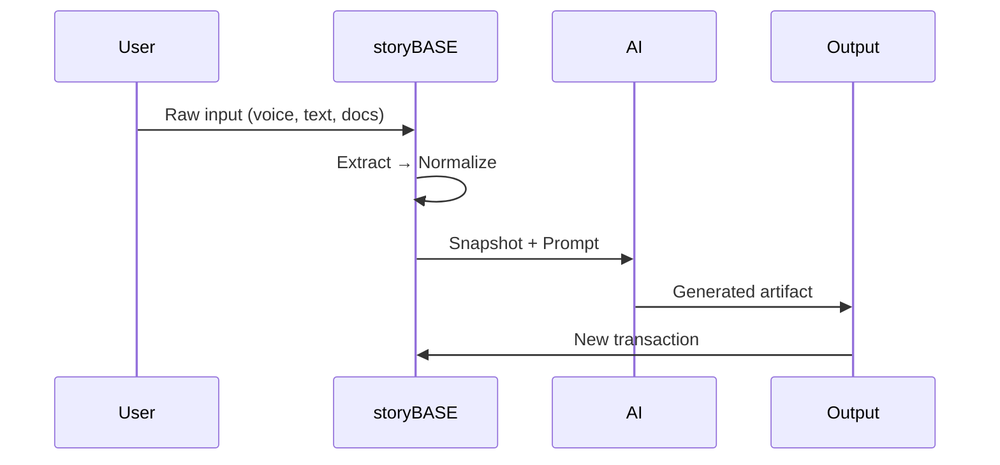
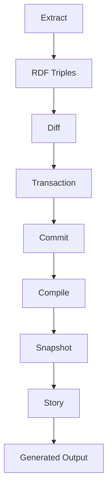
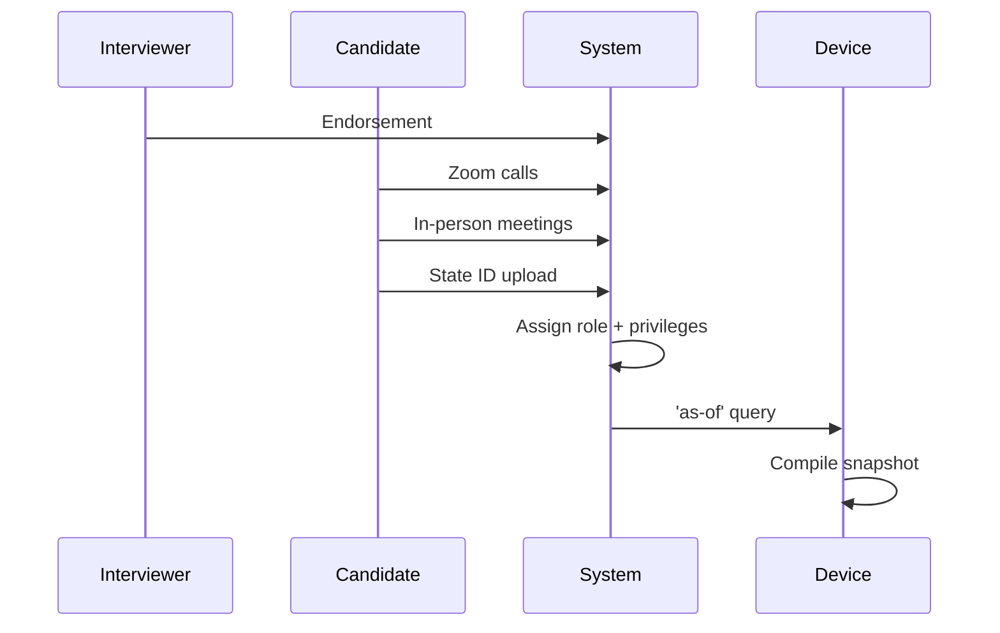
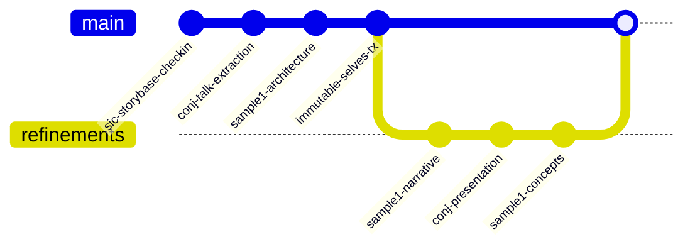
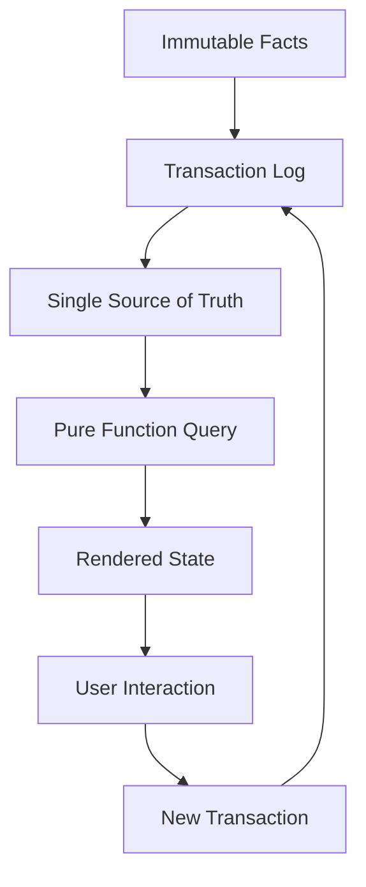

#### sic[theme][#theme]
#
## storyBASE
### Git-Native RDF Knowledge Graph for Narrative-Driven AI
#
#### Scarlet Dame
###### Founder, as written.ai
	[#theme]: Custom presentation theme for storyBASE; brand stylization follows CamelCase with uppercase suffix pattern from narr:StyleObs_storyBASE, narr:StyleObs_BrandStylization_1.

---
###### What is storyBASE?
# Identity as compiled from immutable history
	storyBASE is an RDF narrative source of truth that steers AI output, making it specific, controllable, and aligned with organizational worldview[][#what-is-it]. The system models identity—both human and AI—as an append-only log that compiles to state, not mutable objects[][#immutable-identity].
	
	[#what-is-it]: From storybase.synthetic-identity.co/product/what-is-storybase, generated in Tx_20251109T223928Z_conj2025.
	[#immutable-identity]: Core narrative from narr:Narrative_ImmutableIdentity, Sample_ConjPresentation_2025.

---
### The problem
# AI memory is mutable state
## We're treating it like Backbone.js
	Current AI systems lack provenance and version control for identity. Persona prompts mutate rendered state with no single source of truth[][#problem]. Each chat creates different context; labs train models that say stuff, but the source of truth remains unclear[][#ai-actor].
	
	[#problem]: From narr:ProblemContext_2, describing AI identity challenges in Archetype_2.
	[#ai-actor]: Actor definition from narr:Actor_AI in Sample_ConjPresentation_2025.

---
## The solution
# Append-only log → Single source of truth
	Experience is an append-only log that compiles to identity[][#analogy]. This workflow embodies the core thesis: identity and content derive from append-only log with as-of-T snapshots, enabling provenance and deterministic evolution[][#core-thesis].
	
	[#analogy]: From narr:StyleObs_Analogy_1, Sample_ConjPresentation_2025, character positions 4850-4933.
	[#core-thesis]: narr:Narrative_1 definition from Tx_20251113T033534Z_claude45.

---
## Architecture

---
### System Flow
###### From input to output

	The data model lifecycle follows an immutable pattern: append-only transaction log, immutable files, snapshot equals replay of sorted transactions[][#lifecycle]. Provenance lives in the transaction step; future work will use named graphs for add/remove operations[][#roadmap].
	
	[#lifecycle]: From storybase.synthetic-identity.co/model/data-lifecycle-storybase.
	[#roadmap]: Related to storybase.synthetic-identity.co/roadmap/narrative-storybase.

---
### Core Primitives
###### Building blocks

	Three foundational primitives compose the system[][#primitives]:
	
	1. **Append-only transaction log** – Immutability guarantee
	2. **Single source of truth (SSoT)** – Compiled state from transaction history  
	3. **Pure function renderer** – Deterministic transformation: SSoT → identity surface
	
	[#primitives]: From narr:Primitive_1, narr:Primitive_2, narr:Primitive_3 in ProductLadder.

---
### The Workflow
###### Content production as compilation

	User inputs flow to initial storyBASE, then through normalization and iteration to polished outputs with embedded provenance[][#flow]. The system cleans and refines raw transcription using established style and terminology to fix errors, inconsistencies, and filler[][#normalize].
	
	[#flow]: narr:Flow_1 from Tx_20251113T033534Z_claude45.
	[#normalize]: narr:Behavior_1 definition, related to StyleProfiles and TerminologyControl.

---
## Two Systems, One Pattern

---
### System: Human
# berecognized.id
###### Immutable Identification
	Digital identification enables recognition and delegates authority to access, use, and transact with shared technology[][#berecognized-context]. The system maintains an append-only log of facts about a person over time—employment, access, roles, interactions—compiled to a device-rendered snapshot at a specific point in time[][#berecognized-intervention].
	
	**Stack**: Datomic SSoT, datalog query, device-to-device interaction, change-privilege events[][#berecognized-arch].
	
	[#berecognized-context]: narr:CaseStudy_BeRecognizedID CaseContext.
	[#berecognized-intervention]: CaseIntervention from same case study.
	[#berecognized-arch]: narr:SolutionArchetype_BeRecognized definition.

---
### System: AI  
# aswritten.ai
###### Immutable AI Memory
	The AI memory problem: "My AI doesn't give the same answers as your AI"[][#ai-problem]. The solution formalizes architecture from manual process: person talks to AI → extract chats/docs to RDF → save to append-only log → AI memory as 'as-of T' snapshot (pure function)[][#aswritten-intervention].
	
	**Stack**: RDF+git SSoT, SPARQL query, chat+API interaction, extract-narrative events[][#aswritten-arch].
	
	[#ai-problem]: Rhetorical question from narr:StyleObs_4, Sample_1 positions 2754-2809.
	[#aswritten-intervention]: narr:CaseStudy_AsWrittenAI CaseIntervention.
	[#aswritten-arch]: narr:SolutionArchetype_AsWritten definition.

---
## What You Get
# Provenance, equality, decentralization
	Three system properties emerge from the reified change pattern[][#properties]:
	
	**Provenance** – Transaction log ensures auditability for every interaction[][#provenance]
	
	**Equality** – Immutability provides referential equality for free[][#equality]
	
	**Offline scale** – Reads scale linearly; data model exists off-server[][#scale]
	
	[#properties]: Triadic list from narr:StyleObs_8, Sample_1 positions 2398-2464.
	[#provenance]: narr:SystemProperty_ImmutabilityProvenance definition.
	[#equality]: Same system property, evidenced by both case studies.
	[#scale]: narr:SystemProperty_DistributedDecentralization definition.

---
## The Tools

---
### storyBASE Capabilities
###### Modules that compose

	Six core modules enable the workflow[][#modules]:
	
	- **Compile** – Replay transactions to Turtle snapshot
	- **Extract** – RDF from input  
	- **Diff** – Semantic comparison
	- **Tx** – Propose transaction
	- **Commit** – Append-only to Git
	- **Story** – YAML front matter + prompt to model outputs
	
	[#modules]: From storybase.synthetic-identity.co/module/storybase-capabilities.

---
### Integration Points
###### How it connects

	The system integrates via[][#integrations]:
	
	- **GitHub** – OAuth, webhooks, Actions for version control
	- **Open Router** – API proxy via Helicone for model access
	- **Outseta** – OIDC and billing
	- **MCP protocol** – Tool exposure to frontends
	- **Future**: GitHub Apps with scoped credentials
	
	[#integrations]: storybase.synthetic-identity.co/integration/points-storybase.

---
## The Meta-Layer
# This talk is a storyBASE query
	The talk itself exemplifies the reified change architecture and storyBASE workflow, showing iterative refinement from raw inputs to polished outputs[][#meta-proof]. Voice memos and transcriptions become structured presentations through the same normalization process we describe[][#meta-demo].
	
	[#meta-proof]: narr:Proof_1 from Tx_20251113T033534Z_claude45.
	[#meta-demo]: Sample_1 note: "Meta-narrative closing: demonstrating storyBASE workflow via talk creation process."

---
### The Employee Lifecycle
###### Continuous identity establishment

	Endorsement by interviewer → Zoom calls → in-person meetings → state ID uploads → assigned role with privileges → 'as-of' query compiles snapshot (digital identification) on device[][#employee-flow]. This mitigates ghost labor risk: bad actors deepfaking candidates, passing interviews, collecting paychecks on behalf of fake identities[][#ghost-labor].
	
	[#employee-flow]: narr:Flow_EmployeeLifecycle definition.
	[#ghost-labor]: narr:Risk_GhostLabor, challenges CaseStudy_BeRecognizedID.

---
## Style & Voice
# How the narrative sounds
	The storyBASE encodes style through observations and metrics[][#style-system]. Brand names use consistent stylization (storyBASE, berecognized.id, aswritten.ai)[][#brand-style]. Technical terminology follows canonical phrasing: "append-only log," "as-of T snapshots," "pure function"[][#terminology].
	
	**Measured attributes**:
	- Average sentence length: 12.3–22.3 words
	- Active voice ratio: 0.78–0.85
	- Jargon density: 0.12–0.15
	- Conciseness: 0.72–0.78
	
	[#style-system]: Style facet from ontology, includes StyleMetrics, StyleObservation, StyleReview.
	[#brand-style]: Multiple StyleObs nodes for BrandNameStylization across samples.
	[#terminology]: narr:StyleObs_1, narr:StyleObs_2 from Tx_20251113T033534Z_claude45.

---
### Rubric Scores
###### Quality assessment across samples

	Nine dimensions track narrative quality (0–5 scale)[][#rubric]:
	
	| Dimension | Range | Notes |
	|-----------|-------|-------|
	| Register | 3.5–4.5 | Conversational to authoritative |
	| Phrasing | 3.0–4.5 | Domain vocabulary strength |
	| Cadence | 3.0–4.5 | Rhythm and sentence variation |
	| Strategic Alignment | 4.0–5.0 | Ties to mission/vision |
	| Tailoring | 3.5–5.0 | Audience fit |
	| Resonance | 3.0–4.5 | Stories and analogies |
	| Flow | 3.0–4.0 | Transitions and coherence |
	| Novelty | 3.5–4.5 | Freshness vs. cliché |
	| Accuracy | 3.0–4.0 | Factual correctness |
	
	[#rubric]: Rubric_* concepts from Style ontology; assessments from multiple RubricAssess_* nodes.

---
## The Vision
# Deterministic AI perspective 'as-of T'
	Future queries enable[][#future-vision]:
	
	- Full talk as query
	- Section of talk
	- Talk evolution over time  
	- Any accessible graph subset within billion-node graph
	
	Close with examples of such queries, then link to chat for participants to engage with narrative source of truth[][#engagement].
	
	[#future-vision]: narr:FutureVision_DeterministicAI from Tx_20251113T032552Z_sample1.
	[#engagement]: Same node's skos:note guidance.

---
## Roadmap
###### What's next

	Narrative-driven development priorities[][#roadmap-detail]:
	
	1. **Named graphs** – Move from SPARQL to TriG for add/remove
	2. **SHACL validation** – Schema enforcement
	3. **Evolved individuation** – Snapshot + message → transaction
	4. **File ingestion** – GitHub-based upload
	5. **Marketplace** – storyBASE sharing and discovery
	6. **Cost pass-through** – Transparent billing
	
	[#roadmap-detail]: storybase.synthetic-identity.co/roadmap/narrative-storybase description.

---
### Current State
###### Production system

	**Deployed**: n8n agent orchestrates tools; MCP server exposes to frontends (Agent.ai, ChatGPT, Open WebUI); Docker Compose on Digital Ocean[][#topology].
	
	**Transactions**: 10 SPARQL files in `.storyBASE` directory, compiled to 1,613 triples[][#snapshot-stats].
	
	**Stories**: 4 active story files (README, presenter, conj-talk, conj-essay) with auto-generation via GitHub Actions[][#stories].
	
	[#topology]: storybase.synthetic-identity.co/architecture/topology-storybase.
	[#snapshot-stats]: From SNAPSHOT metadata: inserted 1613, deleted 0, skippedDuplicates 539.
	[#stories]: STORIES array in session context.

---
## The Proof
# 13 years of production Clojure
	Speaker's career exemplifies the pattern: Backbone.js (2012) → Om (2013) → production systems at scale[][#case-context]. Applied Clojure principles—immutability, pure functions, single source of truth—to UI, then identity systems (berecognized.id, aswritten.ai)[][#case-intervention].
	
	**Results**: Provenance, equality, versioning, decentralization, infinite read scale achieved; systems in production[][#case-results].
	
	[#case-context]: narr:CaseContext_1 from CaseStudy_1.
	[#case-intervention]: narr:CaseIntervention_1.
	[#case-results]: narr:CaseResults_1.

---
### Leverage Profile
###### Small choices, outsized effects

	Immutability enables equality, provenance, versioning, branching, generative testing, decentralization, and infinite read scale—for free[][#leverage].
	
	**Trade-off**: Bottleneck at single transactor; all logic in event clients; transact is just adding triples[][#tradeoff]. What we gave up: distributed writes. Why worth it: consistency, provenance, auditability[][#why-worth-it].
	
	[#leverage]: narr:LeverageProfile_1 from TechnicalExplainers.
	[#tradeoff]: narr:DesignTradeoff_1 value.
	[#why-worth-it]: Same node's skos:note.

---
## Who It's For
# Programming-literate worldview manipulators
	Primary actors: entrepreneurs, designers, developers, consultants who manipulate worldview and see perspective changes[][#actors]. The positioning extends software development rigor—versioning, branching, collaboration—into strategy, content, marketing, and organizational operations[][#positioning].
	
	[#actors]: storybase.synthetic-identity.co/actor/primary-storybase description.
	[#positioning]: storybase.synthetic-identity.co/thesis/positioning-storybase.

---
### Market Timing
###### Why now

	Convergence of prompt engineering maturity, multi-agent workflows, and demand for organizational AI memory creates window for narrative-driven context management[][#timing]. High-quality AI output requires extensive context; current models use search, but RDF-based narrative source of truth enables specific, controllable, versionable AI memory[][#opportunity].
	
	**Window**: 2024–2026[][#window].
	
	[#timing]: storybase.synthetic-identity.co/thesis/timing-storybase description.
	[#opportunity]: storybase.synthetic-identity.co/opportunity/storybase-market.
	[#window]: timestampWindow from timing thesis.

---
## The Moat
# Git-native, versionable AI memory
	Git-native, versionable, branchable AI memory encoding style, conviction, narrative metrics[][#moat]. Replaces brittle role prompts with deep, operable persona descriptions[][#moat-detail].
	
	Clojure ecosystem (Datomic, datalog, re-frame) as proof-of-concept; 13 years of production experience; provenance and equality by design[][#moat-leverage].
	
	[#moat]: storybase.synthetic-identity.co/leverage/moat-storybase description.
	[#moat-detail]: Same node, full description.
	[#moat-leverage]: narr:MoatLeverage_1 from StrategyOverview.

---
## Transaction History
###### Append-only evolution

	10 transactions compiled into current snapshot, newest first[][#tx-list]:
	
	1. **update_sample_1_input_length** (1763005004)
	2. **add_sample_1_narrative_concepts** (1763005004)  
	3. **add_sample1_narrative_triples** (1763004456)
	4. **add_conj_presentation_2025** (1763003388)
	5. **update_sample_metadata** (1762897917)
	
	Each transaction carries provenance: agent (storyTWIN), user (pleasetrythisathome), timestamp, model (claude-sonnet-4.5)[][#tx-prov].
	
	[#tx-list]: From SNAPSHOT.txes array, sorted by timestamp.
	[#tx-prov]: prov:Activity pattern in all transactions, e.g., narr:Tx_20251113T033534Z_claude45.

---
### Sample Evolution
###### Identity through time

	Sample_1 demonstrates identity as compiled from immutable history[][#sample-identity]:
	
	- **Sources**: Voice memo, clojure-conj-2025 repo README, user messages
	- **Input lengths**: 5,847 → 11,800 → 1,847 (normalization)
	- **Created dates**: 2025-01-15, 2025-01-20, 2025-01-XX (as-of queries)
	- **Generators**: 4 distinct transactions
	
	The same entity accumulates facts over time; each query compiles a different snapshot[][#as-of-pattern].
	
	[#sample-identity]: Multiple narr:Sample_1 triples showing evolution.
	[#as-of-pattern]: Canonical term from narr:StyleObs_9, appears in both case studies.

---
## Style Observations
# How we write
	The graph captures 40+ style observations across samples[][#style-obs-count], including:
	
	**Brand stylization** – CamelCase with uppercase suffix (storyBASE)[][#brand]
	
	**Technical terms** – "append-only log," "as-of T snapshots," "pure function"[][#tech-terms]
	
	**Rhetorical devices** – Anaphora, metaphor, rhetorical questions[][#rhetoric]
	
	**Cadence** – Short, punchy sentences; triadic structures[][#cadence]
	
	[#style-obs-count]: Count of narr:StyleObs_* nodes in snapshot.
	[#brand]: narr:StyleObs_storyBASE and related observations.
	[#tech-terms]: narr:StyleObs_1, narr:StyleObs_2 from multiple transactions.
	[#rhetoric]: StyleObs nodes for Anaphora, Metaphor, RhetoricalQuestion.
	[#cadence]: narr:StyleObs_ShortPunchy_1, narr:StyleObs_Anaphora_1.

---
### Conviction Levels
###### From notion to foundation

	Four levels govern claim settledness[][#conviction-levels]:
	
	**Notion** – Suggestive, exploratory, open edges
	
	**Stake** – Proposed with supporting value, still moveable
	
	**Boulder** – Settled, central, requires multi-party consensus to shift
	
	**Foundation** – Underpinning across subgraphs, effectively permanent
	
	[#conviction-levels]: Conviction_* concepts from ontology, with xkos:next/previous ordering.

---
## Repository Structure
###### Assets and organization

	**/.storyBASE/** – 10 SPARQL transaction files (append-only)
	
	**/*.story** – 4 story definitions with YAML front matter
	
	**/README.md** – Auto-generated from README.story
	
	**/ontology.rdf** – Narrative Architecture schema (SKOS/XKOS)
	
	**Docker Compose** – n8n, Open WebUI, MCP server orchestration[][#structure].
	
	[#structure]: Inferred from storybase.synthetic-identity.co/architecture/topology-storybase and repository context.

---
## Clojure Principles Applied
###### Simple tools + good principles

	No frameworks. Simple tools ± good principles[][#clojure-idiom].
	
	**Make state explicit** – Append-only log → Single source of truth
	
	**Everyone sees the same thing** – Deterministic UIs
	
	**Render as pure function** – Identity from immutable history
	
	[#clojure-idiom]: narr:StyleObs_StockPhrase_1, Sample_ConjPresentation_2025 positions 3530-3577.

---
### The Pattern
###### Reified change

	Reified change design pattern from Clojure principles: immutability and explicit state management enable provenance, equality, and offline capability[][#reified-claim]. The claim has Conviction_Stake level, supported by both case studies, and evidenced by production systems[][#claim-support].
	
	[#reified-claim]: narr:Claim_ReifiedChangePattern definition.
	[#claim-support]: aboutNode, hasConvictionLevel, supports, evidencedBy properties on same claim.

---
## The Mission
# Extend software rigor into narrative
	Move identity from mutable documents and profiles to compiled surfaces rendered from append-only logs and single sources of truth[][#mission]. Extend software development rigor—versioning, branching, collaboration—into strategy, content, marketing; provide versionable, collaborative, narrative-driven AI memory[][#mission-storybase].
	
	[#mission]: narr:Mission_1 from NarrativeAnchor.
	[#mission-storybase]: storybase.synthetic-identity.co/mission/storybase.

---
## The Vision  
# Identity rendered from immutable history
	A world where identity—human, synthetic, AI—is rendered from immutable history, enabling equality, provenance, and trust by design[][#vision]. Future state: identity systems that inherit Clojure's guarantees[][#vision-note].
	
	[#vision]: narr:Vision_1 value from NarrativeAnchor.
	[#vision-note]: Same node's skos:note.

---
### Tagline
# AI that tells your story, as written.
	Seven-word tagline encoding promise and brand[][#tagline]. The Latin "sic" meaning—"thus," "as written"—signals fidelity to source[][#sic-meaning].
	
	[#tagline]: narr:Tagline_AsWritten from Sample_ConjPresentation_2025.
	[#sic-meaning]: storybase.synthetic-identity.co/tagline/storybase note.

---
## Try It
# Chat with this storyBASE
	The presentation you just experienced is queryable as RDF[][#queryable]. Ask:
	
	- "Show me all style observations about brand names"
	- "What's the conviction level of the reified change claim?"
	- "How did Sample_1 evolve across transactions?"
	- "Compare rubric scores across all samples"
	
	**as written.ai** – Open WebUI at production endpoint[][#try-it].
	
	[#queryable]: Implicit from FutureVision_DeterministicAI and meta-proof concept.
	[#try-it]: storybase.synthetic-identity.co/product/overview-storybase mentions Open WebUI.

---
## Now Go and Move Mountains
	
	For more: [github.com/pleasetrythisathome/clojure-conj-2025](https://github.com/pleasetrythisathome/clojure-conj-2025)
	
	**storyBASE** is open source. Fork it. Extend it. Make it yours.