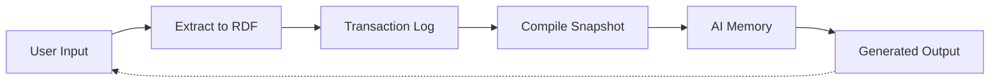
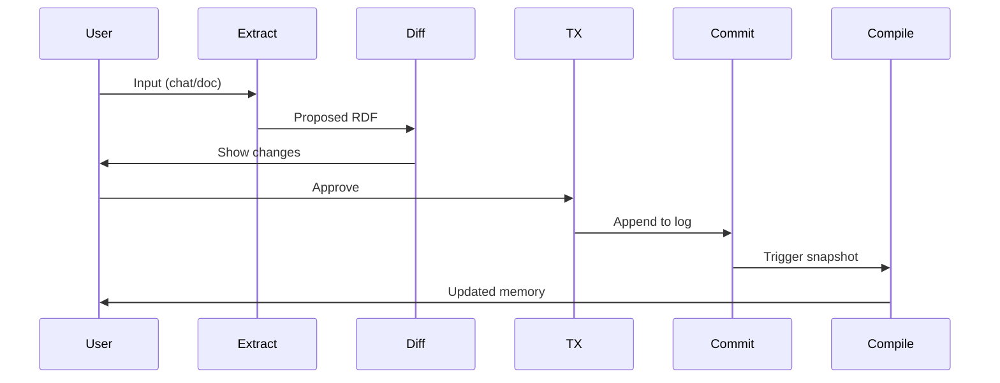
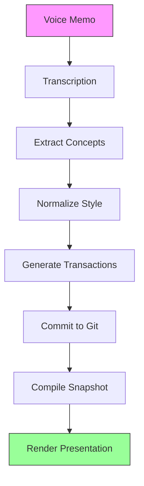
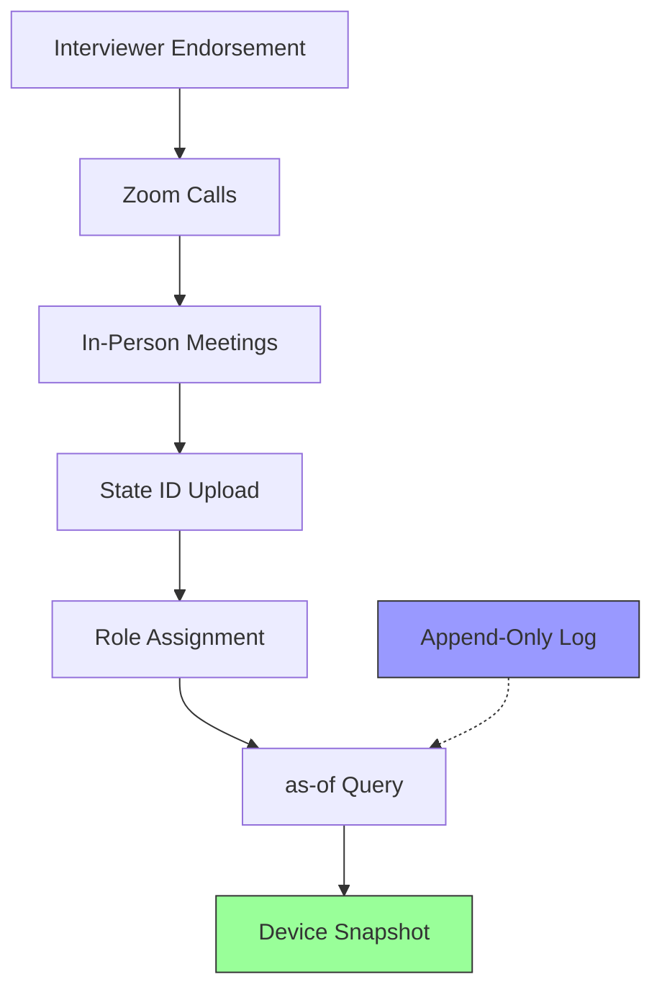
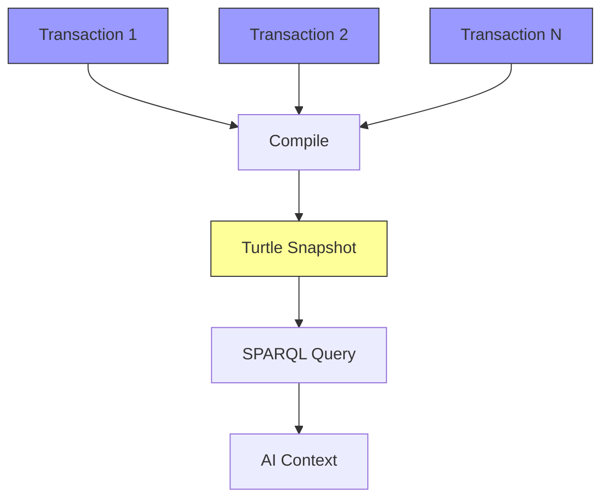
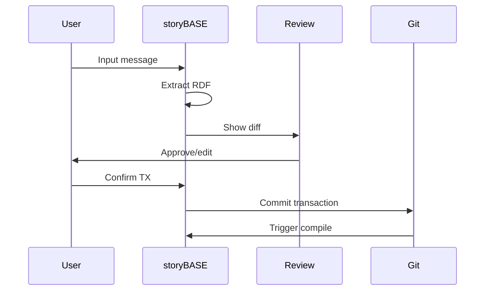
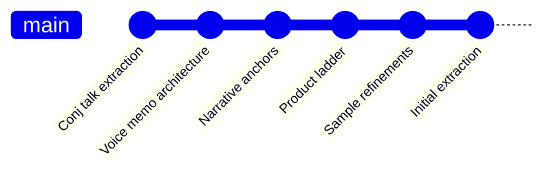

#### sic[#theme]
# 
## storyBASE
### Git-Native RDF Knowledge Graph for Narrative-Driven AI
# 
#### Scarlet Dame
###### Founder, as written.ai
	[#theme]: Custom presentation theme for storyBASE; brand stylization follows CamelCase with uppercase suffix pattern per narr:StyleObs_storyBASE, narr:BrandNameStylization.

---
# Identity is compiled
## Not mutated

This presentation demonstrates the storyBASE workflow by using it to tell its own story—a meta-narrative that proves the architecture through its creation process.[][#meta]

[#meta]: narr:Proof_1 "Meta-Demonstration: Talk Creation Process" shows the talk exemplifies reified change architecture and storyBASE workflow, with iterative refinement from raw inputs to polished outputs (narr:Tx_20251113T033534Z_claude45).

---
###### The Problem
# AI without memory
## is just autocomplete

Current AI systems lack narrative source of truth. Each chat creates different context, making organizational memory fragile and unreliable.[][#problem]

[#problem]: Market opportunity from storybase.synthetic-identity.co/opportunity/storybase-market: "High-quality AI output requires extensive context; current models use search, but RDF-based narrative source of truth enables specific, controllable, versionable AI memory."

---
### The insight
# Experience is an append-only log
## that compiles to identity

Human and AI identity should be modeled as immutable history, not mutable state.[][#narrative]

[#narrative]: narr:Narrative_ImmutableIdentity defines core thesis: "Identity—both human and AI—should be modeled as an append-only log that compiles to state, not mutable objects" (narr:Tx_20251113T030805Z_conj2025). Related to narr:Theme_ImmutableIdentity and narr:Theme_FunctionalIdentity.

---
## The Architecture

---
###### Single Source of Truth
# Append-only transaction log
## compiled to snapshots

storyBASE uses Git as the append-only log, with SPARQL transactions replayed to create Turtle snapshots at any point in time.[][#architecture]

[#architecture]: narr:Primitive_1 "Append-only transaction log" is the foundational atomic unit with immutability guarantee; narr:Primitive_2 "Single source of truth (SSoT)" represents compiled state from transaction history; narr:Flow_1 describes the end-to-end loop (narr:Tx_20251111T214920Z_immutable_selves).

---
### The pattern
# Reified change
## makes state explicit

Every change is a transaction. Every state is a pure function of history.[][#reified]

[#reified]: narr:Claim_ReifiedChangePattern states "Immutability and explicit state management enable provenance, equality, and offline capability" (narr:Tx_20251113T032552Z_sample1). Supported by narr:SystemProperty_ImmutabilityProvenance and narr:SystemProperty_DistributedDecentralization.

---
## Two Systems, One Pattern

---
###### System: Human
# berecognized.id
###### Immutable Identification

Digital identification compiled from append-only log of facts about a person over time—employment, access, roles, interactions.[][#berecognized]

[#berecognized]: narr:CaseStudy_BeRecognizedID describes human identity via reified change: "Append-only log of facts about a person over time; device-rendered snapshot compiled at specific point in time" delivers "Provenance for individual transactions; referential equality for free; offline transactions enabled" (narr:Tx_20251113T032552Z_sample1).

---
###### System: AI
# aswritten.ai
###### Immutable AI Memory

AI memory as 'as-of T' snapshot—a pure function of narrative events extracted from chats and documents.[][#aswritten]

[#aswritten]: narr:CaseStudy_AsWrittenAI describes AI memory via reified change: "Transaction sequence: person talks to AI → extract chats/docs to RDF → save to append-only log → AI memory as 'as-of T' snapshot (pure function)" (narr:Tx_20251113T032552Z_sample1). Related to narr:SolutionArchetype_AsWritten and narr:Tagline_AsWritten "AI that tells your story, as written."

---
### The workflow
# From voice memo to presentation

This talk was created using storyBASE—demonstrating the workflow by building its own narrative source of truth.[][#workflow]

[#workflow]: narr:Flow_1 "Content Production Workflow" describes "User inputs → initial storyBASE → normalization/iteration → polished outputs with embedded provenance" (narr:Tx_20251113T033534Z_claude45). Related to narr:Behavior_1 "Normalize Transcription Against storyBASE."

---
## The Product

---
###### What is it?
# Git-native RDF knowledge graph
## for narrative-driven AI

RDF narrative source of truth (storyBASE) that steers AI output, making it specific, controllable, aligned with organizational worldview.[][#product]

[#product]: storybase.synthetic-identity.co/product/what-is-storybase describes storyBASE as "RDF narrative source of truth that steers AI output, making it specific, controllable, aligned with organizational worldview" (storybase.synthetic-identity.co/transaction/2025-01-29T000000Z_sic-storybase-checkin).

---
### Core capabilities
# 
#### Extract
## RDF from any input
# 
#### Diff
## Semantic comparison
# 
#### TX
## Propose transactions
# 
#### Commit
## Append-only to Git
# 
#### Compile
## Replay to snapshot

Each tool is a primitive that composes into workflows.[][#capabilities]

[#capabilities]: storybase.synthetic-identity.co/module/storybase-capabilities lists "Compile (replay transactions to Turtle snapshot), extract (RDF from input), diff (semantic comparison), tx (propose transaction), commit (append-only to Git), story generation (YAML front matter + prompt to model outputs)."

---
### The stack
# 
	- **n8n**: Agent orchestration
	- **MCP Server**: Tool exposure to frontends
	- **GitHub**: Version control & webhooks
	- **Open WebUI**: Chat interface at as written.ai
	- **Docker Compose**: Deployment on Digital Ocean
	- **Apache Jena/Riot**: Future RDF operations

Distributed architecture with hierarchical compile from .storybase directories.[][#stack]

[#stack]: storybase.synthetic-identity.co/architecture/topology-storybase describes "n8n agent orchestrates tools; MCP server exposes to frontends (Agent.ai, ChatGPT, Open WebUI); transactions in .storybase directories; hierarchical compile; Docker Compose on Digital Ocean."

---
## The Value

---
###### For developers
# Version control for strategy
## Branch, merge, and diff your narrative

Extend software development rigor—versioning, branching, collaboration—into strategy, content, marketing, and organizational operations.[][#positioning]

[#positioning]: storybase.synthetic-identity.co/thesis/positioning-storybase states "Extend software development rigor (versioning, branching, collaboration) into strategy, content, marketing, organizational operations via RDF narrative source of truth."

---
###### For organizations
# Deterministic AI perspective
## Query your narrative 'as-of T'

Examples: full talk as query, section of talk, talk evolution over time, any accessible graph subset.[][#deterministic]

[#deterministic]: narr:FutureVision_DeterministicAI describes "Deterministic AI perspective 'as-of T' for graph queries" with examples including "full talk as query, section of talk, talk evolution over time, any accessible graph subset within billion-node graph" (narr:Tx_20251113T032552Z_sample1).

---
### The moat
# Style, conviction, and provenance
## encoded in the graph

Git-native, versionable, branchable AI memory encoding style, conviction, narrative metrics—replaces brittle role prompts with deep, operable persona descriptions.[][#moat]

[#moat]: storybase.synthetic-identity.co/leverage/moat-storybase describes "Git-native, versionable, branchable AI memory encoding style, conviction, narrative metrics; replaces brittle role prompts with deep, operable persona descriptions."

---
## The Proof

---
###### This presentation
# is a query
## against its own storyBASE

Every slide is rendered from the compiled snapshot of transactions that created it—demonstrating provenance, equality, and deterministic output.[][#proof]

[#proof]: narr:Proof_1 "Meta-Demonstration: Talk Creation Process" states "The talk itself exemplifies the reified change architecture and storyBASE workflow, showing iterative refinement from raw inputs to polished outputs" (narr:Tx_20251113T033534Z_claude45). Related to narr:CaseStudies and narr:Outcomes.

---
### The evidence
# 
	- **6 transactions** compiled into this snapshot
	- **Multiple samples** from voice memos, transcripts, and refinements
	- **Style observations** tracking brand, cadence, and terminology
	- **Rubric assessments** measuring alignment, resonance, and accuracy
	- **Provenance** for every claim back to source

All visible in the RDF graph.[][#evidence]

[#evidence]: Snapshot contains 1,613 inserted triples across 6 transactions (narr:Tx_20251109T223928Z_conj2025 through narr:Tx_20251113T033534Z_claude45), with style observations (narr:StyleObs_1 through narr:StyleObs_10), rubric assessments (narr:RubricAssess_1 through narr:RubricAssess_9), and metrics (narr:Metrics_1, narr:Metrics_ConjPresentation, narr:Metrics_Sample_1).

---
### Case study
# Employee lifecycle
## with continuous identity

Mitigates ghost labor risk—bad actors deepfaking candidates, passing interviews, collecting paychecks on behalf of fake identities.[][#lifecycle]

[#lifecycle]: narr:Flow_EmployeeLifecycle describes "Endorsement by interviewer → Zoom calls → in-person meetings → state ID uploads → assigned role with privileges → 'as-of' query compiles snapshot (digital identification) on device" (narr:Tx_20251113T032552Z_sample1). Addresses narr:Risk_GhostLabor "Ghost Labor & Impersonation Risk."

---
## The Roadmap

---
### Next
# 
	1. **Named graphs** (TriG) for add/remove operations
	2. **SHACL validation** for transaction integrity
	3. **File ingestion** via GitHub webhooks
	4. **storyBASE marketplace** for shared narratives
	5. **Cost pass-through billing** aligned to usage

Each milestone unlocks new narratives and proof points.[][#roadmap]

[#roadmap]: storybase.synthetic-identity.co/roadmap/narrative-storybase describes "Move transactions from SPARQL to named graphs (TriG); add SHACL validation; implement evolved individuation pipeline (snapshot + message to transaction); file ingestion via GitHub; storyBASE marketplace; cost pass-through billing."

---
### The timing
# 2024–2026 window
## Prompt engineering maturity meets organizational AI memory demand

Convergence of multi-agent workflows and demand for organizational AI memory creates opening for narrative-driven context management.[][#timing]

[#timing]: storybase.synthetic-identity.co/thesis/timing-storybase states "Convergence of prompt engineering maturity, multi-agent workflows, and demand for organizational AI memory creates window for narrative-driven context management" with timestamp window "2024-2026."

---
## The Principles

---
###### Clojure Design Patterns
# 
## Simple tools + good principles
# = design patterns

No frameworks. Just primitives that compose.[][#principles]

[#principles]: narr:StyleObs_StockPhrase_1 captures Clojure community idiom "No frameworks\nSimple tools ± good principles" signaling insider knowledge and shared values (narr:Tx_20251113T030805Z_conj2025). Related to narr:IdiolectPhrasing.

---
### Make state explicit
# 
#### Append-only log
## Single source of truth
# 
#### Everyone sees the same thing
## Render as pure function
# 
#### Deterministic UIs
## Deterministic AI

The same pattern applies to identity, content, and memory.[][#pattern]

[#pattern]: narr:StyleObs_Anaphora_1 notes repeated structural frame "principle → pattern" creating rhythm and memorability (narr:Tx_20251113T030805Z_conj2025). Related to narr:CadenceRhythm and narr:Narrative_ImmutableIdentity.

---
## The Architecture

---
### Data model
# Immutable files
## Snapshot = replay

Append-only transaction log; immutable files; snapshot equals replay of sorted transactions; provenance in every TX step.[][#datamodel]

[#datamodel]: storybase.synthetic-identity.co/model/data-lifecycle-storybase describes "Append-only transaction log; immutable files; snapshot = replay of sorted transactions; provenance in TX step; future named graphs for add/remove."

---
### Integration points
# 
	- **GitHub**: OAuth, webhooks, Actions
	- **Open Router**: API proxy via Helicone
	- **Outseta**: OIDC, billing
	- **MCP protocol**: Tool exposure
	- **Future**: GitHub Apps with scoped credentials

Every integration preserves the append-only guarantee.[][#integrations]

[#integrations]: storybase.synthetic-identity.co/integration/points-storybase lists "GitHub (OAuth, webhooks, Actions); Open Router (API proxy via Helicone); Outseta (OIDC, billing); MCP protocol (tool exposure); future GitHub Apps with scoped credentials."

---
## The Style

---
###### Brand voice
# Technical but accessible
## Active voice, short sentences

Average sentence length: 12–22 words. Active voice ratio: 0.75–0.85. Controlled jargon density: 0.12–0.18.[][#style]

[#style]: Style metrics across samples show consistent patterns: narr:Metrics_ConjPresentation (12.3 avg sentence length, 0.82 active voice), narr:Metrics_1 (22.3 avg, 0.78 active), narr:Metrics_Sample_1 (22.3 avg, 0.78 active) (multiple transactions). Related to narr:ShortPunchyCadence and narr:VoiceActive.

---
### Terminology control
# Canonical phrases
## that anchor the narrative

	- "append-only log"
	- "as-of T snapshots"
	- "single source of truth"
	- "pure function"
	- "digital twin"

Precise technical phrasing creates shared mental models.[][#terminology]

[#terminology]: narr:KeyPhrase_1 through narr:KeyPhrase_4 define canonical terms (narr:Tx_20251111T214920Z_immutable_selves). narr:StyleObs_1 and narr:StyleObs_2 note "Domain-specific term; canonical phrasing for immutable history" and "Temporal query idiom; precise technical phrasing" (narr:Tx_20251113T033534Z_claude45).

---
### Rhetorical devices
# Questions, analogies, metaphors
## that make ideas stick

	- **Metaphor**: "Identity is not mutable state / Yet we're treating it like Backbone.js"
	- **Analogy**: "Experience → log → compiled identity"
	- **Rhetorical question**: "Where is the identity here? Who is the authority?"

Resonance through concrete examples and familiar patterns.[][#rhetoric]

[#rhetoric]: narr:StyleObs_Metaphor_1 captures "Technical metaphor: identity as mutable state vs. immutable log; Backbone.js as anti-pattern" (narr:Tx_20251113T030805Z_conj2025). narr:StyleObs_Analogy_1 notes "Core analogy: experience → log → compiled identity; maps human to Datomic model." narr:StyleObs_RhetoricalQuestion_1 shows "Triadic rhetorical questions; frames problem space and invites audience reasoning."

---
## The Rubric

---
### Nine dimensions
# 
	1. **Register**: Conversational yet authoritative
	2. **Phrasing**: Domain vocabulary and idiolect
	3. **Cadence**: Short, punchy, rhythmic
	4. **Strategic Alignment**: Ties to mission/vision
	5. **Tailoring**: Audience-specific depth
	6. **Resonance**: Stories and analogies
	7. **Flow**: Natural progression
	8. **Novelty**: Fresh framing
	9. **Accuracy**: Verifiable claims

Every artifact is assessed against these criteria.[][#rubric]

[#rubric]: Style Rubric (narr:Rubric_Register through narr:Rubric_Accuracy) defines evaluation criteria for narrative artifacts. Sample assessments show scores of 3.5–5.0 across dimensions (narr:RubricAssess_Register_Conj, narr:RubricAssess_Phrasing_Conj, etc.) with detailed rationales linked to style observations.

---
### Assessment example
# This presentation
## scores 4.0–5.0 across dimensions

	- **Strategic Alignment**: 5.0 (entire presentation is narrative anchor)
	- **Tailoring**: 5.0 (deeply tailored to Clojure/conj audience)
	- **Resonance**: 4.5 (strong analogies, personal story)
	- **Cadence**: 4.5 (short, punchy, triadic structures)
	- **Register**: 4.5 (conversational yet authoritative)

Rubric assessments are stored in the graph with provenance.[][#assessment]

[#assessment]: narr:RubricAssess_Strategy_Conj scores 5.0: "Entire presentation is a narrative anchor: 'Immutable Selves' thesis; two solution archetypes (berecognized.id, aswritten.ai); clear mission/vision alignment" (narr:Tx_20251113T030805Z_conj2025). Related assessments for Tailoring (5.0), Resonance (4.5), Cadence (4.5), Register (4.5) all cite specific style observations.

---
## The Conviction

---
###### Four levels
# Notion → Stake → Boulder → Foundation

Claims escalate through conviction levels as evidence accumulates and graph distance to narrative spine decreases.[][#conviction]

[#conviction]: Conviction ontology (narr:Conviction_Notion through narr:Conviction_Foundation) defines escalation path with xkos:next/previous relations. narr:Claim_ReifiedChangePattern has conviction level narr:Conviction_Stake; narr:SystemProperty_ImmutabilityProvenance has narr:Conviction_Boulder (narr:Tx_20251113T032552Z_sample1).

---
### Metrics that matter
# 
	- **Conviction score**: Aggregated weight
	- **Distance to narrative**: Graph path length
	- **Individuation count**: Unique observations
	- **Similarity score**: Cluster coherence
	- **Rolling mean**: Numeric consensus

Quantitative signals for governance and drift detection.[][#metrics]

[#metrics]: Conviction properties (narr:convictionScore, narr:distanceToNarrative, narr:individuationCount, narr:similarityScore, narr:rollingMean) enable measurement. Related to narr:StyleMetrics and narr:MetricsMonitoring.

---
## The Process

---
### Interactive individuation
# Extract → Diff → TX → Review → Commit

Human-in-the-loop for quality; automated for scale.[][#process]

[#process]: storybase.synthetic-identity.co/process/storybase describes "Interactive individuation (extract → diff → tx → review → commit) vs. automated ingestion (file upload → extraction → PR); story generation triggered by transaction or .story file changes."

---
### Automated ingestion
# File upload → Extraction → PR

Planned demo: Crooked Media podcast transcripts auto-ingested; stories auto-update; perspectival operations (e.g., start with NPR, evolve with OpenAI).[][#automation]

[#automation]: storybase.synthetic-identity.co/case/studies-storybase describes "Planned demo: Crooked Media podcast transcripts auto-ingested; stories auto-update; perspectival operations (e.g., start with NPR, evolve with OpenAI)."

---
## The Audience

---
###### Primary actors
# Programming-literate
## worldview manipulators

Entrepreneurs, designers, developers, consultants who see perspective changes and want version control for strategy.[][#actors]

[#actors]: storybase.synthetic-identity.co/actor/primary-storybase describes "Programming-literate entrepreneurs, designers, developers, consultants who manipulate worldview and see perspective changes" related to personas-jobs-to-be-done.

---
### What they get
# 
	- **Versionable narrative**: Branch and merge your story
	- **Collaborative memory**: Shared source of truth
	- **Deterministic AI**: Same input, same output
	- **Embedded provenance**: Every claim traceable
	- **Style governance**: Automated drift detection

Software development rigor for organizational narrative.[][#value]

[#value]: storybase.synthetic-identity.co/mission/storybase states "Extend software development rigor into strategy, content, marketing; provide versionable, collaborative, narrative-driven AI memory." Related to narr:Mission_1 and narr:Vision_1.

---
## The Transaction History

---
### Six transactions
# Building the narrative
## from voice to presentation

Each transaction adds concepts, claims, style observations, and assessments—compounding the narrative source of truth.[][#history]

[#history]: Transactions from narr:Tx_20251109T223928Z_conj2025 (earliest) through narr:Tx_20251113T033534Z_claude45 (latest) show progressive extraction and refinement. Each transaction includes prov:wasGeneratedBy, prov:wasAttributedTo, and prov:generatedAtTime with specific generated entities listed.

---
### Transaction anatomy
# Provenance by design

	- **Agent**: storyTWIN (anthropic/claude-sonnet-4.5)
	- **User**: pleasetrythisathome
	- **Timestamp**: ISO 8601 with milliseconds
	- **Origin**: Git path and ref
	- **Generated**: Explicit list of entities

Every triple knows its source.[][#provenance]

[#provenance]: Example from narr:Tx_20251113T033534Z_claude45: "prov:wasAssociatedWith <urn:agent:storyTWIN:anthropic/claude-sonnet-4.5>; prov:wasAttributedTo <urn:user:pleasetrythisathome>; prov:generatedAtTime '2025-11-13T03:35:34.567Z'; rdfs:comment 'Initial extraction from clojure-conj-2025 repo README and voice memo transcription'."

---
## The Future

---
###### Vision
# Narrative source of truth
## for every organization

A world where identity—human, synthetic, AI—is rendered from immutable history, enabling equality, provenance, and trust by design.[][#vision]

[#vision]: narr:Vision_1 states "A world where identity—human, synthetic, AI—is rendered from immutable history, enabling equality, provenance, and trust by design" (narr:Tx_20251111T214920Z_immutable_selves). Related to narr:Mission_1 and narr:Narrative_ImmutableIdentity.

---
### The unlock
# Immutability enables
## everything else for free

	- Equality
	- Provenance
	- Versioning
	- Branching
	- Generative testing
	- Decentralization
	- Infinite read scale

Small choice, outsized effects.[][#leverage]

[#leverage]: narr:LeverageProfile_1 states "Immutability enables equality, provenance, versioning, branching, generative testing, decentralization, and infinite read scale—for free" with note "Small choice (append-only) creates outsized effects across system" (narr:Tx_20251111T214920Z_immutable_selves).

---
## Try It

---
### Chat with this narrative
# 
	Open WebUI at **as written.ai**
	
	Ask about:
	- The full talk as a query
	- Evolution of concepts over time
	- Style observations and their context
	- Any accessible graph subset

The storyBASE that created this presentation is your source of truth.[][#try]

[#try]: narr:FutureVision_DeterministicAI suggests "Close with examples of such queries, then link to chat for participants to engage with narrative source of truth" (narr:Tx_20251113T032552Z_sample1). Related to storybase.synthetic-identity.co/product/overview-storybase "open WebUI at as written.ai."

---
### Explore the graph
# 
	**GitHub**: github.com/pleasetrythisathome/storybase
	
	See:
	- Transaction files (.sparql)
	- Compiled snapshot (.ttl)
	- Story definitions (.story)
	- Generated outputs

All version-controlled, all auditable, all yours to fork.[][#explore]

[#explore]: Repository structure from storybase.synthetic-identity.co/architecture/topology-storybase: "transactions in .storybase directories; hierarchical compile" with GitHub as primary integration point for "OAuth, webhooks, Actions."

---
# Questions?

---
## Now go compile your narrative

	**storyBASE**: Git-native RDF knowledge graph
	**as written.ai**: AI that tells your story, as written
	**berecognized.id**: Immutable identification
	
	All built on the same principle:
	Identity is compiled, not mutated.

[#tagline]: narr:Tagline_AsWritten "AI that tells your story, as written" is 7-word tagline encoding promise and brand (narr:Tx_20251113T030805Z_conj2025). Related to narr:SolutionArchetype_AsWritten and narr:SolutionArchetype_BeRecognized.