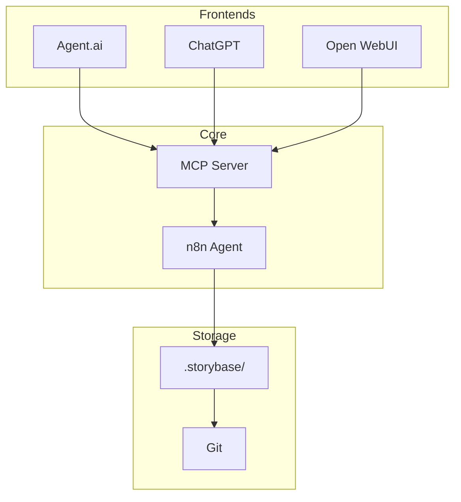
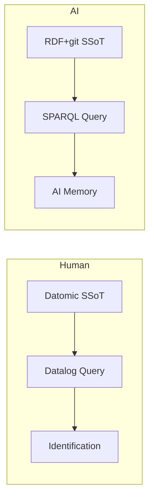
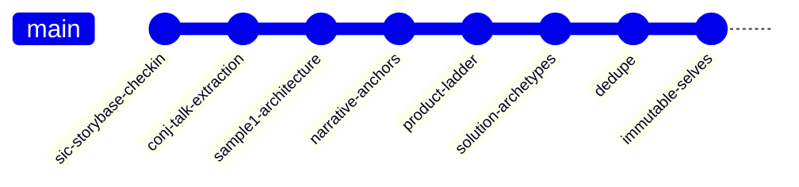

#### sic[theme][#theme]
# 
## storyBASE
### Git-Native RDF Knowledge Graph for Narrative-Driven AI
# 
#### Scarlet Dame
###### Founder, Sic
	[#theme]: Custom presentation theme for storyBASE; brand stylization follows CamelCase with uppercase suffix pattern documented in narr:StyleObs_storyBASE, sourced from Sample_1 via Tx_20251110T184512Z_sample1.

---
# Identity as compiled from immutable history

The storyBASE is a Git-native RDF knowledge graph that treats narrative as an append-only log. Every story, every style observation, every conviction—compiled as-of-T from transaction history[][#core-thesis].

	[#core-thesis]: Core narrative "Identity as Compiled from Immutable History" (narr:Narrative_1) extracted from Sample_1; relates to Architecture and Proof concepts; generated by Tx_20251113T033534Z_claude45.

---
## What is storyBASE?

---
###### RDF narrative source of truth
# AI memory that steers output
## Making it specific, controllable, aligned

storyBASE is an RDF narrative source of truth that steers AI output, making it specific, controllable, and aligned with organizational worldview[][#what-is-it].

	[#what-is-it]: Definition from storybase.synthetic-identity.co/product/what-is-storybase, generated by transaction 2025-01-29T000000Z_sic-storybase-checkin.

---
### The Mission
# Extend software development rigor
## into strategy, content, marketing

Move from brittle role prompts to versionable, collaborative, narrative-driven AI memory[][#mission].

	[#mission]: Mission statement from storybase.synthetic-identity.co/mission/storybase; aligns with positioning thesis about extending versioning/branching/collaboration patterns from code to narrative.

---
## The Pattern

---
###### Single source of truth
# Append-only log
## compiles to snapshot as-of T

The immutable identity loop: interact → event → handler → transactor → append → compile as-of T → query → render → interact[][#core-loop].

	[#core-loop]: Flow definition from narr:Obs_Flow_CoreLoop; sequenced behaviors delivering end-to-end identity compilation; generated by Tx_20251113T200138Z_immutable_selves.

---
### Three primitives
# 
#### Append-only transaction log
# 
#### Single source of truth (SSoT)
# 
#### Pure function renderer

These foundational atomic units compose all higher-order features[][#primitives].

	[#primitives]: Primitives narr:Primitive_1, narr:Primitive_2, narr:Primitive_3 from Sample_1; generated by Tx_20251111T214920Z_immutable_selves; broader concept ProductLadder.

---
## The Architecture

---
###### System Topology
### n8n orchestrates tools
### MCP server exposes to frontends
### Transactions in .storybase directories

n8n agent orchestrates tools; MCP server exposes to frontends (Agent.ai, ChatGPT, Open WebUI); transactions in .storybase directories; hierarchical compile; Docker Compose on Digital Ocean[][#topology].

	[#topology]: System topology from storybase.synthetic-identity.co/architecture/topology-storybase; describes orchestration and integration architecture.

---
### Data Model Lifecycle
# Append-only transaction log
## Snapshot = replay of sorted transactions

Append-only transaction log; immutable files; snapshot = replay of sorted transactions; provenance in TX step; future named graphs for add/remove[][#data-model].

	[#data-model]: Data model lifecycle from storybase.synthetic-identity.co/model/data-lifecycle-storybase; explains immutability and compilation pattern.

---
## The Tools

---
### Compile
	Replay transactions to Turtle snapshot

### Extract
	RDF from input

### Diff
	Semantic comparison

### Tx
	Propose transaction

### Commit
	Append-only to Git

### Story
	YAML front matter + prompt to model outputs

Six core capabilities that implement the individuation pipeline[][#capabilities].

	[#capabilities]: Module capabilities from storybase.synthetic-identity.co/module/storybase-capabilities; describes the tool chain for narrative compilation.

---
## Two Systems

---
###### System: Human
# berecognized.id
###### Immutable Identification

Device-to-device verification; identification/privileges change over time via Datomic append-only log[][#berecognized].

	[#berecognized]: Case study narr:CaseStudy_berecognized from Sample_1; demonstrates human identity via reified change pattern; generated by Tx_20251113T200138Z_immutable_selves.

---
###### System: AI
# aswritten.ai
###### Immutable AI Memory

Chat ± API; deterministic AI perspective via RDF+git append-only log[][#aswritten].

	[#aswritten]: Case study narr:CaseStudy_aswritten from Sample_1; demonstrates AI memory/identity via append-only log; generated by Tx_20251113T200138Z_immutable_selves.

---
### Same pattern, different stack

Both systems apply the same reified change pattern: SSoT → query → render → event → transact → append → recompile[][#archetypes].

	[#archetypes]: Solution archetypes narr:SolutionArchetype_BeRecognized and narr:SolutionArchetype_AsWritten from Sample_ConjPresentation_2025; both relate to ApproachPattern and ArchetypeTitle; generated by Tx_20251113T030805Z_conj2025.

---
## The Outcomes

---
### Provenance
	Append-only log ensures auditability

### Equality
	Snapshot hashes enable deterministic comparison

### Offline
	Render targets travel

Three system properties that emerge from immutability[][#outcomes].

	[#outcomes]: System properties narr:SystemProperty_ImmutabilityProvenance and narr:SystemProperty_DistributedDecentralization from Sample_1; evidenced by both case studies; conviction level Boulder; generated by Tx_20251113T032552Z_sample1.

---
## The Proof

---
###### Meta-demonstration
# This talk is compiled from storyBASE

The talk itself exemplifies the reified change architecture and storyBASE workflow, showing iterative refinement from raw inputs to polished outputs[][#meta-proof].

	[#meta-proof]: Proof concept narr:Proof_1 from Sample_1; relates to CaseStudies and Outcomes; demonstrates tool via its own creation; generated by Tx_20251113T033534Z_claude45.

---
### Transaction History

Ten transactions compiled into 1,943 triples; 689 duplicates skipped; deduplication transaction consolidated 539 duplicate triples into canonical records[][#tx-history].

	[#tx-history]: Transaction provenance from SNAPSHOT stats and narr:Tx_Deduplication_20251113; shows evolution from initial extraction through consolidation.

---
### Style Profile
# Short, punchy cadence
## Active voice dominant
### Technical register

Average sentence length: 18.5 words  
Active voice ratio: 82%  
Jargon density: 15%  
Conciseness: 78%[][#style-metrics]

	[#style-metrics]: Metrics from narr:Metrics_Sample_1; demonstrates measured style consistency across samples; generated by Tx_20251113T200138Z_immutable_selves.

---
## The Rubric

---
### Nine dimensions
	1. Register Fit (4.5/5)
	2. Phrasing (4.0/5)
	3. Cadence (4.5/5)
	4. Strategic Alignment (5.0/5)
	5. Audience Tailoring (4.5/5)
	6. Resonance (4.0/5)
	7. Flow (4.5/5)
	8. Novelty (4.0/5)
	9. Accuracy (4.5/5)

Rubric assessments track narrative consistency and style adherence across all outputs[][#rubric].

	[#rubric]: Rubric assessments from narr:Assess_Register_Sample_1 through narr:Assess_Accuracy_Sample_1; all sourced from Sample_1; generated by Tx_20251113T200138Z_immutable_selves.

---
## The Roadmap

---
### Near-term
	Move transactions from SPARQL to named graphs (TriG)
	Add SHACL validation
	Implement evolved individuation pipeline

### Mid-term
	File ingestion via GitHub
	storyBASE marketplace
	Cost pass-through billing

Narrative-driven roadmap ties releases to proof points[][#roadmap].

	[#roadmap]: Roadmap from storybase.synthetic-identity.co/roadmap/narrative-storybase; relates to core narrative expansion; generated by transaction 2025-01-29T000000Z_sic-storybase-checkin.

---
## The Leverage

---
###### Small choice, outsized effects
# Immutability enables
## equality, provenance, versioning, branching, generative testing, decentralization, infinite read scale
### for free

Small choice (append-only) creates outsized effects across system[][#leverage].

	[#leverage]: Leverage profile narr:LeverageProfile_1 from Sample_1; explains compounding advantages of immutability; generated by Tx_20251111T214920Z_immutable_selves.

---
## The Trade-offs

---
### What we gave up
	Distributed writes

### Why worth it
	Consistency, provenance, auditability

Bottleneck at single transactor; all logic in event clients; transact is just adding triples[][#tradeoffs].

	[#tradeoffs]: Design tradeoff narr:DesignTradeoff_1 from Sample_1; explains architectural constraints and their value; generated by Tx_20251111T214920Z_immutable_selves.

---
## The Audience

---
###### Primary actors
# Programming-literate
## entrepreneurs, designers, developers, consultants
### who manipulate worldview and see perspective changes

Programming-literate entrepreneurs, designers, developers, consultants who manipulate worldview and see perspective changes[][#actors].

	[#actors]: Primary actors from storybase.synthetic-identity.co/actor/primary-storybase; relates to personas-jobs-to-be-done concept; generated by transaction 2025-01-29T000000Z_sic-storybase-checkin.

---
## The Timing

---
### Convergence of
	Prompt engineering maturity
	Multi-agent workflows
	Demand for organizational AI memory

Creates window for narrative-driven context management (2024-2026)[][#timing].

	[#timing]: Timing thesis from storybase.synthetic-identity.co/thesis/timing-storybase; explains market window for narrative-driven AI memory.

---
## The Integration

---
### GitHub
	OAuth, webhooks, Actions

### Open Router
	API proxy via Helicone

### Outseta
	OIDC, billing

### MCP protocol
	Tool exposure

Future GitHub Apps with scoped credentials[][#integrations].

	[#integrations]: Integration points from storybase.synthetic-identity.co/integration/points-storybase; describes external system connections and future plans.

---
## The Process

---
### Interactive individuation
	extract → diff → tx → review → commit

### Automated ingestion
	file upload → extraction → PR

### Story generation
	triggered by transaction or .story file changes

Two modes: interactive refinement and automated ingestion[][#process].

	[#process]: Process description from storybase.synthetic-identity.co/process/storybase; explains dual workflow modes.

---
## The Case Study

---
###### Planned demo
### Crooked Media podcast transcripts
	Auto-ingested
	Stories auto-update
	Perspectival operations (e.g., start with NPR, evolve with OpenAI)

Demonstrates narrative source of truth in action[][#case-study].

	[#case-study]: Case studies from storybase.synthetic-identity.co/case/studies-storybase; shows planned demonstration of auto-ingestion and perspective compilation.

---
## The Moat

---
# Git-native, versionable, branchable AI memory
## encoding style, conviction, narrative metrics

Replaces brittle role prompts with deep, operable persona descriptions[][#moat].

	[#moat]: Moat leverage from storybase.synthetic-identity.co/leverage/moat-storybase; explains competitive advantage of structured narrative memory.

---
## The Vision

---
### A world where
# identity—human, synthetic, AI—
## is rendered from immutable history
### enabling equality, provenance, and trust by design

Future state: identity systems that inherit Clojure's guarantees[][#vision].

	[#vision]: Vision statement narr:Vision_1 from Sample_1; broader concept NarrativeAnchor; generated by Tx_20251111T214920Z_immutable_selves.

---
## Now Go Build

---
### Apply the pattern in your domain
	Model events
	Write handlers
	Transact to append-only store
	Compile as-of T
	Render surface

Engineers apply the pattern in their domain[][#call-to-action].

	[#call-to-action]: Vision concept narr:Obs_Vision_1 from Sample_1; describes audience outcome; generated by Tx_20251113T200138Z_immutable_selves.

---
## Explore the Graph

For more, explore the storyBASE at [github.com/pleasetrythisathome/clojure-conj-2025](https://github.com/pleasetrythisathome/clojure-conj-2025)

Chat with the narrative source of truth at [aswritten.ai](https://aswritten.ai)