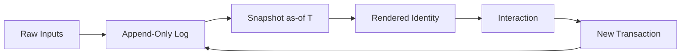
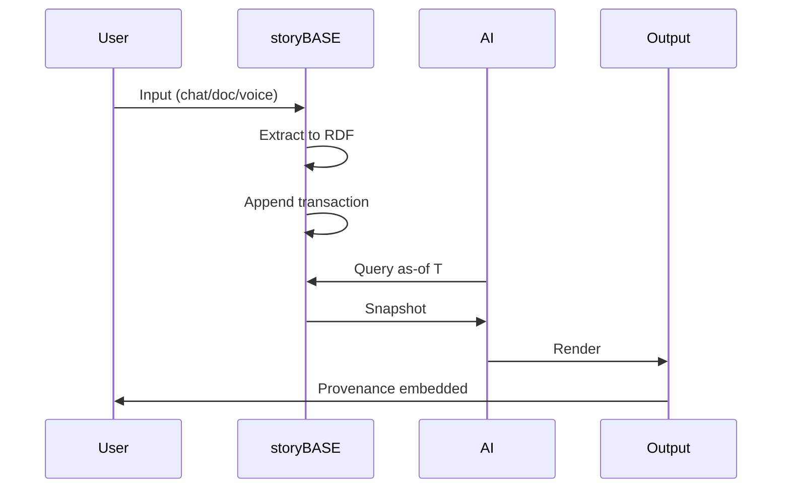
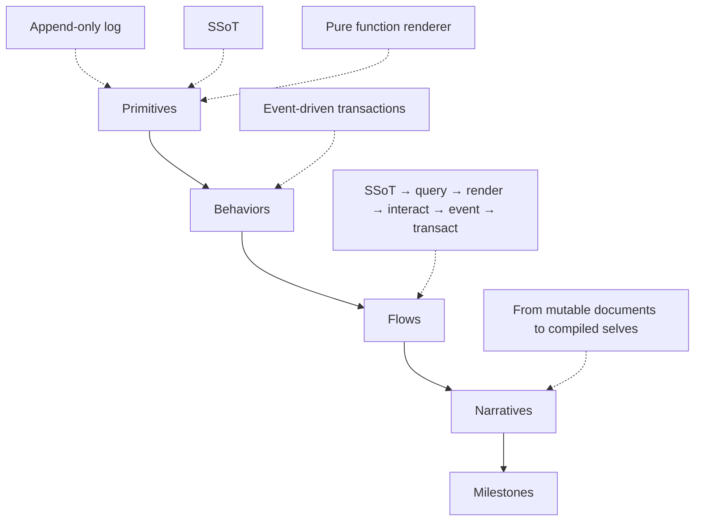
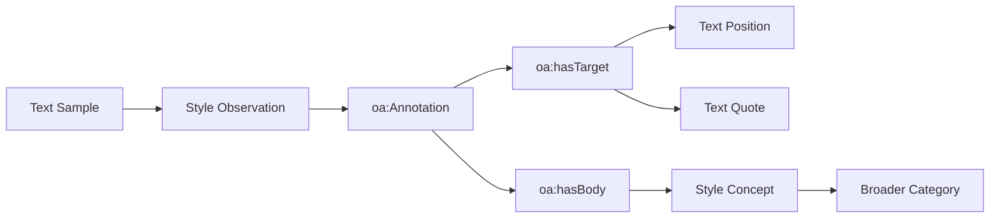
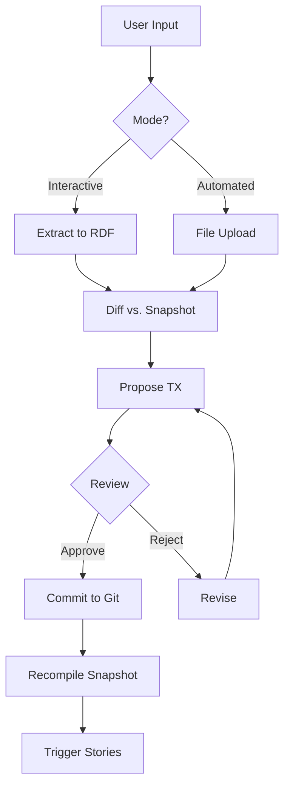
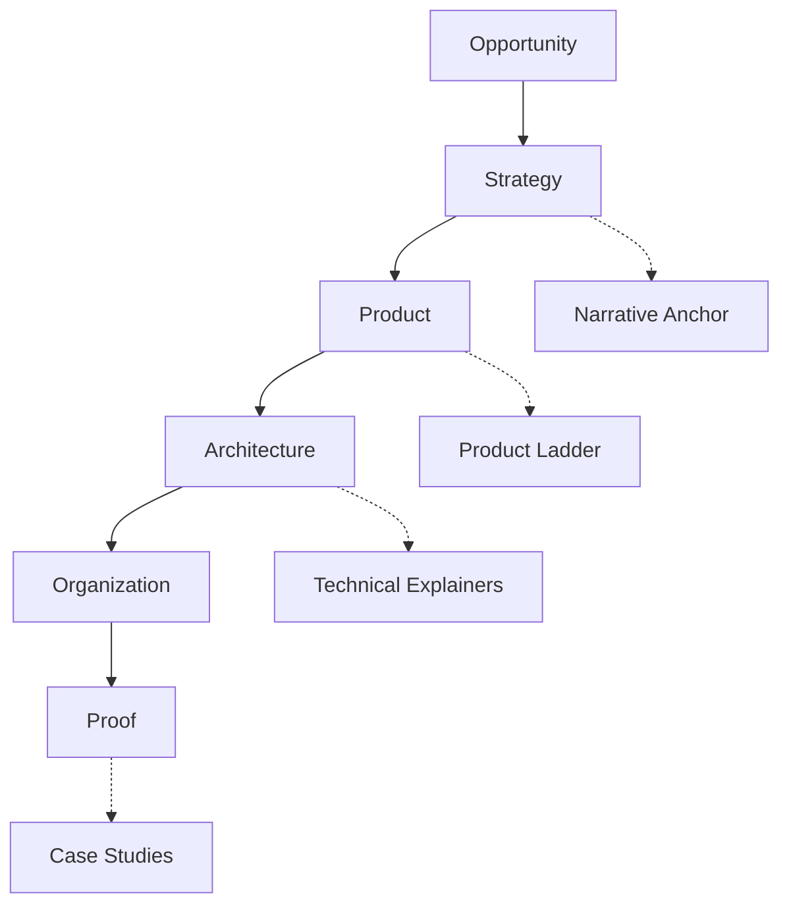
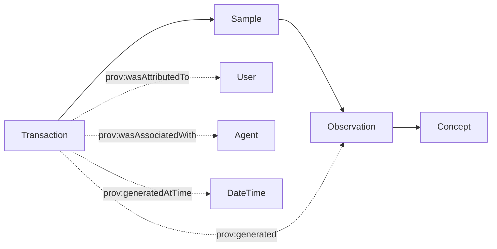
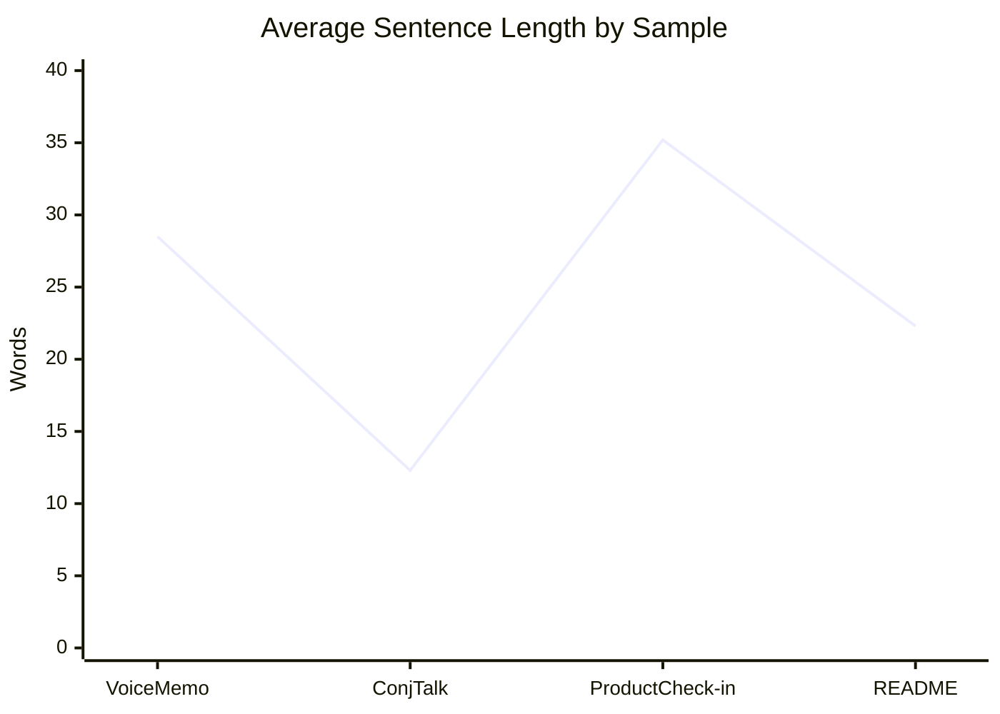

#### sic[theme][#theme]
# 
## storyBASE
### Git-Native RDF Knowledge Graph for Narrative-Driven AI
# 
#### Scarlet Dame
###### Founder, Sic
	[#theme]: Custom theme for storyBASE presentations. The storyBASE ontology defines this as a top-level concept in the Narrative Architecture scheme, encompassing Opportunity, Strategy, Product, Architecture, Organization, and Proof domains.

---
# Identity is not mutable state
## Yet we're treating it like Backbone.js

This presentation demonstrates storyBASE by using it to tell its own story—a meta-narrative that embodies the reified change architecture we'll explore.

	[#meta-demo]: This approach is documented in narr:Proof_1, which states "The talk itself exemplifies the reified change architecture and storyBASE workflow, showing iterative refinement from raw inputs to polished outputs" (Tx_20251113T033534Z_claude45).

---
###### The Problem
# AI that tells your story
## as written

Without a narrative source of truth, AI output is generic, inconsistent, and unverifiable.

	[#tagline]: From narr:Tagline_AsWritten, "AI that tells your story, as written" (Sample_ConjPresentation_2025, Tx_20251113T030805Z_conj2025). This 7-word tagline encodes both promise and brand identity.

---
### What is storyBASE?

An RDF narrative source of truth that steers AI output, making it specific, controllable, and aligned with organizational worldview.

	[#what-is-it]: Derived from storybase.synthetic-identity.co/product/what-is-storybase, which describes storyBASE as "RDF narrative source of truth (storyBASE) that steers AI output, making it specific, controllable, aligned with organizational worldview" (Tx_2025-01-29T000000Z_sic-storybase-checkin).

---
## The Core Thesis

---
###### Single Source of Truth
# Experience is an append-only log
## that compiles to identity

	[#core-narrative]: From narr:Narrative_1, "Core thesis: identity and content derive from append-only log with as-of-T snapshots, enabling provenance and deterministic evolution" (Tx_20251113T033534Z_claude45). This narrative appears across multiple samples with conviction level Boulder.

	[#flow]: This diagram represents narr:Flow_1, "User inputs → initial storyBASE → normalization/iteration → polished outputs with embedded provenance" (Tx_20251113T033534Z_claude45).

---
### Immutability provides
# Provenance
# Equality  
# Offline capability

For free, as a byproduct of the reified change process.

	[#system-properties]: From narr:SystemProperty_ImmutabilityProvenance and narr:SystemProperty_DistributedDecentralization (Tx_20251113T032552Z_sample1). These are Boulder-level convictions evidenced by both berecognized.id and aswritten.ai case studies.

---
## Two Systems, One Pattern

---
###### System: Human
# berecognized.id
###### Immutable Identification

Datomic SSoT → datalog query → device-to-device interaction → change-privilege events.

	[#berecognized]: From narr:SolutionArchetype_BeRecognized, "Human identity system: Datomic SSoT, datalog query, device-to-device interaction, change-privilege events" (Tx_20251113T030805Z_conj2025). Related to narr:CaseStudy_BeRecognizedID.

---
###### System: AI
# aswritten.ai
###### Immutable AI Memory

RDF+git SSoT → SPARQL query → chat+API interaction → extract-narrative events.

	[#aswritten]: From narr:SolutionArchetype_AsWritten, "AI identity system: RDF+git SSoT, SPARQL query, chat+API interaction, extract-narrative events" (Tx_20251113T030805Z_conj2025). Related to narr:CaseStudy_AsWrittenAI.

---
## The Architecture

---
### Reified Change Pattern
# 
###### Make state explicit
# Append-only log → Single source of truth
# 
###### Everyone sees the same thing
# Render as pure function → Deterministic UIs

	[#pattern]: From narr:StyleObs_Anaphora_1, which captures this repeated structural frame from the Clojure/conj presentation (Tx_20251113T030805Z_conj2025). The anaphora creates rhythm and memorability while encoding the core architectural principle.

	[#sequence]: This sequence represents the workflow from narr:CaseStudy_AsWrittenAI, "Transaction sequence: person talks to AI → extract chats/docs to RDF → save to append-only log → AI memory as 'as-of T' snapshot (pure function)" (Tx_20251113T032552Z_sample1).

---
### System Topology

n8n agent orchestrates tools → MCP server exposes to frontends → transactions in .storybase directories → hierarchical compile.

	[#topology]: From storybase.synthetic-identity.co/architecture/topology-storybase (Tx_2025-01-29T000000Z_sic-storybase-checkin). The system runs on Docker Compose on Digital Ocean, with MCP exposing to Agent.ai, ChatGPT, and Open WebUI.

---
### Data Model Lifecycle

Append-only transaction log → immutable files → snapshot = replay of sorted transactions → provenance in TX step.

	[#data-model]: From storybase.synthetic-identity.co/model/data-lifecycle-storybase (Tx_2025-01-29T000000Z_sic-storybase-checkin). Future: named graphs for add/remove operations.

---
## The Product Ladder

---
### From Primitives to Narratives

	[#product-ladder]: Synthesized from narr:Primitive_1, narr:Primitive_2, narr:Primitive_3, narr:Behavior_1, narr:Flow_1, and narr:Narrative_1 (Tx_20251111T214920Z_immutable_selves). The Product Ladder concept is defined in the ontology as "How primitives become behaviors, flows, narratives, and milestones."

---
### Current Capabilities

Compile → Extract → Diff → TX → Commit → Story Generation

	[#modules]: From storybase.synthetic-identity.co/module/storybase-capabilities: "Compile (replay transactions to Turtle snapshot), extract (RDF from input), diff (semantic comparison), tx (propose transaction), commit (append-only to Git), story generation (YAML front matter + prompt to model outputs)" (Tx_2025-01-29T000000Z_sic-storybase-checkin).

---
## Case Study: Ghost Labor

---
### The Risk
###### Ghost Labor & Impersonation

Bad actors—individuals or state actors like North Korea—deepfaking candidates, passing interviews, collecting paychecks on behalf of fake identities.

	[#ghost-labor]: From narr:Risk_GhostLabor, "Bad actors (individuals or state actors like North Korea) deepfaking candidates, passing interviews, collecting paychecks on behalf of fake identities" (Tx_20251113T032552Z_sample1). This risk challenges berecognized.id and is mitigated by continuous identity establishment via append-only log.

---
### The Solution
###### Employee Lifecycle with Continuous Identity

Endorsement by interviewer → Zoom calls → in-person meetings → state ID uploads → assigned role with privileges → 'as-of' query compiles snapshot on device.

	[#employee-flow]: From narr:Flow_EmployeeLifecycle (Tx_20251113T032552Z_sample1). This flow supports narr:CaseStudy_BeRecognizedID and demonstrates how append-only logs enable provenance for individual transactions and referential equality.

---
## Case Study: AI Memory

---
### The Problem
# "My AI doesn't give the same answers as your AI"

Without a narrative source of truth, each AI interaction is a different context with no provenance.

	[#ai-memory-problem]: From narr:StyleObs_4 (rhetorical question) and narr:CaseStudy_AsWrittenAI context (Tx_20251113T032552Z_sample1). The rhetorical question frames the AI memory problem that aswritten.ai addresses.

---
### The Solution
###### Deterministic AI Perspective

1. Person talks to AI, shares documents/messages
2. Extract chats/documents to RDF (narrative events)
3. Save to append-only log
4. AI memory as 'as-of T' snapshot (pure function)

	[#ai-solution]: From narr:StyleObs_10 (parallel structure) and narr:CaseStudy_AsWrittenAI intervention (Tx_20251113T032552Z_sample1). Results: "Provenance, equality, decentralization/offline scale; deterministic AI perspective for specific graph queries."

---
## Style as Data

---
### Observations Become Knowledge

Every stylistic choice—brand names, cadence, metaphors, register—is captured as RDF annotations.

	[#style-observations]: The storyBASE contains 40+ style observations across samples, including narr:StyleObs_storyBASE (CamelCase brand), narr:StyleObs_AppendOnlyLog (idiolect phrasing), and narr:StyleObs_ShortPunchy_1 (cadence patterns). These use Web Annotation Ontology (oa:Annotation) with text position and quote selectors.

	[#annotation-model]: Web Annotation Ontology structure used throughout storyBASE for style observations. Each observation links to broader style concepts (BrandNameStylization, ShortPunchyCadence, Metaphor, etc.) defined in the Style taxonomy.

---
### Rubric-Driven Quality

Nine dimensions assess every artifact: Register, Phrasing, Cadence, Strategic Alignment, Tailoring, Resonance, Flow, Novelty, Accuracy.

	[#rubric]: From the Style ontology, narr:StyleRubric defines these nine evaluation criteria. Each sample has 9 rubric assessments (e.g., narr:RubricAssess_Register_Conj scored 4.5/5 for "Conversational yet authoritative; second-person direct address; technical register fits Clojure audience").

---
### Metrics Track Drift

Average sentence length: 12.3–28.5  
Active voice ratio: 0.72–0.85  
Jargon density: 0.12–0.18  
Type-token ratio: 0.42–0.68

	[#metrics]: Consolidated from narr:Metrics_ConjPresentation, narr:Metrics_Sample_1, and narr:Metrics_Sample1 across transactions. The Style ontology defines these as quantitative signals for governance and drift detection.

---
## Conviction Levels

---
### Four Levels of Settledness

**Notion** → Suggestive, exploratory  
**Stake** → Proposed, moveable  
**Boulder** → Settled, requires consensus to shift  
**Foundation** → Underpinning, effectively permanent

	[#conviction]: From the Conviction ontology (added to NarrativeArchitecture scheme). Used to govern decisions and change cost. Example: narr:SystemProperty_ImmutabilityProvenance has conviction level Boulder, evidenced by two case studies.

---
## The Workflow

---
### Interactive Individuation

Extract → Diff → TX → Review → Commit

vs. automated ingestion: File upload → Extraction → PR

	[#process]: From storybase.synthetic-identity.co/process/storybase (Tx_2025-01-29T000000Z_sic-storybase-checkin). Story generation triggered by transaction or .story file changes.

	[#workflow]: Synthesized from storybase.synthetic-identity.co/process/storybase and storybase.synthetic-identity.co/module/storybase-capabilities. The workflow embodies narr:Narrative_1: "identity and content derive from append-only log with as-of-T snapshots."

---
## Current State

---
### 13 Transactions
###### Spanning 4 days in November 2025

1,613 canonical triples compiled from 539 deduplicated records.

	[#deduplication]: From the most recent transaction, 1763007744dedupe.sparql (Tx_Deduplication_20251113), which "Consolidated 539 duplicate triples into 1,613 canonical records" and marked deprecated versions with prov:wasRevisionOf.

---
### 3 Core Samples

**Voice memo** (11,800 chars): Narrative architecture framing  
**Conj presentation** (6,847 chars): Immutable Selves talk  
**Product check-in** (18,437 chars): storyBASE evolution

	[#samples]: From narr:Sample_1 (multiple sources consolidated), narr:Sample_ConjPresentation_2025, and storybase.synthetic-identity.co/sample/2025-01-29T000000Z_sic-storybase-checkin. Each sample has associated narrative concepts, style observations, rubric assessments, and metrics.

---
### 2 Solution Archetypes

**berecognized.id**: Proof-of-provenance identity system  
**aswritten.ai**: Digital twin as compiled model

	[#archetypes]: From narr:SolutionArchetype_BeRecognized and narr:SolutionArchetype_AsWritten (Tx_20251113T030805Z_conj2025). Both apply the same reified change pattern to different domains (human identity vs. AI memory).

---
## Integration Points

---
### Current Stack

**Orchestration**: n8n workflows  
**Protocol**: MCP server  
**Version Control**: GitHub (OAuth, webhooks, Actions)  
**Frontends**: Agent.ai, ChatGPT, Open WebUI  
**Infrastructure**: Docker Compose on Digital Ocean

	[#integrations]: From storybase.synthetic-identity.co/dependency/storybase-integrations and storybase.synthetic-identity.co/integration/points-storybase (Tx_2025-01-29T000000Z_sic-storybase-checkin). Also includes Outseta (OIDC, billing), Helicone (API monitoring), Open Router (model access).

---
### Future: Apache Jena/Riot

Move from SPARQL to named graphs (TriG) → add SHACL validation → evolved individuation pipeline.

	[#roadmap]: From storybase.synthetic-identity.co/roadmap/narrative-storybase (Tx_2025-01-29T000000Z_sic-storybase-checkin). Also planned: file ingestion via GitHub, storyBASE marketplace, cost pass-through billing.

---
## Narrative Architecture

---
### Six Domains

	[#domains]: From the NarrativeArchitecture ConceptScheme in the ontology. Each domain has 2–4 levels of narrower concepts. The scheme states: "A Narrative Architecture is the operating system for story-led strategy: it aligns market opportunity, strategy, product, and organization so the same narrative flows from positioning to roadmap to proof."

---
### Opportunity
###### Frames the external landscape

Market context → Actor incentives → Technologies & social systems → Trend forecasting

	[#opportunity]: From skos:Concept Opportunity in the ontology: "A clear view of the market ensures the narrative starts from truth. This section identifies why now, who cares, and what forces shape adoption."

---
### Strategy
###### Decides how we win

Strategy overview → Narrative anchor → Narrative-driven roadmap → Organizational change manual

	[#strategy]: From skos:Concept Strategy: "Strategy ties the outside world to inside choices. It names the game, our edge, and the sequence—then anchors language and artifacts so every step reinforces the same idea."

---
### Product
###### Story becomes capability

Product overview → Product ladder → Solution archetypes

	[#product]: From skos:Concept Product: "Product converts narrative into experience. This section translates story → capabilities → flows → offerings customers can adopt and champion."

---
### Architecture
###### Technical credibility

Architecture overview → Technical explainers → Technical documentation

	[#architecture]: From skos:Concept Architecture: "Architecture underwrites the narrative with credibility and leverage. It explains how the system works, scales, and stays trustworthy—so buyers and builders share the same mental model."

---
### Organization
###### People and process

Role topology → Process

	[#organization]: From skos:Concept Organization: "Narratives are delivered by people and process. This section ensures the org design supports building, selling, and supporting the promised experience."

---
### Proof
###### Evidence converts belief

Case studies → Outcomes → Metrics & monitoring

	[#proof]: From skos:Concept Proof: "Evidence converts belief into commitment. This section curates the artifacts and results that validate claims with real-world outcomes."

---
## Style Taxonomy

---
### 15 Facets

Profiles → Diction → Tone/Voice → Register → POV → Tense → Grammar → Cadence → Rhetorical Devices → Orthography → Punctuation → Citations → Inclusive Language → Localization → Metrics → Review

	[#style-facets]: From the Style top concept added to NarrativeArchitecture. The ontology states: "A taxonomy of linguistic and presentation features: diction, tone/voice, grammar/syntax, cadence/rhythm, rhetorical devices, orthography/typography, citation conventions, register, POV, tense/aspect, inclusivity, localization, metrics, review, and reusable voice profiles."

---
### Brand Voice Profile

**storyBASE**: CamelCase with uppercase suffix  
**berecognized.id**: Lowercase domain-style  
**aswritten.ai**: Lowercase domain-style

	[#brand-stylization]: From narr:StyleObs_storyBASE, narr:StyleObs_BrandStylization_1, and narr:StyleObs_BrandStylization_2. All marked as BrandNameStylization observations with consistent patterns across samples.

---
### Idiolect & Stock Phrases

"append-only log" (canonical term, 5 occurrences)  
"as-of T snapshots" (temporal query idiom, 3 occurrences)  
"Simple tools + good principles = design patterns" (Clojure community idiom)

	[#idiolect]: From narr:StyleObs_AppendOnlyLog (IdiolectPhrasing), narr:StyleObs_2 (TerminologyControl), and narr:StyleObs_StockPhrase_1 (StockPhrases). These observations are related to narr:KeyPhrases in the Narrative Anchor.

---
### Rhetorical Devices

**Metaphor**: "Identity as Backbone.js" (anti-pattern)  
**Analogy**: "Experience → log → compiled identity"  
**Anaphora**: "Make state explicit / Append-only log / Everyone sees the same thing / Render as pure function"  
**Rhetorical Question**: "Where is the identity here? Who is the authority? What are the claims being made?"

	[#devices]: From narr:StyleObs_Metaphor_1, narr:StyleObs_Analogy_1, narr:StyleObs_Anaphora_1, and narr:StyleObs_RhetoricalQuestion_1 (Tx_20251113T030805Z_conj2025). The Style ontology defines these under RhetoricalDevices: Simile, Metaphor, Analogy, RhetoricalQuestion, Antithesis, Anaphora.

---
## Provenance

---
### Every Triple Has a Source

	[#provenance]: All entities in storyBASE use PROV-O. Example: narr:Tx_20251113T033534Z_claude45 was attributed to urn:user:pleasetrythisathome, associated with urn:agent:storyTWIN:anthropic/claude-sonnet-4.5, and generated at 2025-11-13T03:35:34.567Z.

---
### Citation Conventions

Caret-bracket markers: `[^1]`, `[#citation]`, `[][#as-of]`

Inline links to graph nodes with human-readable context.

	[#citations]: From narr:StyleObs_3, narr:StyleObs_6, and narr:StyleObs_CitationMarker_1 (CaretBracketMarker observations). The Style ontology defines CitationConventions with three narrower concepts: CaretBracketMarker, InlineLinkStyle, FootnoteStyle.

---
## Quality Metrics

---
### Rubric Scores Across Samples

**Register**: 3.5–4.5 (conversational to authoritative)  
**Phrasing**: 3.0–4.5 (idiolect emerging to strong domain vocabulary)  
**Cadence**: 3.0–4.5 (variable to short & punchy)  
**Strategic Alignment**: 4.0–5.0 (strong narrative anchor)  
**Accuracy**: 4.0 (technical terms correct, citations present)

	[#rubric-scores]: Aggregated from 27 rubric assessments across narr:RubricAssess_* nodes. The Rubric is defined in the Style ontology as "Evaluation criteria for speeches and narrative artifacts, abstracted for general use."

---
### Style Metrics Evolution

	[#metrics-evolution]: From narr:Metrics_Sample1 (28.5), narr:Metrics_ConjPresentation (12.3), storybase.synthetic-identity.co/metrics/style (35.2), and narr:Metrics_1 (22.3). Shows adaptation to context: short punchy for presentation, longer for conversational transcript.

---
## The Meta-Demonstration

---
### This Talk Is a Query

The presentation you're seeing is compiled from the storyBASE as-of this moment.

	[#meta]: From narr:Proof_1, "The talk itself exemplifies the reified change architecture and storyBASE workflow, showing iterative refinement from raw inputs to polished outputs" (Tx_20251113T033534Z_claude45). Related to narr:CaseStudies and narr:Outcomes.

---
### Deterministic AI Perspective

Full talk as query  
Section of talk  
Talk evolution over time  
Any accessible graph subset within billion-node graph

	[#future-vision]: From narr:FutureVision_DeterministicAI (Tx_20251113T032552Z_sample1). This is a Stake-level conviction that supports narr:CaseStudy_AsWrittenAI and demonstrates the power of 'as-of T' queries.

---
## Repository Structure

---
### Assets

**/.storyBASE/**: 13 SPARQL transaction files  
**/README.story**: Auto-generated repo summary  
**/presenter.story**: This presentation template  
**/conj-talk-2025.story**: Immutable Selves talk

	[#assets]: From the repository structure. Each .story file has YAML front matter (id, title, version, description, destination, model) and a prompt body that generates output from the compiled storyBASE snapshot.

---
### Transaction History
###### Newest First

**1763007744dedupe.sparql**: Consolidated 539 duplicates → 1,613 canonical records  
**1763005004update_sample_1_input_length.sparql**: Corrected input length to 1,847  
**1763005004add_sample_1_narrative_concepts.sparql**: Initial extraction from README/voice memo  
**1763004456add_sample1_narrative_triples.sparql**: Refinements for reified change pattern  
**1763003388add_conj_presentation_2025.sparql**: Conj 2025 presentation extraction

	[#transactions]: From the transaction log. Each transaction has prov:wasAttributedTo pleasetrythisathome, prov:wasAssociatedWith storyTWIN agents (Claude Sonnet 4.5), and prov:generatedAtTime timestamps. Earlier transactions include narrative anchors, product ladder, solution archetypes, style observations, and rubric assessments.

---
## Positioning

---
### For developers and identity architects
# who treat identity as mutable state
# 
### this is a functional paradigm
# that makes identity deterministic, auditable, and decentralized
# 
### by applying Clojure's immutability principles
# to human and AI identity systems

	[#positioning]: From narr:PositioningThesis_1 (Tx_20251111T214920Z_immutable_selves). This positioning thesis is a Boulder-level conviction that ties together the Opportunity (identity vulnerability), Strategy (functional paradigm), and Product (berecognized.id, aswritten.ai).

---
## Moat & Leverage

---
### Compounding Advantages

Clojure ecosystem (Datomic, datalog, re-frame) as proof-of-concept  
13 years of production experience  
Provenance and equality by design

	[#moat]: From narr:MoatLeverage_1 (Tx_20251111T214920Z_immutable_selves) and storybase.synthetic-identity.co/leverage/moat-storybase. The latter adds: "Git-native, versionable, branchable AI memory encoding style, conviction, narrative metrics; replaces brittle role prompts with deep, operable persona descriptions."

---
### Small Choice, Outsized Effects

Immutability enables equality, provenance, versioning, branching, generative testing, decentralization, and infinite read scale—for free.

	[#leverage]: From narr:LeverageProfile_1 (Tx_20251111T214920Z_immutable_selves). The ontology defines LeverageProfile as "The small choices that create outsized effects (e.g., data network effects)."

---
## Design Trade-offs

---
### What We Gave Up

Bottleneck at single transactor  
All logic in event clients  
Transact is just adding triples

	[#tradeoffs]: From narr:DesignTradeoff_1 (Tx_20251111T214920Z_immutable_selves). The note explains: "What we gave up: distributed writes. Why worth it: consistency, provenance, auditability."

---
### When to Use This Pattern

When provenance, auditability, and equality matter more than write throughput.

	[#comparative]: From narr:ComparativeAnalysis_1 (Tx_20251111T214920Z_immutable_selves). Compares "Backbone.js (query DOM, mutate picture) vs. Om/React (state machine, pure function render). Identity systems today are Backbone; this is Om for identity."

---
## Primary Actors

---
### Who This Is For

Programming-literate entrepreneurs, designers, developers, consultants who manipulate worldview and see perspective changes.

	[#actors]: From storybase.synthetic-identity.co/actor/primary-storybase (Tx_2025-01-29T000000Z_sic-storybase-checkin). Related to the Segmentation and PersonasJTBD concepts in the Opportunity domain.

---
### Human vs. AI

**Human**: Source of truth is you; authorities issue documents that make claims  
**AI**: Source of truth unclear; labs train models that say stuff; each chat is different context

	[#human-ai]: From narr:Actor_Human and narr:Actor_AI (Tx_20251113T030805Z_conj2025). This contrast sets up the parallel solution archetypes (berecognized.id for humans, aswritten.ai for AI).

---
## Timing Thesis

---
### Why Now

Convergence of prompt engineering maturity, multi-agent workflows, and demand for organizational AI memory creates window for narrative-driven context management.

	[#timing]: From storybase.synthetic-identity.co/thesis/timing-storybase (Tx_2025-01-29T000000Z_sic-storybase-checkin). Timestamp window: 2024-2026. Related to the TimingThesis concept in Opportunity > Market Context.

---
## Mission & Vision

---
### Mission

Move identity from mutable documents and profiles to compiled surfaces rendered from append-only logs and single sources of truth.

	[#mission]: From narr:Mission_1 (Tx_20251111T214920Z_immutable_selves). The note states: "Durable purpose: make identity deterministic, provable, and decentralized."

---
### Vision

A world where identity—human, synthetic, AI—is rendered from immutable history, enabling equality, provenance, and trust by design.

	[#vision]: From narr:Vision_1 (Tx_20251111T214920Z_immutable_selves). The note states: "Future state: identity systems that inherit Clojure's guarantees."

---
## Try It Yourself

---
### Engage with the Narrative Source of Truth

This presentation is queryable. Ask:
- "Show me all style observations about brand names"
- "What's the conviction level of the immutability claim?"
- "How has the average sentence length changed over time?"

	[#interactive]: From narr:FutureVision_DeterministicAI, which suggests closing "with examples of such queries, then link to chat for participants to engage with narrative source of truth" (Tx_20251113T032552Z_sample1).

---
# Experience is an append-only log
## that compiles to identity

	[#closing]: Returns to the core thesis from narr:StyleObs_Analogy_1 (Tx_20251113T030805Z_conj2025). This analogy maps human experience to the Datomic model and is rated 4.5/5 for Resonance in the Conj presentation rubric assessment.

---
## Thank You

Scarlet Dame  
scarlet@sic.ai  
github.com/pleasetrythisathome

	[#contact]: From narr:Actor_ScarletDame (Tx_20251110T184512Z_sample1), with alternate labels "Dylan Butman" and "Scarlet Spectacular." The speaker's identity history exemplifies the append-only log model.