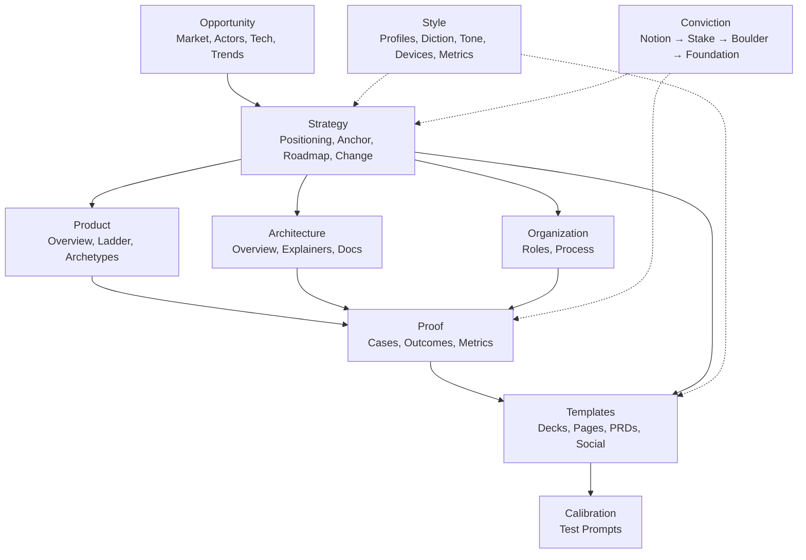
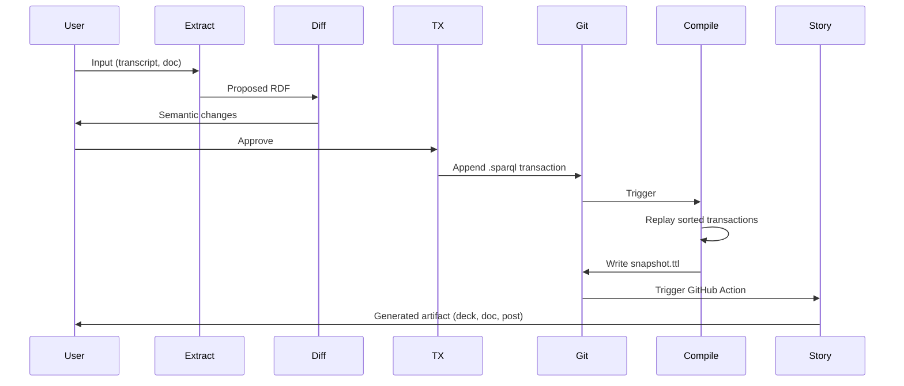

# storyBASE
## AI memory that tells your story, as written.

A Git-native RDF knowledge graph for narrative-driven AI memory and organizational strategy.

---

## What is storyBASE?

storyBASE is an **append-only, version-controlled knowledge graph** that encodes organizational narrative, strategy, and style as RDF triples[^architecture]. It enables AI systems to generate content that is **specific, controllable, and aligned** with your worldview—replacing brittle role prompts with deep, operable persona descriptions[^moat].

[^architecture]: The system uses an immutable transaction log compiled into Turtle snapshots, with Git providing version control and branching. See `narr:DataModelLifecycle` and `narr:SystemTopology` in the ontology.

[^moat]: storyBASE's moat is "Git-native, versionable, branchable AI memory encoding style, conviction, narrative metrics; replaces brittle role prompts with deep, operable persona descriptions." From `storybase.synthetic-identity.co/leverage/moat-storybase`.

---

## Core Principles

### Immutability as Foundation
	Identity—human, organizational, or AI—is rendered from immutable history, not mutable state[^mission]. Every change is a transaction; every state is a compilation.

### Narrative as Operating System
	Strategy, product, and proof flow from a single **Narrative Architecture**[^narrative-anchor]—ensuring every artifact reinforces the same story.

### Functional Composition
	Primitives → Behaviors → Flows → Narratives → Offerings[^product-ladder]. Each layer composes deterministically from the one below.

[^mission]: "Move identity from mutable documents and profiles to compiled surfaces rendered from append-only logs and single sources of truth." From `narr:Mission_1`.

[^narrative-anchor]: The Narrative Anchor includes Tagline, Mission, Vision, Key Phrases, and What-Is-It statements that make the organization memorable and direct execution. See `narr:NarrativeAnchor`.

[^product-ladder]: The Product Ladder defines how atomic units (primitives) compose into user-facing value (offerings) through explicit interfaces, behaviors, and flows. See `narr:ProductLadder`.

---

## How It Works

### 1. Extract
	Convert input (transcripts, docs, conversations) into RDF triples using SPARQL transactions[^modules].

### 2. Compile
	Replay sorted transactions to produce a Turtle snapshot—the current state of the graph[^data-lifecycle].

### 3. Query
	Use SPARQL to retrieve narrative anchors, style profiles, case studies, or strategic positioning[^ontology].

### 4. Render
	Generate stories, decks, docs, or social posts from the compiled graph—always on-narrative[^templates].

[^modules]: The `extract` tool uses LLMs to propose RDF from unstructured input; `diff` compares semantic changes; `tx` writes SPARQL transactions; `commit` appends to Git. From `storybase.synthetic-identity.co/module/storybase-capabilities`.

[^data-lifecycle]: "Append-only transaction log; immutable files; snapshot = replay of sorted transactions; provenance in TX step; future named graphs for add/remove." From `storybase.synthetic-identity.co/model/data-lifecycle-storybase`.

[^ontology]: The ontology defines 8 top-level domains (Opportunity, Strategy, Product, Architecture, Organization, Proof, Templates, Calibration) plus Style and Conviction. See `NarrativeArchitecture` concept scheme.

[^templates]: Templates include Sales Decks, Landing Pages, PRDs, Social Posts, and Customer Documentation—all tied to the narrative anchor. See `narr:Templates`.

---

## Repository Structure

### `.storyBASE/`
	Transaction log (`.sparql` files) recording every change to the graph. Sorted by timestamp; replayed to compile snapshots.

### `*.story`
	YAML front matter + prompt templates. Trigger story generation via GitHub Actions when transactions or `.story` files change[^process].

### `ontology.rdf`
	SKOS/RDFS schema defining the Narrative Architecture taxonomy and Style/Conviction facets.

### `snapshot.ttl`
	Compiled Turtle representation of the current graph state (generated, not edited directly).

[^process]: "Interactive individuation (extract → diff → tx → review → commit) vs. automated ingestion (file upload → extraction → PR); story generation triggered by transaction or .story file changes." From `storybase.synthetic-identity.co/process/storybase`.

---

## Current State

### Narrative Anchors
- **Tagline**: "Immutable Selves: A Functional Approach to Digital Identity"[^tagline]
- **Mission**: Move identity from mutable documents to compiled surfaces[^mission]
- **Vision**: A world where identity is rendered from immutable history, enabling equality, provenance, and trust by design[^vision]

### Key Samples
1. **Immutable Selves Talk** (5,847 chars): Conference talk applying Clojure principles to identity systems[^sample-immutable]
2. **Punch Talk Framing** (11,800 chars): Voice memo on narrative architecture for identity-as-append-only-log[^sample-punch]
3. **SIC/storyBASE Check-in** (18,437 chars): Product strategy transcript with conversational register[^sample-checkin]

### Style Profile
- **Register**: Conversational, direct, technical; second-person address; active voice[^rubric-register]
- **Cadence**: Short, punchy sentences; formula-style equations; anaphora for rhythm[^rubric-cadence]
- **Phrasing**: Domain verbs ("compile", "mutated", "rendered"); stock phrases ("Your code was shit")[^rubric-phrasing]

[^tagline]: From `narr:Tagline_1`. Encodes the core promise: identity as pure function.

[^vision]: From `narr:Vision_1`. Future state: identity systems that inherit Clojure's guarantees.

[^sample-immutable]: `narr:Sample_1` sourced from "Immutable Selves talk". Includes narrative anchors, product ladder, solution archetypes, case studies, and style observations.

[^sample-punch]: `narr:Sample_1` (alternate) sourced from "Voice memo: Punch talk conceptual framing". Includes themes on immutable identity and transition as state machine.

[^sample-checkin]: `storybase.synthetic-identity.co/sample/2025-01-29T000000Z_sic-storybase-checkin`. Covers opportunity, timing thesis, positioning, moat, product overview, roadmap, and style metrics.

[^rubric-register]: Rubric assessment: 4.5/5. "Conversational, direct, technical; second-person address; active voice; fits conference talk register perfectly." From `narr:RubricAssess_1`.

[^rubric-cadence]: Rubric assessment: 4.5/5. "Short, punchy sentences; formula-style equations; anaphora for rhythm." From `narr:RubricAssess_3`.

[^rubric-phrasing]: Rubric assessment: 4.0/5. "Strong idiolect ('Your code was shit'); domain verbs (mutated, compiled, rendered); stock phrases present." From `narr:RubricAssess_2`.

---

## Stories

### `README.story`
**Intent**: Auto-generate this README from the storyBASE graph.  
**Approach**: Query narrative anchors, samples, transactions, and ontology structure; summarize state, stories, assets, and transaction history with Mermaid charts.

### `presenter.story`
**Intent**: Generate an iA Presenter slide deck introducing storyBASE.  
**Approach**: Use narrative anchors, product ladder, and proof points to create slides with talk tracks; cite claims with footnotes to the graph.

### `conj-talk-2025.story`
**Intent**: Draft the "Immutable Selves" Clojure/conj talk.  
**Approach**: Weave personal journey, identity model, Clojure principles, and case studies (Vouch.io, As Written) into a narrative arc; cite technical explainers and solution archetypes.

---

## Transactions

### `1762897917update_sample_metadata.sparql`
Updated `narr:Sample_1` metadata: source, length, date, and provenance for the Immutable Selves talk.

### `1762897917tx_provenance.sparql`
Recorded transaction-level provenance (`narr:Tx_20251111T214920Z_immutable_selves`) linking all generated entities to the extraction event.

### `1762897917add_narrative_anchors.sparql`
Inserted Tagline, WhatIsIt, Mission, Vision, and Key Phrases for the Immutable Selves narrative.

### `1762897917add_strategy_overview.sparql`
Added Positioning Thesis and Moat/Leverage statements grounding the functional identity paradigm.

### `1762897917add_product_ladder.sparql`
Defined Primitives (append-only log, SSoT, pure function renderer), Behaviors, Flows, and Narratives.

### `1762897917add_solution_archetypes.sparql`
Created two archetypes: **berecognized.id** (immutable identification) and **aswritten.ai** (immutable AI identity).

### `1762897917add_technical_explainers.sparql`
Documented Leverage Profile, Design Tradeoffs, and Comparative Analyses (Backbone.js vs. Om/React analogy).

### `1762897917add_case_studies.sparql`
Captured speaker's 13-year Clojure career as a case study: context, intervention, results, and lessons.

### `1762897917add_style_observations.sparql`
Annotated 8 style observations using Web Annotation Ontology: short punchy cadence, stock phrases, anaphora, brand stylization, analogy, rhetorical questions, second-person address, and verb choice.

### `1762897917add_rubric_assessments.sparql`
Scored the sample on 9 rubric dimensions (Register, Phrasing, Cadence, Strategic Alignment, Tailoring, Resonance, Flow, Novelty, Accuracy) with supporting notes.

### `1762897917add_style_metrics.sparql`
Recorded quantitative style metrics: average sentence length (15.2), active voice ratio (0.85), jargon density (0.12), type-token ratio (0.68), conciseness (0.78).

### `1762800383add_sample1_narrative_architecture.sparql`
Added Sample_1 (Punch talk voice memo) with themes, actors, anchor concept, style observations, rubric assessments, and metrics.

### `1762731465sic-storybase-checkin.sparql`
Ingested SIC/storyBASE check-in transcript: opportunity, timing thesis, actors, positioning, moat, product overview, modules, dependencies, roadmap, topology, data model, integration points, role topology, process, case studies, style observations, metrics, and rubric assessments.

### `1762728019add_conj_talk_2025_extraction.sparql`
Extracted Conj Talk 2025 proposal: opportunity (identity vulnerability), strategy (functional immutable identity), products (Vouch.io, Sic), proof (talk structure), architecture patterns, organizations, style observations, rubric assessments, and style metrics.

---

## Narrative Architecture Overview

---

## Transaction Flow

---

## Getting Started

### Prerequisites
- **Git**: Version control for transactions and snapshots
- **Apache Jena/Riot** (future): RDF validation and SPARQL queries
- **n8n** (current): Agent orchestration and tool execution
- **MCP Server**: Exposes storyBASE tools to AI frontends (Agent.ai, ChatGPT, Open WebUI)

### Workflow
1. **Extract**: Feed input to the `extract` tool (via MCP or n8n)
2. **Review**: Inspect proposed RDF with `diff`
3. **Commit**: Approve and run `tx` + `commit` to append transaction
4. **Compile**: Run `compile` to regenerate snapshot
5. **Generate**: Trigger `.story` files to produce artifacts

---

## Roadmap

### Near-term
- **Named Graphs (TriG)**: Move from SPARQL INSERT/DELETE to add/remove semantics[^roadmap]
- **SHACL Validation**: Enforce ontology constraints at transaction time
- **Evolved Individuation**: Snapshot + message → transaction (reduce manual SPARQL)

### Mid-term
- **File Ingestion via GitHub**: Auto-extract from uploaded docs/transcripts
- **storyBASE Marketplace**: Share/fork narrative architectures
- **Cost Pass-through Billing**: Transparent API usage via Outseta + Helicone

[^roadmap]: "Move transactions from SPARQL to named graphs (TriG); add SHACL validation; implement evolved individuation pipeline (snapshot + message to transaction); file ingestion via GitHub; storyBASE marketplace; cost pass-through billing." From `storybase.synthetic-identity.co/roadmap/narrative-storybase`.

---

## Learn More

- **Ontology**: See `ontology.rdf` for the full SKOS/RDFS schema
- **Snapshot**: See `snapshot.ttl` for the current compiled graph
- **Transactions**: Browse `.storyBASE/*.sparql` for the append-only log
- **Stories**: Check `*.story` files for generation templates

---

**storyBASE**: AI memory that tells your story, as written.