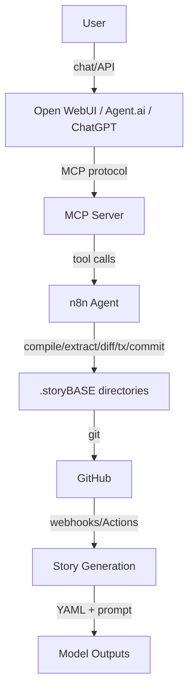
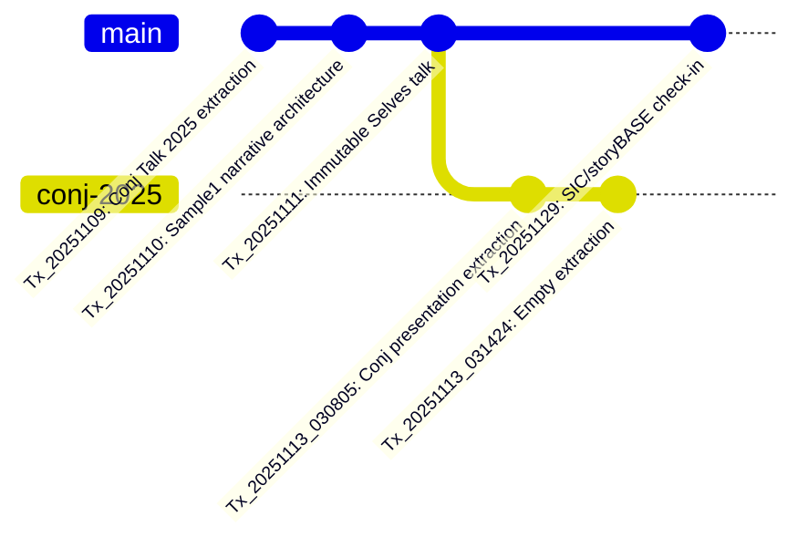
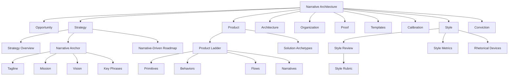
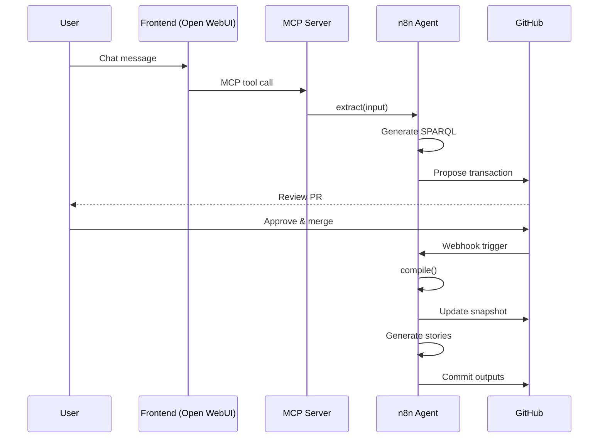

#### sic[#theme]
# 
## storyBASE
### Git-Native RDF Memory for AI
# 
#### Scarlet Dame
###### Founder, as written.ai

[#theme]: Custom theme for storyBASE presentation. Source: `narr:StyleObs_storyBASE` (CamelCase brand stylization with internal capitalization, from `narr:Sample_1` via `narr:Tx_20251110T184512Z_sample1`).

---

# AI that tells your story
## as written.

This is the tagline for aswritten.ai, extracted from the Clojure/conj 2025 presentation sample. It encodes both promise (fidelity to source) and brand identity in seven words.[^tagline]

[^tagline]: `narr:Tagline_AsWritten` from `narr:Sample_ConjPresentation_2025`, generated by `narr:Tx_20251113T030805Z_conj2025`. The tagline is related to `narr:Tagline` in the narrative anchor hierarchy and demonstrates the brand's commitment to immutable, verifiable AI memory.

---

###### The Problem
# Identity is not mutable state
## Yet we're treating it like Backbone.js

Both human and AI identity systems today mutate state directly—like querying the DOM and changing it in place. This creates fragility, lost provenance, and no single source of truth.[^metaphor]

[^metaphor]: `narr:StyleObs_Metaphor_1` from `narr:Sample_ConjPresentation_2025`. This technical metaphor positions identity as mutable state vs. immutable log, with Backbone.js as the anti-pattern. The observation is linked to `narr:Tagline` and demonstrates the speaker's use of technical analogies to frame the problem space.

---

### The Insight
# Experience is an append-only log
## that compiles to identity

Human identity: you are the source of truth. Authorities issue documents that make claims about you. Identification represents you at a point in time.[^human-identity]

AI identity: unclear source of truth. Labs train models that say stuff. Each chat is different context.[^ai-identity]

[^human-identity]: `narr:Actor_Human` from `narr:Sample_ConjPresentation_2025`, broader concept `narr:PrimaryActors`. Definition: "Source of truth for identity; authorities issue documents that make claims."

[^ai-identity]: `narr:Actor_AI` from `narr:Sample_ConjPresentation_2025`, broader concept `narr:PrimaryActors`. Definition: "Source of truth unclear; labs train models that say stuff; each chat is different context."

---

## The Pattern

---

###### Clojure Design Patterns
# No frameworks
## Simple tools ± good principles

This stock phrase signals insider knowledge of the Clojure community's values: composable primitives over monolithic frameworks.[^stock-phrase]

[^stock-phrase]: `narr:StyleObs_StockPhrase_1` from `narr:Sample_ConjPresentation_2025`. The observation notes this as a "Clojure community idiom; signals insider knowledge and shared values," related to `narr:IdiolectPhrasing`. Rubric assessment `narr:RubricAssess_Phrasing_Conj` scores 4.0/5 for strong use of community idioms.

---

###### Reified Change
# 
###### Make state explicit
# Append only log → Single source of truth
# 
###### Everyone sees the same thing
# Render as pure function → Deterministic UIs

This anaphoric structure creates rhythm and memorability by repeating the principle → pattern frame.[^anaphora]

[^anaphora]: `narr:StyleObs_Anaphora_1` from `narr:Sample_ConjPresentation_2025`, broader concept `narr:Anaphora`. Related to `narr:CadenceRhythm`. The rubric assessment `narr:RubricAssess_Cadence_Conj` scores 4.5/5, noting "triadic structures; anaphora creates rhythm."

---

## Two Systems

---

###### System: Human
# berecognized.id
###### Immutable Identification

**Problem:** Passwords and digital keys are mutable, siloed, vulnerable; no single source of truth for privileges.[^problem-human]

**Approach:** Datomic SSoT → datalog query → render to identification/privileges → event-driven transactions → append-only log → recompile.[^approach-human]

**Outcome:** Proof of provenance and authority innate; hash of last tx + SSoT state enables 'be recognized' property.[^outcome-human]

[^problem-human]: `narr:ProblemContext_1`, broader `narr:Archetype_1` (berecognized.id solution archetype), from `narr:Sample_1` via `narr:Tx_20251111T214920Z_immutable_selves`.

[^approach-human]: `narr:ApproachPattern_1`, broader `narr:Archetype_1`. Note: "Canonical flow applied to access control."

[^outcome-human]: `narr:OutcomesProof_1`, broader `narr:Archetype_1`. Note: "Expected metric: cryptographic proof of identity state."

---

###### System: AI
# aswritten.ai
###### Immutable AI Memory

**Problem:** AI models are black boxes; persona prompts mutate rendered state; no provenance or version control for AI identity. Stakes: narrative manipulation, embedded propaganda, deepfakes.[^problem-ai]

**Approach:** RDF + git SSoT → SPARQL query → render to AI memory/identity → event-driven transactions → append-only log → recompile.[^approach-ai]

**Capabilities:** RDF graph, git versioning, SPARQL, multimodal renderer, event system, transactor. Leverages semantic web + version control.[^capabilities-ai]

[^problem-ai]: `narr:ProblemContext_2`, broader `narr:Archetype_2` (aswritten.ai solution archetype), from `narr:Sample_1` via `narr:Tx_20251111T214920Z_immutable_selves`.

[^approach-ai]: `narr:ApproachPattern_2`, broader `narr:Archetype_2`. Note: "Same pattern, different stack: RDF instead of Datomic."

[^capabilities-ai]: `narr:RequiredCapabilities_2`, broader `narr:Archetype_2`.

---

## The Architecture

---

### Single Source of Truth

The end-to-end loop: identity as continuous compilation from immutable history.[^flow]

[^flow]: `narr:Flow_1` from `narr:Sample_1`, broader `narr:ProductLadder`. Value: "SSoT → query → render → interact → event → transact → append log → recompile SSoT." Note: "End-to-end loop; identity as continuous compilation."

---

### Primitives

**Append-only transaction log:** Foundational atomic unit; immutability guarantee.[^primitive-1]

**Single source of truth (SSoT):** Compiled state from transaction history.[^primitive-2]

**Pure function renderer:** Deterministic transformation: SSoT → identity surface.[^primitive-3]

[^primitive-1]: `narr:Primitive_1`, broader `narr:ProductLadder`, from `narr:Sample_1` via `narr:Tx_20251111T214920Z_immutable_selves`.

[^primitive-2]: `narr:Primitive_2`, broader `narr:ProductLadder`.

[^primitive-3]: `narr:Primitive_3`, broader `narr:ProductLadder`.

---

### What You Get for Free

Immutability enables equality, provenance, versioning, branching, generative testing, decentralization, and infinite read scale—for free.[^leverage]

**Trade-off:** Bottleneck at single transactor; all logic in event clients; transact is just adding triples. What we gave up: distributed writes. Why worth it: consistency, provenance, auditability.[^tradeoff]

[^leverage]: `narr:LeverageProfile_1`, broader `narr:TechnicalExplainers`, from `narr:Sample_1`. Note: "Small choice (append-only) creates outsized effects across system."

[^tradeoff]: `narr:DesignTradeoff_1`, broader `narr:TechnicalExplainers`.

---

## storyBASE Product

---

###### What is it?
# RDF narrative source of truth
## that steers AI output

Making it specific, controllable, aligned with organizational worldview.[^what-is-it]

[^what-is-it]: `storybase.synthetic-identity.co/product/what-is-storybase`, type `sb:ProductOverview`, from transaction `2025-01-29T000000Z_sic-storybase-checkin`.

---

### System Topology

n8n agent orchestrates tools; MCP server exposes to frontends; transactions in `.storyBASE` directories; hierarchical compile; Docker Compose on Digital Ocean.[^topology]

[^topology]: `storybase.synthetic-identity.co/architecture/topology-storybase`, type `sb:SystemTopology`, from transaction `2025-01-29T000000Z_sic-storybase-checkin`.

---

### Data Model & Lifecycle

**Append-only transaction log:** Immutable files; snapshot = replay of sorted transactions; provenance in TX step; future named graphs for add/remove.[^data-model]

**Process:** Interactive individuation (extract → diff → tx → review → commit) vs. automated ingestion (file upload → extraction → PR); story generation triggered by transaction or `.story` file changes.[^process]

[^data-model]: `storybase.synthetic-identity.co/model/data-lifecycle-storybase`, type `sb:DataModelLifecycle`.

[^process]: `storybase.synthetic-identity.co/process/storybase`, type `sb:Process`.

---

### Modules & Capabilities

**Compile:** Replay transactions to Turtle snapshot

**Extract:** RDF from input

**Diff:** Semantic comparison

**Tx:** Propose transaction

**Commit:** Append-only to Git

**Story generation:** YAML front matter + prompt to model outputs[^modules]

[^modules]: `storybase.synthetic-identity.co/module/storybase-capabilities`, type `sb:ModuleCapabilities`. Related to `sb:DependenciesIntegrations` (n8n workflows, MCP server, GitHub, Apache Jena/Riot, Docker Compose, Open WebUI, Outseta, Helicone, Open Router).

---

### Integration Points

GitHub (OAuth, webhooks, Actions)

Open Router (API proxy via Helicone)

Outseta (OIDC, billing)

MCP protocol (tool exposure)

Future: GitHub Apps with scoped credentials[^integrations]

[^integrations]: `storybase.synthetic-identity.co/integration/points-storybase`, type `sb:IntegrationPoints`.

---

## The Opportunity

---

###### Market Context
# High-quality AI output
## requires extensive context

Current models use search, but RDF-based narrative source of truth enables specific, controllable, versionable AI memory.[^opportunity]

**Timing:** Convergence of prompt engineering maturity, multi-agent workflows, and demand for organizational AI memory creates window for narrative-driven context management (2024-2026).[^timing]

[^opportunity]: `storybase.synthetic-identity.co/opportunity/storybase-market`, type `sb:Opportunity`. Market context: "AI prompt engineering and organizational memory."

[^timing]: `storybase.synthetic-identity.co/thesis/timing-storybase`, type `sb:TimingThesis`.

---

###### Primary Actors
# Programming-literate
## entrepreneurs, designers, developers, consultants

Who manipulate worldview and see perspective changes.[^actors]

[^actors]: `storybase.synthetic-identity.co/actor/primary-storybase`, type `sb:PrimaryActor`. Related to `concept/personas-jobs-to-be-done`.

---

## Strategy

---

### Positioning

For developers and identity architects who treat identity as mutable state, this is a functional paradigm that makes identity deterministic, auditable, and decentralized—by applying Clojure's immutability principles to human and AI identity systems.[^positioning]

[^positioning]: `narr:PositioningThesis_1`, broader `narr:StrategyOverview`, from `narr:Sample_1`. Note: "Who: devs/architects; What: functional identity; Why-us: Clojure principles proven at scale."

---

### Moat & Leverage

**storyBASE:** Git-native, versionable, branchable AI memory encoding style, conviction, narrative metrics; replaces brittle role prompts with deep, operable persona descriptions.[^moat-storybase]

**Immutable Selves:** Clojure ecosystem (Datomic, datalog, re-frame) as proof-of-concept; 13 years of production experience; provenance and equality by design.[^moat-immutable]

[^moat-storybase]: `storybase.synthetic-identity.co/leverage/moat-storybase`, type `sb:MoatLeverage`.

[^moat-immutable]: `narr:MoatLeverage_1`, broader `narr:StrategyOverview`. Note: "Compounding advantage: existing tools, battle-tested patterns, speaker credibility."

---

### Mission

**storyBASE:** Extend software development rigor into strategy, content, marketing; provide versionable, collaborative, narrative-driven AI memory.[^mission-storybase]

**Immutable Selves:** Move identity from mutable documents and profiles to compiled surfaces rendered from append-only logs and single sources of truth.[^mission-immutable]

[^mission-storybase]: `storybase.synthetic-identity.co/mission/storybase`, type `sb:Mission`.

[^mission-immutable]: `narr:Mission_1`, broader `narr:NarrativeAnchor`. Note: "Durable purpose: make identity deterministic, provable, and decentralized."

---

### Vision

A world where identity—human, synthetic, AI—is rendered from immutable history, enabling equality, provenance, and trust by design.[^vision]

[^vision]: `narr:Vision_1`, broader `narr:NarrativeAnchor`, from `narr:Sample_1`. Related to `narr:Narrative_ImmutableIdentity` (core thesis: experience is an append-only log; identification is a render target; interaction is transaction).

---

## Roadmap

---

### Near-term

Move transactions from SPARQL to named graphs (TriG)

Add SHACL validation

Implement evolved individuation pipeline (snapshot + message to transaction)

File ingestion via GitHub

storyBASE marketplace

Cost pass-through billing[^roadmap]

[^roadmap]: `storybase.synthetic-identity.co/roadmap/narrative-storybase`, type `sb:NarrativeDrivenRoadmap`. Related to `core/narrative-expansion`.

---

## Proof

---

### Case Study: 13 Years in Clojure

**Context:** Speaker's career evolution from Backbone.js (2012) to Om (2013) to production systems at scale. Customer: self; environment: professional dev career; stakes: credibility.[^case-context]

**Intervention:** Applied Clojure principles (immutability, pure functions, single source of truth) to UI, then identity systems (berecognized.id, aswritten.ai).[^case-intervention]

**Results:** Provenance, equality, versioning, decentralization, infinite read scale achieved; systems in production.[^case-results]

**Lessons:** Same principles apply across UI, identity, and AI; immutability is the unlock; single transactor is acceptable bottleneck.[^case-lessons]

[^case-context]: `narr:CaseContext_1`, broader `narr:CaseStudy_1`, broader `narr:Proof`.

[^case-intervention]: `narr:CaseIntervention_1`, broader `narr:CaseStudy_1`. Note: "What implemented: functional paradigm across domains."

[^case-results]: `narr:CaseResults_1`, broader `narr:CaseStudy_1`. Note: "Quantified impact: architectural guarantees delivered."

[^case-lessons]: `narr:CaseLessons_1`, broader `narr:CaseStudy_1`. Note: "Insights inform roadmap: extend pattern to new domains."

---

### Planned Demo

Crooked Media podcast transcripts auto-ingested

Stories auto-update

Perspectival operations (e.g., start with NPR, evolve with OpenAI)[^demo]

[^demo]: `storybase.synthetic-identity.co/case/studies-storybase`, type `sb:CaseStudies`.

---

## Style & Voice

---

### Register & Cadence

**Conversational yet authoritative:** Second-person direct address; technical register fits Clojure audience; concise and confident.[^register]

**Short, punchy sentences:** Triadic structures; anaphora creates rhythm; single-word answers for emphasis ('You.').[^cadence]

[^register]: `narr:RubricAssess_Register_Conj`, broader `narr:Rubric_Register`, score 4.5/5. Related to `narr:StyleObs_SecondPerson_1` and `narr:StyleObs_ShortPunchy_1`.

[^cadence]: `narr:RubricAssess_Cadence_Conj`, broader `narr:Rubric_Cadence`, score 4.5/5. Related to `narr:StyleObs_Anaphora_1` and `narr:StyleObs_ShortPunchy_1`.

---

### Metrics

**Average sentence length:** 12.3 words

**Active voice ratio:** 82%

**Jargon density:** 15% (moderate; technical audience)

**Conciseness:** 0.78[^metrics]

[^metrics]: `narr:Metrics_ConjPresentation`, broader `narr:StyleMetrics`, from `narr:Sample_ConjPresentation_2025`. Note: "Short sentences, high active voice, moderate jargon (technical audience), high conciseness."

---

### Rubric Scores

**Strategic Alignment:** 5.0/5 — Entire presentation is a narrative anchor[^strategy-score]

**Audience Tailoring:** 5.0/5 — Deeply tailored to Clojure/conj audience[^tailoring-score]

**Resonance:** 4.5/5 — Strong analogies; personal story adds emotional resonance[^resonance-score]

**Novelty:** 4.5/5 — Novel framing; fresh application of Clojure patterns[^novelty-score]

**Flow:** 4.0/5 — Clear progression; some formulaic scaffolding[^flow-score]

**Accuracy:** 4.0/5 — Citations present; technical references accurate[^accuracy-score]

[^strategy-score]: `narr:RubricAssess_Strategy_Conj`, related to `narr:Narrative_ImmutableIdentity`, `narr:SolutionArchetype_BeRecognized`, `narr:SolutionArchetype_AsWritten`.

[^tailoring-score]: `narr:RubricAssess_Tailoring_Conj`, related to `narr:Actor_Human`, `narr:Actor_AI`.

[^resonance-score]: `narr:RubricAssess_Resonance_Conj`, related to `narr:StyleObs_Analogy_1`, `narr:StyleObs_Metaphor_1`, `narr:StyleObs_RhetoricalQuestion_1`.

[^novelty-score]: `narr:RubricAssess_Novelty_Conj`, related to `narr:Theme_FunctionalIdentity`.

[^flow-score]: `narr:RubricAssess_Flow_Conj`, related to `narr:StyleObs_Anaphora_1`.

[^accuracy-score]: `narr:RubricAssess_Accuracy_Conj`, related to `narr:StyleObs_CitationMarker_1`.

---

## Transaction History

---

### Graph Evolution

The storyBASE has evolved through 7 transactions, each appending new narrative architecture, style observations, and rubric assessments.[^transactions]

[^transactions]: Transaction provenance from `narr:Tx_*` nodes. Each transaction includes `prov:wasAssociatedWith` (agent), `prov:wasAttributedTo` (user "pleasetrythisathome"), `prov:generatedAtTime`, and `prov:generated` (list of created entities).

---

### Key Transactions

**Tx_20251109:** First Conj Talk 2025 extraction — Opportunity, Strategy, Product, Proof, Architecture, Organization[^tx-1]

**Tx_20251110:** Sample1 narrative architecture — Themes, actors, style observations for voice memo[^tx-2]

**Tx_20251111:** Immutable Selves talk — Narrative anchors, product ladder, solution archetypes, case studies[^tx-3]

**Tx_20251113_030805:** Conj presentation extraction — Full narrative, actors, solution archetypes, tagline, style observations, rubric assessments[^tx-4]

**Tx_20251129:** SIC/storyBASE check-in — Product overview, modules, roadmap, integration points, role topology[^tx-5]

[^tx-1]: `narr:Tx_20251109T223928Z_conj2025`, label "Conj Talk 2025 Extraction Transaction," used model "anthropic/claude-sonnet-4.5."

[^tx-2]: `narr:Tx_20251110T184512Z_sample1`, generated themes `Theme_ImmutableIdentity`, `Theme_TransitionAsStateChange`, actors `Actor_ScarletDame`, `Actor_LukeVanderhart`.

[^tx-3]: `narr:Tx_20251111T214920Z_immutable_selves`, generated 40+ entities including tagline, mission, vision, key phrases, primitives, archetypes, case study components, style observations, rubric assessments.

[^tx-4]: `narr:Tx_20251113T030805Z_conj2025`, generated `Sample_ConjPresentation_2025`, `Narrative_ImmutableIdentity`, `Actor_Human`, `Actor_AI`, `SolutionArchetype_BeRecognized`, `SolutionArchetype_AsWritten`, `Tagline_AsWritten`, 10 style observations, 9 rubric assessments, metrics.

[^tx-5]: Transaction `2025-01-29T000000Z_sic-storybase-checkin`, generated opportunity, timing thesis, primary actors, positioning thesis, moat leverage, mission, product overview, modules, dependencies, roadmap, system topology, data model, integration points, role topology, process, case studies, 10 style observations, 9 rubric assessments, style metrics.

---

## The Graph

---

### Narrative Architecture Ontology

The ontology defines 8 top-level domains with 100+ narrower concepts, providing a complete framework for narrative-driven strategy.[^ontology]

[^ontology]: SKOS ConceptScheme "NarrativeArchitecture" with top concepts: Opportunity, Strategy, Product, Architecture, Organization, Proof, Templates, Calibration, Style, Conviction. Uses XKOS for classification levels and sequential relationships.

---

### Sample Nodes

**3 Samples:** Voice memo (11,800 chars), Immutable Selves talk (5,847 chars), Conj presentation (6,847 chars)[^samples]

**2 Solution Archetypes:** berecognized.id (human identity), aswritten.ai (AI identity)[^archetypes]

**2 Primary Actors:** Human (source of truth), AI (unclear source)[^actors-detail]

**4 Key Phrases:** single source of truth, append-only log, pure function, digital twin[^key-phrases]

[^samples]: `narr:Sample_1`, `narr:Sample_ConjPresentation_2025`, and `storybase.synthetic-identity.co/sample/2025-01-29T000000Z_sic-storybase-checkin`.

[^archetypes]: `narr:SolutionArchetype_BeRecognized` (Datomic SSoT, datalog query, device-to-device interaction) and `narr:SolutionArchetype_AsWritten` (RDF+git SSoT, SPARQL query, chat+API interaction).

[^actors-detail]: `narr:Actor_Human` and `narr:Actor_AI`, both broader `narr:PrimaryActors`.

[^key-phrases]: `narr:KeyPhrase_1` through `narr:KeyPhrase_4`, all broader `narr:NarrativeAnchor`.

---

### Style Observations

**25 style observations** across samples, including:

Brand name stylization (storyBASE, berecognized.id, aswritten.ai)

Idiolect phrasing ("append-only log")

Rhetorical devices (metaphor, analogy, anaphora, rhetorical questions)

Cadence patterns (short punchy, formula-style)

Citation conventions (caret-bracket markers)[^style-obs]

[^style-obs]: Style observations from `narr:StyleObs_*` and `storybase.synthetic-identity.co/style/observation/*` nodes, broader concepts include `narr:BrandNameStylization`, `narr:IdiolectPhrasing`, `narr:Metaphor`, `narr:Analogy`, `narr:Anaphora`, `narr:RhetoricalQuestion`, `narr:ShortPunchyCadence`, `narr:CaretBracketMarker`.

---

### Rubric Assessments

**27 rubric assessments** across 9 dimensions:

Register Fit (3.0–4.5)

Phrasing/Idiolect (3.0–4.0)

Cadence (3.0–4.5)

Strategic Alignment (4.0–5.0)

Audience Tailoring (3.5–5.0)

Resonance (3.0–4.5)

Flow (3.0–4.0)

Novelty (3.5–4.5)

Accuracy (4.0)[^rubrics]

[^rubrics]: Rubric assessments from `narr:RubricAssess_*` and `storybase.synthetic-identity.co/rubric/*` nodes, broader concepts `narr:Rubric_Register`, `narr:Rubric_Phrasing`, `narr:Rubric_Cadence`, `narr:Rubric_StrategicAlignment`, `narr:Rubric_Tailoring`, `narr:Rubric_Resonance`, `narr:Rubric_Flow`, `narr:Rubric_Novelty`, `narr:Rubric_Accuracy`.

---

## How It Works

---

### The Individuation Loop

Interactive individuation: extract → diff → tx → review → commit. Automated ingestion: file upload → extraction → PR. Story generation triggered by transaction or `.story` file changes.[^individuation]

[^individuation]: Process description from `storybase.synthetic-identity.co/process/storybase`. System topology from `storybase.synthetic-identity.co/architecture/topology-storybase`. Data lifecycle from `storybase.synthetic-identity.co/model/data-lifecycle-storybase`.

---

### Compile Step

Snapshot = replay of sorted transactions. Provenance in TX step. Future: named graphs for add/remove.[^compile]

[^compile]: Data model lifecycle from `storybase.synthetic-identity.co/model/data-lifecycle-storybase`: "Append-only transaction log; immutable files; snapshot = replay of sorted transactions; provenance in TX step; future named graphs for add/remove."

---

## Repository Structure

---

### Assets

**/.storyBASE/**: Transaction log (SPARQL files)

**/README.story**: Auto-generated README tracking storyBASE state

**/presenter.story**: This presentation template

**/conj-talk-2025.story**: Immutable Selves talk template

**Outputs:** Generated by GitHub Actions on transaction commit[^assets]

[^assets]: Repository structure inferred from transaction paths and story file metadata. Transactions in `/.storyBASE/` directory with `.sparql` extension. Story files with `.story` extension include YAML front matter (id, title, version, description, destination, model).

---

## What's Next

---

### Extend the Pattern

**From UI to Identity to AI**

Backbone.js (query DOM, mutate picture) vs. Om/React (state machine, pure function render). Identity systems today are Backbone; this is Om for identity.[^comparison]

**When to use:** When provenance, auditability, and equality matter more than write throughput.[^when]

[^comparison]: `narr:ComparativeAnalysis_1`, broader `narr:TechnicalExplainers`, from `narr:Sample_1`.

[^when]: Note from `narr:ComparativeAnalysis_1`.

---

### From Mutable Documents
# to Compiled Selves

Story frame: evolution from Backbone.js mutation to functional rendering.[^narrative-frame]

[^narrative-frame]: `narr:Narrative_1`, broader `narr:ProductLadder`, from `narr:Sample_1`. Value: "From mutable documents to compiled selves."

---

# AI that tells your story
## as written.

For more: [as written.ai](https://aswritten.ai)

Human-readable provenance. Immutable memory. Deterministic individuality.