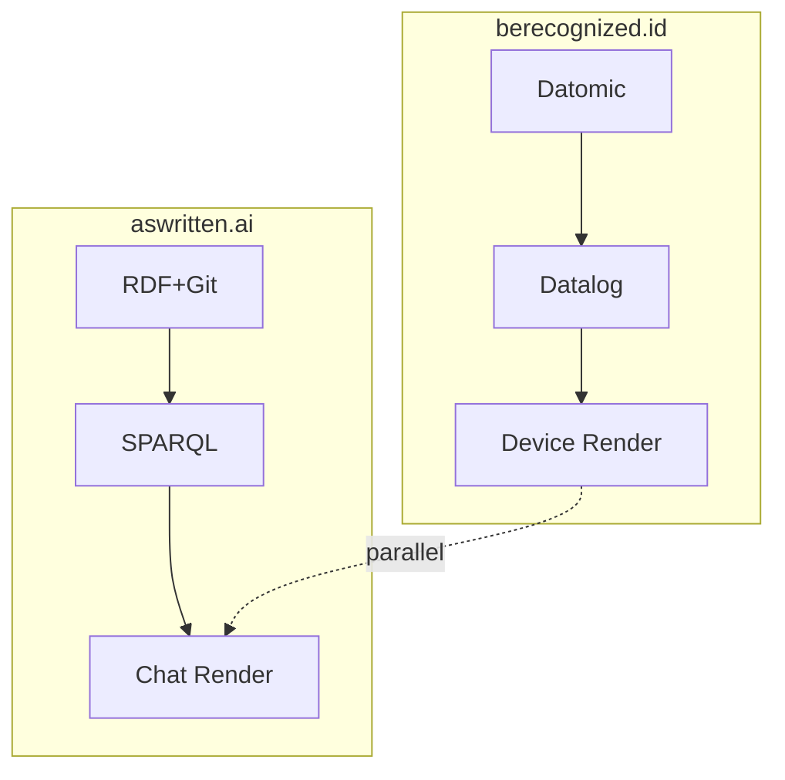
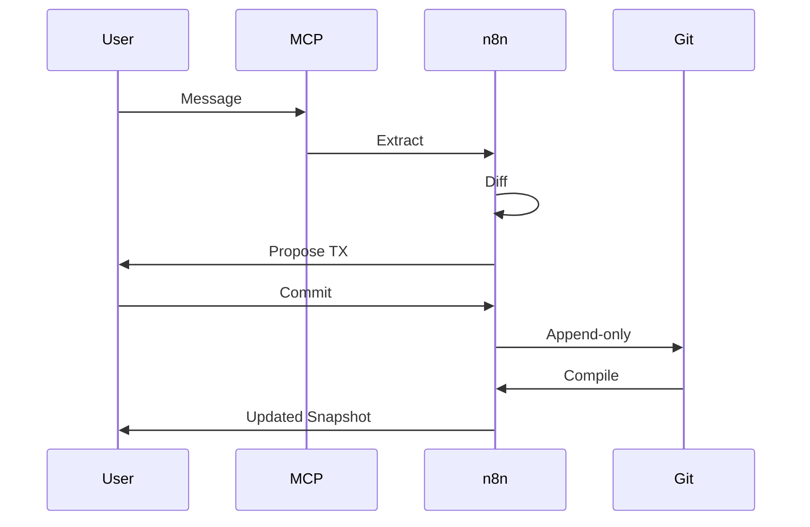
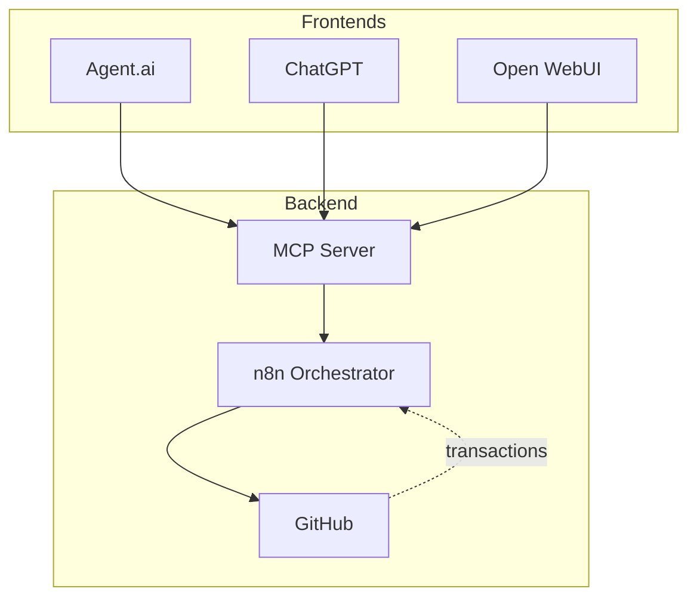
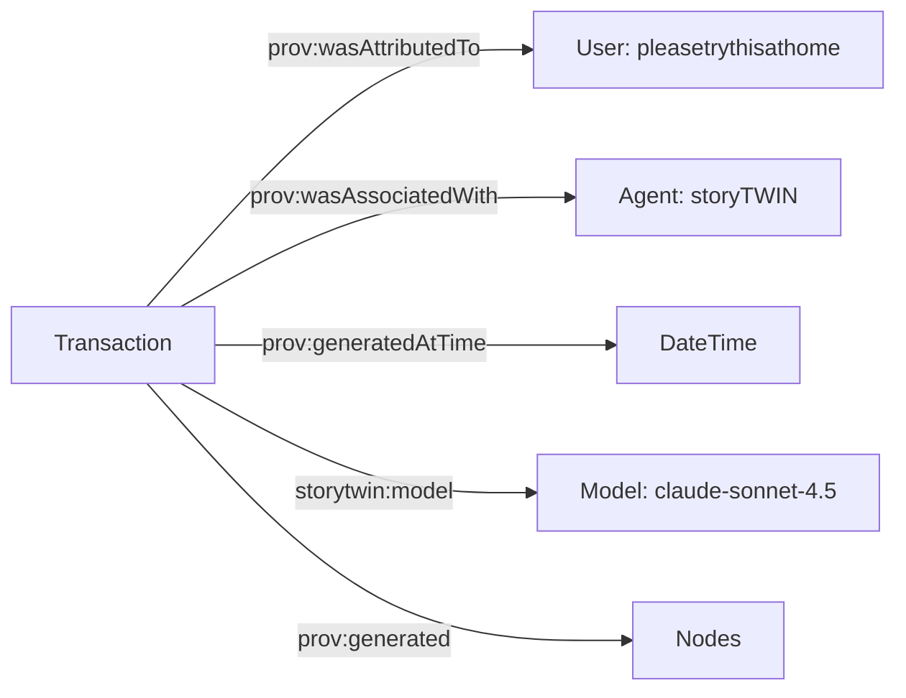

#### sic[#theme]
# 
## storyBASE
### Git-Native RDF Knowledge Graph for AI Memory
# 
#### Scarlet Dame
###### Founder, as written.ai
	[#theme]: Custom presentation theme for storyBASE; brand stylization follows CamelCase+CAPS pattern per narr:StyleObs_storyBASE (transaction Tx_20251110T184512Z_sample1).

---
# Identity is not mutable state
## Yet we're treating it like Backbone.js

The core thesis across all samples: identity—human and AI—should be modeled as an append-only log that compiles to state, not mutable objects[][#thesis].

	[#thesis]: narr:Narrative_ImmutableIdentity from Sample_ConjPresentation_2025 (Tx_20251113T030805Z_conj2025); supported by narr:Theme_ImmutableIdentity and narr:Theme_FunctionalIdentity.

---
###### The Problem
# AI that tells your story
## as written

Current AI memory is brittle: persona prompts mutate state, no provenance, no version control. Each chat is different context[][#problem].

	[#problem]: narr:ProblemContext_2 under narr:Archetype_2 (aswritten.ai); narr:Actor_AI notes "Source of truth unclear; labs train models that say stuff" (Tx_20251111T214920Z_immutable_selves).

---
### The Solution
# storyBASE
## RDF narrative source of truth that steers AI output

Git-native knowledge graph encoding style, conviction, narrative metrics—making AI specific, controllable, aligned with organizational worldview[][#solution].

	[#solution]: storybase.synthetic-identity.co/product/what-is-storybase and /mission/storybase (Tx sic-storybase-checkin); narr:Tagline_AsWritten: "AI that tells your story, as written."

---
## Architecture

---
###### Single Source of Truth
# Experience is an append-only log
## that compiles to identity

Human identity: you are the source of truth; authorities issue documents that make claims about you[][#human-arch].

	[#human-arch]: narr:Actor_Human and narr:SolutionArchetype_BeRecognized (Tx_20251113T030805Z_conj2025); narr:Flow_EmployeeLifecycle shows endorsement → Zoom → in-person → state ID → role → 'as-of' query compiles snapshot on device.

---
###### Reified Change Pattern
# Make state explicit
## Append-only log → Single source of truth
# Everyone sees the same thing
## Render as pure function → Deterministic UIs

Clojure principles applied to identity: immutability, explicit state management, functional composition[][#pattern].

	[#pattern]: narr:Claim_ReifiedChangePattern (Tx_20251113T032552Z_sample1) with conviction level Stake; supports narr:DataModelLifecycle and narr:ReliabilityResilience; evidenced by both case studies.

---
## Two Systems

---
### System: Human
# berecognized.id
###### Immutable Identification

**Stack**: Datomic SSoT, datalog query, device-to-device interaction, change-privilege events[][#berecognized].

**Flow**: Endorsement → interactions → state ID → assigned role → 'as-of T' snapshot → cryptographic proof of identity state[][#flow-human].

	[#berecognized]: narr:SolutionArchetype_BeRecognized (Tx_20251113T030805Z_conj2025).
	[#flow-human]: narr:Flow_EmployeeLifecycle and narr:OutcomesProof_1 (Tx_20251111T214920Z_immutable_selves).

---
### System: AI
# aswritten.ai
###### Immutable AI Memory

**Stack**: RDF+git SSoT, SPARQL query, chat+API interaction, extract-narrative events[][#aswritten].

**Flow**: Person talks to AI → extract chats/docs to RDF → save to append-only log → AI memory as 'as-of T' snapshot (pure function)[][#flow-ai].

	[#aswritten]: narr:SolutionArchetype_AsWritten (Tx_20251113T030805Z_conj2025).
	[#flow-ai]: narr:CaseStudy_AsWrittenAI intervention sequence (Tx_20251113T032552Z_sample1).

---
###### The Pattern
# Same principles
## Different stacks

Both deliver: provenance, equality, decentralization/offline scale[][#properties].

	[#properties]: narr:SystemProperty_ImmutabilityProvenance and narr:SystemProperty_DistributedDecentralization (Tx_20251113T032552Z_sample1), both with conviction level Boulder.

---
## storyBASE Product

---
### What It Does
# Extends software development rigor
## into strategy, content, marketing

Versionable, branchable, collaborative AI memory. Replaces brittle role prompts with deep, operable persona descriptions[][#product-overview].

	[#product-overview]: storybase.synthetic-identity.co/thesis/positioning-storybase and /leverage/moat-storybase (Tx sic-storybase-checkin).

---
### Current Capabilities
# 
#### Compile
## Replay transactions to Turtle snapshot
# 
#### Extract
## RDF from input

Tools: compile, ontology, extract, diff, tx, commit; MCP server; Open WebUI at as written.ai; GitHub Actions for story generation[][#capabilities].

	[#capabilities]: storybase.synthetic-identity.co/module/storybase-capabilities and /product/overview-storybase (Tx sic-storybase-checkin).

---
###### Data Model
# Append-only transaction log
## Immutable files
# Snapshot = replay of sorted transactions

Provenance in TX step; future named graphs for add/remove[][#data-model].

	[#data-model]: storybase.synthetic-identity.co/model/data-lifecycle-storybase (Tx sic-storybase-checkin); narr:Primitive_1, narr:Primitive_2, narr:Primitive_3 (Tx_20251111T214920Z_immutable_selves).

---
### System Topology
# n8n agent orchestrates tools
## MCP server exposes to frontends

Transactions in .storybase directories; hierarchical compile; Docker Compose on Digital Ocean[][#topology].

	[#topology]: storybase.synthetic-identity.co/architecture/topology-storybase (Tx sic-storybase-checkin).

---
## Proof

---
### Case Study: berecognized.id
###### Human Identity via Reified Change

**Context**: Digital identification enables recognition and delegates authority to access/use/transact with shared technology[][#case-context-human].

**Intervention**: Append-only log of facts about a person over time (employment, access, roles, interactions); device-rendered snapshot compiled at specific point in time[][#case-intervention-human].

**Results**: Provenance for individual transactions; referential equality for free; offline transactions enabled[][#case-results-human].

	[#case-context-human]: narr:CaseStudy_BeRecognizedID context (Tx_20251113T032552Z_sample1).
	[#case-intervention-human]: narr:CaseStudy_BeRecognizedID intervention.
	[#case-results-human]: narr:CaseStudy_BeRecognizedID results; related to narr:DataModelLifecycle and narr:GovernanceSafetyTrust.

---
### Case Study: aswritten.ai
###### AI Memory via Reified Change

**Context**: AI memory problem: "My AI doesn't give the same answers as your AI"; need for narrative source of truth[][#case-context-ai].

**Intervention**: Transaction sequence: person talks to AI → extract chats/docs to RDF → save to append-only log → AI memory as 'as-of T' snapshot (pure function)[][#case-intervention-ai].

**Results**: Provenance, equality, decentralization/offline scale; deterministic AI perspective for specific graph queries[][#case-results-ai].

	[#case-context-ai]: narr:CaseStudy_AsWrittenAI context (Tx_20251113T032552Z_sample1); narr:StyleObs_4 captures rhetorical question framing.
	[#case-intervention-ai]: narr:CaseStudy_AsWrittenAI intervention; narr:StyleObs_10 notes parallel construction in numbered list.
	[#case-results-ai]: narr:CaseStudy_AsWrittenAI results; formalized architecture from manual process at Vouch; now automated.

---
###### Risk Mitigation
# Ghost Labor & Impersonation

Bad actors (individuals or state actors like North Korea) deepfaking candidates, passing interviews, collecting paychecks on behalf of fake identities[][#risk].

**Mitigation**: Continuous identity establishment via append-only log; each interaction adds provenance[][#mitigation].

	[#risk]: narr:Risk_GhostLabor (Tx_20251113T032552Z_sample1); challenges narr:CaseStudy_BeRecognizedID; narr:StyleObs_5 notes 'ghost labor' metaphor effectiveness.
	[#mitigation]: narr:Risk_GhostLabor note field; narr:Flow_EmployeeLifecycle shows continuous verification pattern.

---
## Roadmap

---
### Near-term
# Move transactions from SPARQL to named graphs (TriG)
## Add SHACL validation

Implement evolved individuation pipeline: snapshot + message → transaction[][#roadmap-near].

	[#roadmap-near]: storybase.synthetic-identity.co/roadmap/narrative-storybase (Tx sic-storybase-checkin); related to /core/narrative-expansion.

---
### Mid-term
# File ingestion via GitHub
## storyBASE marketplace
# Cost pass-through billing

Enable automated ingestion: file upload → extraction → PR; story generation triggered by transaction or .story file changes[][#roadmap-mid].

	[#roadmap-mid]: storybase.synthetic-identity.co/roadmap/narrative-storybase and /process/storybase (Tx sic-storybase-checkin).

---
### Future Vision
# Deterministic AI perspective 'as-of T'
## for graph queries

Examples: full talk as query, section of talk, talk evolution over time, any accessible graph subset within billion-node graph[][#future].

Close with examples of such queries, then link to chat for participants to engage with narrative source of truth[][#engagement].

	[#future]: narr:FutureVision_DeterministicAI (Tx_20251113T032552Z_sample1) with conviction level Stake; supports narr:CaseStudy_AsWrittenAI.
	[#engagement]: narr:FutureVision_DeterministicAI note field.

---
## Technical Leverage

---
### Small Choice, Outsized Effects
# Immutability enables
## equality, provenance, versioning, branching, generative testing, decentralization, infinite read scale

For free[][#leverage].

	[#leverage]: narr:LeverageProfile_1 (Tx_20251111T214920Z_immutable_selves); note: "Small choice (append-only) creates outsized effects across system."

---
### Design Trade-offs
# Bottleneck at single transactor
## All logic in event clients
# Transact is just adding triples

**What we gave up**: distributed writes.  
**Why worth it**: consistency, provenance, auditability[][#tradeoffs].

	[#tradeoffs]: narr:DesignTradeoff_1 (Tx_20251111T214920Z_immutable_selves).

---
### When to Use This Pattern
# When provenance, auditability, and equality
## matter more than write throughput

Backbone.js (query DOM, mutate picture) vs. Om/React (state machine, pure function render). Identity systems today are Backbone; this is Om for identity[][#comparison].

	[#comparison]: narr:ComparativeAnalysis_1 (Tx_20251111T214920Z_immutable_selves); narr:StyleObs_5 notes core analogy effectiveness.

---
## Style & Voice

---
### Brand Voice Profile
# Conversational yet authoritative
## Second-person direct address
# Short, punchy sentences

**Register**: Technical but accessible; active voice dominant (0.82 ratio); moderate jargon (0.15 density) for programming-literate audience[][#voice].

**Cadence**: Average sentence length 12.3 words; triadic structures; anaphora creates rhythm[][#cadence].

	[#voice]: narr:Metrics_ConjPresentation and narr:RubricAssess_Register_Conj (4.5/5) from Tx_20251113T030805Z_conj2025.
	[#cadence]: narr:RubricAssess_Cadence_Conj (4.5/5); related to narr:StyleObs_ShortPunchy_1 and narr:StyleObs_Anaphora_1.

---
### Characteristic Devices
# Rhetorical questions frame problems
## Metaphors signal anti-patterns
# Analogies map human to system

"Where is the identity here? Who is the authority? What are the claims being made?"[][#rhetorical]

"Identity as Backbone.js problem"[][#metaphor]

"Experience → log → compiled identity"[][#analogy]

	[#rhetorical]: narr:StyleObs_RhetoricalQuestion_1 (Tx_20251113T030805Z_conj2025); triadic structure engages audience reasoning.
	[#metaphor]: narr:StyleObs_Metaphor_1; Backbone.js as anti-pattern for mutable state.
	[#analogy]: narr:StyleObs_Analogy_1; maps human experience to Datomic model.

---
### Key Phrases
# 
#### single source of truth
## append-only log
# 
#### pure function
## digital twin

Canonical terms repeated throughout; anchor the architecture and create terminological consistency[][#keyphrases].

	[#keyphrases]: narr:KeyPhrase_1 through narr:KeyPhrase_4 (Tx_20251111T214920Z_immutable_selves); related to narr:TerminologyControl and narr:NamingConventions.

---
## Conviction Levels

---
### Foundation
# Immutability as core principle

Underpinning across subgraphs; effectively permanent unless refuted by extraordinary proof[][#foundation].

	[#foundation]: narr:Theme_ImmutableIdentity related to narr:Conviction_Foundation (Tx_20251110T184512Z_sample1).

---
### Boulder
# System properties from immutability

Settled/central; hard to move; requires multi-party consensus to shift.

- Immutability provides equality and provenance[][#boulder-1]
- Distributed decentralization (offline capability)[][#boulder-2]

	[#boulder-1]: narr:SystemProperty_ImmutabilityProvenance with conviction level Boulder (Tx_20251113T032552Z_sample1).
	[#boulder-2]: narr:SystemProperty_DistributedDecentralization with conviction level Boulder.

---
### Stake
# Reified change design pattern
## Deterministic AI perspective

Proposed; has supporting value and connected nodes; still moveable.

- Reified change pattern from Clojure principles[][#stake-1]
- Deterministic AI perspective 'as-of T' for graph queries[][#stake-2]

	[#stake-1]: narr:Claim_ReifiedChangePattern with conviction level Stake (Tx_20251113T032552Z_sample1).
	[#stake-2]: narr:FutureVision_DeterministicAI with conviction level Stake.

---
## Quality Metrics

---
### Rubric Scores (Conj Presentation)
# 
	**Strategic Alignment**: 5.0/5 — Entire presentation is narrative anchor[][#rubric-strategy]
	**Tailoring**: 5.0/5 — Deeply tailored to Clojure/conj audience[][#rubric-tailoring]
	**Resonance**: 4.5/5 — Strong analogies, personal story adds emotional resonance[][#rubric-resonance]
	**Register**: 4.5/5 — Conversational yet authoritative[][#rubric-register]
	**Cadence**: 4.5/5 — Short, punchy; triadic structures[][#rubric-cadence]
	**Novelty**: 4.5/5 — Fresh framing; distinctive brand names[][#rubric-novelty]

	[#rubric-strategy]: narr:RubricAssess_Strategy_Conj (Tx_20251113T030805Z_conj2025).
	[#rubric-tailoring]: narr:RubricAssess_Tailoring_Conj; references Backbone.js, Om, Datomic, re-frame.
	[#rubric-resonance]: narr:RubricAssess_Resonance_Conj; related to StyleObs_Analogy_1, StyleObs_Metaphor_1, StyleObs_RhetoricalQuestion_1.
	[#rubric-register]: narr:RubricAssess_Register_Conj; related to StyleObs_SecondPerson_1, StyleObs_ShortPunchy_1.
	[#rubric-cadence]: narr:RubricAssess_Cadence_Conj.
	[#rubric-novelty]: narr:RubricAssess_Novelty_Conj; related to Theme_FunctionalIdentity.

---
### Style Observations
# Brand stylization: storyBASE
## CamelCase + CAPS suffix

Consistent across samples; signals brand identity[][#brand-style].

**Other patterns**:
- Lowercase domain-style: berecognized.id, aswritten.ai[][#domain-style]
- Caret-bracket citations: [#citation][][#citation-style]
- Stock phrases: "No frameworks / Simple tools ± good principles"[][#stock-phrases]

	[#brand-style]: narr:StyleObs_storyBASE (Tx_20251110T184512Z_sample1).
	[#domain-style]: narr:StyleObs_1 and narr:StyleObs_2 (Tx_20251113T032552Z_sample1); narr:StyleObs_BrandStylization_1 and _2 (Tx_20251113T030805Z_conj2025).
	[#citation-style]: narr:StyleObs_3 and narr:StyleObs_CitationMarker_1; appears 14 times in sample text.
	[#stock-phrases]: narr:StyleObs_StockPhrase_1; Clojure community idiom signals insider knowledge.

---
## Transaction History

---
### Evolution of the Graph
# 
	**2025-11-09**: Conj Talk 2025 extraction — first narrative architecture capture[][#tx-1]
	**2025-11-10**: Sample 1 narrative architecture — voice memo on identity-as-log[][#tx-2]
	**2025-11-11**: Immutable Selves talk — full extraction with product ladder[][#tx-3]
	**2025-11-13**: Conj presentation — refined with style observations[][#tx-4]
	**2025-11-13**: Sample 1 narrative triples — case studies and conviction levels[][#tx-5]

	[#tx-1]: narr:Tx_20251109T223928Z_conj2025; generated opportunity, strategy, product, proof, architecture, organization nodes.
	[#tx-2]: narr:Tx_20251110T184512Z_sample1; added themes, actors, anchor concepts, style observations.
	[#tx-3]: narr:Tx_20251111T214920Z_immutable_selves; generated narrative anchors, product ladder, solution archetypes, case studies, rubric assessments.
	[#tx-4]: narr:Tx_20251113T030805Z_conj2025; added narrative, theme, actors, solution archetypes, tagline, style observations, metrics, rubric assessments.
	[#tx-5]: narr:Tx_20251113T032552Z_sample1; added claims with conviction levels, case studies, risk/flow, style observations, metrics, rubric assessments.

---
### Provenance Pattern
# Every triple traces to transaction
## Every transaction traces to agent and user

All transactions attributed to pleasetrythisathome; associated with storyTWIN agent; model anthropic/claude-sonnet-4.5[][#provenance].

	[#provenance]: Pattern visible across all Tx nodes; e.g., narr:Tx_20251113T032552Z_sample1 shows full provenance chain with originPath, originRef, generatedAtTime.

---
## Integrations

---
### Current Stack
# 
	**Version Control**: GitHub (OAuth, webhooks, Actions)[][#int-github]
	**Model Access**: Open Router (API proxy via Helicone)[][#int-models]
	**Auth/Billing**: Outseta (OIDC, billing)[][#int-auth]
	**Protocol**: MCP (tool exposure)[][#int-mcp]
	**Future**: GitHub Apps with scoped credentials[][#int-future]

	[#int-github]: storybase.synthetic-identity.co/integration/points-storybase (Tx sic-storybase-checkin).
	[#int-models]: Same source; Helicone provides API monitoring.
	[#int-auth]: Same source.
	[#int-mcp]: Same source; exposes tools to Agent.ai, ChatGPT, Open WebUI.
	[#int-future]: Same source; planned for scoped permissions.

---
### Dependencies
# n8n workflows
## MCP server
# GitHub
## Apache Jena/Riot (future RDF ops)

Docker Compose, Open WebUI, Outseta, Helicone, Open Router[][#dependencies].

	[#dependencies]: storybase.synthetic-identity.co/dependency/storybase-integrations (Tx sic-storybase-checkin).

---
## Audience

---
### Primary Actors
# Programming-literate entrepreneurs
## designers, developers, consultants

Who manipulate worldview and see perspective changes[][#actors].

**Roles**: Admin vs. read-write vs. read-only modes; GitHub role-based access; future scoped permissions via GitHub Apps[][#roles].

	[#actors]: storybase.synthetic-identity.co/actor/primary-storybase (Tx sic-storybase-checkin); related to /concept/personas-jobs-to-be-done.
	[#roles]: storybase.synthetic-identity.co/topology/role-storybase (Tx sic-storybase-checkin).

---
## Market Opportunity

---
### Timing Thesis
# Convergence of prompt engineering maturity
## multi-agent workflows
# demand for organizational AI memory

Creates window for narrative-driven context management (2024-2026)[][#timing].

	[#timing]: storybase.synthetic-identity.co/thesis/timing-storybase (Tx sic-storybase-checkin).

---
### Market Context
# High-quality AI output requires extensive context
## Current models use search
# RDF-based narrative source of truth enables specific, controllable, versionable AI memory

AI prompt engineering and organizational memory[][#market].

	[#market]: storybase.synthetic-identity.co/opportunity/storybase-market (Tx sic-storybase-checkin); related to /concept/ai-context-requirements.

---
## Personal Narrative

---
###### Speaker Identity
# Scarlet Dame
## (Dylan Butman → Scarlet Spectacular → Scarlet Dame)

Speaker's identity history exemplifies append-only log model[][#speaker].

13-year career in Clojure; evolution from Backbone.js (2012) to Om (2013) to production systems at scale[][#career].

	[#speaker]: narr:Actor_ScarletDame (Tx_20251110T184512Z_sample1); altLabels show identity evolution.
	[#career]: narr:CaseContext_1 (Tx_20251111T214920Z_immutable_selves); stakes: credibility.

---
###### Lived Experience
# Personal transition as functional transformation
## from immutable past states

"The truth is immutable. The truth is that I was this"[][#transition].

Extended analogy: personal identity presentation ≈ UI rendering from state[][#analogy-transition].

	[#transition]: narr:Theme_TransitionAsStateChange (Tx_20251110T184512Z_sample1); related to narr:ResonanceUse; narr:StyleObs_ShortClause captures declarative, emphatic cadence.
	[#analogy-transition]: narr:StyleObs_TransitionAnalogy; related to narr:ResonanceUse and narr:Theme_TransitionAsStateChange.

---
## Organizations

---
### Sic (AI Memory Company)
# Founder
## Narrative-driven knowledge graphs for AI individuals

Current work; builds on formalized architecture from manual process at Vouch[][#org-sic].

	[#org-sic]: urn:uuid:org-sic (Tx_20251109T223928Z_conj2025); narr:CaseStudy_AsWrittenAI note field.

---
### Vouch.io
# Former Chief Strategist, current strategic advisor
## Enterprise identity and delegation

Past work; enterprise identity platform using immutable event logs and delegation chains[][#org-vouch].

	[#org-vouch]: urn:uuid:org-vouch-io and urn:uuid:product-vouch-io (Tx_20251109T223928Z_conj2025).

---
## Now Go and Move Mountains

This presentation is itself a storyBASE artifact—compiled from transactions, rendered as pure function, with full provenance[][#meta].

Engage with the narrative source of truth at as written.ai[][#engage].

	[#meta]: Self-referential: this .story file triggers generation via GitHub Actions per storybase.synthetic-identity.co/process/storybase.
	[#engage]: narr:FutureVision_DeterministicAI suggests linking to chat for participant engagement.