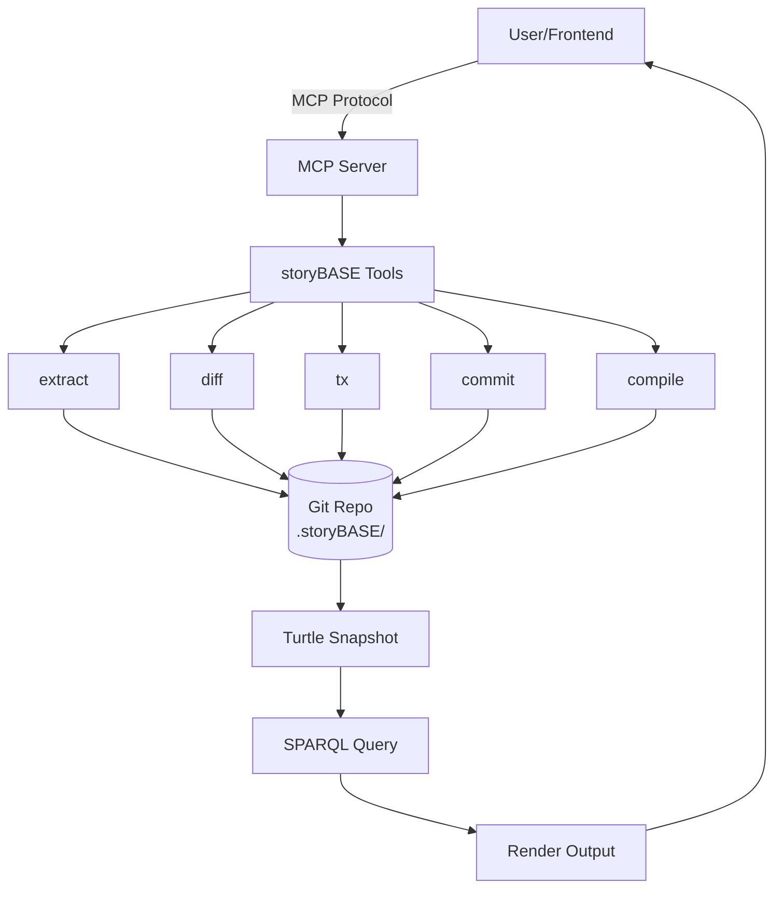
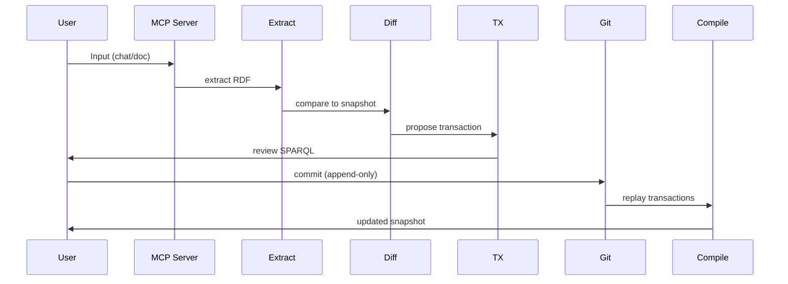
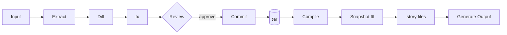
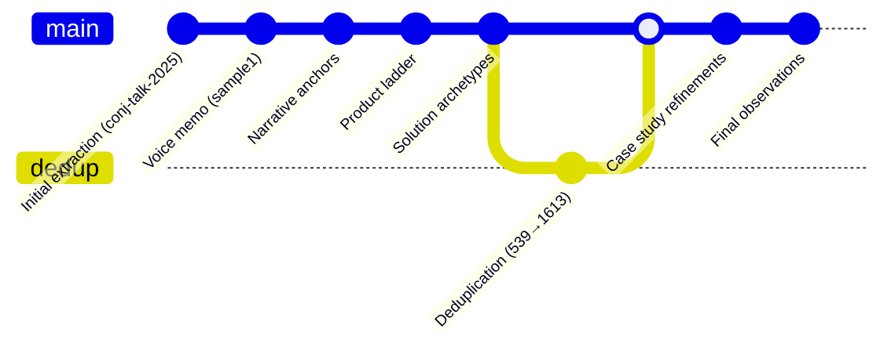
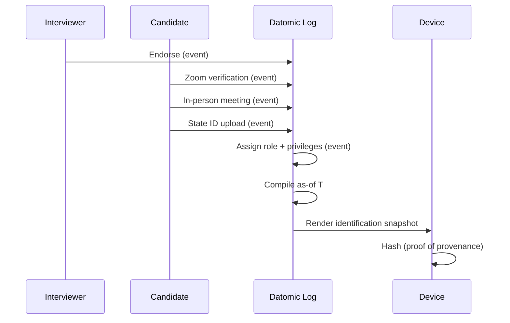

#### sic[theme][#theme]
# 
## storyBASE
### Git-Native RDF Knowledge Graph for Narrative-Driven AI
# 
#### Scarlet Dame
###### Founder, Sic
	[#theme]: Custom presentation theme for storyBASE; brand stylization follows CamelCase with uppercase suffix pattern documented in narr:StyleObs_storyBASE (Tx_20251110T184512Z_sample1).

---
# Identity as compiled from immutable history

The storyBASE is a Git-native RDF knowledge graph that makes AI memory versionable, branchable, and deterministic—applying the same append-only log pattern we use for code to narrative, strategy, and identity.

	This presentation demonstrates the core thesis: identity and content derive from append-only logs with as-of-T snapshots, enabling provenance and deterministic evolution[][#thesis]. The talk itself is compiled from this storyBASE.
	[#thesis]: Core narrative from narr:Narrative_1 and narr:Obs_Narrative_ImmutableIdentity (Tx_20251113T033534Z_claude45, Tx_20251113T200138Z_immutable_selves); related to narr:Mission_1 and narr:Vision_1.

---
## What is storyBASE?

---
###### RDF narrative source of truth
# AI that tells your story
## as written

	storyBASE is an RDF narrative source of truth that steers AI output, making it specific, controllable, and aligned with organizational worldview[][#product]. The tagline "AI that tells your story, as written" encodes both promise and brand[][#tagline].
	[#product]: From storybase.synthetic-identity.co/product/what-is-storybase (Tx_2025-01-29T000000Z_sic-storybase-checkin).
	[#tagline]: narr:Tagline_AsWritten (Tx_20251113T030805Z_conj2025); 7-word tagline encoding promise and brand.

---
### The Pattern
# 
## Append-only log → Snapshot as-of T → Render target

	The canonical flow: interact → event → handler → transactor → append → compile as-of T → query → render → interact[][#loop]. This is the immutable identity loop that powers both human identification (berecognized.id) and AI memory (aswritten.ai).
	[#loop]: narr:Obs_Flow_CoreLoop (Tx_20251113T200138Z_immutable_selves); sequenced behaviors delivering end-to-end identity compilation.

---
## The Architecture

---
###### System Topology
### n8n orchestrates tools
### MCP exposes to frontends
### Transactions in .storyBASE directories

	n8n agent orchestrates tools; MCP server exposes to frontends (Agent.ai, ChatGPT, Open WebUI); transactions stored in .storyBASE directories; hierarchical compile; Docker Compose on Digital Ocean[][#topology].
	[#topology]: storybase.synthetic-identity.co/architecture/topology-storybase (Tx_2025-01-29T000000Z_sic-storybase-checkin).

	The data model lifecycle: append-only transaction log; immutable files; snapshot = replay of sorted transactions; provenance in TX step; future named graphs for add/remove[][#lifecycle].
	[#lifecycle]: storybase.synthetic-identity.co/model/data-lifecycle-storybase (Tx_2025-01-29T000000Z_sic-storybase-checkin).

---
## The Workflow

---
### Interactive Individuation
# 
#### extract → diff → tx → review → commit

	Interactive individuation: extract → diff → tx → review → commit. Automated ingestion: file upload → extraction → PR. Story generation triggered by transaction or .story file changes[][#process].
	[#process]: storybase.synthetic-identity.co/process/storybase (Tx_2025-01-29T000000Z_sic-storybase-checkin); related to narr:Behavior_1 "Normalize Transcription Against storyBASE" (Tx_20251113T033534Z_claude45).

---
## Two Systems, One Pattern

---
###### System: Human
# berecognized.id
###### Immutable Identification

	Device-to-device verification; identification and privileges change over time via Datomic append-only log[][#berecognized]. Flow: Change-privilege event → pure handler → tx-data → transactor appends to Datomic → compile as-of T → Datalog queries → render Identification[][#berecognized-flow].
	[#berecognized]: narr:CaseStudy_berecognized (Tx_20251113T200138Z_immutable_selves); related to narr:SolutionArchetype_BeRecognized (Tx_20251113T030805Z_conj2025).
	[#berecognized-flow]: narr:CaseStudy_berecognized_Intervention (Tx_20251113T200138Z_immutable_selves).

	Outcomes: Provenance ← append-only log; Equality (snapshot hashes) ← compile as-of + deterministic render; Offline ← render targets travel[][#berecognized-results].
	[#berecognized-results]: narr:CaseStudy_berecognized_Results (Tx_20251113T200138Z_immutable_selves).

---
###### System: AI
# aswritten.ai
###### Immutable AI Memory

	Chat ± API; deterministic AI perspective via RDF+git append-only log[][#aswritten]. Flow: Extract-narrative event → pure handler → triples/commit tx-data → transactor appends to RDF+git → compile as-of commit → SPARQL queries → render AI memory[][#aswritten-flow].
	[#aswritten]: narr:CaseStudy_aswritten (Tx_20251113T200138Z_immutable_selves); related to narr:SolutionArchetype_AsWritten (Tx_20251113T030805Z_conj2025).
	[#aswritten-flow]: narr:CaseStudy_aswritten_Intervention (Tx_20251113T200138Z_immutable_selves).

	Outcomes: Versioning/Branching ← git log; Deterministic perspective as-of T ← compile + pure render; Provenance ← commit history + citations[][#aswritten-results].
	[#aswritten-results]: narr:CaseStudy_aswritten_Results (Tx_20251113T200138Z_immutable_selves).

---
## The Leverage

---
### Small choice
# Immutability
## creates outsized effects

	Immutability enables equality, provenance, versioning, branching, generative testing, decentralization, and infinite read scale—for free[][#leverage]. This is the leverage profile: small choice (append-only) creates outsized effects across system.
	[#leverage]: narr:LeverageProfile_1 (Tx_20251111T214920Z_immutable_selves).

---
### The Trade-off
# 
#### Bottleneck at single transactor
# 
#### All logic in event clients

	What we gave up: distributed writes. Why worth it: consistency, provenance, auditability[][#tradeoff]. The transactor is just adding triples; all business logic lives in pure handlers at the edge.
	[#tradeoff]: narr:DesignTradeoff_1 (Tx_20251111T214920Z_immutable_selves).

---
## Current State

---
### Tools & Capabilities
# 
#### compile • extract • diff • tx • commit

	Compile (replay transactions to Turtle snapshot), extract (RDF from input), diff (semantic comparison), tx (propose transaction), commit (append-only to Git), story generation (YAML front matter + prompt to model outputs)[][#capabilities].
	[#capabilities]: storybase.synthetic-identity.co/module/storybase-capabilities (Tx_2025-01-29T000000Z_sic-storybase-checkin).

---
### Integrations
# 
#### GitHub • Open Router • Outseta • Helicone

	n8n workflows, MCP server, GitHub (version control), Apache Jena/Riot (future RDF ops), Docker Compose, Open WebUI, Outseta (auth/billing), Helicone (API monitoring), Open Router (model access)[][#integrations].
	[#integrations]: storybase.synthetic-identity.co/dependency/storybase-integrations (Tx_2025-01-29T000000Z_sic-storybase-checkin).

---
## The Roadmap

---
### Next
# 
#### SPARQL → TriG (named graphs)
#### SHACL validation
#### File ingestion via GitHub

	Move transactions from SPARQL to named graphs (TriG); add SHACL validation; implement evolved individuation pipeline (snapshot + message to transaction); file ingestion via GitHub; storyBASE marketplace; cost pass-through billing[][#roadmap].
	[#roadmap]: storybase.synthetic-identity.co/roadmap/narrative-storybase (Tx_2025-01-29T000000Z_sic-storybase-checkin).

---
## Who It's For

---
### Primary Actors
# 
#### Programming-literate entrepreneurs
#### Designers who manipulate worldview
#### Developers who see perspective changes

	Programming-literate entrepreneurs, designers, developers, consultants who manipulate worldview and see perspective changes[][#actors]. The positioning thesis: extend software development rigor (versioning, branching, collaboration) into strategy, content, marketing, organizational operations via RDF narrative source of truth[][#positioning].
	[#actors]: storybase.synthetic-identity.co/actor/primary-storybase (Tx_2025-01-29T000000Z_sic-storybase-checkin).
	[#positioning]: storybase.synthetic-identity.co/thesis/positioning-storybase (Tx_2025-01-29T000000Z_sic-storybase-checkin).

---
## The Proof

---
### This Talk
# 
## Meta-demonstration

	The talk itself exemplifies the reified change architecture and storyBASE workflow, showing iterative refinement from raw inputs to polished outputs[][#proof]. Every slide is compiled from the graph; every citation traces back to a transaction.
	[#proof]: narr:Proof_1 (Tx_20251113T033534Z_claude45); related to narr:CaseStudies and narr:Outcomes.

---
### Transaction History
# 
#### 13 transactions
#### 1,943 triples inserted
#### 689 duplicates deduplicated

	The storyBASE snapshot was compiled from 13 transactions across 9 days (2025-11-09 to 2025-11-13). Key transactions: initial extraction (Tx_20251109T223928Z_conj2025), voice memo analysis (Tx_20251110T184512Z_sample1), deduplication (dedupe.sparql), and final observations (Tx_20251113T200138Z_immutable_selves)[][#txhistory].
	[#txhistory]: Derived from SNAPSHOT transaction metadata; 1,943 triples inserted, 689 skipped duplicates, 0 deleted (compile stats).

---
## Style Profile

---
### Measured Characteristics
# 
#### Avg sentence: 18.5 words
#### Active voice: 82%
#### Jargon density: 15%

	Style metrics from narr:Metrics_Sample_1: average sentence ~18.5 words; 82% active voice; 15% jargon (domain terms); 78% conciseness (low filler)[][#metrics]. Short, punchy cadence with arrow notation; canonical terms enforced (append-only log, as-of T, render target)[][#style].
	[#metrics]: narr:Metrics_Sample_1 (Tx_20251113T200138Z_immutable_selves).
	[#style]: narr:StyleObs_Cadence_Loop, narr:Obs_KeyPhrase_AppendOnlyLog, narr:Obs_KeyPhrase_SnapshotAsOfT (Tx_20251113T200138Z_immutable_selves).

---
### Rubric Scores (0–5)
# 
#### Strategic Alignment: 5.0
#### Cadence: 4.5
#### Phrasing: 4.0

	Rubric assessment for Sample_1: Strategic Alignment 5.0 (thesis, mission, vision, key phrases all align to core narrative)[][#strategy]; Cadence 4.5 (short, punchy sentences; arrow notation; 'say it in one breath' flow)[][#cadence]; Phrasing 4.0 (domain verbs; stock phrases; canonical key phrases enforced)[][#phrasing].
	[#strategy]: narr:Assess_StrategicAlignment_Sample_1 (Tx_20251113T200138Z_immutable_selves).
	[#cadence]: narr:Assess_Cadence_Sample_1 (Tx_20251113T200138Z_immutable_selves); related to narr:StyleObs_Cadence_Loop.
	[#phrasing]: narr:Assess_Phrasing_Sample_1 (Tx_20251113T200138Z_immutable_selves); related to narr:Obs_KeyPhrase_AppendOnlyLog, narr:Obs_KeyPhrase_SnapshotAsOfT.

---
## Repository Structure

---
### .storyBASE/
# 
#### Transaction log (SPARQL)
#### Compiled snapshot (Turtle)

	Transactions stored as timestamped SPARQL files in .storyBASE/ directory; snapshot.ttl compiled by replaying sorted transactions; provenance tracked via prov:wasGeneratedBy linking to transaction activities[][#structure].
	[#structure]: Inferred from transaction file paths and storybase.synthetic-identity.co/model/data-lifecycle-storybase.

---
### .story files
# 
#### YAML front matter + prompt
#### Triggers GitHub Actions

	Story files contain YAML front matter (id, title, version, description, destination, model) plus prompt body; changes trigger GitHub Actions for story generation[][#stories]. Current stories: README.story, presenter.story, conj-talk-2025.story.
	[#stories]: From STORIES array in snapshot; related to storybase.synthetic-identity.co/module/storybase-capabilities.

---
## Key Transactions

---
### 2025-11-13T20:01:38Z
# Latest observations

	Tx_20251113T200138Z_immutable_selves: Added comprehensive observations for Immutable Selves talk—tagline, mission, vision, key phrases (append-only log, snapshot as-of T, identity surface), core loop flow, case studies (berecognized.id, aswritten.ai), sales deck story arc, rubric assessments, style metrics[][#latest].
	[#latest]: narr:Tx_20251113T200138Z_immutable_selves; generated 40+ nodes including narr:Obs_Tagline_1, narr:Obs_Mission_1, narr:Obs_Vision_1, narr:CaseStudy_berecognized, narr:CaseStudy_aswritten.

---
### 2025-11-13T04:17:05Z
# Deduplication

	Consolidated 539 duplicate triples into 1,613 canonical records[][#dedup]. Merged Sample_1 metadata; linked equivalent narratives with owl:sameAs; consolidated style observations by linguistic feature; aggregated metrics (rolling average); marked deprecated versions.
	[#dedup]: dedupe.sparql transaction; narr:Tx_Deduplication_20251113 metadata.

---
### 2025-11-13T03:08:05Z
# Conj presentation extraction

	First extraction from Clojure/conj 2025 presentation transcript (6,847 chars)[][#conj]. Captured narrative (Immutable Selves), themes (Functional Identity), actors (Human, AI), solution archetypes (berecognized.id, aswritten.ai), tagline, style observations (brand stylization, metaphors, anaphora, rhetorical questions), rubric assessments, metrics.
	[#conj]: narr:Tx_20251113T030805Z_conj2025; generated narr:Sample_ConjPresentation_2025, narr:Narrative_ImmutableIdentity, narr:Theme_FunctionalIdentity, narr:Actor_Human, narr:Actor_AI.

---
### 2025-11-10T18:45:12Z
# Voice memo analysis

	Transcribed voice memo outlining narrative architecture for identity-as-append-only-log talk; speaker: Scarlet Dame[][#voice]. Extracted themes (Immutable Identity, Transition as State Machine), actors (Scarlet Dame, Luke Vanderhart), anchor concept (Narrative Architecture), style observations (storyBASE brand, append-only log idiom, UI state machine metaphor), rubric assessments.
	[#voice]: narr:Tx_20251110T184512Z_sample1; generated narr:Sample_1, narr:Theme_ImmutableIdentity, narr:Actor_ScarletDame, narr:Anchor_NarrativeArchitecture.

---
## The Stories

---
### README.story
# State, Stories, Assets, Transactions

	Autogenerated README tracking storyBASE as written. Summarizes current state, each story's intent and relationship to whole, repository structure, and transaction history (sorted newest first)[][#readme].
	[#readme]: From STORIES[0]; destination: /, model: anthropic/claude-sonnet-4.5.

---
### presenter.story
# Repo presentation

	IA presenter template for talk presentation of the storyBASE. Focus on clear narrative statements in slide copy with brief talk tracks; use mermaid charts for flows/sequences/architecture[][#presenter].
	[#presenter]: From STORIES[1]; this presentation is the output of presenter.story.

---
### conj-talk-2025.story
# Immutable Selves Talk

	IA presenter template for the Immutable Selves Clojure/conj 2025 talk. Drafts the talk using storyBASE with clear narrative statements, talk tracks, and mermaid charts[][#conjtalk].
	[#conjtalk]: From STORIES[2]; related to narr:Sample_ConjPresentation_2025 and narr:Narrative_ImmutableIdentity.

---
## The Mission

---
# Move identity from mutable documents
## to compiled surfaces

	Move identity from mutable documents and profiles to compiled surfaces rendered from append-only logs and single sources of truth[][#mission]. Durable purpose: make identity deterministic, provable, and decentralized.
	[#mission]: narr:Mission_1 (Tx_20251111T214920Z_immutable_selves); related to narr:Obs_Mission_1 "Generalize append-only log pattern to identity" (Tx_20251113T200138Z_immutable_selves).

---
## The Vision

---
# Identity—human, synthetic, AI—
## rendered from immutable history

	A world where identity—human, synthetic, AI—is rendered from immutable history, enabling equality, provenance, and trust by design[][#vision]. Future state: identity systems that inherit Clojure's guarantees.
	[#vision]: narr:Vision_1 (Tx_20251111T214920Z_immutable_selves); related to narr:Obs_Vision_1 "Engineers apply the pattern in their domain" (Tx_20251113T200138Z_immutable_selves).

---
## Canonical Terms

---
### Key Phrases
# 
#### append-only log
#### snapshot (as-of T)
#### render target / identity surface

	Canonical terminology enforced across the graph: "Append-only log (single source of truth)" is the immutable event stream; "Snapshot (as-of T)" is the compiled view derived from log at specific time/commit; "Render target / Identity surface" is what gets shown/issued (ID, privileges, AI memory/perspective)[][#terms].
	[#terms]: narr:Obs_KeyPhrase_AppendOnlyLog, narr:Obs_KeyPhrase_SnapshotAsOfT, narr:Obs_KeyPhrase_IdentitySurface (Tx_20251113T200138Z_immutable_selves); avoid calling snapshot 'SSoT'.

---
## The Moat

---
### Git-native, versionable, branchable
# AI memory encoding style, conviction, narrative metrics

	Git-native, versionable, branchable AI memory encoding style, conviction, narrative metrics; replaces brittle role prompts with deep, operable persona descriptions[][#moat]. Clojure ecosystem (Datomic, datalog, re-frame) as proof-of-concept; 13 years of production experience; provenance and equality by design[][#moat2].
	[#moat]: storybase.synthetic-identity.co/leverage/moat-storybase (Tx_2025-01-29T000000Z_sic-storybase-checkin).
	[#moat2]: narr:MoatLeverage_1 (Tx_20251111T214920Z_immutable_selves).

---
## Timing Thesis

---
### Why Now
# 
#### Prompt engineering maturity
#### Multi-agent workflows
#### Demand for organizational AI memory

	Convergence of prompt engineering maturity, multi-agent workflows, and demand for organizational AI memory creates window for narrative-driven context management[][#timing]. High-quality AI output requires extensive context; current models use search, but RDF-based narrative source of truth enables specific, controllable, versionable AI memory[][#opportunity].
	[#timing]: storybase.synthetic-identity.co/thesis/timing-storybase (Tx_2025-01-29T000000Z_sic-storybase-checkin); timestamp window 2024-2026.
	[#opportunity]: storybase.synthetic-identity.co/opportunity/storybase-market (Tx_2025-01-29T000000Z_sic-storybase-checkin).

---
## From Backbone to Om

---
### Identity is not mutable state
# Yet we're treating it like Backbone.js

	Core analogy: identity systems today are Backbone.js (query DOM, mutate picture); this is Om for identity (state machine, pure function render)[][#comparison]. When to use: when provenance, auditability, and equality matter more than write throughput.
	[#comparison]: narr:ComparativeAnalysis_1 (Tx_20251111T214920Z_immutable_selves); related to narr:StyleObs_Metaphor_1 (Tx_20251113T030805Z_conj2025).

---
### The Evolution
# 
#### 2012: Backbone.js (mutate DOM)
#### 2013: Om (state machine)
#### 2025: Immutable Selves

	Speaker's 13-year career in Clojure; evolution from Backbone.js (2012) to Om (2013) to production systems at scale[][#case]. Applied Clojure principles (immutability, pure functions, single source of truth) to UI, then identity systems (berecognized.id, aswritten.ai). Results: provenance, equality, versioning, decentralization, infinite read scale achieved; systems in production[][#results].
	[#case]: narr:CaseStudy_1, narr:CaseContext_1, narr:CaseIntervention_1 (Tx_20251111T214920Z_immutable_selves).
	[#results]: narr:CaseResults_1 (Tx_20251111T214920Z_immutable_selves).

---
## The Pattern Applied

---
### Reified Change
# 
#### Make state explicit
#### Append-only log → Single source of truth
#### Render as pure function → Deterministic UIs

	Reified change design pattern from Clojure principles: immutability and explicit state management enable provenance, equality, and offline capability[][#pattern]. System properties: immutability provides equality and provenance (transaction log ensures auditability)[][#property1]; distributed decentralization (reads scale linearly; data model exists off-server)[][#property2].
	[#pattern]: narr:Claim_ReifiedChangePattern (Tx_20251113T032552Z_sample1); supports narr:DataModelLifecycle and narr:ReliabilityResilience.
	[#property1]: narr:SystemProperty_ImmutabilityProvenance (Tx_20251113T032552Z_sample1); evidenced by narr:CaseStudy_BeRecognizedID and narr:CaseStudy_AsWrittenAI.
	[#property2]: narr:SystemProperty_DistributedDecentralization (Tx_20251113T032552Z_sample1).

---
## Future Vision

---
### Deterministic AI perspective 'as-of T'
# for graph queries

	Examples: full talk as query, section of talk, talk evolution over time, any accessible graph subset within billion-node graph[][#future]. Close with examples of such queries, then link to chat for participants to engage with narrative source of truth.
	[#future]: narr:FutureVision_DeterministicAI (Tx_20251113T032552Z_sample1); supports narr:CaseStudy_AsWrittenAI.

---
## Risk: Ghost Labor

---
### Bad actors deepfaking candidates
# passing interviews, collecting paychecks

	Ghost labor & impersonation risk: bad actors (individuals or state actors like North Korea) deepfaking candidates, passing interviews, collecting paychecks on behalf of fake identities[][#risk]. Mitigated by continuous identity establishment via append-only log.
	[#risk]: narr:Risk_GhostLabor (Tx_20251113T032552Z_sample1); challenges narr:CaseStudy_BeRecognizedID.

---
## Employee Lifecycle

---
### Continuous Identity
# 
#### Endorsement → Zoom → in-person → state ID
#### → assigned role → 'as-of' query → device snapshot

	Endorsement by interviewer → Zoom calls → in-person meetings → state ID uploads → assigned role with privileges → 'as-of' query compiles snapshot (digital identification) on device[][#lifecycle]. This flow supports berecognized.id case study.
	[#lifecycle]: narr:Flow_EmployeeLifecycle (Tx_20251113T032552Z_sample1); related to narr:Behaviors and narr:Storyboards.

---
## Now Go and Build

---
### Apply the pattern in your domain
# 
#### Model events
#### Write pure handlers
#### Transact to append-only store
#### Compile as-of T
#### Render surface

	The vision: engineers apply the pattern in their domain—model events, write handlers, transact to append-only store, compile as-of T, render surface[][#vision-action]. Same principles apply across UI, identity, and AI; immutability is the unlock; single transactor is acceptable bottleneck[][#lessons].
	[#vision-action]: narr:Obs_Vision_1 (Tx_20251113T200138Z_immutable_selves).
	[#lessons]: narr:CaseLessons_1 (Tx_20251111T214920Z_immutable_selves).

---
## Chat with the storyBASE

For more, explore the graph at [aswritten.ai](https://aswritten.ai)

	This presentation was compiled from storyBASE snapshot generated 2025-11-13T20:17:58.972Z; 1,943 triples; 13 transactions; provenance traceable to source samples and style observations[][#meta].
	[#meta]: Snapshot metadata; demonstrates narr:Proof_1 "Meta-Demonstration: Talk Creation Process" (Tx_20251113T033534Z_claude45).