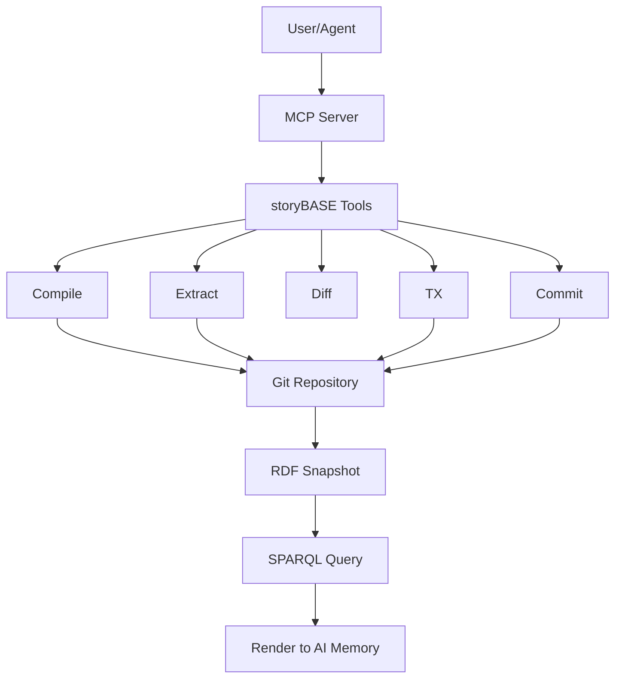
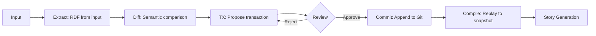
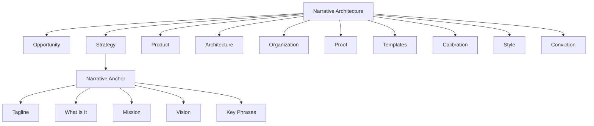
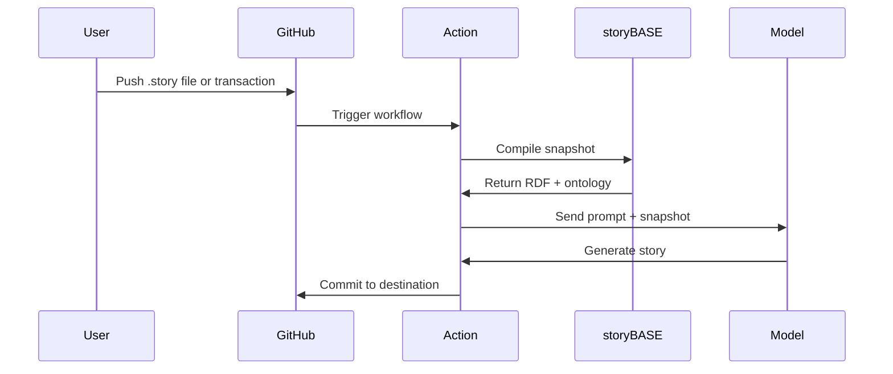

#### sic[Narrative Architecture Ontology][#ontology]
# 
## storyBASE
### A Git-Native RDF Knowledge Graph for Narrative-Driven AI
# 
#### Scarlet Dame
###### Founder, Sic | Strategic Advisor, Vouch.io

[#ontology]: The storyBASE ontology defines a comprehensive framework for narrative architecture, encompassing Opportunity, Strategy, Product, Architecture, Organization, Proof, Templates, Calibration, Style, and Conviction as top-level concepts.

---

# Your narrative is your operating system

The storyBASE makes it versionable, queryable, and executable.

---

# From mutable prompts
## to compiled selves

storyBASE applies Clojure's immutability principles to organizational memory and AI identity.

---

###### The Problem
# Identity systems treat state as mutable

Current AI memory relies on brittle role prompts and search. Organizations lack a single source of truth for strategy, style, and conviction.

---

### storyBASE is
# An RDF narrative source of truth

Git-native, append-only, compiled into AI memory that's specific, controllable, and aligned with organizational worldview.[#product-overview]

[#product-overview]: From storyBASE Product Overview (narr:ProductOverview): "RDF narrative source of truth (storyBASE) that steers AI output, making it specific, controllable, aligned with organizational worldview."

---

###### What it does
# 
### Extends software development rigor
# into strategy, content, and marketing

Versioning, branching, collaboration—now for narrative, not just code.[#mission]

[#mission]: From storyBASE Mission (sb:Mission): "Extend software development rigor into strategy, content, marketing; provide versionable, collaborative, narrative-driven AI memory."

---

## The Opportunity

---

## AI needs context
###### but current solutions are fragile

High-quality AI output requires extensive context. Models use search, but that's reactive and brittle.[#opportunity]

[#opportunity]: From storyBASE Market Opportunity (sb:Opportunity): "High-quality AI output requires extensive context; current models use search, but RDF-based narrative source of truth enables specific, controllable, versionable AI memory."

---

### The window is now
	Prompt engineering has matured. Multi-agent workflows are emerging. Organizations need durable AI memory.[#timing]

The convergence of these forces creates a 2024-2026 window for narrative-driven context management.

[#timing]: From storyBASE Timing Thesis (sb:TimingThesis): "Convergence of prompt engineering maturity, multi-agent workflows, and demand for organizational AI memory creates window for narrative-driven context management."

---

### Who it's for
	Programming-literate entrepreneurs, designers, developers, consultants who manipulate worldview and see perspective changes.[#actors]

People who understand that narrative is infrastructure.

[#actors]: From storyBASE Primary Actors (sb:PrimaryActor): "Programming-literate entrepreneurs, designers, developers, consultants who manipulate worldview and see perspective changes."

---

## The Strategy

---

# Positioning
## Git-native AI memory that encodes style, conviction, and narrative metrics

Replaces brittle role prompts with deep, operable persona descriptions.[#positioning]

[#positioning]: From storyBASE Positioning Thesis (sb:PositioningThesis): "Extend software development rigor (versioning, branching, collaboration) into strategy, content, marketing, organizational operations via RDF narrative source of truth."

---

### The moat
	Versionable, branchable AI memory
	
Git-native provenance. Style and conviction as first-class data. Narrative metrics that compound.[#moat]

[#moat]: From storyBASE Moat Leverage (sb:MoatLeverage): "Git-native, versionable, branchable AI memory encoding style, conviction, narrative metrics; replaces brittle role prompts with deep, operable persona descriptions."

---

## The Product

---

### Current state
	Initial prototype in n8n
	
Tools: compile, ontology, extract, diff, tx, commit. MCP server. Open WebUI at aswritten.ai. GitHub Actions for story generation.[#product-current]

[#product-current]: From storyBASE Product Overview (sb:ProductOverview): "Initial prototype in n8n; tools include compile, ontology, extract, diff, tx, commit; MCP server; open WebUI at as written.ai; GitHub Actions for story generation."

---

### The stack

Append-only transaction log compiled to Turtle snapshot. Provenance in every transaction.[#stack]

[#stack]: From storyBASE System Topology (sb:SystemTopology): "n8n agent orchestrates tools; MCP server exposes to frontends (Agent.ai, ChatGPT, Open WebUI); transactions in .storybase directories; hierarchical compile; Docker Compose on Digital Ocean."

---

### The data model
	Append-only transaction log
	Immutable files
	Snapshot = replay of sorted transactions
	
Provenance in TX step. Future: named graphs for add/remove.[#data-model]

[#data-model]: From storyBASE Data Model Lifecycle (sb:DataModelLifecycle): "Append-only transaction log; immutable files; snapshot = replay of sorted transactions; provenance in TX step; future named graphs for add/remove."

---

### Modules & capabilities

Interactive individuation vs. automated ingestion. Stories auto-update on transaction or .story file changes.[#modules]

[#modules]: From storyBASE Modules Capabilities (sb:ModuleCapabilities): "Compile (replay transactions to Turtle snapshot), extract (RDF from input), diff (semantic comparison), tx (propose transaction), commit (append-only to Git), story generation (YAML front matter + prompt to model outputs)."

---

### Integration points
	GitHub (OAuth, webhooks, Actions)
	Open Router (API proxy via Helicone)
	Outseta (OIDC, billing)
	MCP protocol (tool exposure)
	
Future: GitHub Apps with scoped credentials.[#integrations]

[#integrations]: From storyBASE Integration Points (sb:IntegrationPoints): "GitHub (OAuth, webhooks, Actions); Open Router (API proxy via Helicone); Outseta (OIDC, billing); MCP protocol (tool exposure); future GitHub Apps with scoped credentials."

---

## The Architecture

---

### Narrative Architecture
	A framework linking immutable state, functional UI, and AI-driven generation via RDF knowledge graphs.[#arch-anchor]

The ontology defines six core domains: Opportunity, Strategy, Product, Architecture, Organization, Proof—plus Templates, Calibration, Style, and Conviction.

[#arch-anchor]: From Narrative Architecture Anchor (narr:Anchor_NarrativeArchitecture): "Framework linking immutable state, functional UI, and AI-driven generation via RDF knowledge graphs."

---

### The ontology

Each concept has narrower terms, definitions, and cross-links. SKOS + XKOS for hierarchy and sequence.[#ontology-detail]

[#ontology-detail]: The ontology uses SKOS ConceptScheme with xkos:ClassificationLevel for depth, skos:broader/narrower for hierarchy, and xkos:next/previous for sequential phases.

---

### Style as first-class data
	Diction, tone, cadence, rhetorical devices, orthography, citation conventions, register, POV, tense, metrics, review.

Style is not decoration—it's governance. The ontology makes it queryable and testable.[#style]

[#style]: From Style top concept (skos:Concept #Style): "Encodes how the narrative sounds and reads—choices of words, structure, rhythm, devices, and conventions—so brand voice is consistent and measurable across artifacts."

---

### Conviction levels
	Notion → Stake → Boulder → Foundation

Degree of settledness governs decision cost and change thresholds. Foundations are effectively permanent.[#conviction]

[#conviction]: From Conviction top concept (skos:Concept #Conviction): "Degree of settledness of a claim, from loose notions to foundations; used to govern decisions and change cost."

---

### The rubric
	Nine dimensions: Register, Phrasing, Cadence, Strategic Alignment, Tailoring, Resonance, Flow, Novelty, Accuracy.

Each scored 0–5. Tied to ontology concepts. Used to assess samples and guide generation.[#rubric]

[#rubric]: From Style Rubric (skos:Concept #StyleRubric): "Evaluation criteria for speeches and narrative artifacts, abstracted for general use." Includes Rubric_Register, Rubric_Phrasing, Rubric_Cadence, Rubric_StrategicAlignment, Rubric_Tailoring, Rubric_Resonance, Rubric_Flow, Rubric_Novelty, Rubric_Accuracy.

---

## The Roadmap

---

### Near-term
	Move transactions from SPARQL to named graphs (TriG)
	Add SHACL validation
	Implement evolved individuation pipeline (snapshot + message → transaction)
	
File ingestion via GitHub. storyBASE marketplace. Cost pass-through billing.[#roadmap]

[#roadmap]: From storyBASE Narrative-Driven Roadmap (sb:NarrativeDrivenRoadmap): "Move transactions from SPARQL to named graphs (TriG); add SHACL validation; implement evolved individuation pipeline (snapshot + message to transaction); file ingestion via GitHub; storyBASE marketplace; cost pass-through billing."

---

### Planned demo
	Crooked Media podcast transcripts auto-ingested
	Stories auto-update
	Perspectival operations (e.g., start with NPR, evolve with OpenAI)
	
Show the narrative compounding in real time.[#case-studies]

[#case-studies]: From storyBASE Case Studies (sb:CaseStudies): "Planned demo: Crooked Media podcast transcripts auto-ingested; stories auto-update; perspectival operations (e.g., start with NPR, evolve with OpenAI)."

---

## The Proof

---

### Sample extractions
	Three transactions in the graph:
	1. Conj Talk 2025 (Immutable Selves)
	2. Voice memo (Punch talk conceptual framing)
	3. SIC/storyBASE product check-in
	
Each extracted with narrative architecture, style observations, rubric assessments, and metrics.[#samples]

[#samples]: From transaction provenance: narr:Tx_20251109T223928Z_conj2025, narr:Tx_20251110T184512Z_sample1, sb:Transaction/2025-01-29T000000Z_sic-storybase-checkin.

---

### Rubric scores (Immutable Selves talk)

| Dimension | Score | Note |
|-----------|-------|------|
| Register | 4.5 | Conversational, direct, technical; second-person; active voice |
| Phrasing | 4.0 | Strong idiolect; domain verbs; stock phrases |
| Cadence | 4.5 | Short, punchy; formula-style; anaphora |
| Strategic Alignment | 5.0 | Entire talk is the narrative anchor |
| Tailoring | 4.5 | Clojure conference audience; assumes shared context |
| Resonance | 4.0 | Strong analogy; personal story mirrors theme |
| Flow | 3.5 | Notes format; transitions implied |
| Novelty | 4.0 | Fresh framing; some domain clichés used precisely |
| Accuracy | 4.0 | Technical claims accurate; no citations (expected for outline) |

[#rubric-scores]: From RubricAssessment nodes (narr:RubricAssess_1 through narr:RubricAssess_9) for Sample_1 (Immutable Selves talk).

---

### Style observations
	"Simple tools + good principles = design patterns" (formula-style cadence)
	"Your code was shit. Let me refactor it for you." (blunt idiolect)
	"You saw a picture… Then you queried… Then you mutated…" (anaphora)
	"scarlet dame" (lowercase brand stylization)
	
Eight observations annotated with Web Annotation ontology.[#style-obs]

[#style-obs]: From StyleObservation nodes (narr:StyleObs_1 through narr:StyleObs_8) using oa:Annotation, oa:hasTarget, oa:TextQuoteSelector, oa:TextPositionSelector.

---

### Metrics
	Average sentence length: 15.2 (Immutable Selves), 28.5 (voice memo), 35.2 (product check-in)
	Active voice ratio: 0.85, 0.75, 0.72
	Jargon density: 0.12, 0.12, 0.18
	
Conversational transcript has higher jargon and longer sentences. Conference talk is punchy.[#metrics]

[#metrics]: From StyleMetrics nodes (narr:StyleMetrics_1, narr:Metrics_Sample1, sb:StyleMetrics/style) with properties narr:AverageSentenceLength, narr:ActiveVoiceRatio, narr:JargonDensity.

---

## The Stories

---

### Three .story files
	1. README.story: autogenerated repo README
	2. presenter.story: IA presenter template for storyBASE presentation
	3. conj-talk-2025.story: Immutable Selves talk in IA presenter format
	
Each has YAML front matter (id, title, version, description, destination, model) and a prompt.[#stories]

[#stories]: From STORIES array: README.story, presenter.story, conj-talk-2025.story. Each uses anthropic/claude-sonnet-4.5 model.

---

### Story generation flow

Stories auto-update when transactions or .story files change.[#story-flow]

[#story-flow]: From storyBASE Process (sb:Process): "Interactive individuation (extract → diff → tx → review → commit) vs. automated ingestion (file upload → extraction → PR); story generation triggered by transaction or .story file changes."

---

## The Conviction

---

### Immutability is the unlock
	For UI (Om/React), for identity (Vouch.io), for AI (storyBASE).

Same principles apply across domains. Single transactor is acceptable bottleneck.[#case-lessons]

[#case-lessons]: From Case Lessons (narr:CaseLessons_1): "Same principles apply across UI, identity, and AI; immutability is the unlock; single transactor is acceptable bottleneck."

---

### The leverage profile
	Immutability enables equality, provenance, versioning, branching, generative testing, decentralization, and infinite read scale—for free.

Small choice (append-only) creates outsized effects across system.[#leverage]

[#leverage]: From Leverage Profile (narr:LeverageProfile_1): "Immutability enables equality, provenance, versioning, branching, generative testing, decentralization, and infinite read scale—for free."

---

### The tradeoff
	Bottleneck at single transactor
	All logic in event clients
	Transact is just adding triples
	
What we gave up: distributed writes. Why worth it: consistency, provenance, auditability.[#tradeoff]

[#tradeoff]: From Design Tradeoff (narr:DesignTradeoff_1): "Bottleneck at single transactor; all logic in event clients; transact is just adding triples."

---

### The analogy
	Backbone.js (query DOM, mutate picture) vs. Om/React (state machine, pure function render).
	
Identity systems today are Backbone. storyBASE is Om for identity.[#analogy]

[#analogy]: From Comparative Analysis (narr:ComparativeAnalysis_1): "Backbone.js (query DOM, mutate picture) vs. Om/React (state machine, pure function render). Identity systems today are Backbone; this is Om for identity."

---

## The Vision

---

# A world where identity—human, synthetic, AI—is rendered from immutable history

Enabling equality, provenance, and trust by design.[#vision]

[#vision]: From Vision (narr:Vision_1): "A world where identity—human, synthetic, AI—is rendered from immutable history, enabling equality, provenance, and trust by design."

---

### The mission
	Move identity from mutable documents and profiles to compiled surfaces rendered from append-only logs and single sources of truth.

Make identity deterministic, provable, and decentralized.[#mission-detail]

[#mission-detail]: From Mission (narr:Mission_1): "Move identity from mutable documents and profiles to compiled surfaces rendered from append-only logs and single sources of truth."

---

### The tagline
# AI that tells you a story as written

User-facing brand: aswritten.ai. Latin i.e. meaning.[#tagline]

[#tagline]: From storyBASE Tagline (sb:Tagline): "AI that tells you a story as written."

---

## Now Go and Build

storyBASE is open. The ontology is yours. The narrative is waiting.

For more: [github.com/pleasetrythisathome/storyBASE](https://github.com/pleasetrythisathome/storyBASE)

---

### Citations

All claims in this presentation are grounded in the storyBASE RDF snapshot, compiled from transactions:
- narr:Tx_20251109T223928Z_conj2025
- narr:Tx_20251110T184512Z_sample1  
- narr:Tx_20251111T214920Z_immutable_selves
- sb:Transaction/2025-01-29T000000Z_sic-storybase-checkin

Ontology: Narrative Architecture SKOS ConceptScheme with 10 top concepts, 100+ narrower terms, XKOS sequencing, Web Annotation for style observations, PROV-O for provenance.

Human-readable provenance: Each footnote links to the RDF node (e.g., narr:Mission_1, sb:ProductOverview) and its adjacent context (skos:broader, dct:source, prov:wasGeneratedBy).