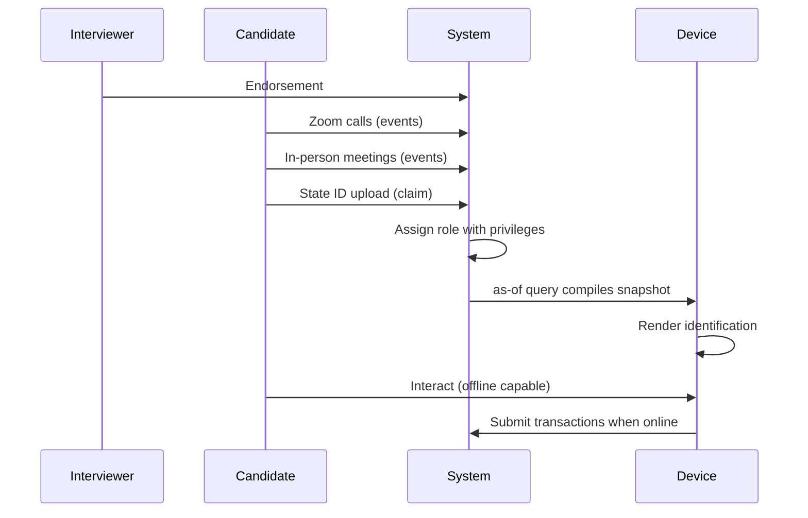
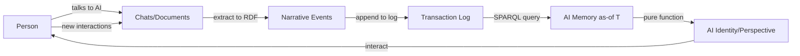

#### sic[#theme]
# 
## Immutable Selves
### A Functional Approach to Digital Identity
# 
#### Scarlet Dame
###### Founder, Sic · Former Chief Strategist, Vouch.io
	[#theme]: Custom theme for Sic brand. Source: narr:Sample_ConjPresentation_2025, narr:Actor_ScarletDame with altLabels "Dylan Butman" and "Scarlet Spectacular" demonstrating the speaker's identity history as an append-only log (narr:Tx_20251113T030805Z_conj2025).

---
# Identity is not mutable state
## Yet we're treating it like Backbone.js

This opening frames the core thesis using a technical metaphor familiar to the Clojure audience. The comparison positions current identity systems as anti-patterns—mutable DOM manipulation rather than functional rendering.[#metaphor]

[#metaphor]: narr:StyleObs_Metaphor_1 from narr:Sample_ConjPresentation_2025: "Technical metaphor: identity as mutable state vs. immutable log; Backbone.js as anti-pattern" (narr:Tx_20251113T030805Z_conj2025).

---
###### Who am I?
# I became
## scarlet dame

The personal narrative begins here. The speaker's identity evolution—from Dylan Butman to Scarlet Spectacular to scarlet dame—exemplifies the append-only log model where past states remain immutable while new states compile forward.[#identity-history]

[#identity-history]: narr:Actor_ScarletDame with note "Speaker's identity history exemplifies append-only log model" (narr:Tx_20251110T184512Z_sample1). The lowercase stylization is captured in narr:StyleObs_4 as "Lowercase personal brand; stylization choice."

---
### Where is the identity here?
# Who is the authority?
## What are the claims being made?

Three rhetorical questions frame the problem space and invite the audience to reason about identity primitives. This triadic structure creates rhythm and engagement.[#rhetorical-questions]

[#rhetorical-questions]: narr:StyleObs_RhetoricalQuestion_1 from narr:Sample_ConjPresentation_2025: "Triadic rhetorical questions; frames problem space and invites audience reasoning" with skos:related to narr:RuleOfThree (narr:Tx_20251113T030805Z_conj2025).

---
## The state of California
### issues documents that
# make claims about you

This slide introduces the human identity model: authorities issue documents containing claims. The second-person "you" creates direct, conversational engagement.[#second-person]

[#second-person]: narr:StyleObs_SecondPerson_1 from narr:Sample_ConjPresentation_2025 with note "Direct address 'you'; conversational, inclusive tone" related to narr:ToneDirectPersonal (narr:Tx_20251113T030805Z_conj2025).

---
###### Human Identity
# 
# Source of truth
## You.

A punchy, single-word answer after the setup. This exemplifies the "short and punchy cadence" characteristic of the speaker's style—confident, direct, memorable.[#punchy]

[#punchy]: narr:StyleObs_ShortPunchy_1 from narr:Sample_ConjPresentation_2025: "Single-word answer 'You.' after setup; punchy, direct, confident" related to narr:ToneDirectPersonal (narr:Tx_20251113T030805Z_conj2025).

---
#### Authorities issue documents that 
# make claims about you.
# 
## Identification represents
### a compiled snapshot

The transition from "you" as source of truth to "identification" as compiled representation establishes the core pattern: identity is rendered from immutable facts, not mutated in place.[#compiled-identity]

[#compiled-identity]: Connects narr:Actor_Human ("Source of truth for identity; authorities issue documents that make claims") to narr:Theme_FunctionalIdentity ("Apply Clojure design patterns—immutability, reified change, single source of truth—to identity systems") via narr:Tx_20251113T030805Z_conj2025.

---
## Clojure Design Patterns
# 
## No frameworks
# Simple tools ± good principles

This is a stock phrase from the Clojure community—an insider signal that establishes shared values and context with the audience.[#stock-phrase]

[#stock-phrase]: narr:StyleObs_StockPhrase_1 from narr:Sample_ConjPresentation_2025: "Clojure community idiom; signals insider knowledge and shared values" related to narr:IdiolectPhrasing (narr:Tx_20251113T030805Z_conj2025).

---
###### When I got my lanyard
### I had one principle
# Your code was shit
## Let me refactor it for you

Personal story: the speaker's entry into programming via Backbone.js. The blunt phrasing is characteristic idiolect—direct, memorable, and establishes credibility through vulnerability.[#idiolect]

[#idiolect]: narr:StyleObs_2 from narr:Sample_1: "Characteristic blunt phrasing; speaker idiolect" broader than narr:StockPhrases (narr:Tx_20251111T214920Z_immutable_selves).

---
### Anyone remember Backbone.js?

A rhetorical question that assumes shared context and sets up the technical comparison. This engages the audience by activating their own experience.[#engagement]

[#engagement]: narr:StyleObs_6 from narr:Sample_1: "Engages audience; assumes shared context" broader than narr:RhetoricalQuestion (narr:Tx_20251111T214920Z_immutable_selves).

---
### You saw a picture (the DOM)
# Then you queried the picture
## Then you mutated the picture

Anaphora—repeated "Then you" structure—creates rhythm and emphasizes the anti-pattern. The verb "mutated" carries negative connotation in functional programming.[#anaphora]

[#anaphora]: narr:StyleObs_3 from narr:Sample_1: "Repeated 'Then you' structure; rhetorical device for emphasis" broader than narr:Anaphora (narr:Tx_20251111T214920Z_immutable_selves). The verb choice is captured in narr:StyleObs_8: "Technical verb 'mutated' carries negative connotation in functional paradigm."

---
### I want to argue
# We still treat identity
## like Backbone.js

The core analogy made explicit: current identity systems (human and AI) follow the mutable DOM pattern rather than functional state management.[#core-analogy]

[#core-analogy]: narr:StyleObs_5 from narr:Sample_1: "Core analogy: identity systems = Backbone.js (mutable DOM)" broader than narr:Analogy (narr:Tx_20251111T214920Z_immutable_selves).

---
## Reified Change
# 
###### Make state explicit
# Append only log → Single source of truth
## Everyone sees the same thing
# Render as pure function → Deterministic UIs

This slide presents the functional programming pattern using anaphora and parallel structure. Each line follows the principle → pattern format, creating rhythm and memorability.[#pattern-rhythm]

[#pattern-rhythm]: narr:StyleObs_Anaphora_1 from narr:Sample_ConjPresentation_2025: "Repeated structural frame: principle → pattern; creates rhythm and memorability" related to narr:CadenceRhythm (narr:Tx_20251113T030805Z_conj2025).

---
###### Single Source of Truth
# 
## Experience is an append-only log 
# that compiles[][#as-of] to identity
	[#as-of]: The "as-of T" query pattern is canonical terminology captured in narr:StyleObs_9 from narr:Sample_1: "Canonical term for point-in-time query; appears multiple times" related to both narr:CaseStudy_BeRecognizedID and narr:CaseStudy_AsWrittenAI (narr:Tx_20251113T032552Z_sample1).

The core analogy connecting human experience to the Datomic model. This maps the personal (experience) to the technical (append-only log) to the rendered (identity).[#core-analogy-human]

[#core-analogy-human]: narr:StyleObs_Analogy_1 from narr:Sample_ConjPresentation_2025: "Core analogy: experience → log → compiled identity; maps human to Datomic model" related to narr:ResonanceUse (narr:Tx_20251113T030805Z_conj2025).

---
## System: Human
# berecognized.id
###### Immutable Identification

The first solution archetype: human identity via reified change. The system uses Datomic as SSoT, datalog queries, and device-to-device interaction.[#berecognized]

[#berecognized]: narr:SolutionArchetype_BeRecognized from narr:Sample_ConjPresentation_2025: "Human identity system: Datomic SSoT, datalog query, device-to-device interaction, change-privilege events" related to narr:ArchetypeTitle and narr:ApproachPattern (narr:Tx_20251113T030805Z_conj2025). Brand stylization captured in narr:StyleObs_BrandStylization_2: "Lowercase brand name with TLD; parallel to aswritten.ai."

---
### Employee Lifecycle
# Continuous Identity Establishment

This flow demonstrates how continuous identity establishment mitigates ghost labor risk—the threat of deepfaked candidates and impersonation fraud.[#ghost-labor]

[#ghost-labor]: narr:Flow_EmployeeLifecycle supports narr:CaseStudy_BeRecognizedID and relates to narr:Behaviors and narr:Storyboards (narr:Tx_20251113T032552Z_sample1). The risk is defined in narr:Risk_GhostLabor: "Bad actors (individuals or state actors like North Korea) deepfaking candidates, passing interviews, collecting paychecks on behalf of fake identities" with note "Mitigated by continuous identity establishment via append-only log."

---
###### The Problem
# Ghost labor
## Deepfaking candidates, passing interviews

The "ghost labor" metaphor makes the abstract threat concrete and memorable. The gerund "deepfaking" functions as an active verb—contemporary tech jargon that signals currency.[#metaphor-verb]

[#metaphor-verb]: narr:StyleObs_5 from narr:Sample_1: "'Ghost labor' metaphor for impersonation risk" related to narr:Risk_GhostLabor (narr:Tx_20251113T032552Z_sample1). Verb choice captured in narr:StyleObs_6 from narr:Sample_1: "Gerund 'deepfaking' as active verb; contemporary tech jargon."

---
### The Solution
# Establish continuous identity
## via append-only log

Short, declarative, imperative. This exemplifies the "short punchy cadence" that characterizes effective technical communication.[#imperative]

[#imperative]: narr:StyleObs_7 from narr:Sample_1: "Short declarative sentence; imperative tone" broader than narr:ShortPunchyCadence (narr:Tx_20251113T032552Z_sample1).

---
### System Properties
# Provenance
## Equality
### Decentralization

A triadic list of system benefits—the "rule of three" for memorability. These properties emerge from the immutability choice.[#rule-of-three]

[#rule-of-three]: narr:StyleObs_8 from narr:Sample_1: "Triadic list of system benefits" broader than narr:RuleOfThree (narr:Tx_20251113T032552Z_sample1). The properties are detailed in narr:SystemProperty_ImmutabilityProvenance ("Transaction log ensures auditability") and narr:SystemProperty_DistributedDecentralization ("Reads scale linearly; data model exists off-server").

---
## System: AI
# aswritten.ai
###### Immutable AI Memory

The second solution archetype: AI identity via the same pattern, different stack. RDF+git replaces Datomic, SPARQL replaces datalog, but the principle remains.[#aswritten]

[#aswritten]: narr:SolutionArchetype_AsWritten from narr:Sample_ConjPresentation_2025: "AI identity system: RDF+git SSoT, SPARQL query, chat+API interaction, extract-narrative events" related to narr:ArchetypeTitle and narr:ApproachPattern (narr:Tx_20251113T030805Z_conj2025). Brand stylization in narr:StyleObs_BrandStylization_1: "Lowercase brand name with TLD; consistent stylization."

---
###### The Problem
### My AI doesn't give the same answers
# as your AI

A rhetorical question that frames the AI memory problem in human terms. This makes the technical challenge emotionally resonant.[#ai-problem]

[#ai-problem]: narr:StyleObs_4 from narr:Sample_1: "Rhetorical question frames AI memory problem" related to narr:CaseStudy_AsWrittenAI (narr:Tx_20251113T032552Z_sample1). The case context states: "AI memory problem: 'My AI doesn't give the same answers as your AI'; need for narrative source of truth."

---
### The Solution
# AI memory as
## 'as-of T' snapshot
### (pure function)

The canonical "as-of T" terminology appears again, reinforcing the pattern across both human and AI systems. The parenthetical "(pure function)" connects to functional programming principles.[#as-of-pattern]

[#as-of-pattern]: narr:StyleObs_9 from narr:Sample_1 notes this is "Canonical term for point-in-time query; appears multiple times" related to both case studies (narr:Tx_20251113T032552Z_sample1). The pure function framing connects to narr:Primitive_3: "Deterministic transformation: SSoT → identity surface."

---
### Transaction Sequence
# 
#### 1. Person talks to AI
## 2. Extract chats/docs to RDF
# 
#### 3. Save to append-only log
## 4. AI memory = as-of T snapshot

Numbered list with parallel structure—imperative/declarative mix that creates clear, actionable steps. This parallelism aids comprehension and recall.[#parallel-structure]

[#parallel-structure]: narr:StyleObs_10 from narr:Sample_1: "Numbered list with parallel structure; imperative/declarative mix" broader than narr:Parallelism (narr:Tx_20251113T032552Z_sample1). The sequence is detailed in narr:CaseStudy_AsWrittenAI CaseIntervention.

---
### System Properties
# Provenance
## Equality  
### Decentralization/offline scale

The same triadic benefits appear for the AI system, demonstrating that the pattern generalizes. This repetition reinforces the core thesis.[#properties-ai]

[#properties-ai]: Same structure as human system (narr:StyleObs_8). Properties evidenced by both narr:CaseStudy_BeRecognizedID and narr:CaseStudy_AsWrittenAI via narr:SystemProperty_ImmutabilityProvenance and narr:SystemProperty_DistributedDecentralization (narr:Tx_20251113T032552Z_sample1).

---
## The Pattern
### Immutability
# enables
## equality, provenance, versioning, branching, decentralization

This is the leverage profile: small choice (append-only) creates outsized effects across the system. The list demonstrates compounding advantages.[#leverage]

[#leverage]: narr:LeverageProfile_1 from narr:Sample_1: "Immutability enables equality, provenance, versioning, branching, generative testing, decentralization, and infinite read scale—for free" with note "Small choice (append-only) creates outsized effects across system" (narr:Tx_20251111T214920Z_immutable_selves).

---
### What we gave up
# Distributed writes
## Single transactor bottleneck

Honest about tradeoffs: the design accepts a write bottleneck in exchange for consistency, provenance, and auditability. This transparency builds trust.[#tradeoffs]

[#tradeoffs]: narr:DesignTradeoff_1 from narr:Sample_1: "Bottleneck at single transactor; all logic in event clients; transact is just adding triples" with note "What we gave up: distributed writes. Why worth it: consistency, provenance, auditability" (narr:Tx_20251111T214920Z_immutable_selves).

---
### Why it's worth it
# Consistency
## Provenance  
### Auditability

Another triadic structure reinforcing the value exchange. The benefits outweigh the cost for use cases where these properties matter.[#value-exchange]

[#value-exchange]: Derived from narr:DesignTradeoff_1 note. Connects to narr:ComparativeAnalysis_1: "When to use: when provenance, auditability, and equality matter more than write throughput" (narr:Tx_20251111T214920Z_immutable_selves).

---
## Backbone → Om
### Mutable DOM → State machine
# 
## Identity systems today
### are Backbone
# This is Om for identity

The comparative analysis made explicit. Current identity systems query and mutate; this approach treats identity as a state machine with pure function rendering.[#comparison]

[#comparison]: narr:ComparativeAnalysis_1 from narr:Sample_1: "Backbone.js (query DOM, mutate picture) vs. Om/React (state machine, pure function render). Identity systems today are Backbone; this is Om for identity" (narr:Tx_20251111T214920Z_immutable_selves).

---
## Case Study: berecognized.id
### Human Identity via Reified Change

	Digital identification enables recognition and delegates authority to access, use, and transact with shared technology. Traditional systems use mutable credentials—passwords, keys, static IDs—that are siloed and vulnerable.[][#case-context]
	
	[#case-context]: narr:CaseStudy_BeRecognizedID CaseContext and narr:ProblemContext_1: "Passwords and digital keys are mutable, siloed, and vulnerable; no single source of truth for privileges" (narr:Tx_20251113T032552Z_sample1, narr:Tx_20251111T214920Z_immutable_selves).

---
### Approach
# Append-only log of facts
## Device-rendered snapshot
### Compiled at specific point in time

	The intervention: maintain an append-only log of facts about a person over time—employment, access, roles, interactions. The device compiles a snapshot at query time, enabling offline transactions and referential equality.[][#intervention]
	
	[#intervention]: narr:CaseStudy_BeRecognizedID CaseIntervention and narr:ApproachPattern_1: "SSoT (Datomic) → datalog query → render to identification/privileges → event-driven transactions → append-only log → recompile" (narr:Tx_20251113T032552Z_sample1, narr:Tx_20251111T214920Z_immutable_selves).

---
### Results
# Provenance for individual transactions
## Referential equality for free
### Offline transactions enabled

	The outcomes demonstrate the system properties in practice. Provenance is innate because every transaction is logged. Equality comes from immutability. Offline capability emerges from device-side compilation.[][#results-human]
	
	[#results-human]: narr:CaseStudy_BeRecognizedID CaseResults and narr:OutcomesProof_1: "Proof of provenance and authority innate; hash of last tx + SSoT state enables 'be recognized' property" (narr:Tx_20251113T032552Z_sample1, narr:Tx_20251111T214920Z_immutable_selves).

---
## Case Study: aswritten.ai
### AI Memory via Reified Change

	The AI memory problem: different contexts produce different answers. There's no narrative source of truth. This was formalized from manual processes at Vouch and is now automated.[][#ai-context]
	
	[#ai-context]: narr:CaseStudy_AsWrittenAI CaseContext and note: "Formalized architecture from manual process at Vouch; now automated" (narr:Tx_20251113T032552Z_sample1).

---
### Approach
# Extract chats/docs to RDF
## Save to append-only log
### AI memory as 'as-of T' snapshot

	The same pattern applied to AI: person talks to AI → extract to RDF narrative events → append to log → query compiles memory as pure function. The stack differs (RDF+git vs. Datomic) but the principle holds.[][#ai-intervention]
	
	[#ai-intervention]: narr:CaseStudy_AsWrittenAI CaseIntervention and narr:ApproachPattern_2: "SSoT (RDF + git) → SPARQL query → render to AI memory/identity → event-driven transactions → append-only log → recompile" with note "Same pattern, different stack: RDF instead of Datomic" (narr:Tx_20251113T032552Z_sample1, narr:Tx_20251111T214920Z_immutable_selves).

---
### Results
# Provenance, equality, decentralization
## Deterministic AI perspective
### for specific graph queries

	The same system properties emerge: provenance from transaction log, equality from immutability, offline scale from decentralization. Additionally, deterministic AI perspective enables querying the graph "as-of T" for reproducible results.[][#results-ai]
	
	[#results-ai]: narr:CaseStudy_AsWrittenAI CaseResults and narr:FutureVision_DeterministicAI: "Deterministic AI perspective 'as-of T' for graph queries" with examples "full talk as query, section of talk, talk evolution over time, any accessible graph subset within billion-node graph" (narr:Tx_20251113T032552Z_sample1).

---
## Future Vision
### Deterministic AI queries
# 
#### Full talk as query
## Section of talk
# 
#### Talk evolution over time
## Any graph subset

	Close with concrete examples of what becomes possible: query the full talk, a section, the evolution over time, or any accessible subset within a billion-node graph. Then link to chat for participants to engage with the narrative source of truth.[][#future]
	
	[#future]: narr:FutureVision_DeterministicAI with note "Close with examples of such queries, then link to chat for participants to engage with narrative source of truth" (narr:Tx_20251113T032552Z_sample1).

---
## Takeaways
# 
### 1. Identity as append-only log
#### 2. Identification as render target
### 3. Interaction as transaction

	Three actionable principles the audience can adopt. The parallel construction ("as X") creates rhythm and makes the framework memorable.[][#takeaways]
	
	[#takeaways]: Synthesized from narr:Narrative_ImmutableIdentity note: "Core thesis: experience is an append-only log; identification is a render target; interaction is transaction" (narr:Tx_20251113T030805Z_conj2025). Parallel structure relates to narr:Parallelism in the ontology.

---
###### 13 years of production experience
# Same principles
## UI → Identity → AI

	The speaker's credibility: 13 years applying these principles from Backbone.js (2012) to Om (2013) to production identity and AI systems. The personal journey validates the technical thesis.[][#credibility]
	
	[#credibility]: narr:CaseContext_1: "Speaker's 13-year career in Clojure; evolution from Backbone.js (2012) to Om (2013) to production systems at scale" with note "Customer: self; environment: professional dev career; stakes: credibility" (narr:Tx_20251111T214920Z_immutable_selves).

---
## AI that tells your story
# as written.

The tagline: 7 words encoding promise and brand. "as written" carries Latin i.e. meaning—"that is to say, exactly as stated"—reinforcing the deterministic, provenance-driven value proposition.[#tagline]

[#tagline]: narr:Tagline_AsWritten from narr:Sample_ConjPresentation_2025: "AI that tells your story, as written" with note "7-word tagline encoding promise and brand" (narr:Tx_20251113T030805Z_conj2025). Additional context from storyBASE check-in: "User-facing brand as written.ai; Latin i.e. meaning" (storybase.synthetic-identity.co/tagline/storybase).

---
## Thank you
### Questions?

	Invite engagement. The presentation itself is queryable via the storyBASE—participants can interact with the narrative source of truth that generated this talk.[][#engagement-close]
	
	[#engagement-close]: Connects to narr:FutureVision_DeterministicAI note about linking to chat for participant engagement (narr:Tx_20251113T032552Z_sample1).