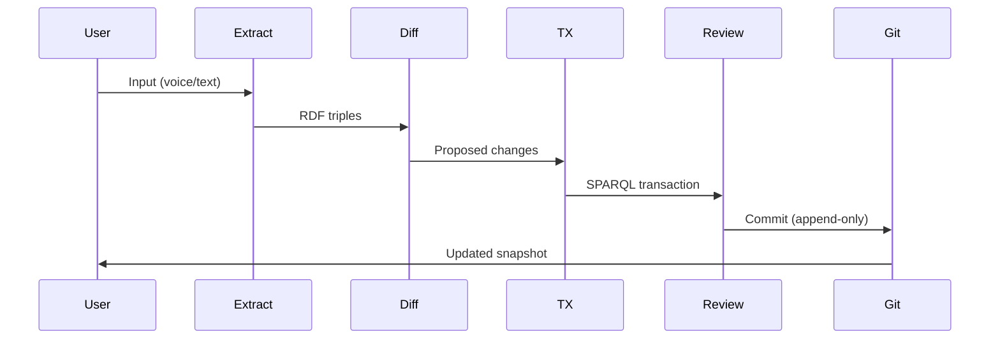
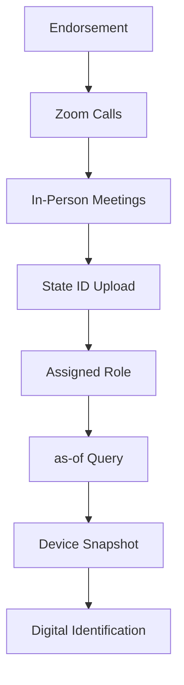
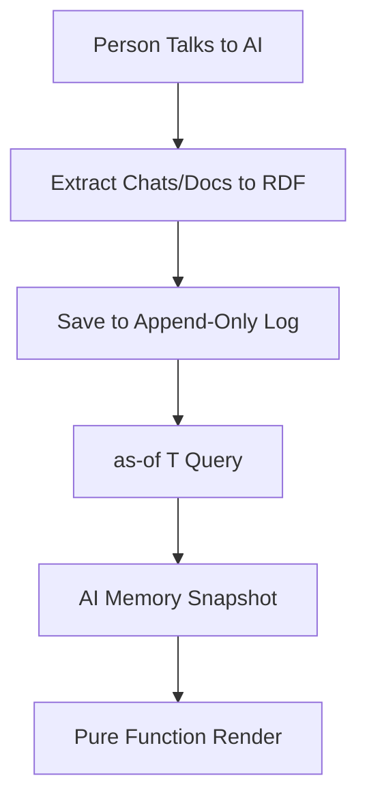
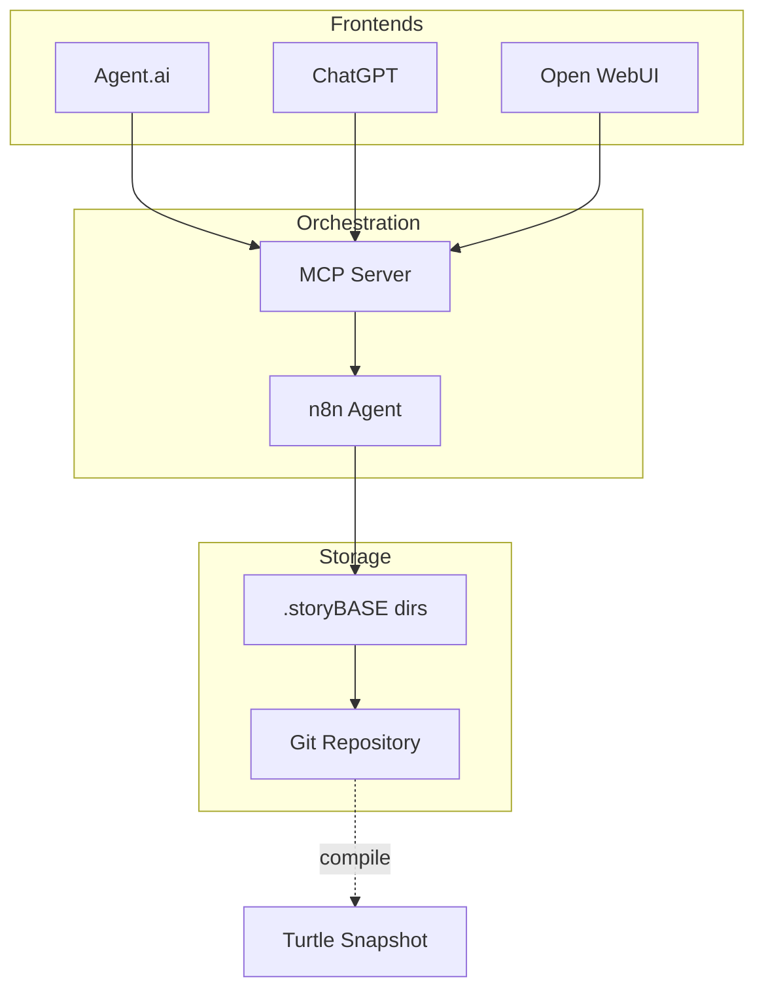
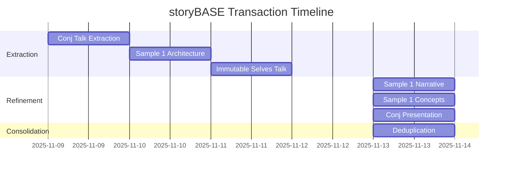

#### sic[theme][#theme]
# 
## storyBASE
### Git-Native RDF Knowledge Graph for Narrative-Driven AI
# 
#### Scarlet Dame
###### Founder, as written.ai
	[#theme]: Custom theme for storyBASE presentations. The storyBASE is a Git-native RDF knowledge graph that encodes narrative architecture, style profiles, and conviction-weighted claims to steer AI output with provenance and deterministic individuality (narr:Narrative_ImmutableIdentity, narr:SolutionArchetype_AsWritten).

---
# Identity as compiled from immutable history

---
# Your story
## as written

---
###### What is storyBASE?
# An append-only log that compiles to narrative[][#what-is]
	[#what-is]: storyBASE is defined as "RDF narrative source of truth that steers AI output, making it specific, controllable, aligned with organizational worldview" (storybase.synthetic-identity.co/product/what-is-storybase). The core narrative is "Identity as Compiled from Immutable History" (narr:Narrative_1), applying Clojure principles of immutability to content and AI memory.

---
### From voice memos
# To polished presentations

---
###### The Problem
# 
### AI without context
# Generic output

---
## The Solution
###### Single Source of Truth

---
### Transactions
# Append-only log
## Pure function render
# Deterministic output[][#architecture]
	[#architecture]: The architecture follows the reified change pattern: "SSoT (RDF + git) → SPARQL query → render to AI memory/identity → event-driven transactions → append-only log → recompile" (narr:ApproachPattern_2). This mirrors human identity systems at berecognized.id (narr:SolutionArchetype_BeRecognized) and extends them to AI memory.

---
## How It Works

---
### The storyBASE Workflow
	User inputs (voice memos, documents, chats) flow through extraction to RDF, creating an initial storyBASE graph. The system then normalizes transcriptions against established style and terminology, iteratively refining until outputs are polished and provenance-embedded[][#workflow].
	[#workflow]: The content production workflow is "User inputs → initial storyBASE → normalization/iteration → polished outputs with embedded provenance" (narr:Flow_1). This workflow itself demonstrates the core thesis as meta-proof (narr:Proof_1).

---
###### Normalization
### Clean transcription
# Against your storyBASE[][#normalize]
	[#normalize]: The behavior "Normalize Transcription Against storyBASE" uses the entity's established style and terminology to fix errors, inconsistencies, and filler (narr:Behavior_1). This is supported by style profiles (narr:StyleProfiles) and terminology control (narr:TerminologyControl).

---
### Iteration
# Extract → Diff → TX → Review → Commit[][#process]
	[#process]: The interactive individuation process follows "extract → diff → tx → review → commit" vs. automated ingestion via file upload and PR (storybase.synthetic-identity.co/process/storybase). Each transaction is append-only and immutable.

---
## Architecture

---
### Git-Native
# Version control for narrative[][#git]
	[#git]: Transactions live in .storyBASE directories; snapshot = replay of sorted transactions; provenance in TX step; future named graphs for add/remove (storybase.synthetic-identity.co/model/data-lifecycle-storybase). This enables branching, merging, and collaborative narrative development.

---
### RDF Knowledge Graph
# Semantic relationships
## SPARQL queries
# Deterministic perspectives[][#rdf]
	[#rdf]: The system uses RDF graph with git versioning and SPARQL for querying (narr:RequiredCapabilities_2). This enables "deterministic AI perspective 'as-of T' for graph queries" including full talk, sections, evolution over time, or any accessible graph subset (narr:FutureVision_DeterministicAI).

---
###### Provenance
### Every claim
# Traceable to source[][#provenance]
	[#provenance]: The system property "Immutability provides equality and provenance" ensures "transaction log ensures auditability for every interaction" (narr:SystemProperty_ImmutabilityProvenance). This is evidenced by both berecognized.id and aswritten.ai case studies.

---
## Two Systems, One Pattern

---
### System: Human
# berecognized.id
###### Immutable Identification
	Human identity system using Datomic SSoT, datalog query, and device-to-device interaction. Append-only log of facts about a person over time compiles to privileges as 'as-of T' snapshot on device[][#berecognized].
	[#berecognized]: berecognized.id demonstrates "Human Identity via Reified Change" with context "Digital identification enables recognition and delegates authority" (narr:CaseStudy_BeRecognizedID). Results include "Provenance for individual transactions; referential equality for free; offline transactions enabled."

---
### System: AI
# aswritten.ai
###### Immutable AI Memory
	AI identity system using RDF+git SSoT, SPARQL query, and chat+API interaction. Person talks to AI → extract to RDF → save to append-only log → AI memory as 'as-of T' snapshot (pure function)[][#aswritten].
	[#aswritten]: aswritten.ai addresses "AI memory problem: 'My AI doesn't give the same answers as your AI'" (narr:CaseStudy_AsWrittenAI). The intervention creates "deterministic AI perspective for specific graph queries" with "Provenance, equality, decentralization/offline scale."

---
###### The Pattern
### Append-only log
# Single source of truth
## Pure function render
# Deterministic identity[][#pattern]
	[#pattern]: The reified change design pattern from Clojure principles states "Immutability and explicit state management enable provenance, equality, and offline capability" (narr:Claim_ReifiedChangePattern). This pattern is a Boulder-level conviction (narr:Conviction_Boulder) evidenced by both case studies.

---
## Style & Voice

---
### Brand Stylization
# storyBASE
## berecognized.id
# aswritten.ai[][#brand]
	[#brand]: Consistent brand name stylization observed across samples: "CamelCase with uppercase suffix" for storyBASE (narr:StyleObs_3, narr:StyleObs_storyBASE), "lowercase domain-style" for berecognized.id and aswritten.ai (narr:StyleObs_1, narr:StyleObs_2, narr:StyleObs_BrandStylization_1, narr:StyleObs_BrandStylization_2).

---
###### Canonical Terms
### append-only log
### as-of T snapshots
### pure function
### digital twin[][#terms]
	[#terms]: Key phrases that anchor the architecture (narr:KeyPhrase_1, narr:KeyPhrase_2, narr:KeyPhrase_3, narr:KeyPhrase_4). These terms appear consistently across samples with precise technical phrasing (narr:StyleObs_1, narr:StyleObs_2, narr:StyleObs_9).

---
### Cadence
# Short. Punchy. Direct.[][#cadence]
	[#cadence]: Style observations show "Short declarative sentence; imperative tone" (narr:StyleObs_7), "Single-word answer 'You.' after setup; punchy, direct, confident" (narr:StyleObs_ShortPunchy_1), and "Formula-style cadence; punchy equation" (narr:StyleObs_1). Average sentence length ranges from 12.3 to 22.3 words across samples.

---
###### Voice
### Active voice dominant
# Second-person address
## Conversational yet authoritative[][#voice]
	[#voice]: Rubric assessments consistently score 4.0–4.5 on register fit, noting "Conversational yet authoritative; second-person direct address; technical register fits audience; concise and confident" (narr:RubricAssess_Register_Conj). Active voice ratio ranges from 0.75 to 0.85 across samples.

---
## Conviction Levels

---
### Notion
# Exploratory
## Open graph edges

---
### Stake
# Proposed
## Connected nodes
# Still moveable

---
### Boulder
# Settled
## Hard to move
# Requires consensus

---
### Foundation
# Underpinning
## Effectively permanent[][#conviction]
	[#conviction]: The Conviction ontology provides four levels (Notion, Stake, Boulder, Foundation) with sequential relationships via xkos:next/previous. Claims link to conviction levels via hasConvictionLevel property. The immutability thesis is Foundation-level (narr:Theme_ImmutableIdentity related to narr:Conviction_Foundation).

---
## Current State

---
### Tools & Capabilities
	Compile (replay transactions to Turtle snapshot), extract (RDF from input), diff (semantic comparison), tx (propose transaction), commit (append-only to Git), story generation (YAML front matter + prompt to model outputs)[][#tools].
	[#tools]: Module capabilities from storybase.synthetic-identity.co/module/storybase-capabilities. The system includes MCP server, Open WebUI at as written.ai, and GitHub Actions for story generation.

---
### Integration Points
	GitHub (OAuth, webhooks, Actions), Open Router (API proxy via Helicone), Outseta (OIDC, billing), MCP protocol (tool exposure), future GitHub Apps with scoped credentials[][#integrations].
	[#integrations]: Integration points from storybase.synthetic-identity.co/integration/points-storybase. Dependencies include n8n workflows, Apache Jena/Riot (future RDF ops), Docker Compose, Open WebUI.

---
### System Topology
	n8n agent orchestrates tools; MCP server exposes to frontends (Agent.ai, ChatGPT, Open WebUI); transactions in .storybase directories; hierarchical compile; Docker Compose on Digital Ocean[][#topology].
	[#topology]: System topology from storybase.synthetic-identity.co/architecture/topology-storybase. The architecture follows "SSoT → query → render → interact → event → transact → append log → recompile SSoT" (narr:Flow_1).

---
## Samples & Extraction

---
### Voice Memo
# 11,800 characters
## Transcribed narrative architecture[][#sample1]
	[#sample1]: Sample_1 from "Voice memo: Punch talk conceptual framing" (narr:Sample_1), created 2025-01-15, 11,800 characters. Source for Theme_ImmutableIdentity and Actor_ScarletDame. Rubric scores: Register 4.0, Strategic Alignment 4.5, Resonance 4.5.

---
### Conj Presentation
# 6,847 characters
## Functional identity talk[][#conj]
	[#conj]: Sample_ConjPresentation_2025 from "Clojure/conj 2025 presentation: Immutable Selves" (narr:Sample_ConjPresentation_2025), created 2025-01-01. Source for Narrative_ImmutableIdentity, Theme_FunctionalIdentity, and Tagline_AsWritten. Rubric scores: Strategic Alignment 5.0, Tailoring 5.0, Novelty 4.5.

---
### Product Check-in
# 18,437 characters
## Strategy & roadmap transcript[][#checkin]
	[#checkin]: Sample from "SIC / storyBASE / as written.ai Product & Strategy Check-in" (storybase.synthetic-identity.co/sample/2025-01-29T000000Z_sic-storybase-checkin), 18,437 characters. Source for market opportunity, timing thesis, positioning thesis, and detailed product overview. Rubric scores: Strategic Alignment 4.0, Accuracy 4.0.

---
## Style Observations

---
### Metaphor
# "Identity systems = Backbone.js"
## "Experience → log → identity"[][#metaphor]
	[#metaphor]: Core analogies include "identity systems = Backbone.js (mutable DOM)" (narr:StyleObs_5) and "experience → log → compiled identity; maps human to Datomic model" (narr:StyleObs_Analogy_1). These technical metaphors resonate with functional programming audiences.

---
### Rhetorical Questions
# "Where is the identity here?"
## "Who is the authority?"[][#rhetoric]
	[#rhetoric]: Triadic rhetorical questions frame problem space and invite audience reasoning (narr:StyleObs_RhetoricalQuestion_1). Also "My AI doesn't give the same answers as your AI?" frames AI memory problem (narr:StyleObs_4).

---
### Anaphora
# "Make state explicit"
## "Append only log → Single source of truth"
# "Everyone sees the same thing"[][#anaphora]
	[#anaphora]: Repeated structural frame "principle → pattern" creates rhythm and memorability (narr:StyleObs_Anaphora_1). Also "Then you" structure for rhetorical emphasis (narr:StyleObs_3).

---
## Rubric Performance

---
### Strategic Alignment
# 4.5–5.0
## Directly advances narrative[][#strategy-score]
	[#strategy-score]: Strategic alignment scores range from 4.5 to 5.0 across samples. "Entire presentation is a narrative anchor: 'Immutable Selves' thesis; two solution archetypes; clear mission/vision alignment" (narr:RubricAssess_Strategy_Conj). Explicitly ties architecture to case studies and system outcomes.

---
### Tailoring
# 4.0–5.0
## Deeply audience-specific[][#tailoring-score]
	[#tailoring-score]: Tailoring scores 4.0–5.0. "Deeply tailored to Clojure/conj audience: references Backbone.js, Om, Datomic, re-frame; assumes functional programming literacy" (narr:RubricAssess_Tailoring_Conj). Programming-literate entrepreneurs, designers, developers, consultants (storybase.synthetic-identity.co/actor/primary-storybase).

---
### Resonance
# 4.0–4.5
## Strong analogies & examples[][#resonance-score]
	[#resonance-score]: Resonance scores 4.0–4.5. "Strong analogies (experience→log→identity); metaphors (Backbone.js as anti-pattern); personal story (gender transition) adds emotional resonance" (narr:RubricAssess_Resonance_Conj). Concrete examples like North Korea deepfakes and employee lifecycle strengthen narrative proof.

---
### Accuracy
# 4.0
## Technical terms correct
# Citations present[][#accuracy-score]
	[#accuracy-score]: Accuracy scores 4.0 across samples. "Technical terms used correctly; citation marker present; workflow steps verifiable; no falsifiable claims detected" (narr:RubricAssess_9). Named entities (berecognized.id, aswritten.ai, Vouch, North Korea) are specific and correct.

---
## Transactions

---
### Deduplication (2025-11-13)
	Consolidated 539 duplicate triples into 1,613 canonical records. Merged Sample_1 metadata, deduplicated narrative concepts with owl:sameAs, consolidated style observations, merged rubric assessments, aggregated style metrics with rolling averages[][#dedupe].
	[#dedupe]: Transaction narr:Tx_Deduplication_20251113 at 2025-11-13T04:17:05.187Z by pleasetrythisathome. Marked deprecated versions with prov:wasRevisionOf and owl:deprecated true. Created canonical consolidated records for Sample_1, Narrative_1, StyleObs, RubricAssess, and Metrics.

---
### Sample 1 Concepts (2025-11-13)
	Initial extraction from clojure-conj-2025 repo README and voice memo. Added Narrative_1 (Identity as Compiled from Immutable History), Flow_1 (Content Production Workflow), Behavior_1 (Normalize Transcription), Milestone_1 (Initial storyBASE Graph), Proof_1 (Meta-Demonstration)[][#sample1-tx].
	[#sample1-tx]: Transaction narr:Tx_20251113T033534Z_claude45 by storyTWIN (anthropic/claude-sonnet-4.5). Generated 9 rubric assessments, 7 style observations, and style metrics (avg sentence length 22.3, active voice 0.78, jargon density 0.12).

---
### Sample 1 Narrative (2025-11-13)
	Refinements for reified change design pattern section. Added Claim_ReifiedChangePattern, SystemProperty_ImmutabilityProvenance, SystemProperty_DistributedDecentralization, CaseStudy_BeRecognizedID, CaseStudy_AsWrittenAI, Risk_GhostLabor, Flow_EmployeeLifecycle[][#narrative-tx].
	[#narrative-tx]: Transaction narr:Tx_20251113T032552Z_sample1 from user message, 4,237 characters. Added 10 style observations including 'ghost labor' metaphor, 'as-of T' terminology, parallel structure. Generated 9 rubric assessments with Strategy 4.5, Resonance 4.5.

---
### Conj Presentation (2025-11-13)
	Clojure/conj 2025 presentation extraction. Added Narrative_ImmutableIdentity, Theme_FunctionalIdentity, Actor_Human, Actor_AI, SolutionArchetype_BeRecognized, SolutionArchetype_AsWritten, Tagline_AsWritten ("AI that tells your story, as written")[][#conj-tx].
	[#conj-tx]: Transaction narr:Tx_20251113T030805Z_conj2025 from 6,847-character presentation transcript. Generated 9 style observations (brand stylization, metaphor, anaphora, rhetorical questions) and 9 rubric assessments. Scores: Strategic Alignment 5.0, Tailoring 5.0, Novelty 4.5.

---
### Immutable Selves Talk (2025-11-11)
	Added narrative anchors: Tagline_1 ("Immutable Selves: A Functional Approach to Digital Identity"), Mission_1, Vision_1, KeyPhrase_1–4. Product ladder: Primitive_1–3, Behavior_1, Flow_1, Narrative_1. Solution archetypes with problem context, approach patterns, required capabilities[][#talk-tx].
	[#talk-tx]: Transaction narr:Tx_20251111T214920Z_immutable_selves generated 38 entities including technical explainers (LeverageProfile_1, DesignTradeoff_1, ComparativeAnalysis_1), case studies, style observations, and rubric assessments. Source: "Immutable Selves talk", 5,847 characters.

---
### Sample 1 Architecture (2025-11-10)
	Voice memo extraction outlining narrative architecture for identity-as-append-only-log talk. Added Theme_ImmutableIdentity, Theme_TransitionAsStateChange, Actor_ScarletDame (with altLabels Dylan Butman, Scarlet Spectacular), Anchor_NarrativeArchitecture[][#arch-tx].
	[#arch-tx]: Transaction narr:Tx_20251110T184512Z_sample1 from "Voice memo: Punch talk conceptual framing", 11,800 characters. Generated 6 style observations (storyBASE brand, append-only log phrasing, UI state machine metaphor, transition analogy) and 8 rubric assessments. Speaker: Scarlet Dame.

---
### Product Check-in (2025-11-09)
	SIC / storyBASE / as written.ai product & strategy check-in. Added market opportunity, timing thesis (2024-2026 window), positioning thesis, moat leverage, product overview, modules capabilities, dependencies, roadmap, system topology, data lifecycle, integration points, role topology, process[][#checkin-tx].
	[#checkin-tx]: Transaction storybase.synthetic-identity.co/transaction/2025-01-29T000000Z_sic-storybase-checkin by n8n.storyTWIN/MCP. Generated 10 style observations and 9 rubric assessments. Input length 18,437 characters. Attributed to actor scarlet-dame.

---
### Conj Talk Extraction (2025-11-09)
	First extraction for Conj Talk 2025 proposal. Captured narrative architecture (Opportunity, Strategy, Product, Proof, Architecture, Organization), style observations, rubric assessments, and style metrics. Added opportunity (Identity Vulnerability Crisis), strategy (Functional Immutable Identity Architecture), products (Vouch.io, Sic)[][#first-tx].
	[#first-tx]: Transaction narr:Tx_20251109T223928Z_conj2025 by storyTWIN (anthropic/claude-sonnet-4.5). Generated sample record (3,421 characters), architecture (immutable identity system patterns), organizations (Sic, Vouch.io), 11 style observations, 4 rubric assessments. Scores: Clarity 4.5, Technical Depth 4.8, Narrative Coherence 4.6.

---
## Roadmap

---
### Near-term
# Named graphs (TriG)
## SHACL validation
# Evolved individuation pipeline[][#roadmap-near]
	[#roadmap-near]: Move transactions from SPARQL to named graphs (TriG); add SHACL validation; implement evolved individuation pipeline (snapshot + message to transaction) (storybase.synthetic-identity.co/roadmap/narrative-storybase).

---
### Mid-term
# File ingestion via GitHub
## storyBASE marketplace
# Cost pass-through billing[][#roadmap-mid]
	[#roadmap-mid]: File ingestion via GitHub; storyBASE marketplace; cost pass-through billing (storybase.synthetic-identity.co/roadmap/narrative-storybase). Related to narrative expansion (storybase.synthetic-identity.co/core/narrative-expansion).

---
### Vision
# Deterministic AI queries
## Billion-node graphs
# Shareable perspectives[][#roadmap-vision]
	[#roadmap-vision]: Future vision includes "deterministic AI perspective 'as-of T' for graph queries" with examples: full talk as query, section of talk, talk evolution over time, any accessible graph subset within billion-node graph (narr:FutureVision_DeterministicAI). Close with chat for participants to engage with narrative source of truth.

---
## Proof

---
### Meta-Demonstration
# This talk
## Created with storyBASE[][#meta]
	[#meta]: "The talk itself exemplifies the reified change architecture and storyBASE workflow, showing iterative refinement from raw inputs to polished outputs" (narr:Proof_1). Meta-narrative closing demonstrates storyBASE workflow via talk creation process (narr:Sample_1 note).

---
### Case Studies
# berecognized.id
## aswritten.ai
# Vouch.io[][#cases]
	[#cases]: Three case studies demonstrate the pattern: berecognized.id (human identity via reified change), aswritten.ai (AI memory via reified change), and Vouch.io (enterprise identity platform using immutable event logs). All share the same architectural primitives: append-only log, SSoT, pure function render.

---
### Metrics
# 1,613 canonical records
## 539 duplicates consolidated
# 9 transactions[][#metrics]
	[#metrics]: Current snapshot contains 1,613 inserted triples after deduplication (539 skipped duplicates). Generated from 9 transactions spanning 2025-11-09 to 2025-11-13. Style metrics show consistent voice: active voice ratio 0.75–0.85, average sentence length 12.3–22.3, jargon density 0.12–0.18.

---
## The Pattern

---
###### Immutability
### Enables equality
# Provenance
## Versioning
# Decentralization[][#leverage]
	[#leverage]: "Immutability enables equality, provenance, versioning, branching, generative testing, decentralization, and infinite read scale—for free" (narr:LeverageProfile_1). Small choice (append-only) creates outsized effects across system.

---
###### Trade-offs
### Bottleneck at transactor
# All logic in event clients
## Transact is just adding triples[][#tradeoffs]
	[#tradeoffs]: "Bottleneck at single transactor; all logic in event clients; transact is just adding triples" (narr:DesignTradeoff_1). What we gave up: distributed writes. Why worth it: consistency, provenance, auditability.

---
###### When to Use
### Provenance matters
# Auditability required
## Equality by design[][#when]
	[#when]: "When to use: when provenance, auditability, and equality matter more than write throughput" (narr:ComparativeAnalysis_1). Backbone.js (query DOM, mutate picture) vs. Om/React (state machine, pure function render). Identity systems today are Backbone; this is Om for identity.

---
## Now Go Build

---
### Your narrative
# As written
## With provenance[][#cta]
	[#cta]: The tagline "AI that tells your story, as written" (narr:Tagline_AsWritten) encodes the promise: 7-word tagline encoding promise and brand. Mission: "Move identity from mutable documents and profiles to compiled surfaces rendered from append-only logs and single sources of truth" (narr:Mission_1).

---
###### Get Started
### Chat with this storyBASE
# Query the narrative graph
## See the pattern in action

For more: [as written.ai](https://aswritten.ai)

---
## Appendix: Transaction History

---
###### Provenance
### Every claim
# Traceable to transaction
## Auditable by design

This presentation was generated from storyBASE snapshot compiled 2025-11-13T20:09:09.385Z, containing 1,613 triples from 9 transactions, attributed to pleasetrythisathome, using anthropic/claude-sonnet-4.5.